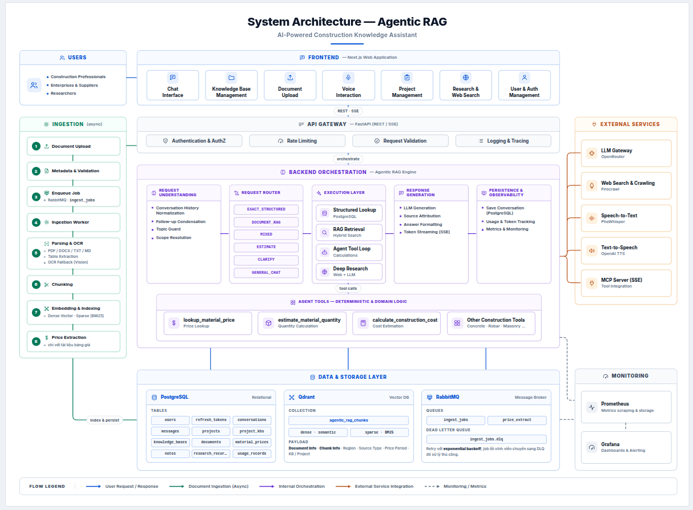

# Agentic RAG

An AI backend for a Vietnamese construction-materials domain assistant, combining **RAG**, **deterministic tool-calling** for material pricing and cost estimation, **local voice I/O**, and an **MCP server** — exposed via FastAPI (HTTP/SSE), with a Next.js chat frontend.

---

## Architecture



---

## 1. Tech stack

| Layer | Technology | Notes |
|---|---|---|
| **API** | FastAPI (HTTP + SSE) | SSE streams the chat token-by-token |
| **LLM / embeddings / vision** | OpenRouter (OpenAI-compatible) | Model per task is set independently in `.env` |
| **Vector store** | Qdrant | Dense + sparse (BM25) hybrid retrieval, batched upsert |
| **Relational store** | PostgreSQL 16 + SQLAlchemy (async) + Alembic | Users, KBs, documents, conversations, and **structured** material-price rows (`material_prices`) — exact SQL lookups, not vector search |
| **Job queue** | RabbitMQ (`aio-pika`) | Every document upload goes through here, no separate seeding path |
| **STT** | `faster-whisper` running **PhoWhisper** (Vietnamese fine-tune) | In-process (`STT_BACKEND=local`) or via a GPU box you run yourself (`http`) |
| **TTS** | OpenAI `/v1/audio/speech` direct | Not routed through OpenRouter — reads text verbatim, no paraphrasing |
| **Tool calling / MCP** | Custom `Tool` registry + tool-calling loop | Price/quantity/cost math is deterministic Python, never LLM-computed — see §4 |
| **Deep research** | LangGraph (expand → search → aggregate → summarize) | |
| **Frontend** | Next.js (App Router) + React, Tailwind, Zustand | One chat surface — Chat/Search/Research are composer modes, not routes |
| **Auth** | JWT (access + refresh) + OAuth2 (Google, GitHub) | |
| **Monitoring** | Prometheus + Grafana (optional) | |

---

## 2. Request flow

A chat turn is checked in order, stopping at the first match, so the real LLM is only ever called when nothing cheaper can answer:

1. **Form submission present?** → run the construction-cost tool directly, no LLM.
2. **Small talk?** (`app/core/chat/intent.py`) → canned reply, zero LLM calls.
3. **Matches the fixed cost-estimate intent?** → render a structured form client-side instead of guessing parameters from free text.
4. **Off-topic?** (cheap classifier, only when no KB/project/skill is active) → polite refusal before the main model is touched.
5. **Request Router** (`app/core/chat/router.py`) — a price/attribute question is routed to a deterministic SQL lookup (`EXACT_STRUCTURED`), RAG (`DOCUMENT_RAG`), both (`MIXED`), or a clarifying question (`CLARIFY`) *before* retrieval runs — this is what stops the model from reading a number out of the wrong region's table chunk.
6. Otherwise, `run_tool_loop()` lets the LLM decide whether to call a tool, streaming the reply back over SSE (and through TTS if the turn was voice-initiated).

Document ingestion (`POST /documents/upload[-price]/{kb_id}`) runs async through RabbitMQ: parse (PyMuPDF + pdfplumber, OCR fallback for scanned PDFs) → chunk → embed → index in Qdrant, and for the pricing KB, also extract structured rows into `material_prices` (`app/core/ingestion/price_extractor.py`).

Full step-by-step detail (DB tables, Qdrant payload shape, every stage): **[docs/submit/kien-truc-chi-tiet.md](docs/submit/kien-truc-chi-tiet.md)**.

---

## 3. Construction-materials domain layer

Four fixed knowledge bases exist in every deployment (identity hardcoded, content **not** auto-seeded — each starts empty and is populated by uploading documents through the UI, same as a user KB):

| KB | Purpose |
|---|---|
| **Dự toán giá nhà** | Official Sở Xây dựng price-announcement PDFs. The only KB where structured price-row extraction (`/upload-price`) is allowed. |
| **Báo giá doanh nghiệp** | Vendor/company price quotes — narrative RAG only. |
| **Kiến thức về VLXD cho kỹ sư** | Quantity-takeoff / cost-estimation methodology reference. |
| **Quy chuẩn & tiêu chuẩn xây dựng Việt Nam** | QCVN/TCVN national construction codes. |

Full pipeline detail and known data-quality caveats: **[docs/submit/kien-truc-chi-tiet.md](docs/submit/kien-truc-chi-tiet.md)**.

---

## 4. Why price math is deterministic Python, never LLM-computed

- **`lookup_material_price`** — SQL against `material_prices`, not vector similarity. Reports "not found" instead of guessing when region/material/period don't match.
- **`calculate_construction_cost`** — estimates **phần thô** (rough-stage materials: thép, xi măng, cát, đá, gạch xây + vật tư phụ) for **nhà phố / nhà ở dân dụng**, from either a direct floor area or móng/tầng/mái geometry. Quantities come from fixed reference coefficients + hao hụt factors; the LLM is only ever used to disambiguate which DB row is the right product among unit-filtered candidates — it never invents a price or a quantity.

Two fixed-pipeline vs. free tool-calling modes exist side by side: a **fixed pipeline** for the one well-known intent ("giá xây nhà 100m² ở Hà Nội") guarantees correct parameters, while **`mode="agent"`** lets the LLM decide for open-ended questions.

---

## 5. Frontend

Next.js + React + Tailwind, single-page chat app with a sidebar: **Chat**, **Notes**, **Projects**, **Knowledge Base**, **Usage**, **Settings**. Chat is the main surface — Search/Research are composer modes on the same view, not separate routes; a mic button drives voice I/O. Settings has a 3-tier model picker (Budget/Standard/Premium) plus temperature/max-tokens, applied to new messages only.

---

## 6. Prerequisites

- Docker + Docker Compose v24+
- An OpenRouter API key ([openrouter.ai/keys](https://openrouter.ai/keys)) — required for chat, embeddings, OCR fallback, and TTS
- *(Optional)* NVIDIA GPU for faster local Whisper STT — see [docs/instruction/local-gpu-stt-demo.md](docs/instruction/local-gpu-stt-demo.md)

---

## 7. Quick start

```bash
git clone https://github.com/KhaiBoiPho/agentic-rag.git
cd agentic-rag
bash scripts/setup.sh              # creates .env with random secrets
# edit .env — fill in OPENROUTER_API_KEY at minimum
docker compose up -d --build
```

| Service | URL |
|---|---|
| UI | http://localhost:3210 |
| API docs | http://localhost:8000/docs |
| RabbitMQ | http://localhost:15672 (guest / guest) |
| Qdrant | http://localhost:6333/dashboard |

The 4 system knowledge bases exist from the first migration but start **empty** — upload documents through the UI to populate them (see §3).

---

## 8. Makefile

```bash
make up / down / restart / logs / shell
make migrate / migrate-down / migrate-gen msg="..."
make test                        # pytest + coverage
make lint && make fmt            # ruff check + format
make monitoring                  # Prometheus + Grafana
```

---

## 9. Project structure

```
agentic-rag/
├── app/
│   ├── api/v1/               # REST endpoints (auth, chat, documents, kb, search, research, voice)
│   ├── core/
│   │   ├── chunking/         # PDF / DOCX / TXT chunkers
│   │   ├── ingestion/        # Ingestion pipelines, OCR fallback, price_extractor
│   │   ├── construction/     # Deterministic cost-estimation formulas (§4)
│   │   ├── chat/             # Router, fixed-intent forms, price answer/lookup
│   │   ├── retrieval/        # Qdrant hybrid retriever
│   │   ├── llm/               # OpenRouter client + tool-calling loop
│   │   ├── research/          # LangGraph research graph
│   │   ├── voice/             # STT/TTS
│   │   ├── mcp/               # MCP server + tools
│   │   └── auth/              # JWT, OAuth, passwords
│   ├── db/                    # SQLAlchemy models/repos + Qdrant client
│   └── queue/                 # RabbitMQ publisher + consumer
├── web/                        # Next.js frontend, see §5
├── seed_data/                   # Reference PDFs — not auto-ingested, see §3
├── scripts/                     # setup.sh + one-off maintenance scripts
├── migrations/                  # Alembic migrations
└── docker-compose.yml / Dockerfile / .env.example
```

---

## 10. API (selected)

Swagger UI at http://localhost:8000/docs (when `APP_DEBUG=true`).

| Method | Path | Description |
|---|---|---|
| `POST` | `/api/v1/auth/login` | Login → tokens |
| `POST/GET` | `/api/v1/kb` | Create / list knowledge bases |
| `POST` | `/api/v1/documents/upload/{kb_id}` | Upload a document (RAG chunking) |
| `POST` | `/api/v1/documents/upload-price/{kb_id}` | Upload a price-announcement PDF — structured extraction, pricing KB only |
| `POST` | `/api/v1/chat/stream` | Streaming chat (SSE) — see §2 |
| `POST` | `/api/v1/voice/stt` / `/api/v1/voice/tts/stream` | Speech in / out |
| `GET` | `/health` / `/metrics` | Health check / Prometheus metrics |

---

## 11. Further reading

- **[docs/submit/kien-truc-chi-tiet.md](docs/submit/kien-truc-chi-tiet.md)** (Vietnamese) — deepest-detail system doc: every stage of ingestion, chat routing, and the price-extraction pipeline
- [docs/instruction/railway-deploy.md](docs/instruction/railway-deploy.md) — deploying on Railway
- [docs/instruction/local-gpu-stt-demo.md](docs/instruction/local-gpu-stt-demo.md) — STT on your own GPU box
- [docs/instruction/qa-test-scenarios.md](docs/instruction/qa-test-scenarios.md) — end-to-end feature test scenarios
