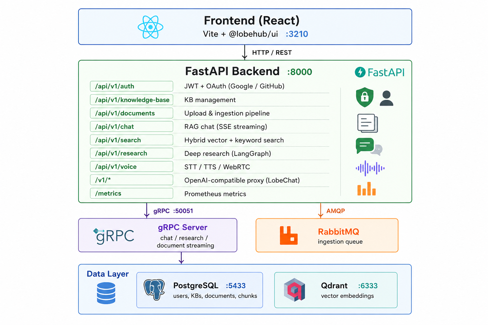

# Agentic RAG

A monolithic AI backend for a Vietnamese construction-materials domain assistant, combining **RAG**, **deterministic tool-calling for cost estimation**, **local voice I/O (GPU-capable)**, and an **MCP server** — exposed via FastAPI (HTTP/SSE) and gRPC streaming, with a Next.js chat frontend.

---

## Architecture



---

## 1. Tech stack

| Layer | Technology | Why |
|---|---|---|
| **API** | FastAPI (HTTP + SSE) + gRPC (bi-directional streaming) | SSE for the chat UI's token stream; gRPC stubs exist for non-browser clients |
| **LLM / embeddings / vision / TTS** | OpenRouter (OpenAI-compatible), model per task set independently in `.env` | One API key, swappable models per task without code changes |
| **Vector store** | Qdrant | Named-vector collection, batched upsert (200 pts/request — large PDFs otherwise hit `WriteTimeout`) |
| **Relational store** | PostgreSQL 16 + SQLAlchemy (async, `asyncpg`) + Alembic | Users, KBs, documents, and **structured** material-price rows (`material_prices` table) — exact lookups, not vector search |
| **Job queue** | RabbitMQ (`aio-pika`) | User-initiated document uploads only. System-KB seeding at startup bypasses the queue and calls the ingestion pipeline directly (no consumer round-trip needed for a background one-shot job) |
| **STT** | `faster-whisper` (CTranslate2), self-hosted, **CPU or GPU** | No external STT API/serverless — runs in-process, model configurable via `.env` (`WHISPER_MODEL_SIZE/DEVICE/COMPUTE_TYPE`) |
| **TTS** | OpenRouter `openai/gpt-audio-mini` via chat-completions (`modalities: ["text","audio"]`, PCM16 stream → WAV wrapped in-process) | OpenRouter has no dedicated `/audio/speech` endpoint; audio-output chat models are the only TTS-shaped option available there — see caveat below |
| **Tool calling / MCP** | Custom `Tool` + `handle_*` registry (`app/core/mcp/tools/`), OpenAI-style tool-calling loop (`app/core/llm/tool_loop.py`) | Price/quantity/cost math is deterministic Python, never LLM-computed — see §4 |
| **Deep research** | LangGraph graph (expand → search → aggregate → quality-check → summarize) | Separate problem from tool-calling (iterative web search), kept as its own graph rather than folded into the tool loop |
| **Frontend** | Next.js 16 (App Router) + React 19, Tailwind, Zustand store | Single chat surface — search/research/voice are composer actions, not separate routes (see §6) |
| **Auth** | JWT (access + refresh) + OAuth2 (Google, GitHub) | |
| **Monitoring** | Prometheus + Grafana (optional profile) | |

---

## 2. System flow

### 2.1. Chat (RAG) — the default path

```
User message → POST /api/v1/chat/stream
   │
   ├─ form_submission present?  → skip straight to the fixed-pipeline tool (§4.3), no LLM
   │
   ├─ detect_intent(message)   app/core/chat/intent.py
   │     matches a known fixed intent (e.g. construction cost)?
   │       → SSE `form_request` event, render a form client-side, LLM never invoked
   │
   ├─ mode == "agent"?  → run_tool_loop() — LLM decides whether to call
   │     lookup_material_price / calculate_construction_cost itself (§4.4)
   │
   └─ mode == "rag" (default) → QdrantStore hybrid retrieval on the active KB
         → chunks injected into the prompt → OpenRouterClient.stream_chat()
         → SSE token deltas → frontend renders + (if the turn was voice-
           initiated) speaks the finished reply back
```

### 2.2. Document ingestion (upload or system-KB seed)

Two pipelines share the same chunking/embedding backbone:

```
PDF/DOCX/TXT bytes
   │
   ├─ ChunkDispatcher.chunk()          app/core/chunking/dispatcher.py
   │     PdfChunker: PyMuPDF (text blocks, reading order) + pdfplumber (tables → HTML)
   │
   ├─ 0 chunks (scanned/image-only PDF)?
   │     → OCR fallback: render each page to an image, transcribe via an
   │       OpenRouter vision model (app/core/ingestion/ocr_fallback.py),
   │       re-chunk the transcribed text — only triggers when normal
   │       extraction found nothing, to avoid a vision call per page on
   │       every PDF
   │
   ├─ split_oversized_table_chunk()    a single table chunk can exceed the
   │     embedding model's 8192-token hard limit (a real 78-row price table
   │     → ~20k tokens) — split by row groups, repeat the header row in each
   │     piece so column context isn't lost; OpenRouter rejects the whole
   │     batch if even one item is oversized, not just that item
   │
   ├─ OpenRouterClient.embed()         text-embedding-3-small, 1536-dim,
   │     batched (EMBED_BATCH_SIZE)
   │
   ├─► QdrantStore.upsert_chunks()     batched 200 pts/request — narrative
   │     text + table HTML, tagged with region/source_type/price_period
   │     metadata for RAG retrieval and citation
   │
   └─► [price-extraction mode only] extract_price_rows()
         app/core/ingestion/price_extractor.py → MaterialPriceRepository
         → `material_prices` (Postgres) — see §4 for why this is a separate,
           structured store instead of relying on the vector search above
```

**Two entry points, same pipeline:**
- **User upload** — `POST /api/v1/documents/upload/{kb_id}` or `/upload-price/{kb_id}` → publishes a job to RabbitMQ → `app/queue/consumer.py` picks it up → same `IngestionPipeline`/`PriceExtractionPipeline` classes.
- **System-KB seeding** — `app/core/bootstrap/seed.py`, run once as a background asyncio task at app startup (`app/main.py::on_startup`). Calls the pipelines **directly**, bypassing the queue (no consumer round-trip needed for a one-shot startup job). Idempotent **per file** (not per KB): each file's ingest status is tracked independently, so an interrupted seed (container restart mid-ingest) resumes only the unfinished files on next startup instead of restarting the whole batch or silently skipping it forever.

### 2.3. Voice

```
Composer "Speak" button → MediaRecorder (browser) → stop → webm blob
   │
   ▼
POST /api/v1/voice/stt  →  LocalWhisperService.transcribe()
   │   faster-whisper, in-process, CPU int8 or GPU float16 per WHISPER_DEVICE
   ▼
transcript → auto-sent as a chat message (mode="chat", viaVoice=true)
   │   (construction-cost questions still route through the form — see §2.1;
   │   the form's *result*, once submitted, is what gets spoken back)
   ▼
LLM reply streamed + displayed as normal chat text
   │
   ▼
POST /api/v1/voice/tts/stream  →  OpenRouterClient.tts_stream()
   │   chat-completions w/ modalities=["text","audio"], stream=true,
   │   audio.format=pcm16 (the only format OpenRouter allows while
   │   streaming) → base64 PCM16 chunks collected → wrapped in a WAV
   │   header in-process (24kHz mono 16-bit)
   ▼
frontend plays the WAV; a pulsing "🔊 Speaking…" indicator shows next to
the mic button while it plays
```

**Known caveat, by design, not a bug:** `gpt-audio-mini` is a *conversational* audio model, not a dedicated TTS engine — even with an explicit "read verbatim, don't converse" system prompt, it can paraphrase rather than reading the displayed text word-for-word (verified: `"Hello! How can I assist you today?"` was spoken back as `"Hi there! I'm here to help with anything you need. How can I support you today?"`). OpenRouter has no real `/audio/speech` TTS endpoint to fall back to. The UI therefore doesn't promise a word-for-word match — it shows a speaking indicator instead of literal captions. If verbatim reading matters for your use case, swap `TTSProvider` for a real TTS engine (ElevenLabs, a self-hosted engine like Piper/Coqui) instead of OpenRouter's audio-chat models.

---

## 3. Construction-materials domain layer

The 2 system knowledge bases are seeded automatically at first startup from `seed_data/` (committed in-repo) and are **read-only** — no user can upload to, delete from, or modify them (`403` enforced in `app/api/v1/{documents,knowledge_base}.py`, checked against `app/core/bootstrap/constants.py::is_system_kb()`), so every deployment starts with the same knowledge base:

| KB | Content | Source |
|---|---|---|
| **Kiến thức xây dựng** | Quantity-takeoff / cost-estimation methodology playbook, QCVN 16:2023, a materials reference book | `seed_data/knowledge/` (3 files) |
| **Dự toán giá nhà** | Official Sở Xây dựng price-announcement PDFs (công văn + phụ lục) for Hà Nội, Đà Nẵng, TP.HCM, plus vendor quotes | `seed_data/prices/{HN,DN,HCM}/` |

Full pipeline detail, header-detection heuristics, and known data-quality caveats (a source PDF genuinely lacking a price category is reported honestly as "no data", not guessed): **[docs/construction-pricing-pipeline.md](docs/construction-pricing-pipeline.md)**.

### 4. Why price math is deterministic Python, never LLM-computed

This is the core design constraint of the whole domain layer, not a stylistic choice:

- **`estimate_material_quantity`** — quantity-takeoff formulas (`app/core/construction/formulas.py`) straight from the methodology playbook's chapters (concrete §16, rebar §17, masonry §19, plaster §20, tile §21, paint §22). Pure Python, no LLM in the loop.
- **`lookup_material_price`** — direct SQL against `material_prices` (`WHERE region=... AND material_name ILIKE ...`), not vector similarity — a wrong material/region/period match here means a wrong cost downstream, so it reports "not found" instead of guessing.
- **`calculate_construction_cost`** — orchestrates the two above per material category, then **uses an LLM only to disambiguate which DB row is the right product** among unit-filtered candidates (e.g. distinguishing "bê tông thương phẩm" — ready-mix concrete — from "bê tông đúc sẵn" — precast concrete panels — when both loosely match a name search). The LLM never invents a price; it only picks an index into real rows, or says none fit, which maps to an honest "no data for this category" line rather than a wrong number. This replaced an earlier hand-maintained keyword-exclusion list, which was correct but too brittle to extend as new vendor files were added.

Two fixed-pipeline vs. free tool-calling **modes** exist side by side:
- **Fixed pipeline** (`app/core/chat/intent.py` → form → direct tool call, no LLM at all) for the one well-known, high-stakes intent ("giá xây nhà 100m2 ở Hà Nội") — guarantees correct parameters instead of trusting an LLM to parse them from free text.
- **`mode="agent"`** (`run_tool_loop()`) for open-ended questions — the LLM decides whether/which tool to call, with the risk of misparsed parameters that the fixed pipeline avoids.

---

## 5. Frontend — one chat surface, no separate pages

Search, research, and voice are **composer actions inside the chat view**, not separate sidebar routes — confirmed during a UI audit that `/search` and `/research` were duplicate views of logic `ChatArea.handleSend()` already branches on by `mode`. The sidebar only has Chat and Knowledge Base. Model selection and output-tuning controls (temperature/max_tokens/top_k) were removed from the UI entirely — every user gets the same hardcoded `openai/gpt-4o-mini` (`frontend/components/chat/ChatArea.tsx::FIXED_MODEL`), consistent with the "no LLM-computed prices" philosophy in §4: nothing about a cost estimate should silently vary by which model a user happened to have picked.

---

## 6. Prerequisites

- Docker + Docker Compose v24+
- An OpenRouter API key ([openrouter.ai/keys](https://openrouter.ai/keys)) — required for chat, embeddings, OCR fallback, and TTS
- **(Optional) NVIDIA GPU** for faster local Whisper STT — see §8

---

## 7. Quick start

```bash
git clone https://github.com/KhaiBoiPho/agentic-rag.git
cd agentic-rag
bash scripts/setup.sh              # creates .env with random secrets
# edit .env — fill in OPENROUTER_API_KEY at minimum
docker compose build app
docker run --rm -v "$(pwd):/app" -w /app agentic-rag-app bash scripts/gen_protos.sh  # one-time, see docs/getting-started.md §3
docker compose up -d --build
```

Services start in order: `postgres` → `migrate` → `qdrant` + `rabbitmq` → `app` → `ui`. On first start, `app` also seeds the 2 system knowledge bases from `seed_data/` in the background (§3) — see [docs/getting-started.md](docs/getting-started.md) for the full walkthrough, troubleshooting, and how to test each feature end-to-end.

| Service | URL |
|---|---|
| UI | http://localhost:3210 |
| API docs | http://localhost:8000/docs |
| RabbitMQ | http://localhost:15672 (guest / guest) |
| Qdrant | http://localhost:6333/dashboard |

---

## 8. GPU (optional — local Whisper STT)

`faster-whisper` runs on CPU (`WHISPER_DEVICE=cpu`, `int8`) with no extra setup — fine for the `base`/`small` models. For `medium`/`large` on an NVIDIA GPU:

1. `.env`: `WHISPER_MODEL_SIZE=medium`, `WHISPER_DEVICE=cuda`, `WHISPER_COMPUTE_TYPE=float16`.
2. The `app` image already includes the pip-only CUDA runtime libs (`nvidia-cublas-cu12`, `nvidia-cudnn-cu12` in `pyproject.toml`) with `LD_LIBRARY_PATH` pointed at them in the `Dockerfile` — no need to switch to a full `nvidia/cuda` base image.
3. `docker-compose.yml`'s `app` service already requests GPU passthrough (`deploy.resources.reservations.devices`, driver `nvidia`) — requires [`nvidia-container-toolkit`](https://docs.nvidia.com/datacenter/cloud-native/container-toolkit/latest/install-guide.html) installed on the **host**.
4. **If you run Docker Desktop** (macOS, or Linux with the Docker Desktop app rather than the native `dockerd`): GPU passthrough may fail with `could not select device driver "nvidia"` even with the toolkit installed on the host — Docker Desktop runs its own VM-based engine, separate from the host's native `dockerd`, and the two don't automatically share GPU config. Check `docker context ls` — if you have both a `desktop-linux` and a `default` context, switch to the native one: `docker context use default`, then verify with `docker run --rm --gpus all nvidia/cuda:12.1.1-base-ubuntu22.04 nvidia-smi` before bringing the stack up there. `make`/`docker compose` need no changes — the `Makefile` already auto-detects the active socket.

Verify a GPU load actually happened: `docker compose logs app | grep -i whisper` should show `Loading local Whisper model=medium device=cuda compute_type=float16` followed by `Local Whisper model loaded and ready` with no CUDA/cuDNN errors; `docker compose exec app nvidia-smi` should list the GPU from inside the container.

---

## 9. Moving to another machine without re-embedding

Re-running the full `seed_data/` ingestion (chunk → embed → extract) from scratch costs real time and OpenRouter API calls — the largest single source PDF alone (a 699-page Hà Nội price annex) takes several minutes just for embedding. To skip that on a new machine or after switching Docker engines, copy the two volumes that hold the already-processed result instead of re-seeding:

```bash
# On the source machine (stack stopped, so nothing's mid-write):
docker compose stop
docker run --rm -v agentic-rag_postgres_data:/data -v "$(pwd)":/backup alpine \
  tar czf /backup/backups/postgres_data.tar.gz -C /data .
docker run --rm -v agentic-rag_qdrant_data:/data -v "$(pwd)":/backup alpine \
  tar czf /backup/backups/qdrant_data.tar.gz -C /data .
docker compose start
```

```bash
# On the target machine, BEFORE the first `docker compose up`:
docker volume create agentic-rag_postgres_data
docker volume create agentic-rag_qdrant_data
docker run --rm -v agentic-rag_postgres_data:/data -v "$(pwd)":/backup alpine \
  tar xzf /backup/backups/postgres_data.tar.gz -C /data
docker run --rm -v agentic-rag_qdrant_data:/data -v "$(pwd)":/backup alpine \
  tar xzf /backup/backups/qdrant_data.tar.gz -C /data
docker compose up -d
```

`seed.py` checks per-file ingest status on startup — with the restored volumes in place it logs `already fully seeded — skipping` for both system KBs instead of re-ingesting anything. The `backups/` directory is gitignored (large binary dumps, regenerate locally rather than committing) — verify the exact volume name with `docker volume ls | grep -E "postgres_data|qdrant_data"` first if your Compose project directory isn't named `agentic-rag` (Compose derives the volume prefix from the directory name).

---

## 10. Environment

Copy `.env.example` to `.env` and fill in your keys. Every variable is documented with inline comments in [.env.example](.env.example).

**Minimum required:**
- `OPENROUTER_API_KEY` — LLM chat, embeddings, vision OCR fallback, and TTS all go through OpenRouter
- `SECRET_KEY` + `JWT_SECRET_KEY` — generate with `openssl rand -hex 32` (done automatically by `scripts/setup.sh`)

**Optional (feature-gated):**
- Local Whisper GPU: `WHISPER_DEVICE=cuda`, `WHISPER_COMPUTE_TYPE=float16` (§8)
- Deep research web search: `FIRECRAWL_API_KEY`
- OAuth: `GOOGLE_CLIENT_ID/SECRET`, `GITHUB_CLIENT_ID/SECRET`

**Not used anymore, may still appear in old notes:** ElevenLabs (`ELEVENLABS_*`), RunPod (`RUNPOD_*`) — both fully removed; TTS and STT are OpenRouter and self-hosted Whisper respectively (§2.3).

---

## 11. Makefile

```bash
make up                          # build + start all containers
make down                        # stop and remove containers
make restart                     # restart app container only
make logs                        # follow app logs
make shell                       # bash inside app container

make migrate                     # alembic upgrade head
make migrate-down                # rollback one revision
make migrate-gen msg="your msg"  # autogenerate migration from model changes

make proto                       # compile .proto → Python stubs
make test                        # pytest + coverage
make lint && make fmt            # ruff check + format
make monitoring                  # start Prometheus + Grafana
```

`DOCKER_HOST` is auto-detected from whichever Docker socket exists (Docker Desktop macOS, native Linux Engine, or Docker Desktop Linux) — no manual edits needed regardless of which engine you're on.

---

## 12. Monitoring (optional)

```bash
docker compose --profile monitoring up -d
```

| Service | URL | Credentials |
|---|---|---|
| Prometheus | http://localhost:9090 | — |
| Grafana | http://localhost:3001 | admin / admin |

Dashboard is auto-provisioned from `grafana/dashboards/agentic_rag.json`.

---

## 13. Project structure

```
agentic-rag/
├── app/
│   ├── main.py              # FastAPI app factory + startup (Qdrant connect, system-KB seed, Whisper load, gRPC)
│   ├── config.py            # Settings (reads .env)
│   ├── api/v1/               # REST endpoints (auth, chat, documents, knowledge_base, search, research, voice, config)
│   ├── core/
│   │   ├── chunking/        # PDF / DOCX / TXT chunkers + dispatcher
│   │   ├── ingestion/       # Ingestion pipelines (generic + price-extraction), OCR fallback, price_extractor
│   │   ├── construction/    # Deterministic quantity/cost formulas (§4)
│   │   ├── chat/            # Fixed-pipeline intent detection + form schemas
│   │   ├── retrieval/       # Qdrant hybrid retriever
│   │   ├── llm/             # OpenRouter client + tool-calling loop
│   │   ├── research/        # LangGraph research graph
│   │   ├── voice/           # STT (local Whisper), TTS (OpenRouter audio)
│   │   ├── mcp/             # MCP server + tools (price_lookup, quantity, cost)
│   │   ├── bootstrap/       # System-KB seeding (seed.py) + constants (system user/KB IDs)
│   │   └── auth/            # JWT, OAuth, passwords
│   ├── db/
│   │   ├── postgres/        # SQLAlchemy models + repos (incl. material_prices)
│   │   └── qdrant/          # Vector store client
│   ├── grpc_server/         # gRPC servicers + generated stubs
│   ├── queue/               # RabbitMQ publisher + consumer
│   └── monitoring/          # Prometheus metrics + middleware
├── frontend/                # Next.js 16 (App Router) + React 19 — single chat surface, see §5
├── seed_data/                # Committed source files for the 2 system KBs (§3)
├── backups/                  # gitignored — local Postgres/Qdrant volume dumps (§9)
├── scripts/                  # gen_protos.sh, setup.sh, one-off ingestion/dedup scripts used during development
├── protos/                  # .proto definitions
├── migrations/               # Alembic migrations
├── grafana/                 # Prometheus config + dashboards
├── docker-compose.yml
├── Dockerfile
└── .env.example
```

---

## 14. API

Swagger UI at http://localhost:8000/docs (when `APP_DEBUG=true`).

| Method | Path | Description |
|---|---|---|
| `POST` | `/api/v1/auth/register` | Register |
| `POST` | `/api/v1/auth/login` | Login → tokens |
| `GET` | `/api/v1/auth/oauth/google` | Google OAuth2 |
| `GET` | `/api/v1/auth/oauth/github` | GitHub OAuth2 |
| `POST/GET` | `/api/v1/kb` | Create / list KBs (system KBs included, flagged `is_system: true`) |
| `POST` | `/api/v1/documents/upload/{kb_id}` | Upload document to KB (403 on system KBs) |
| `POST` | `/api/v1/documents/upload-price/{kb_id}` | Upload a material price-announcement PDF (`region`, `price_period` query params) — extracts structured rows into Postgres alongside normal RAG chunking, see [docs/construction-pricing-pipeline.md](docs/construction-pricing-pipeline.md) |
| `GET` | `/api/v1/documents/{kb_id}` | List documents in a KB |
| `POST` | `/api/v1/chat/stream` | Streaming chat (SSE). `mode: "rag"` (default) or `"agent"` (LLM tool-calling, §4). A message matching a known fixed-pipeline intent (e.g. "giá xây nhà ...") returns a `form_request` event instead of an LLM answer; submit the filled form back via `form_submission` to run the matching tool directly, no LLM involved |
| `POST` | `/api/v1/search` | Hybrid search |
| `POST` | `/api/v1/research` | Deep research (LangGraph) |
| `POST` | `/api/v1/voice/stt` | Transcribe audio (local Whisper) |
| `POST` | `/api/v1/voice/tts/stream` | Synthesize speech (OpenRouter audio, streamed WAV — §2.3) |
| `GET` | `/health` | Health check |
| `GET` | `/metrics` | Prometheus metrics |

---

## 15. Further reading

- [docs/getting-started.md](docs/getting-started.md) — clone-to-running walkthrough, first-run troubleshooting, end-to-end feature tests
- [docs/construction-pricing-pipeline.md](docs/construction-pricing-pipeline.md) — full detail on the price-extraction heuristics, known data-quality limits, and how to add a new fixed-pipeline intent/form
