# Kiến trúc chi tiết hệ thống Agentic RAG (VLXD)

> Tài liệu mô tả toàn bộ luồng vận hành thực tế của hệ thống: từ lúc nạp tài
> liệu (chunking, xử lý bảng, trích giá), qua lưu trữ vector, đến luồng chat
> (small-talk, phát hiện ý định, guard chủ đ�, RAG, công cụ, dự toán chi phí),
> các sub-model phụ trợ, gi�ng nói, và danh sách API.
>
> **M�i con số nêu ra đ�u lấy từ mã nguồn hoặc từ phép đo chạy trên chính dữ
> liệu của dự án** — không lấy từ bảng xếp hạng chung của model. Chỗ nào là
> lập luận chưa đo, tài liệu ghi rõ bằng nhãn **[LẬP LUẬN]**; chỗ nào bị ép
> buộc bởi môi trư�ng, ghi nhãn **[RÀNG BUỘC]**; chỗ có số đo thật, ghi nhãn
> **[�O]**.

**Quy ước đ�c:** `app/...py:NN` = đư�ng dẫn file (dòng NN nếu có nêu). Các
hằng số cấu hình mặc định nằm ở `app/config.py`, giá trị chạy thật lấy từ
`.env`.

**Tài liệu liên quan:** `kien-truc-he-thong.md` *(đã gỡ)* (tổng quan kiến
trúc cũ), `construction-pricing-pipeline.md` *(đã gỡ)* (đặc tả sâu luồng
giá), `getting-started.md` *(đã gỡ)* (chạy thử), `railway-deploy.md` (triển
khai), `bao-cao-benchmark.md` *(đã gỡ)* + `bo-cau-hoi-benchmark.md` (đo
lư�ng & đánh giá, 30 câu h�i chấm điểm hệ thống).

## Mục lục

1. [Tổng quan](#1-tổng-quan)
2. [Kiến trúc tổng thể](#2-kiến-trúc-tổng-thể)
3. [Chi tiết các thành phần](#3-chi-tiết-các-thành-phần)
4. [Luồng dữ liệu và xử lý](#4-luồng-dữ-liệu-và-xử-lý)
5. [Cấu hình và triển khai](#5-cấu-hình-và-triển-khai)
6. [Vận hành và giám sát](#6-vận-hành-và-giám-sát)
7. [Phụ lục](#7-phụ-lục)

### ��c theo nhu cầu

| Bạn muốn hiểu | ��c mục |
|---|---|
| Vì sao ch�n công nghệ/model này mà không phải cái khác | **§2.3** |
| Chunk size thật sự là bao nhiêu, và hai profile bảng | **§3.1.4** |
| Truy hồi hybrid (dense + BM25 + RRF) và vì sao | **§3.2.3** |
| Xoá KB/document có d�n vector không | **§3.2.4** |
| Router quyết định tool hay RAG như thế nào | **§3.4.2** |
| Khi tool không tìm thấy giá thì hệ thống làm gì | **§3.4.7** |
| Vì sao source chip từng hiện sai vùng, và schema nguồn hiện tại | **§3.10** |
| Tài liệu PDF được bóc ra sao, ô gộp xử lý thế nào | §3.1.6 → §3.1.8 |
| PDF scan không có lớp text thì sao | §3.1.12 |
| Embedding và tìm kiếm vector thực chất là gì | §3.2.1 |
| Giá từ PDF vào database rồi ra câu trả l�i bằng cách nào | **§3.3** (có ví dụ trực quan), §4.2 (sơ đồ trình tự) |
| "Tool" là gì, hệ thống có những tool nào | **§3.5** |
| Công thức dự toán theo từng loại hình công trình | §3.7, §7.C |
| Những gì đã thử và bị loại bằng số liệu | §7.E |
| 30 câu h�i dùng để chấm điểm hệ thống | `bo-cau-hoi-benchmark.md` |

---

## 1. Tổng quan

### 1.1. Hệ thống này là gì

�ây là một hệ thống **Agentic RAG** (Retrieval-Augmented Generation có khả
năng g�i công cụ) phục vụ lĩnh vực **vật liệu xây dựng (VLXD)**: trả l�i câu
h�i v� vật liệu, tra cứu đơn giá theo vùng/kỳ công bố, và dự toán sơ bộ chi
phí vật liệu chính cho một công trình dựa trên diện tích.

Hệ thống nạp tài liệu (công văn, phụ lục bảng giá, quy chuẩn kỹ thuật ở định
dạng PDF/DOCX/TXT/MD), tách thành các đoạn nh� (chunk) để tìm kiếm ngữ nghĩa,
đồng th�i **bóc riêng các dòng giá có cấu trúc** vào một bảng quan hệ để tra
cứu chính xác. Khi ngư�i dùng h�i, một bộ định tuyến quyết định câu h�i cần
**con số tất định từ database** hay **giải thích từ văn bản (RAG)**, hoặc cả
hai.

### 1.2. Bản đồ công nghệ

| Thành phần | Công nghệ | Vai trò |
|---|---|---|
| API / SSE | **FastAPI** + Uvicorn (`app/main.py`) | HTTP + streaming token qua Server-Sent Events |
| CSDL quan hệ | **PostgreSQL** (SQLAlchemy async + asyncpg) | user, KB, document, message, **material_prices**, notes, projects, usage |
| Vector DB | **Qdrant** (dense + sparse BM25) | lưu embedding + vector BM25 của chunk; truy hồi hybrid hợp nhất bằng RRF, có l�c metadata |
| Hàng đợi | **RabbitMQ** (aio-pika) | nạp tài liệu bất đồng bộ (không chặn request upload) |
| LLM / Embedding | **OpenRouter** (OpenAI-compatible SDK) | chat streaming, embedding, vision-OCR, các sub-model |
| STT (gi�ng → text) | **PhoWhisper** (faster-whisper/CTranslate2) | nhận dạng tiếng Việt, chạy in-process hoặc HTTP GPU |
| TTS (text → gi�ng) | **OpenAI** `/v1/audio/speech` trực tiếp | đ�c câu trả l�i |
| Deep Research | **LangGraph** (`app/core/research/graph.py`) | vòng lặp tìm kiếm web nhi�u bước |
| Web search/scrape | **Firecrawl** | tìm giá fallback + search/research |
| �o lư�ng | **Prometheus** middleware | latency, token, ingestion metrics |
| Tokenizer | **tiktoken** `cl100k_base` | đếm token khi chunk + ước tính usage |

**Model production hiện tại: `google/gemini-2.5-flash` qua OpenRouter.** Một
request **không** truy�n `model` sẽ dùng đúng model này — cho cả đư�ng RAG
streaming, presenter giá, presenter dự toán và agent tool-loop. Chỉ có
**một** chỗ đổi: `OPENROUTER_CHAT_MODEL`. Frontend đ�c lại giá trị đó qua
`GET /api/v1/config/chat` nên picker không còn lệch với backend.

> **Model benchmark ≠ model production.** Các id GPT-OSS và những model khác
> xuất hiện dưới `scripts/` và `results/` là **artefact đánh giá lịch sử**
> và được giữ nguyên có chủ ý — chạy lại benchmark bằng model khác là một
> thí nghiệm khác, không phải một lần cập nhật cấu hình.
>
> **Không có NVIDIA NIM trong runtime.** Toàn bộ l�i g�i model đi qua
> OpenRouter (`app/core/llm/openrouter.py`); không còn endpoint NIM nào
> trong `app/`. Tham chiếu `nvidia/…` duy nhất còn lại là ở `scripts/setup.sh`,
> nơi nó *thay* một model embedding NIM cũ trong `.env` bằng
> `openai/text-embedding-3-small` — tức là d�n dẹp, không phải sử dụng.

Bảng model theo từng thiết lập nằm ở **§5.2**.

### 1.3. Hai nguyên tắc thiết kế xuyên suốt

Hai nguyên tắc này chi phối phần lớn các quyết định chi tiết trong toàn tài
liệu, không chỉ là khẩu hiệu:

**Nguyên tắc 1 — Con số đi đư�ng tất định, chữ đi đư�ng xấp xỉ.**
Tìm kiếm vector trả v� "gần giống", và với một con giá thì "gần giống" là
sai. `material_prices` + SQL lo phần con số; Qdrant + embedding lo phần văn
bản giải thích. Bằng chứng bằng số: cùng một câu h�i, `ILIKE '%xi măng%'`
cho ra 135 sản phẩm trải từ 1.400 đến 4.766.000 đ — "giá xi măng" **không có
một đáp án** (chi tiết §3.3.6).

**Nguyên tắc 2 — "Không tìm thấy" luôn tốt hơn "sai".**
Nguyên tắc này quyết định rất nhi�u chi tiết trong code, không chỉ là khẩu
hiệu:

- `lookup_material_price` trả nguyên văn *"Không suy đoán giá"* thay vì lấy
  dòng gần giống.
- Nới l�ng khớp tên **dừng ở 2 từ** — nới tới 1 từ đã từng trả **trần nhôm**
  cho câu h�i xi măng Hoàng Thạch (§3.3.10).
- **Không bao gi� b� từ có chữ số** khi nới l�ng khớp tên — b� `d12` đã từng
  trả **vách kính** cho câu h�i thép D12 (§3.3.10).
- Ô số trong OCR không đối chiếu được thì **làm trống**, không giữ (§3.1.12).
- �ơn giá ngoài biên hợp lý bị **loại** — biên này sinh ra sau khi web
  fallback trả 1,8 tỷ đ/kg thép, thành một hạng mục **31.500 tỷ đ** (§3.7).
- Bảng OCR không nhận được header thì **không phát `<th>`**, vì gán nhầm một
  dòng sản phẩm thành nhãn cột còn tệ hơn không có nhãn (§3.1.8).

---
## 2. Kiến trúc tổng thể

### 2.1. Sơ đồ kiến trúc tổng thể

```mermaid
graph TD
    subgraph Client["Giao diện ngư�i dùng"]
        UI["Web/Mobile UI (Next.js)<br/>Composer.tsx"]
    end

    subgraph API["Backend — FastAPI (app/main.py)"]
        CHAT["POST /api/v1/chat/stream (SSE)"]
        DOCS["POST /api/v1/documents/upload"]
        VOICE["POST /api/v1/voice/stt, /tts/stream"]
        SEARCH["/api/v1/search, /api/v1/research"]
        ROUTER["Request Router<br/>app/core/chat/router.py"]
        TOOLLOOP["Tool loop<br/>app/core/llm/tool_loop.py"]
        PRICESVC["Pricing service<br/>app/core/pricing/service.py"]
        MCP["MCP server (/mcp)<br/>app/core/mcp/server.py"]
    end

    subgraph Async["Xử lý bất đồng bộ"]
        MQ["RabbitMQ<br/>queue: ingest_jobs"]
        CONSUMER["Consumer trong process app<br/>prefetch_count=4"]
        PIPE["Ingestion pipeline<br/>chunk → embed → index"]
        PRICEPIPE["Price extraction pipeline<br/>bóc bảng → material_prices"]
    end

    subgraph Storage["Lưu trữ"]
        PG[("PostgreSQL<br/>users, KB, documents,<br/>material_prices, messages")]
        QD[("Qdrant<br/>dense + sparse BM25")]
    end

    subgraph External["Dịch vụ ngoài"]
        OR["OpenRouter<br/>chat / embedding / vision"]
        OAI["OpenAI /v1/audio/speech<br/>(TTS)"]
        PHW["PhoWhisper<br/>(STT, in-process/HTTP GPU)"]
        FC["Firecrawl<br/>web search / scrape"]
        LG["LangGraph<br/>Deep Research"]
    end

    PROM["Prometheus middleware<br/>+ Grafana"]

    UI --> CHAT
    UI --> DOCS
    UI --> VOICE
    UI --> SEARCH

    DOCS --> MQ
    MQ --> CONSUMER
    CONSUMER --> PIPE
    CONSUMER --> PRICEPIPE
    PIPE --> QD
    PIPE --> PG
    PRICEPIPE --> QD
    PRICEPIPE --> PG

    CHAT --> ROUTER
    ROUTER -->|EXACT_STRUCTURED / MIXED| PRICESVC
    ROUTER -->|DOCUMENT_RAG| QD
    ROUTER -->|agent mode| TOOLLOOP
    TOOLLOOP --> MCP
    MCP --> PG
    MCP --> QD
    MCP --> FC
    PRICESVC --> PG

    CHAT --> OR
    ROUTER --> OR
    PIPE --> OR
    PRICEPIPE --> OR

    VOICE --> PHW
    VOICE --> OAI

    SEARCH --> LG
    LG --> FC
    LG --> OR

    API --> PROM
```

**��c sơ đồ:** Upload tài liệu luôn đi qua hàng đợi (không xử lý đồng bộ
trong request HTTP). Luồng chat luôn đi qua Request Router trước — router
quyết định câu h�i đi đư�ng **tool/SQL** (qua `pricing/service.py`), đư�ng
**RAG** (Qdrant), hay **tool-loop** (khi ở `mode=agent`). Chi tiết từng
nhánh ở §3.4 và các sơ đồ trình tự ở §4.

### 2.2. Sơ đồ quan hệ dữ liệu PostgreSQL

```mermaid
erDiagram
    USERS ||--o{ REFRESH_TOKENS : "có"
    USERS ||--o{ KNOWLEDGE_BASES : "sở hữu"
    USERS ||--o{ PROJECTS : "sở hữu"
    USERS ||--o{ CONVERSATIONS : "sở hữu"
    USERS ||--o{ NOTES : "sở hữu"
    USERS ||--o{ RESEARCH_RECORDS : "sở hữu"
    USERS ||--o{ USAGE_RECORDS : "sở hữu"

    KNOWLEDGE_BASES ||--o{ DOCUMENTS : "chứa"
    DOCUMENTS ||--o{ MATERIAL_PRICES : "sinh ra (nếu là tài liệu giá)"
    KNOWLEDGE_BASES ||--o{ PROJECT_KBS : "tham gia"
    PROJECTS ||--o{ PROJECT_KBS : "gồm nhi�u KB (M-N)"
    CONVERSATIONS ||--o{ MESSAGES : "chứa"

    KNOWLEDGE_BASES {
        bool price_extraction
        bool table_heavy_chunking
    }
    DOCUMENTS {
        jsonb doc_metadata "region, price_period, price_row_count"
        string status "pending|processing|done|error"
    }
    MATERIAL_PRICES {
        string region
        string material_category
        string material_name
        string unit
        numeric price_ex_vat
        string price_basis
        string source_type
        string price_period
        string manufacturer
        text raw_row_text
    }
```

**Ba bảng cốt lõi và vì sao chúng như vậy:**

| Bảng | Giữ gì | �iểm đáng chú ý |
|---|---|---|
| `knowledge_bases` | Kho tri thức | `price_extraction` (bool) quyết định upload chạy pipeline nào |
| `documents` | Mỗi file đã nạp | `doc_metadata` **JSONB** giữ `region` / `price_period` / `price_row_count` — dùng JSONB vì chỉ tài liệu giá mới cần các trư�ng này, tạo cột riêng sẽ để trống ở hầu hết dòng |
| `material_prices` | Mỗi dòng = một đơn giá | �ây là "sự thật v� số" của hệ thống — §3.3.5 |

**Vì sao cascade quan tr�ng:** `documents.kb_id` và `material_prices.document_id`
đ�u `NOT NULL`. Không khai `cascade="all, delete-orphan"` thì hành vi mặc
định của SQLAlchemy là *set NULL cho khoá ngoại của con*, vi phạm ràng buộc
— xoá một KB có tài liệu sẽ lỗi 500. �ó là lý do các quan hệ này khai
cascade tư�ng minh. Cascade Postgres **không** tự động d�n Qdrant — chi tiết
sự cố và cách sửa ở §3.2.4.

### 2.3. Vì sao ch�n các công nghệ và model chính

M»¥c này ghi lại **lý do** đằng sau từng lá»±a chá»�n công nghệ, và quan trá»�ng
hơn — **cái gì đã được đo, cái gì mới chỉ là lập luận**. Chỗ nào có số, số
đó lấy từ phép đo chạy trên chính dữ liệu của dự án, không phải từ bảng xếp
hạng chung.

> Quy ước: **[�O]** = có phép đo trên dữ liệu dự án · **[LẬP LUẬN]** = quyết
> định theo nguyên tắc, chưa đo · **[RÀNG BUỘC]** = do môi trư�ng ép buộc.

#### 2.3.1. Bóc PDF — vì sao dùng CẢ PyMuPDF lẫn pdfplumber

Không phải thừa. Hai thư viện gi�i hai việc khác nhau:

| | PyMuPDF (`fitz`) | pdfplumber |
|---|---|---|
| Lấy text theo khối + toạ độ | **rất nhanh** | chậm |
| Nhận diện **bảng** từ đư�ng kẻ | không có | **có** |
| Biết ô nào là **ô gộp** | không | **có** (`rows[r].cells[c] is None`) |

**[�O]** Chính khả năng thứ ba của pdfplumber là thứ không thể thay thế —
xem §3.1.7. `rows[r].cells[c] is None` là **tín hiệu duy nhất** phân biệt "ô
rỗng thật" với "thân của ô gộp phía trên", và phân biệt sai chỗ đó khiến
11/12 mẫu đèn mất tiêu chuẩn kỹ thuật, dẫn tới model bịa câu trả l�i.

Ngược lại, dùng pdfplumber cho toàn bộ text sẽ chậm hơn nhi�u trên một phụ
lục 699 trang. Nên: **pdfplumber lo bảng + hình h�c, PyMuPDF lo text.**

**�ã cân nhắc và loại:** `pypdf` (không có bảng), `camelot`/`tabula` (cần
Java hoặc Ghostscript, thêm phụ thuộc hệ thống nặng vào image Docker),
`unstructured` (kéo theo hàng loạt model ML, image phồng lên nhi�u GB).

#### 2.3.2. Embedding — `text-embedding-3-small`, và vì sao KHÔNG dùng `large`

**[�O]** �ây là kết quả phản trực giác nhất của dự án. �o khả năng phân biệt
sản phẩm gần giống nhau, câu h�i `"xi măng Bút Sơn PCB40"`:

| Ứng viên | small | large |
|---|---:|---:|
| A — đúng hoàn toàn | 0,8788 | 0,8800 |
| B — sai thương hiệu (Nghi Sơn) | 0,8198 | 0,8496 |
| C — sai mác (PCB30) | 0,7907 | 0,8140 |
| D — bẫy: "chống thấm gốc xi măng" | 0,3616 | 0,4988 |

| Khoảng cách phân biệt | small | large |
|---|---:|---:|
| đúng − sai thương hiệu | **+0,0590** | +0,0304 |
| đúng − sai mác | **+0,0881** | +0,0660 |
| đúng − bẫy | **+0,5172** | +0,3811 |

`large` **làm m�i khoảng cách hẹp lại** — nhất quán trên cả ba phép đo. Với
bài toán này (phân biệt PCB40 với PCB30, Bút Sơn với Nghi Sơn) thì mô hình
"mạnh hơn" lại **tệ hơn**, và đắt hơn. Nâng cấp không phải hướng đi.

**[�O]** Cũng đo được: b� dấu tiếng Việt làm **đảo ngược thứ hạng** — sai
thương hiệu (0,762) vượt đúng (0,716). �ây là bằng chứng số cho việc phải xử
lý `unaccent` ở tầng SQL (§3.3.10), chứ không trông ch� embedding.

**[RÀNG BUỘC]** OpenRouter chỉ phục vụ 2 model embedding
(`text-embedding-3-small` và `-large`), nên không thử được model đa ngữ
chuyên biệt như BGE-M3 hay Cohere multilingual. Nếu sau này tự host được, đó
là hướng đáng thử — vì trần của tìm kiếm vector với câu h�i tra giá chỉ
~0,61, bất kể chia chunk thế nào (§7.E).

#### 2.3.3. Vector store — Qdrant

**[LẬP LUẬN]** Ch�n vì ba tính chất bài toán này cần:

1. **L�c payload kèm tìm kiếm.** Truy hồi phải giới hạn theo `kb_id` (nhi�u
   KB), và với câu h�i giá còn phải l�c theo `region`. Qdrant làm việc này
   trong cùng một truy vấn thay vì l�c sau.
2. **Hybrid dense + sparse.** Collection khai báo sẵn cả hai
   (`DENSE_VECTOR`, `SPARSE_VECTOR`) để bật BM25 — hữu ích đúng với trư�ng
   hợp mã sản phẩm (`CXV-150`) mà vector khớp kém.
3. **Tự host được**, không khoá vào nhà cung cấp.

**�ã cân nhắc:** `pgvector` (g�n hơn vì đã có Postgres, nhưng l�c payload
phức tạp và không có sparse sẵn), Pinecone/Weaviate cloud (thêm phụ thuộc
ngoài và chi phí cố định).

#### 2.3.4. Hàng đợi — RabbitMQ

**[LẬP LUẬN]** Nạp một phụ lục 699 trang mất vài phút (chunk + embed + trích
bảng). Không thể để request HTTP treo suốt th�i gian đó. Queue cho phép trả
`202 Accepted` + `job_id` ngay, xử lý n�n.

Consumer chạy **trong chính process app** (task n�n khởi động ở `main.py`)
với `prefetch_count=4` — đủ để không quá tải, và tránh phải vận hành thêm
một service worker riêng.

**�ã cân nhắc:** Celery (nặng, thêm broker + result backend),
`BackgroundTasks` của FastAPI (mất job khi process restart — không chấp
nhận được với job vài phút).

#### 2.3.5. Model cho từng việc — mỗi việc một model

Không dùng một model cho tất cả. Việc rẻ thì dùng model rẻ — bảng chi tiết ở
§5.2. Lý do ch�n OCR flash + haiku thay vì Opus/Sonnet:

**[�O]** �o trên bản scan Vicem Hà Tiên (bảng 19 cột, header 2 tầng, ô đơn
vị gộp suốt cột), chấm **từng dòng** so với trang in:

| Model (lượt cấu trúc) | Giá đúng | Ghi chú | USD/trang |
|---|---:|---|---:|
| **gemini-2.5-flash** | **15/15** | — | 0,0068 |
| claude-opus-4.5 | 15/15 | không hơn được gì đo được | 0,0710 |
| claude-sonnet-4.5 | — | sai chính tả "Hà Long"/"Hạ Long" | 0,0426 |
| gpt-4o | 14/15 | đ�c `1.356.481` thành `1.436.481` — **giá sai** | 0,0293 |
| gemini-2.5-pro | 0 | không xuất bảng nào | — |

Flash **bằng Opus** ở độ chính xác nhưng rẻ hơn **10 lần**. Opus không mua
được gì đo được trên corpus này.

Lượt đối chiếu đo riêng theo **độ bắt số** (b� sót số thật ⇒ làm trống nhầm
một giá đúng): haiku-4.5 **16/16**, flash 16/16, gpt-4o-mini 15/16.

**Vì sao hai model phải khác nhà cung cấp [LẬP LUẬN]:** model được yêu cầu
xuất bảng có thể bịa một ô cho hàng "cân đối"; h�i lại chính nó, cùng
`temperature=0`, cùng ảnh, thì nó lặp lại đúng cái bịa đó. Chi phí của tính
độc lập là **0,004 USD/trang** — rẻ so với một con giá sai l�t vào dự toán.

---
## 3. Chi tiết các thành phần

### 3.1. Nạp tài liệu & Chunking

#### 3.1.1. Vòng đ�i tài liệu: Upload → Queue → Ingest

File: `app/api/v1/documents.py`

**�ư�ng chính** — `POST /api/v1/documents/upload/{kb_id}` — tự ch�n pipeline
theo **thiết lập của KB**, ngư�i g�i không phải biết ch�n endpoint nào:

```mermaid
flowchart TD
    A["POST /upload/{kb_id}?region=HN&price_period=2026-06"] --> B["��c CẢ HAI c� của KB<br/>(một truy vấn)"]
    B --> C["price_extraction: chạy pipeline nào<br/>table_heavy_chunking: ChunkProfile nào"]
    C --> D["Dựng ChunkProfile<br/>áp query-param override nếu có"]
    D --> E{price_extraction?}
    E -->|false| F["mode = standard<br/>chunk → embed → Qdrant (RAG thuần)"]
    E -->|true| G{region rá»—ng?}
    G -->|có| H["400 — chặn ngay tại API"]
    G -->|không| I["mode = price_extraction"]
    I --> J["NH�NH A: chunk → embed → Qdrant (phần chữ)"]
    I --> K["NH�NH B: bóc bảng → material_prices (phần số)"]
```

Cả hai nhánh đ�u mang `profile.to_config()` trong payload RabbitMQ.

> **[�à SỬA]** Nhánh giá trước đây gửi payload chỉ có `region` +
> `price_period` — **b� hẳn** các tham số chunk. Hệ quả: KB báo giá luôn
> nhận mặc định 512/128/3.000 và không có cách nào đổi, tức là đúng corpus
> cần profile `TABLE_HEAVY` nhất lại là corpus duy nhất không cấu hình được.

Nhận `.pdf` / `.docx` / `.doc` / `.txt` / `.md`, tối đa 50 MB.

**�ư�ng phụ** — `POST /api/v1/documents/upload-price/{kb_id}?region=…` — ép
chạy trích giá cho **một** lần upload mà không đổi thiết lập KB. `region`
bắt buộc.

> **�ã đổi từ migration `0008`.** Trước đây chỉ KB "Dự toán giá nhà" được
> phép trích giá (id cố định, các KB khác trả 403). Gi� **bất kỳ KB nào**
> cũng bật được — kể cả KB ngư�i dùng tự tạo — qua c� `price_extraction`
> (§5.3).
>
> **Migration `0010`** thêm c� thứ hai, `table_heavy_chunking` — ch�n
> ChunkProfile (§3.1.4). Hai c� **độc lập**: c� này quyết định tài liệu được
> *cắt* thế nào, c� kia quyết định có *bóc dòng giá* hay không. Mặc định
> tắt, không backfill, và đổi c� **không** re-chunk tài liệu đã nạp.
>
> **`region` bắt buộc khi c� bật** vì `material_prices.region` là thứ **m�i**
> truy vấn giá l�c theo. Một dòng giá lưu không có vùng sẽ không bao gi�
> được tìm thấy — nên chặn ngay lúc upload tốt hơn là nạp vào rồi không
> dùng được. Giao diện khoá vùng thả file cho tới khi ngư�i dùng ch�n vùng.

> **Vì sao dùng queue:** request upload chỉ enqueue rồi trả v� ngay. Một PDF
> phụ lục giá dài 128 trang có thể mất hàng chục giây để chunk+embed+trích
> bảng — làm n�n trong worker, không chặn HTTP. Tải tài liệu dài **không gây
> quá tải** vì mỗi job xử lý tuần tự theo lô (batch), và `prefetch_count=4`
> giới hạn số job đồng th�i.

#### 3.1.2. Hàng đợi RabbitMQ

- **Publisher**: `app/queue/publisher.py` — queue `ingest_jobs`,
  `durable=True`, message `PERSISTENT`. File được **base64** nhét vào
  message body cùng `kb_id/user_id/filename/config/mode`.
- **Consumer**: `app/queue/consumer.py` — chạy **trong chính process app**
  (task n�n khởi động ở `main.py`), `set_qos(prefetch_count=4)`,
  `message.process(requeue=True)` (job lỗi được requeue). Ch�n pipeline
  theo `mode`.

**Cập nhật trạng thái document.** Bảng `documents.status`:
`pending → processing → done | error` (`app/db/postgres/models.py:120`).
Frontend trang KB **poll mỗi 2.5s** khi còn document `pending/processing`.

#### 3.1.3. Cấu trúc một Chunk và Dispatcher

File n�n: `app/core/chunking/base.py`, `models.py`, dispatcher:
`dispatcher.py`.

```python
Chunk(
  content: str,            # nội dung (bảng = HTML, text = plain)
  chunk_type: TEXT|TABLE,
  document_id, kb_id, filename, page_num,
  context_above: str,      # text bao quanh (chỉ cho chunk bảng)
  context_below: str,
  token_count: int,
  metadata: dict,          # region/source_type/price_period/chunk_id/source=ocr...
)
```

**Giá trị đưa đi embedding = `full_content`** = `context_above` + `\n` +
`content` + `\n` + `context_below`. Tức chunk bảng được embedding **kèm**
đoạn văn mô tả phía trên/dưới — đây là cơ chế "collapse/thu ngữ cảnh" (xem
§3.1.9).

**Dispatcher theo đuôi file:** `.pdf → PdfChunker`, `.docx/.doc →
DocxChunker`, `.txt/.md/.markdown → TextChunker`. �uôi khác →
`ValueError: Unsupported file type`.

#### 3.1.4. Tham số chunk & hai profile

| Tham số | Mặc định | Biến `.env` | � nghĩa |
|---|---|---|---|
| `chunk_token_num` | **512** | `CHUNK_TOKEN_NUM` | ngân sách token/chunk **text** — KHÔNG áp cho bảng |
| `chunk_overlap_percent` | **15** | `CHUNK_OVERLAP_PERCENT` | % overlap giữa 2 chunk li�n k� |
| `table_context_size` | **128** | `TABLE_CONTEXT_SIZE` | token ngữ cảnh gắn quanh chunk bảng (0 = tắt) |
| `table_cap_tokens` | **3000** | (theo profile) | trần **truy hồi** — bảng vượt mức này bị cắt theo hàng |
| `delimiter` | `\n!?。；�？` | `CHUNK_DELIMITER` | ký tự ranh giới câu |
| `MAX_EMBED_TOKENS` | **8000** | (hằng số) | trần cứng của API embedding — **không cấu hình được** |
| `embed_batch_size` | **32** | `EMBED_BATCH_SIZE` | số chunk/lô embedding |
| `embed_dim` | **1536** | `EMBED_DIM` | chi�u vector |

> **��c kỹ:** `chunk_token_num=512` **chỉ chi phối văn xuôi** (`naive_merge`).
> Một bảng luôn thành **một chunk riêng**, và chỉ bị cắt khi vượt
> `table_cap_tokens`. Nói "hệ thống dùng chunk 512" là sai với nhánh bảng.

**Hai profile chunking** (`app/core/chunking/profiles.py`). Corpus có hai
loại tài liệu, và một bộ hằng số không phục vụ được cả hai:

| | `STANDARD` (mặc định) | `TABLE_HEAVY` |
|---|---|---|
| Dùng cho | văn xuôi có bảng nh�/vừa xen kẽ | phụ lục giá, bảng dài nhi�u trang |
| `chunk_token_num` (text) | 512 | 512 |
| `table_context_size` | **128 (bật)** | **0 (tắt)** |
| `table_cap_tokens` | **3.000** | **1.500** |
| Căn cứ đo | `scripts/eval_chunk_cap.py` — phủ 242 giá CADIVI trong top-5 | `scripts/eval_final_500.py` — 500 câu, nhánh T1500 vs R1500 |

> **V� khả năng tái lập.** `eval_chunk_cap.py`, `eval_intra_table_sim.py`,
> `eval_price_lookup.py`, `eval_table_embedding.py` và
> `docs/bao-cao-benchmark.md` **đã bị gỡ kh�i cây mã** trong đợt d�n `docs/`
> + `scripts/`. Các con số chúng tạo ra được giữ lại nguyên văn trong tài
> liệu này và trong comment của `base.py` — nhưng **không chạy lại được** từ
> trạng thái repo hiện tại. Nhánh còn tái lập được là `eval_final_500.py`
> (T1500/T3000/R1500) và `scripts/run_retrieval_representation_benchmark.py`.

**Vì sao hai phép đo ra hai kết luận ngược nhau.** Phép đo 3.000 chạy trên
tài liệu mà bảng chỉ là thành phần phụ; ở đó cắt nh� làm mỗi mảnh mang quá
ít hàng, header lặp ăn 1/5 ngân sách token, và các mảnh cùng bảng embed
giống nhau tới mức không xếp hạng tách được (cosine ≥0,98 ở 24,8% cặp tại
cap 800 so với 13,2% tại 3.000). Phép đo 1.500 chạy trên corpus **toàn
bảng**, nơi không có văn xuôi nào để mượn ngữ cảnh. Hai kết luận không mâu
thuẫn; chúng trả l�i hai câu h�i khác nhau trên hai loại tài liệu khác nhau,
nên mỗi cái được áp đúng chỗ nó được đo.

**Ch�n profile bằng c� per-KB** `knowledge_bases.table_heavy_chunking`
(migration `0010`), bật/tắt bằng một checkbox trong trang chi tiết Kho tri
thức. Mặc định **tắt** — m�i KB hiện có giữ nguyên hành vi cũ. �ộc lập hoàn
toàn với `price_extraction`: c� kia quyết định *có bóc dòng giá vào
`material_prices` hay không*, c� này quyết định *tài liệu được cắt thế
nào*.

> **Profile KHÔNG bao gồm model trả l�i.** Dòng "cấu hình end-to-end tốt
> nhất" trong nghiên cứu truy hồi còn nêu `openai/gpt-oss-20b` làm model
> sinh; phần đó **không** được áp dụng. Generation vẫn là
> `google/gemini-2.5-flash`. `ChunkProfile` chỉ mô tả cách cắt tài liệu —
> dataclass của nó không có trư�ng nào liên quan tới model, và có test chốt
> đi�u đó.

**Luồng:** endpoint upload đ�c c� của KB → dựng `ChunkProfile` → serialize
vào payload RabbitMQ (`profile.to_config()`) → worker dựng lại bằng
`profile_from_config()`. Nh� vậy một job đã xếp hàng trước khi bạn đổi c�
vẫn được chunk theo đúng thiết lập lúc nó được xếp hàng. Job cũ (trước khi
có trư�ng này) fallback v� `STANDARD`. �ổi profile **không** re-chunk tài
liệu đã nạp — chỉ ảnh hưởng lần upload sau.

#### 3.1.5. `naive_merge` — gộp text theo token (RAGFlow-inspired)

`base.py:naive_merge()`. Duyệt tuần tự các "section" text, cộng dồn cho tới
khi vượt `chunk_token_num * (1 - overlap%)` thì **mở chunk mới**, đồng th�i
**kéo phần đuôi** của chunk trước làm phần overlap đầu chunk mới
(`overlap_ratio = (100-15)/100 = 0.85`). Kết quả: các chunk ~512 token,
chồng lấn ~15% để không cắt ngang ý.

#### 3.1.6. Xử lý PDF: text + bảng đan xen theo thứ tự đ�c

File: `app/core/chunking/pdf_chunker.py`

**Bảng chạy trước text**, vì bbox của bảng là thứ dùng để l�c text:

1. **Bảng** bằng **pdfplumber** — qua `extract_tables_resolved()` (§3.1.7)
   chứ không phải `page.extract_tables()` thô. Lấy `y` và bbox từ
   `page.find_tables()`.
2. **Text blocks** bằng **PyMuPDF** (`page.get_text("blocks")`) — mỗi block
   có toạ độ `y`; b� block ảnh (`b[6] != 0`) và **b� block nào có tâm nằm
   trong bbox của bảng** (`_in_any_bbox`, biên 2pt).
3. **Trộn theo thứ tự đ�c**: gộp text-block và table-block cùng trang rồi
   **sort theo `y`** (trên→dưới). Nh� vậy bảng nằm đúng vị trí giữa các
   đoạn văn.
4. **Text được gộp bằng `naive_merge`; bảng giữ nguyên là 1 chunk độc lập**
   (không trộn bảng vào text).
5. Gắn ngữ cảnh cho bảng bằng `add_table_context` (§3.1.9).

**Vì sao phải l�c text theo bbox bảng.** PyMuPDF không biết vùng nào là
bảng — nó trả chữ **bên trong** bảng ra như text block r�i, thứ tự khó
đoán. Không l�c thì nội dung bảng có mặt ở **cả hai** loại chunk, và các
mảnh ô bị xáo trộn chui vào chunk text lân cận lẫn `context_above/below`
của chính chunk bảng. Ví dụ thật (trang 69 file
`BangGia-VatTuDien-DaNang`): PyMuPDF trả 12 block, 10 block nằm trong bbox
bảng — trong đó có `'27 Cồn Dầu 2, Phư�ng Hòa Xuân, TP �à Nẵng 4.446.000'`
(một địa chỉ dính li�n một cái giá). Sau khi l�c chỉ còn 2 block
header/footer trang. Trên toàn bộ 10 PDF nguồn: **3.163 → 1.195 chunk**
(−62%), số chunk bảng không đổi (795).

**`page_num` lấy theo section đầu tiên.** `flush_text()` dùng
`naive_merge_with_origins()` (`base.py`) — trả v� `(text, origin_idx)` —
nên mỗi chunk text mang trang của section **đầu tiên** góp vào nó. Buffer
text có thể trải vài trang trước khi gặp bảng; gán tất cả theo trang cuối
cùng nhìn thấy sẽ đẩy trích dẫn đi xa hàng chục trang.

**Bảng → HTML** (`_table_to_html`): hàng header là `<th>` (nếu xác định
được — xem §3.1.8), còn lại `<td>`:

```html
<table>
<tr><th>Tên vật liệu</th><th>�ơn vị</th><th>Giá</th></tr>
<tr><td>Xi măng PCB40</td><td>tấn</td><td>1.450.000</td></tr>
...
</table>
```

Giữ HTML (thay vì flatten) để bảo toàn quan hệ hàng–cột khi model đ�c.

#### 3.1.7. Ô gộp và ký hiệu lặp — `table_extract.py`

File: `app/core/chunking/table_extract.py`. **Dùng chung cho cả chunker RAG
và extractor giá có cấu trúc (§3.3)** để hai đư�ng nhìn thấy cùng một lưới.

**Vấn đ�.** `page.extract_tables()` chỉ đặt chữ của ô gộp theo chi�u d�c vào
**hàng mà ô đó bắt đầu**, m�i hàng tiếp theo trả rỗng. Trong phụ lục vật tư
điện �à Nẵng, ô "Tiêu chuẩn kỹ thuật" gộp suốt một h� sản phẩm → chỉ **1/12**
mẫu đèn dính với `"CE, ENEC, IEC60598-2-3, RoHS…"`. Câu h�i *"tiêu chuẩn
RoHS áp dụng cho vật liệu nào"* truy hồi được đúng chunk, nhưng trong chunk
chỉ thấy một sản phẩm có tiêu chuẩn → model lấp chỗ trống bằng kiến thức
chung, trả l�i sai.

**Ví dụ hình dung — một bảng thu nh�.** Bảng như mắt ngư�i nhìn thấy trên
trang PDF:

```
        cá»™t0   cá»™t1               cá»™t2      cá»™t3                   cá»™t4        cá»™t5
       ┌─────┬──────────────────┬─────────┬──────────────────────┬───────────┬───────────�
hàng0  │ TT  │ TÊN VẬT LIỆU     │ �ƠN VỊ  │ TIÊU CHUẨN KỸ THUẬT  │ GHI CHÚ   │ GI� B�N   │
       ├─────┼──────────────────┼─────────┼──────────────────────┼───────────┼───────────┤
hàng1  │  1  │ DHP-STR02A 30W   │ đ/bộ    │                      │ Hàng đặt  │ 4.446.000 │
       ├─────┼──────────────────┼─────────┤                      ├───────────┼───────────┤
hàng2  │  2  │ DHP-STR02A 40W   │    -    │   CE, ENEC,          │           │ 5.087.250 │
       ├─────┼──────────────────┼─────────┤   IEC60598-2-3,      ├───────────┼───────────┤
hàng3  │  3  │ DHP-STR02A 50W   │    -    │   RoHS               │           │ 5.785.500 │
       ├─────┼──────────────────┼─────────┤                      ├───────────┼───────────┤
hàng4  │  4  │ DHP-STR02A 60W   │    -    │                      │           │ 6.184.500 │
       └─────┴──────────────────┴─────────┴──────────────────────┴───────────┴───────────┘
```

Hai cột dưới đây là mấu chốt, và chúng **ngược nhau** dù ở hàng 2 đ�u trông
"trống":

- **cột3 (TIÊU CHUẨN)** — giữa hàng 1→4 **không có đư�ng kẻ ngang nào**. �ó
  là **một ô duy nhất cao bằng 4 hàng**; chữ căn giữa nên trông như thuộc
  hàng 2–3. Hàng 2 trống vì **tiêu chuẩn RoHS vẫn đang áp dụng cho nó**.
- **cột4 (GHI CHÚ)** — **có** đư�ng kẻ ngang giữa m�i hàng: **4 ô riêng
  biệt**, 3 ô dưới rỗng. Hàng 2 trống vì **nó thật sự không có ghi chú**
  ("Hàng đặt" chỉ áp cho hàng 1).

`grid = table.extract()` — **chỉ có chữ, mất thông tin đư�ng kẻ** — cho ra
`grid[2][3]` và `grid[2][4]` **đ�u là `''`**: nhìn vào lưới chữ không thể
phân biệt "trống vì bị ô gộp phủ" với "trống thật".

`rows = table.rows` — **thông tin đư�ng kẻ, thứ vừa bị mất**:

```
rows[0].cells = [ â–­ ,  â–­ ,  â–­ ,   â–­    ,  â–­ ,  â–­ ]
rows[1].cells = [ ▭ ,  ▭ ,  ▭ ,  ▭▭▭▭  ,  ▭ ,  ▭ ]   � ô cột3 CAO GẤP 4 HÀNG
rows[2].cells = [ â–­ ,  â–­ ,  â–­ ,  None  ,  â–­ ,  â–­ ]
rows[3].cells = [ â–­ ,  â–­ ,  â–­ ,  None  ,  â–­ ,  â–­ ]
rows[4].cells = [ â–­ ,  â–­ ,  â–­ ,  None  ,  â–­ ,  â–­ ]
                                   â–²       â–²
                                   │       └─ cột4: LUÔN có ô thật (chỉ là rỗng)
                                   └───────── cột3: không có ô nào bắt đầu ở đây,
                                              vì ô của hàng1 đã phủ xuống
```

`None` **không** có nghĩa "ô rỗng". Nó có nghĩa **"vị trí này không phải một
ô — nó là phần thân của ô phía trên"**. �ó chính là thứ phân biệt được hai
cột mà lưới chữ không phân biệt nổi.

**Cách giải — dựa vào hình h�c, không đoán chuỗi.** `_resolve()` duyệt từ
trên xuống, giữ mảng `last[cột]` = giá trị gần nhất từng thấy ở cột đó:

| Ô | `extract()` | `rows[r].cells[c]` | `_resolve()` làm gì |
|---|---|---|---|
| thân của ô gộp | `''` | `None` | lấy `last[c]` (giá trị gần nhất ở cột đó) |
| ô rỗng thật (có vi�n) | `''` | bbox | **giữ rỗng**, và `last[c] = ''` |
| ô có chữ | chữ | bbox | giữ nguyên, cập nhật `last[c]` |

�p vào ví dụ trên, kết quả — cột3 đi�n đủ, cột4 vẫn rỗng, đúng như bảng gốc:

```python
['1', 'DHP-STR02A 30W', 'đ/bộ', 'CE, ENEC, IEC60598-2-3, RoHS', 'Hàng đặt', '4.446.000']
['2', 'DHP-STR02A 40W', '-',    'CE, ENEC, IEC60598-2-3, RoHS', '',         '5.087.250']
['3', 'DHP-STR02A 50W', '-',    'CE, ENEC, IEC60598-2-3, RoHS', '',         '5.785.500']
['4', 'DHP-STR02A 60W', '-',    'CE, ENEC, IEC60598-2-3, RoHS', '',         '6.184.500']
```

Nếu chỉ làm *"ô nào rỗng thì copy dòng trên"* — không nhìn hình h�c — thì
cột3 vẫn đúng, nhưng **cột4 cũng bị đi�n `'Hàng đặt'` cho cả 4 hàng**: tự
bịa ra ghi chú cho 3 sản phẩm không h� có. Với bảng giá vật liệu, các cột
"Ghi chú", "�i�u kiện thương mại", "Vận chuyển" đ�u là loại thông tin chỉ áp
cho **một** dòng cụ thể, nên sai kiểu này là bịa dữ liệu không có trong tài
liệu.

**Trư�ng hợp thứ ba — LƯỚI KHUYẾT, và vì sao nó nguy hiểm nhất.** Bảng trên
có hai loại `''`. Thực tế có **loại thứ ba**, và nó trông giống hệt ô gộp
trong `rows[r].cells` — cũng là `None`.

M»™t số PDF vẽ bảng vá»›i **Ä‘Æ°á»�ng kẻ không đầy đủ**: có ô thật, có chữ trong ô,
nhưng thiếu nét vi�n nên pdfplumber không dựng được ô ở vị trí đó. Khi ấy:

1. pdfplumber **đánh rơi luôn chữ** trong vùng đó — không có ô nào để gắn
   vào, nên `grid[r][c]` ra `''`;
2. `rows[r].cells[c]` ra **`None`**, y hệt thân ô gộp;
3. quy tắc ở bảng trên bèn đi�n `last[c]` — **một giá trị từ hàng khác**.

Kết quả không phải "mất dữ liệu" mà là **bịa dữ liệu**, tệ hơn nhi�u. Ca
thật trong phụ lục vật liệu �à Nẵng: dòng "Cấp phối A Dmax25 | đ/m3 | (Giá
từ ngày 18/4/2026) | **298.182**" — chữ nằm ở x≈666, nhưng lưới bảng không
có ô nào phủ khoảng x 643→698 nên pdfplumber b� qua chữ này, và giá trị đ�c
ra chỉ còn **7** (kế thừa từ một hàng phía trên, hoàn toàn không liên quan
nhưng trông vẫn "hợp lệ").

**121 dòng** trong kho dữ liệu từng mang giá bịa kiểu này (`7 đ/m3`, `5
đ/m3`…). Không có dấu hiệu nào để phát hiện: đúng kiểu dữ liệu, đúng đơn vị,
chỉ sai giá.

**Cách phân biệt.** Quay lại nhìn trang giấy chứ đừng chỉ nhìn lưới:

| | Thân ô gộp thật | Lưới khuyết |
|---|---|---|
| `cells[c]` | `None` | `None` |
| `grid[r][c]` | `''` | `''` |
| Vùng đó trên trang có chữ không? | **KHÔNG** — chữ nằm ở hàng ô bắt đầu | **CÓ** — chữ vẫn nằm đúng chỗ đó |

Nên trước khi kế thừa, `_resolve()` g�i `_recover_hole()`: dựng lại hộp của
ô từ **biên ngang của cột** (mượn từ những hàng có bbox ở cột đó) và **biên
d�c của hàng**, rồi tìm m�i từ trên trang có **tâm** rơi vào hộp đó.

- Tìm thấy chữ → chữ đó là **của chính hàng này**, dùng nó, **không kế thừa**;
- Không thấy gì → đúng là thân ô gộp, kế thừa như cũ.

Khớp theo **tâm của từ** chứ không theo độ chồng lấn, để một từ nằm vắt qua
ranh giới cột chỉ thuộc v� đúng một cột thay vì bị đếm hai lần.

Hai test khoá đúng ranh giới này lại:
`test_resolve_recovers_text_from_a_hole_instead_of_inheriting` và
`test_resolve_still_inherits_when_the_hole_is_empty`.

> �ây là ví dụ điển hình cho **Nguyên tắc 2** ở §1.3: một suy luận hình h�c
> **đúng trong đa số trư�ng hợp** (`None` ⇒ ô gộp) vẫn có thể bịa dữ liệu ở
> thiểu số còn lại. Chi phí để loại b� thiểu số đó là một lượt
> `extract_words()` má»—i trang.

**Ký hiệu lặp (ditto).** Dạng chữ của cùng ý "như trên": `-nt-`, `nt`,
`-//-`, `"`, `''`, `như trên` → bung ra thành giá trị phía trên. Dấu `-`
trần **cố ý không** coi là ditto ở tầng này (nó cũng có nghĩa "không áp
dụng"); chỉ extractor giá resolve nó **trong cột đơn vị**, nơi `-` không
thể là đơn vị hợp lệ (`is_unit_ditto`).

**Hai API:** `extract_tables_resolved(page)` trả lưới đã đi�n;
`extract_tables_with_raw(page)` trả kèm lưới **chưa đi�n**. Bên g�i nào
phân loại dòng theo *độ rỗng* thì bắt buộc dùng bản raw — dòng tiêu đ� nhóm
vật liệu được nhận ra nh� "gần như m�i ô đ�u rỗng", mà sau khi đi�n nó thừa
hưởng đơn vị, tiêu chuẩn và cả **tên vật liệu** của h� phía trên, trông hệt
một dòng dữ liệu bình thư�ng (§3.3.3).

**Giới hạn còn lại.** Nếu ô gộp bắt đầu *dưới* dòng đầu của khối (chữ căn
giữa, đư�ng kẻ cắt ngay dưới dòng đầu) thì dòng đầu có ô riêng rỗng thật và
không được đi�n. Trên khối đèn CDE: 12/13 dòng có tiêu chuẩn thay vì 1/13.
Không đi�n ngược lên vì đó là suy đoán, không phải hình h�c.

#### 3.1.8. Header của bảng nối trang — `_resolve_header`

pdfplumber bóc **một bảng cho mỗi trang**. Phụ lục Hà Nội quý II/2026 cho
đúng **700 chunk bảng trên 699 trang** — tức 1 trang = 1 bảng, gần như
tuyệt đối; một bảng giá dài 699 trang v� thành 699 bảng r�i. Không xử lý
thì dòng dữ liệu đầu tiên của **m�i** trang tiếp theo bị gán `<th>` — nói
với model rằng `12.883.415` là tên một cột.

`_resolve_header(grid, prev_header, prev_ncol)` xét theo thứ tự:

1. Dòng đầu **trùng** header bảng trước → header lặp lại bình thư�ng.
2. **Cùng số cột** nhưng dòng đầu rõ ràng là dữ liệu → trang nối tiếp:
   **mượn header trang trước**, toàn bộ dòng trang này là `<td>`.
3. Dòng đầu **trông như header** → header mới.
4. Không rơi vào nhánh nào → **không phát `<th>`**. Gán nhầm một dòng sản
   phẩm thành nhãn cột tệ hơn là không có nhãn.

Ví dụ thật, bảng trang 69 của `BangGia-VatTuDien-DaNang`: dòng đầu bảng
trang 1 là `['TT', 'TÊN VẬT LIỆU, LO…', '�ƠN VỊ', 'TIÊU CHUẨN KỸ TH…', …]` →
`_looks_like_header` trả `True` → header mới. Dòng đầu bảng trang 69 là
`['', '�èn Led thanh CDE-SL13…', '-', '', '', '12.883.415']` →
`_looks_like_header` trả `False` (không có nhãn cột nào) nhưng cùng 6 cột
với header đang giữ → mượn header trang trước, dòng này thành `<td>`, không
phải `<th>`.

`_looks_like_header()` đòi: ≥2 ô có chữ, không ô nào dài quá 60 ký tự,
không ô nào là số ti�n thuần, **và** có ít nhất một nhãn cột quen thuộc
(`_HEADER_LABELS`: `stt`, `tên`, `đơn vị`, `giá`, `tiêu chuẩn`, `nhà sản
xuất`, `ghi chú`…). �i�u kiện cuối là thứ phân biệt header thật với **dòng
tiêu đ� nhóm vật liệu** — cả hai đ�u ngắn, thuần chữ, không có giá, nên hình
dạng không đủ để tách.

Kết quả trên `BangGia-VatTuDien-DaNang` (89 chunk bảng): 78 chunk có header
đúng, 11 chunk không header — thà không có nhãn cột còn hơn nhãn sai. Trong
dữ liệu nạp bằng bản cũ, phụ lục Hà Nội có 10/700 chunk mà `<th>` là một
dòng dữ liệu (ví dụ trang 498 gán nhầm tên công ty thành tiêu đ� cột) —
chunk đó mất hoàn toàn thông tin cột.

#### 3.1.9. Gắn ngữ cảnh cho chunk bảng — `add_table_context`

`base.py:add_table_context()`. Với mỗi chunk bảng, đi **ngược lên** thu các
chunk text li�n trước tới khi đủ `table_context_size` (128) token →
`context_above`; đi **xuôi xuống** → `context_below`. Cắt theo ranh giới câu
(regex `[。!?？；�\n]`). Mục đích: một bảng giá trơ tr�i (chỉ số liệu) sẽ
mất ngữ cảnh "đây là bảng gì, đi�u kiện giá ra sao" — đoạn văn bao quanh bù
lại đi�u đó khi embedding và khi model đ�c chunk.

Cơ chế này **phụ thuộc vào việc l�c text theo bbox ở §3.1.6**: chỉ khi các
mảnh ô bảng đã bị loại kh�i luồng text thì `context_above/below` mới là văn
bản thật. Trước khi có bộ l�c, chunk bảng của phụ lục Hà Nội nhận
`context_above` là một chuỗi ô bảng xáo trộn của chính bảng đó — nguy hiểm
hơn nhiễu thuần tuý vì một con số của sản phẩm khác dễ bị gán sai cho hàng
đang xét. Với phụ lục gần như toàn bảng (không có đoạn văn xen kẽ),
`context_above/below` nay thư�ng chỉ còn header/footer trang hoặc rỗng —
đúng và vô hại, thay vì sai.

#### 3.1.10. Chunk quá khổ (bảng rộng) — tách theo hàng

`base.py:split_oversized_table_chunk()`. API embedding
(`text-embedding-3-small`) trần 8191 token; **một chunk quá khổ làm h�ng cả
lô**. Nếu `token_count > MAX_EMBED_TOKENS (8000)` và là **TABLE**:

- Tách HTML thành nhi�u chunk, **lặp lại hàng header (`<tr>` đầu)** trong
  mỗi chunk để không mất ngữ cảnh cột.
- Hàng nào tự nó đã > ngân sách (một ô chứa cả đoạn ghi chú dài) → **b�
  hàng đó**.
- Sau khi tách mà vẫn còn chunk quá khổ (không phải bảng) → **loại b�**
  kh�i Qdrant, ghi `logger.warning` (dữ liệu giá có cấu trúc **không bị ảnh
  hưởng** vì đi đư�ng trích riêng — xem §3.3).

#### 3.1.11. DOCX, Text và Markdown

**DOCX** (`docx_chunker.py`): duyệt body XML theo thứ tự DOM, `p`→text,
`tbl`→HTML; text gộp `naive_merge`, bảng độc lập + gắn context.

**Text / Markdown** (`text_chunker.py`):
- `.md`: **cắt tại mỗi heading** (`^#{1,6}`), forward-fill marker
  `<!-- chunk_id: ... -->` (nếu file có), gộp `naive_merge` **theo từng
  nhóm chunk_id** để trích dẫn bám đúng mục nguồn.
- `.txt`: cắt theo đoạn (dòng trống) rồi `naive_merge`.

#### 3.1.12. OCR fallback cho PDF scan — hai lượt, hai model khác nhau

File: `app/core/ingestion/ocr_fallback.py`. Kích hoạt khi PdfChunker trả **0
chunk cho toàn tài liệu** (PDF chỉ là ảnh scan, không có lớp text). Chỉ chạy
khi không có chunk nào — g�i vision model mỗi trang cho PDF đã có text là
vô ích và tốn ti�n.

**Mỗi trang được render 200 DPI rồi g�i hai lượt:**

| Lượt | Thiết lập | Vai trò |
|---|---|---|
| Cấu trúc | `openrouter_vision_table_model` | xin **HTML `<table>`** |
| �ối chiếu | `openrouter_vision_model` | text thuần, **chỉ để soi số** |

�ầu ra lượt cấu trúc đi qua **đúng lớp xử lý bảng** như PDF có text: thành
TABLE chunk (§3.1.6), rồi `_detect_header` / `_parse_data_rows` (§3.3.2) →
vào `material_prices`. Trước đây OCR chỉ ra text thuần, nên một phụ lục giá
dạng scan chỉ tìm kiếm được chứ **không đóng góp dòng giá nào**.

**Hai model phải khác nhà cung cấp.** Model được yêu cầu xuất bảng có thể
bịa một ô cho hàng "cân đối", và h�i lại chính nó thì nó lặp lại đúng cái
bịa đó. Bất kỳ số ti�n nào trong HTML mà **không xuất hiện** trong bản đ�c
độc lập sẽ bị **làm trống ô** (`_verify`) — ô rỗng báo "không có dữ liệu",
còn số bịa thì thành một dự toán sai.

**�o trên bản scan Vicem Hà Tiên** — số liệu chi tiết ở §2.3.5. Cấu hình
đang dùng: **flash** (cấu trúc) + **haiku-4.5** (đối chiếu) ≈ **0,0145
USD/trang**.

**Ba việc lớp này phải tự làm vì OCR không có hình h�c:**

- `_normalise` (`ocr_fallback.py`) — đệm hàng thiếu ô v� b� rộng phổ biến,
  đệm **bên phải** để các cột đầu (STT, tên, đơn vị) không lệch.
- `_is_legend_row` nhận cả `[1] [2] [3]` — dạng có ngoặc. Không nhận thì
  dòng chỉ số cột thành một vật liệu tên `"[3]"` giá `12`, và tệ hơn là
  gieo đơn vị `"[4]"` cho m�i dòng sau nó. Hàm này nằm ở `price_extractor.py`
  (§3.3.2) — **dùng chung** cho cả bảng OCR lẫn bảng đ�c trực tiếp từ PDF
  có lớp text, vì "hàng chỉ số cột lặp đầu mỗi trang" là vấn đ� của cả hai
  nguồn.
- `_fill_table_wide_unit` (cũng ở `price_extractor.py`, §3.3.2) — ô "Tấn"
  gộp suốt cột được model đặt **một lần ở giữa bảng**, 8 hàng trên nó không
  có gì để kế thừa. Chỉ áp cho **cột đơn vị**: cột "Ghi chú" / "�i�u kiện
  thương mại" cũng có dạng "một giá trị, nhi�u ô trống", nhưng ở đó ghi chú
  in cạnh một hàng chỉ thuộc hàng đó — đi�n vào là bịa dữ liệu, đúng thứ
  §3.1.7 tránh được nh� hình h�c.

**Prompt phải nói rõ hai đi�u** mà model hay b�: ô gộp **theo cột** cũng
phải lặp giá trị, và header **nhi�u tầng** phải giữ nguyên từng dòng. Thiếu
vế sau, model ép "Giá bán (chưa gồm VAT)" và 4 nhãn vùng con thành một dòng
→ mất hết từ khoá giá → `_detect_header` trả `None` → 0 dòng giá.

**Kết quả trên tài liệu đó**: 0 chunk / 0 dòng giá → **13 chunk (6 bảng) /
38 dòng giá**, 0 ô bị làm trống.

**Giới hạn còn lại**: bảng có 4 cột giá song song (Hồ Chí Minh / Cần Gi� /
Củ Chi / Phú Hòa �ông) nhưng `_detect_header` chỉ map **một**
`price_generic_col` → chỉ lấy cột đầu; dòng nào chỉ có giá ở vùng con khác
sẽ bị b�.

#### 3.1.13. Pipeline nạp thư�ng (standard)

File: `app/core/ingestion/pipeline.py`. Là async generator, phát event tiến
độ (`parsing 0.1 → [ocr 0.2] → chunking 0.3 → embedding 0.3–0.8 → indexing
0.9 → done 1.0`):

1. Tạo record document (`status=processing`).
2. Chunk (dispatcher) → nếu 0 chunk và là PDF → **OCR fallback** (phát thêm
   event `stage="ocr", progress=0.2` trước khi vào OCR).
3. Tách chunk quá khổ (§3.1.10).
4. **Embedding theo lô** `embed_batch_size=32`: mỗi lô g�i
   `llm.embed([full_content...])`.
5. **Upsert Qdrant** (§3.2).
6. `status=done`, `chunk_count=total`. �o `INGESTION_CHUNK_COUNT`,
   `INGESTION_DURATION`.

Lỗi ở bất kỳ bước nào → `status=error` + event `stage=error`.

---
### 3.2. Embedding & Lưu trữ vector (Qdrant)

File: `app/db/qdrant/client.py`, `app/core/retrieval/retriever.py`

#### 3.2.1. Embedding và tìm kiếm vector — thực chất là gì

M¡y không so sánh được nghÄ©a của hai câu chữ. Nên ta biến má»—i Ä‘oạn văn bản
thành một **dãy 1536 con số** (g�i là *vector* hay *embedding*) sao cho hai
đoạn ý nghĩa gần nhau thì hai dãy số cũng gần nhau:

```
"Xi măng bao Bút Sơn PCB40"   ──embed──►  [0.021, -0.118, 0.077, … ]  (1536 số)
"Xi măng Nghi Sơn PCB40"      ──embed──►  [0.019, -0.121, 0.081, … ]  � rất gần
"Thép thanh vằn D10 CB300-V"  ──embed──►  [-0.203, 0.412, -0.056, …]  � xa
```

"Gần nhau" đo bằng **cosine similarity** — v� bản chất là góc giữa hai
vector, quy v� một số trong khoảng −1 đến 1. Càng gần 1 càng giống nghĩa.
Số đo thật trên dữ liệu dự án:

| Cặp | Cosine |
|---|---:|
| "xi măng Bút Sơn PCB40" ↔ "Xi măng bao Bút Sơn Xanh đa dụng PCB40" | 0,879 |
| "xi măng Bút Sơn PCB40" ↔ "Xi măng bao **Nghi Sơn** Xanh đa dụng PCB40" | 0,820 |
| "xi măng Bút Sơn PCB40" ↔ "Vật liệu chống thấm gốc xi măng" | 0,362 |
| "xi măng Bút Sơn PCB40" ↔ "Thép thanh vằn D10 CB300-V" | 0,427 |

��c bảng này thấy ngay **sức mạnh và giới hạn** của phương pháp:

- Nó **loại được thứ không liên quan** rất tốt (0,88 vs 0,36 — cách nhau xa).
- Nhưng **phân biệt sản phẩm gần giống thì rất yếu**: đúng thương hiệu 0,879
  so với sai thương hiệu 0,820 — chỉ hơn **0,059**. Một chút nhiễu là đảo
  thứ hạng.

�ó chính là lý do con số giá **không** được lấy từ đư�ng này (§3.3.6), và
lý do `text-embedding-3-large` bị loại vì nó làm khoảng cách đó **hẹp hơn
nữa** (§2.3.2).

```mermaid
flowchart LR
    subgraph Ingest["Lúc nạp"]
        A["chunk"] -->|embed| B["vector"]
        B --> C[("lưu vào Qdrant<br/>kèm payload<br/>kb_id, region, …")]
    end
    subgraph Query["Lúc h�i"]
        D["câu h�i"] -->|embed| E["vector"]
    end
    E -->|so cosine| C
    C --> F["top_k = 5 điểm cao nhất<br/>+ l�c payload (kb_id, region)"]
    F --> G["nhét vào prompt"]
```

�i�u được đem đi embed **không phải** `content` mà là `full_content` =
`context_above` + `content` + `context_below` (§3.1.3) — tức chunk bảng
được embed **kèm** đoạn văn bao quanh nó.

#### 3.2.2. Payload má»—i point

```python
{
  "document_id", "kb_id", "filename", "chunk_type",
  "content", "context_above", "context_below", "full_content",
  "page_num", "token_count",
  "metadata": { region?, source_type?, price_period?, chunk_id?, source? }
}
```

- Collection có **dense vector** (COSINE, size = `embed_dim` 1536) **và
  sparse vector** — cả hai đ�u được ghi từ khi có hybrid retrieval (§3.2.3).
- Upsert theo lô `batch_size=200` (một phụ lục 699 trang sinh hàng nghìn
  point, upsert một phát dễ `WriteTimeout`).

#### 3.2.3. Truy hồi HYBRID — dense + BM25, hợp nhất bằng RRF

`retriever.search()` → embed query **+** tokenize query → `qdrant.search()`
→ hai nhánh chạy song song rồi RRF.

```mermaid
flowchart TD
    Q["câu h�i"] --> D["embed (dense)"]
    Q --> S["tokenize (BM25)"]
    D --> PD["Prefetch dense<br/>using=dense, limit=50<br/>score_threshold=0.5"]
    S --> PS["Prefetch sparse<br/>using=sparse, limit=50<br/>KHÔNG ngưỡng"]
    PD --> FQ["FusionQuery (RRF, k=60)"]
    PS --> FQ
    FQ --> TK["top-k = 5"]
```

**Vì sao thêm BM25.** �o trên 500 câu (`scripts/eval_final_500.py`):
Recall@5 nhánh table-aware đi từ **343/500 (68,6%) → 410/500 (82,0%)**, tăng
**67 câu** — cải thiện truy hồi lớn nhất trong toàn bộ nghiên cứu, lớn hơn
cả chênh lệch giữa table-aware và recursive. Riêng câu tra giá: **189/252 →
238/252**.

Lý do rất khớp domain: sản phẩm được định danh bằng **mã** (`PCB40`,
`CXV-150`, `D12`, `60/70`). �ó là chuỗi hiếm; embedding gộp chúng vào một
hướng "đại loại là xi măng" nơi hàng chục sản phẩm trông giống nhau, còn
BM25 cân theo IDF nên khớp mã chính xác được đẩy lên đầu.

**Okapi BM25 được tách làm hai nửa** (`app/core/retrieval/sparse.py`):

| | Tính ở đâu | Công thức |
|---|---|---|
| Bão hoà tần suất + chuẩn hoá độ dài | **lúc index**, lưu vào sparse vector | `tf·(k1+1) / (tf + k1·(1-b+b·len/avg_len))`, `k1=1,5`, `b=0,75` |
| IDF | **Qdrant**, lúc truy vấn (`Modifier.IDF`) | `ln(1 + (N-df+0,5)/(df+0,5))` |

Nhân hai vế ra đúng Okapi BM25. Vector truy vấn mang giá trị `1.0` cho mỗi
token — tr�ng số nằm ở IDF, nên lặp một từ trong câu h�i không làm nó tính
hai lần. Công thức IDF này chính là công thức `bench_retrieval.py` dùng,
nên thứ tự xếp hạng của benchmark **được tái lập** chứ không chỉ na ná.

Tokenizer là **bản sao nguyên văn** của benchmark (`cxv-150` →
`['cxv','150','cxv150']`); `tests/test_sparse.py` so từng chuỗi giữa hai
bên và fail nếu một bên bị sửa lẻ.

**Bộ l�c `must`** — áp cho **CẢ HAI** nhánh, nếu không BM25 sẽ trả chunk Hà
Nội cho câu h�i TP.HCM và mở lại bug P0 qua cửa sau (§3.10):
- `kb_id` (một KB, hoặc **danh sách** KB khi chat theo Project).
- `metadata.{key}` nếu có `metadata_filters`.
- **`region`**: **"đúng vùng HOẶC không gắn vùng"** —
  `Filter(should=[region==X, IsEmpty(region)])`. Chunk region-agnostic
  không bị loại, chunk giá **sai vùng** vẫn bị loại.

**`score_threshold` chỉ gác nhánh dense.** �ó là ngưỡng cosine; điểm BM25
không có biên trên còn điểm RRF là tổng nghịch đảo hạng — áp 0,5 lên điểm
hợp nhất thì hoặc l�t hết hoặc chặn hết. �ặt ngưỡng lên nhánh sparse còn tệ
hơn: nó sẽ vứt đúng những chunk mà BM25 sinh ra để cứu (dense chấm ~0,45).

**Thay vào đó: `HYBRID_REQUIRE_DENSE_SUPPORT`** (mặc định `true`). BM25
được phép **xếp lại và mở rộng** những gì dense tìm thấy, nhưng **không
được tự trả l�i**. Nếu không chunk nào vượt ngưỡng dense, kết quả là rỗng.

> Vì sao cần: BM25 không phân biệt "liên quan" với "trùng từ hiếm". �
> corpus này đó là rủi ro có thật — *"Hồ Chí Minh"* vừa là tên ngư�i vừa là
> tên vùng giá, nên một câu h�i lạc đ� v� nhân vật là một match lexical rất
> mạnh với **m�i** tài liệu giá TP.HCM. Không có chốt này, chúng sẽ được trả
> v� làm citation — đúng lỗi mà ngưỡng 0,5 sinh ra để chặn.
>
> Chốt này **không bao gi� kích hoạt** với câu h�i đúng domain (luôn có
> chunk vượt ngưỡng), nên con số +67 không bị ảnh hưởng. �ặt `false` để tái
> lập chính xác cấu hình benchmark (fusion không chốt).

**Không có query text** (hoặc câu h�i toàn stopword) → không có nhánh sparse
→ chạy dense-only như trước. Tương thích ngược cho m�i caller cũ.

`RetrievedChunk` mang thêm `region`, `price_period`, và **`score_kind`**
(`"rrf"` | `"cosine"`) — vì `score` **đã đổi nghĩa**: điểm RRF của hit tốt
nhất chỉ ~0,033, nên hiển thị nó dưới dạng phần trăm sẽ ra *"3%"*. UI chỉ
hiện `%` khi `score_kind` không phải `rrf`; với hybrid, số `[n]` cạnh tên
file đã chính là thứ RRF sinh ra — **thứ hạng**.

#### 3.2.4. Xoá dữ liệu — Postgres cascade KHÔNG chạm tới Qdrant

�ây là một sự cố production, không phải rủi ro lý thuyết: xoá một Kho tri
thức để lại **4.060 vector mồ côi**.

Nguyên nhân: `KnowledgeBase.documents` có `cascade="all, delete-orphan"`
nên Postgres xoá sạch `documents` và `material_prices` — nhưng **cascade
dừng ở biên store**, không có thao tác Qdrant tương ứng. Và vector mồ côi
**không vô hại**: truy hồi l�c theo `kb_id`, mà payload mồ côi vẫn mang
đúng `kb_id` đó, nên chúng tiếp tục nổi lên làm citation cho một KB ngư�i
dùng tin là đã xoá.

| �ư�ng xoá | Postgres | Qdrant | material_prices |
|---|:--:|:--:|:--:|
| `DELETE /documents/{id}` | ✔ | ✔ `delete_by_document` | ✔ |
| `DELETE /kb/{id}` | ✔ (cascade) | ✔ `delete_by_kb` **� đã bổ sung** | ✔ (cascade) |

```mermaid
sequenceDiagram
    participant U as Ngư�i dùng
    participant API as API delete_kb
    participant Q as Qdrant
    participant P as PostgreSQL

    U->>API: DELETE /kb/{id}
    API->>API: 1. Kiểm tra quy�n sở hữu
    Note over API: Nếu không đúng chủ → 404, dừng ngay<br/>(chưa xoá gì)
    API->>Q: 2. delete_by_kb(kb_id)
    Q-->>API: đã xoá vector
    API->>P: 3. Xoá KB (cascade documents, material_prices)
    P-->>API: đã xoá
    API-->>U: 200 OK
```

**Thứ tự trong `delete_kb` là có chủ ý:**

1. kiểm tra **quy�n sở hữu trước** — nếu không, một request bị 404 vẫn kịp
   xoá vector của ngư�i khác;
2. rồi **Qdrant**;
3. rồi **Postgres**.

Hai kiểu h�ng không ngang nhau: *mất vector nhưng còn row* thì nhìn thấy
được và upload lại là xong; *mất row nhưng còn vector* thì vô hình và trả
l�i sai. Ch�n h�ng v� phía cứu được.

**Test chốt:** `tests/test_deletion_integration.py` không assert "đã g�i
delete với filter trông đúng" — đó chính là kiểu lập luận đã để l�t bug
(mỗi tầng đúng riêng lẻ, chuỗi thì đứt giữa chừng). Nó nạp point qua đúng
`upsert_chunks` của pipeline, xoá qua đúng endpoint HTTP, rồi **search lại**
và đòi kết quả rỗng. Có thêm bản chạy trên Qdrant thật:
`QDRANT_INTEGRATION_TEST=1 pytest tests/test_deletion_integration.py`.

`scripts/purge_orphaned_vectors.py` vẫn giữ — để d�n phần cặn đã có sẵn
trong collection và phần dở dang nếu có crash giữa bước 2 và 3. Nó là công
cụ d�n dẹp, không còn là workaround.

#### 3.2.5. Backfill cho collection đã có dữ liệu

Point nạp trước khi có hybrid **không có** sparse vector — chúng không lỗi,
chỉ đơn giản không bao gi� khớp nhánh sparse, nên chất lượng truy hồi lặng
lẽ không cải thiện.

`scripts/backfill_sparse_vectors.py` dựng sparse vector từ `full_content`
đã nằm sẵn trong payload: **không parse lại tài liệu, không embed lại
dense** (`update_vectors` chỉ thêm một named vector). An toàn khi chạy lại
và khi bị ngắt giữa chừng.

Script còn in **độ dài tài liệu trung bình thật** của corpus —
`BM25_AVG_DOC_LEN` xuất xưởng là ước lượng (600), mà chuẩn hoá độ dài của
BM25 tính theo hằng số này. Chạy dry-run → lấy số → set `.env` → chạy
`--apply`.

---

### 3.3. Trích xuất giá có cấu trúc (bảng → `material_prices`)

�ây là điểm mấu chốt: **file định dạng PDF có bảng giá**, upload qua
`/upload-price`, sẽ vừa được chunk cho RAG **vừa** được bóc thành các dòng
giá có cấu trúc trong bảng `material_prices` — nguồn dữ liệu **chính xác,
tất định** cho tính năng dự toán (khác với tìm kiếm ngữ nghĩa).

File: `app/core/ingestion/price_pipeline.py` (đi�u phối),
`app/core/ingestion/price_extractor.py` (bóc bảng).

#### 3.3.1. Pipeline giá chạy song song 2 việc

1. **Chunk narrative → Qdrant** (giống pipeline thư�ng) — nhưng **mỗi chunk
   được gắn metadata** `{region, source_type, price_period}` để retrieval
   l�c đúng vùng/kỳ. Giữ được phần "đi�u kiện giá, phạm vi áp dụng" cho RAG.
2. **Bóc bảng → Postgres** (`extract_price_rows`) vào `material_prices`.

**Phân loại file nguồn** (`classify_source_file`): theo tên file →
`official_announcement` (công văn), `official_annex` (phụ lục), hay
`vendor_quote` (báo giá doanh nghiệp). Ảnh hưởng thứ tự ưu tiên nguồn.

```mermaid
sequenceDiagram
    participant U as Ngư�i dùng (trang KB)
    participant API as API documents
    participant MQ as RabbitMQ
    participant W as Consumer / PriceExtractionPipeline

    U->>API: POST /upload/{kb_id}?region=HN&price_period=2026-06
    API->>API: đ�c knowledge_bases.price_extraction
    alt price_extraction = false
        API->>MQ: enqueue mode=standard
    else price_extraction = true
        API->>API: region rỗng? → 400 nếu thiếu
        API->>MQ: enqueue mode=price_extraction {region, price_period}
    end
    MQ->>W: consumer nhận job
    par NH�NH A — phần chữ
        W->>W: chunk → embed → Qdrant<br/>(mỗi chunk gắn {region, source_type, price_period})
    and NH�NH B — phần số
        W->>W: iter_price_tables(content, filename)
        W->>W: _detect_header() → cột tên/đơn vị/giá/tiêu chuẩn/NSX
        W->>W: _parse_data_rows() → MaterialPriceRow
        W->>W: bulk_create() → INSERT material_prices
    end
    W->>W: set_metadata(doc, {price_row_count, warning_count})
    Note over U: UI hiện badge "27 dòng giá" / "0 dòng giá"
```

**Hai nhánh chạy trên cùng một file, độc lập nhau.** Một công văn không có
bảng giá vẫn ra 20 chunk RAG và 0 dòng giá — đó là kết quả đúng, không phải
lỗi nạp. Một phụ lục 699 trang ra 700 chunk bảng **và** 6.626 dòng giá.

#### 3.3.2. Nhận diện header bảng (`_detect_header`)

- Dò trong **6 hàng đầu**, khớp **từ khoá** cho từng cột: tên vật liệu
  (`_NAME_KEYWORDS`), đơn vị (`_UNIT_KEYWORDS`), nhóm (`_CATEGORY_KEYWORDS`),
  và các loại giá (tại m�/tại chân công trình/giá bán chung — `_PRICE_*`).
- **Header có thể trải ≥2 dòng vật lý** ("GI� B�N…" ở dòng trên, "Tại nơi
  sản xuất/Tại chân công trình" ở dòng dưới) → gộp qua cửa sổ, dòng đầu
  tiên không khớp gì (sau khi cửa sổ bắt đầu) đánh dấu kết thúc header.
- B� qua **hàng chú thích chỉ số cột** ("1","2","3"…) hay gặp lặp đầu mỗi
  trang.
- Yêu cầu tối thiểu: có cột **tên** và **đơn vị** và **ít nhất 1 cột giá**,
  nếu không → b� bảng (ghi warning).

Ngoài ra còn dò cột **tiêu chuẩn kỹ thuật** (`_SPEC_KEYWORDS` → `spec`) và
**nhà sản xuất** (`_MANUFACTURER_KEYWORDS` → `manufacturer`). Hai cột này
hầu như luôn là ô gộp trải cả h� sản phẩm nên chỉ đ�c được **sau khi** §3.1.7
đi�n ô gộp; trước đó hai trư�ng trong `material_prices` luôn `NULL`.

**Tầng dự phòng thứ ba — `_infer_mapping_from_data`.** §3.3.4 mượn mapping
của trang trước khi **số cột trùng nhau** — đúng và an toàn, nhưng
pdfplumber có thể cắt lưới khác nhau giữa các trang của **cùng một bảng vật
lý**: ở công bố giá Khánh Hoà, cùng một bảng ra 17 cột ở trang đầu, 14 cột
ở trang sau, một trang còn bị tách đôi — số cột không khớp nên phép mượn từ
chối, và trước khi có tầng này chỉ 16/4.013 hàng của bảng đó được nhận,
phần còn lại bị b� **im lặng**.

Chỉ chạy khi cả `_detect_header` lẫn phép mượn đ�u thất bại. Suy trực tiếp
từ **hình dạng dữ liệu**, không cần nhãn cột: cột nào phần lớn ô khớp định
dạng ti�n → cột giá (lấy cột phải nhất nếu có nhi�u ứng viên); cột nào phần
lớn ô là một từ đơn nằm trong tập đơn vị đo quen thuộc → cột đơn vị; cột có
văn bản dài nhất và nằm **trước** cột đơn vị → cột tên. Thiếu bất kỳ cột
nào trong ba cột đó thì b� bảng như cũ — đoán nửa v�i sẽ ghi dữ liệu sai vào
kho thay vì báo thiếu, đúng Nguyên tắc 2 (§1.3).

#### 3.3.3. ��c dòng dữ liệu (`_parse_data_rows`)

Lưới đầu vào lấy từ `extract_tables_with_raw(page)` (§3.1.7) — **cả bản đã
đi�n ô gộp lẫn bản gốc**, vì mỗi bản trả l�i một câu h�i khác nhau.

- **Nhận diện hàng "group header"** (tên nhóm vật liệu như `"I | XI MĂNG | |
  |"`) → cập nhật `state.category` cho các dòng sau. Xét **trên lưới G�C**:
  sau khi đi�n ô gộp, hàng này thừa hưởng đơn vị, tiêu chuẩn và cả **tên
  vật liệu** của h� phía trên, trông hệt một dòng dữ liệu bình thư�ng → đ�c
  nhầm sẽ đẻ ra một sản phẩm có giá **không tồn tại** trong tài liệu. Nhãn
  nhóm được lấy từ bất kỳ cột nào chứa nó — một số phụ lục đặt nó ở **cột
  TT**, không phải cột tên.
- **`-` và `-nt-` ở cột đơn vị** → resolve v� đơn vị gần nhất
  (`is_unit_ditto`). Khối báo giá nhà cung cấp ghi đơn vị một lần rồi để
  `-` cho m�i dòng sau; lưu nguyên `unit='-'` khiến giá hiển thị thành
  `4.250.000 đ/-` và vô hiệu bộ l�c `unit` của `lookup_material_price`
  (§3.5.3). � KB hiện tại, **2.026/10.010 dòng** đang mang `unit='-'` do dữ
  liệu nạp bằng bản cũ.
- **Chặn nhãn nhóm tràn sang nhóm mới**: khi số thứ tự (STT) **v� lại 1** mà
  chưa có hàng group-header nào cho nhóm đó → xoá `category`/`manufacturer`
  thay vì kế thừa của nhóm trước (`state.heading_unclaimed`). Trước khi có
  cơ chế này, 47 mẫu đèn CDE VINA bị xếp vào nhóm `"Cáp vặn xoắn hạ thế"`,
  khiến `lookup_material_price(material_category="đèn led")` trả v� rỗng.
- **`manufacturer` chỉ nhận giá trị trông như tên tổ chức**
  (`_looks_like_org`). Cột "NHÀ SẢN XUẤT/ GHI CHÚ" trộn tên công ty với địa
  chỉ, số điện thoại và ghi chú giao hàng ở các dòng bên dưới; chỉ dòng đầu
  là tên. Giá trị đang giữ được dùng tiếp cho các dòng sau cho tới khi gặp
  tên tổ chức mới.
- Collapse xuống dòng trong tên/nhóm (`"�á xây\ndựng"` → `"�á xây dựng"`)
  để ILIKE lookup khớp.
- Một dòng có thể sinh **nhi�u** `MaterialPriceRow` nếu có nhi�u cột giá
  (giá tại m� `tai_mo`, tại chân công trình `tai_chan_cong_trinh`, giá
  chung `khong_ro`).
- **Số VN**: `.` = phân cách nghìn, `,` = thập phân; xử lý cả ô bị dính
  khoảng trắng lỗi font ("1 8.000" → "18.000"). Giá ≤ 0 bị loại.
- **An toàn hơn im lặng đoán**: dòng có tên+đơn vị nhưng **không đ�c được
  giá** → KHÔNG tạo row, đẩy vào `warnings` (một match sai giá → dự toán
  sai).

#### 3.3.4. Bảng trải nhi�u trang (continuation)

`extract_price_rows`. Một phụ lục có thể là **1 bảng dài 128 trang** không
lặp header. Cơ chế: **giữ lại column-mapping và `_ParseState`** (nhóm vật
liệu, đơn vị, nhà sản xuất đang hiệu lực) từ trang cuối CÓ header; trang sau
**không có header nhưng cùng số cột** → coi là tiếp nối. Số cột khác → là
bảng/section khác, **không tái dùng** mapping (tránh đ�c nhầm cột).

> **�o trên 10 PDF nguồn** (`seed_data/prices/`), so bản trước và sau khi
> dùng chung `table_extract`: dòng giá trích được **10.010 → 10.748** (+738),
> cảnh báo **633 → 154** (−76%), tổng chunk **3.163 → 1.195** (−62%, do hết
> text trùng), số chunk bảng giữ nguyên 795.

#### 3.3.5. Bảng `material_prices` (Postgres)

`app/db/postgres/models.py:MaterialPrice`. Cột chính: `region`,
`material_category`, `material_name`, `spec`, `unit`, `price_ex_vat`
(Numeric 18,2), `price_basis`, `source_type`, `price_period`,
`manufacturer`, `raw_row_text` (dòng gốc để đối soát). FK `document_id` →
xoá document sẽ xoá kèm các row giá (`cascade="all, delete-orphan"`).

> **Tóm tắt "file nào ra được giá":** chỉ **PDF thật có bảng giá bóc được**
> (bằng pdfplumber), upload qua `/upload-price` với `region` đúng. File
> `.md`/`.txt` hay PDF scan không bảng **không** sinh row giá (nhưng vẫn
> thành chunk RAG nếu upload thư�ng).

#### 3.3.6. Vì sao không dùng RAG thuần cho con số giá

RAG trả l�i bằng cách nhét vài đoạn văn bản gần nghĩa nhất vào prompt rồi để
model tự đ�c. Với **văn xuôi** thì tốt. Với **một con số ti�n** thì ba điểm
yếu sau là cố hữu, không phải do chỉnh tham số chưa khéo:

**1. Tương đồng ngữ nghĩa không phân biệt được sản phẩm gần giống nhau.**
"Xi măng PCB40" và "Xi măng PCB30" khác nhau đúng một ký tự và cách nhau
khoảng 200.000 đ/tấn. Vector của hai chuỗi đó gần như trùng nhau. Truy hồi
top-k không có cơ chế nào để nói "hai cái này khác nhau v� giá".

**2. Con số và tên vật liệu có thể lệch hàng trong cùng một chunk.** �ây là
lỗi đã xảy ra thật trong hệ thống này. Chunk `01509092…` (phụ lục Hà Nội,
trang 275) có hàng **DN65** với ô giá **trống**, trong khi con số
`3.859.200` — giá của **DN50** ở trang trước — lại nằm trong `context_above`
của chính chunk đó. Model đ�c chunk ấy rất dễ gán 3.859.200 cho DN65. §3.1.6
và §3.1.7 đã sửa nguyên nhân, nhưng rủi ro dạng này không bao gi� v� 0 với
bảng dài, ô gộp, cắt trang.

**3. RAG không tổng hợp được.** "Giá xi măng thấp nhất ở Hà Nội là bao
nhiêu", "có bao nhiêu loại thép trong công bố quý này" — không có phép
`MIN()`, `COUNT()` nào trong tìm kiếm vector. Nó chỉ lấy v� k đoạn rồi thôi.

Bằng chứng bằng số trên chính dữ liệu này (10.010 dòng giá):

| Truy vấn | Số dòng khớp | Khoảng giá |
|---|---|---|
| `ILIKE '%xi măng%'` | 135 (HN 83, DN 52) | 1.400 → 4.766.000 |
| `ILIKE '%thép%'` | 512 | 3 → 210.000.000 |

Chênh 3.400 lần trong cùng một truy vấn, vì trộn đơn vị (`đ/tấn` với `đ/kg`)
và trộn mác/thương hiệu. Một câu "giá xi măng bao nhiêu" **không có một đáp
án duy nhất** — nó là 135 sản phẩm. RAG sẽ ch�n đại một đoạn và trả l�i như
thể đó là đáp án. �ây chính là **Nguyên tắc 1** ở §1.3.

> **[LỖI THỜI — đã sửa]** Bản trước mô tả Agentic là *"truy hồi RAG trước,
> rồi để LLM tự quyết có cần g�i tool hay không"*. Cách đó **không** hoạt
> động cho câu h�i giá: một khối RAG lớn đặt trước câu h�i khiến model trả
> l�i thẳng từ khối đó và **không g�i tool lần nào** (§3.4.7, §3.5.2). Nay
> router chạy trước, và câu h�i giá chính xác được **backend ép** qua tool
> — kể cả trong `mode=agent` (§3.4.2, §3.4.7).

#### 3.3.7. Từ PDF vào database — ví dụ cụ thể

Nguồn: `HaNoi-PhuLuc-BangGiaVLXD-QuyII-2026.pdf`, trang 15.

**Bước 1 — lưới thô từ pdfplumber** (ô gộp chỉ có chữ ở dòng đầu):

```python
['1', 'Xi măng Bút Sơn PCB40', 'tấn', 'TCVN 6260:2020', 'Bút Sơn', '', '1.520.000']
['2', 'Xi măng Bút Sơn PCB30', '-',   '',                '-nt-',    '', '1.430.000']
```

**Bước 2 — sau `_resolve()`** (§3.1.7: ô gộp đi�n xuống theo hình h�c,
`-nt-` bung ra):

```python
['1', 'Xi măng Bút Sơn PCB40', 'tấn', 'TCVN 6260:2020', 'Bút Sơn', '', '1.520.000']
['2', 'Xi măng Bút Sơn PCB30', '-',   'TCVN 6260:2020', 'Bút Sơn', '', '1.430.000']
```

**Bước 3 — `_detect_header()` xác định cột:**

```
name_col=1  unit_col=2  spec_col=3  manufacturer_col=4  price_generic_col=6
```

**Bước 4 — `_parse_data_rows()` xử lý dòng 2:**

- `unit = '-'` → `is_unit_ditto()` → lấy đơn vị gần nhất → `'tấn'`
- `price = _parse_price('1.430.000')` → `1430000.0` (dấu `.` là phân cách
  nghìn)
- `manufacturer` giữ `'Bút Sơn'` (đã bung từ `-nt-`)

**Bước 5 — dòng nằm trong DB:**

```sql
INSERT INTO material_prices
  (region, material_category, material_name,          unit,  price_ex_vat,
   price_basis, source_type,      price_period, spec,             manufacturer, ...)
VALUES
  ('HN',   'Xi măng',         'Xi măng Bút Sơn PCB30','tấn', 1430000.00,
   'khong_ro',  'official_annex', '2026-06',    'TCVN 6260:2020', 'Bút Sơn', ...);
```

#### 3.3.8. Từ câu h�i tới con số — luồng đầy đủ

Xem sơ đồ trình tự đầy đủ ở **§4.2**. Tóm tắt các bước chính:

1. Router phân loại câu h�i là `EXACT_STRUCTURED` bằng **luật tất định**,
   không g�i model — dựa trên từ khoá giá + có tên vật liệu + nêu vùng.
2. **Không truy hồi RAG.** Backend g�i thẳng
   `lookup_material_record(region, material_name)`.
3. `MaterialPriceRepository.lookup()` khớp **từng từ, b� dấu** (migration
   `0009`), xếp hạng theo `similarity()`.
4. Kết quả phân loại thành `PriceStatus`: `FOUND` / `NOT_FOUND` /
   `AMBIGUOUS` / `MISSING_SLOTS` (chi tiết §3.4.7).
5. Chỉ `FOUND` mới dựng **fact sheet số-chính-xác** và để LLM **trình bày
   lại** (`temperature=0.2`) — model không tự sinh con số.

**�iểm mấu chốt.** Không có tìm kiếm vector nào tham gia vào việc lấy con
số, và quan tr�ng hơn: **không có RAG context nào được dựng trước đó.** Bản
cũ truy hồi trước rồi để model tự quyết có g�i tool hay không — và model
đ�c luôn từ khối context, trả l�i "không có dữ liệu" mà không g�i tool lần
nào (§3.5.2). Thứ tự thực thi là thứ ép được; một dòng prompt hướng dẫn thì
không.

`1.520.000` đi thẳng từ ô trong PDF → `material_prices` → `SELECT` → fact
sheet → câu trả l�i. Model **không tự sinh** con số đó.

**Nếu không tìm thấy** (`NOT_FOUND`): trả nguyên văn *"Không tìm thấy dữ
liệu giá đã xác minh cho … tại Hà Nội"*, **không g�i model**, và `sources`
rỗng. Không lấy giá vùng khác, không lấy giá từ chunk RAG, không ch�n sản
phẩm gần giống (§3.4.7).

#### 3.3.9. Khi nào KHÔNG dùng tool — RAG vẫn là đư�ng đúng

| Câu h�i | �ư�ng xử lý | Vì sao |
|---|---|---|
| "Giá xi măng PCB40 ở HN?" | tool → SQL | cần con số chính xác |
| "Xây 100 m² ở HN hết bao nhiêu vật liệu?" | tool `calculate_construction_cost` → SQL nhi�u lần | cần khối lượng × đơn giá |
| "PCB40 khác PCB30 chỗ nào?" | RAG | kiến thức, không phải số |
| "Tiêu chuẩn RoHS áp dụng cho vật liệu nào?" | RAG | quan hệ trong bảng, đ�c từ chunk |
| "Giá công bố đã gồm VAT chưa?" | RAG | đi�u kiện áp dụng, nằm trong văn bản |

M»™t câu há»�i lai — *"xi măng PCB40 giá bao nhiêu và nó khác PCB30 thế nào"* —
được trả l�i bằng con số từ DB **và** giải thích từ tài liệu, trong cùng
một lượt: đó là route `MIXED` (§3.4.7).

#### 3.3.10. Khớp tên vật liệu — vì sao `ILIKE` không đủ

�ây là chỗ nghẽn lớn nhất của đư�ng tra giá, và đã được đo bằng một bộ 16
câu tra thực tế (`eval_price_lookup.py` *(đã gỡ)*).

**Cách cũ** — một `material_name ILIKE '%<cả cụm>%'` — đòi các từ của ngư�i
dùng phải **li�n nhau, đúng thứ tự**. Câu h�i thật không như vậy: ngư�i
dùng gõ `"xi măng Bút Sơn PCB40"`, tên trong DB là `"Xi măng bao Bút Sơn
Xanh đa dụng PCB40"`. Cùng những từ đó, nhưng bị chen `bao` và `Xanh đa
dụng` vào giữa → `ILIKE` trả **0 dòng** trong khi dữ liệu nằm ngay đó. Gõ
không dấu cũng 0 dòng.

**Cách mới** (migration `0009` + `MaterialPriceRepository.lookup`):

1. Tách câu tra thành **từng từ**, b� dấu, b� stopword (`giá`, `của`,
   `loại`…).
2. Ứng viên phải chứa **m�i từ** (`AND`, không phải `OR`) — nghiêm ngặt như
   cũ, nhưng cho phép từ khác chen vào giữa.
3. Xếp hạng phần còn lại bằng `similarity()` của `pg_trgm`.
4. Nếu **không dòng nào** chứa đủ m�i từ, **b� dần từ phổ biến nhất** rồi
   thử lại — vì tên trong DB cô đ�ng hơn câu h�i (`"cáp điện CXV-150"` được
   lưu là `"CXV-150 - 0,6/1kV"`, `"xi măng Vicem Hà Tiên Xây tô"` là `"XM
   Vicem Hà Tiên Xây tô"`), nên các từ mô tả ngư�i dùng thêm vào đơn giản
   là không có trong tên.

| | CŨ | MỚI |
|---|---:|---:|
| Tra đúng sản phẩm ở kết quả đầu | **5/16** | **15/16** |

Ca duy nhất còn trượt là `"ống nhựa uPVC"` — không có dòng uPVC nào ở �à
Nẵng, tức trả 0 dòng là **đúng**.

**Hai chốt an toàn, và vì sao chúng cần thiết.** Cả hai đ�u ra đ�i sau khi
phép đo bắt được lỗi thật, không phải phòng xa.

- **Không bao gi� b� từ có chữ số.** Mã sản phẩm và kích thước (`D12`,
  `CXV-150`, `PCB40`) **chính là danh tính** của vật liệu, nhưng tần suất
  không nói lên đi�u đó: `d12` xuất hiện trong 49 dòng Hà Nội còn `nhat`
  chỉ 15. Xếp theo tần suất thuần tuý thì `d12` bị b� trước, còn lại
  `[viet, nhat]`, và câu `"thép Việt Nhật D12"` được trả l�i bằng **một tấm
  vách kính** hiệu "kính Việt Nhật".
- **Không nới l�ng xuống dưới 2 từ.** Một từ không đủ làm danh tính: `"xi
  măng Hoàng Thạch"` (loại xi măng không có trong bảng) nới xuống còn
  `hoang` và trả v� **trần nhôm Zinca Alu**. Dừng ở 2 từ khiến nó trả **0
  dòng** — đúng hợp đồng của công cụ này: *không tìm thấy* tốt hơn *sản
  phẩm sai*.
- **Không dùng `word_similarity` làm cơ chế nới l�ng.** �ã thử và loại: với
  câu h�i v� Hà Tiên, nó xếp `"Xi măng Vicem **Hạ Long** Xây tô"` (0,742)
  **trên** `"XM Vicem **Hà Tiên** Xây tô"` (0,741) — sai thương hiệu, ở
  hạng nhất, kèm điểm số trông rất tự tin. Giữ các từ hiếm làm **bộ l�c
  cứng** không thể mắc lỗi đó: ứng viên vẫn buộc phải chứa từng từ một.

Ca đối kháng đã kiểm chứng: `"xi măng Vicem Hạ Long Xây tô"` → chỉ ra Hạ
Long; `"cáp điện CXV-240"` → chỉ ra CXV-240; `"xi măng Nghi Sơn PCB40"`
(không có trong bảng HN) → **0 dòng**, không lấy Bút Sơn ra thay.

#### 3.3.11. Giới hạn còn lại

- **Không có tổng hợp.** Chưa có min/max/trung vị theo đơn vị, nên "giá xi
  măng khoảng bao nhiêu" chưa trả l�i g�n được.
- ~~**`region` bắt buộc** trong schema tool, nên câu h�i không nêu vùng sẽ
  bị model đoán vùng.~~ **[�à SỬA]** Câu h�i giá không nêu vùng nay ra route
  `CLARIFY` và hệ thống **h�i lại** thay vì đoán (§3.4.2, §3.4.7). Câu h�i
  danh mục ("công ty X bán những loại cát nào") vẫn **không** đòi vùng — nó
  nêu tên công ty, không nêu tỉnh, và ép một vùng vào chính là thứ khiến
  model đoán.
- **Không làm text2sql.** Xem so sánh đầy đủ ở §3.5.4.

---

### 3.4. Luồng chat & Request Router

File: `app/api/v1/chat.py`, endpoint `POST /api/v1/chat/stream` (SSE). Bên
trong `generate()` chạy **theo thứ tự**, trả sớm ngay khi một nhánh xử lý
xong.

#### 3.4.1. Thứ tự xử lý tổng quát

```mermaid
flowchart TD
    S0["0. form_submission != null?"] -->|có| ST["Công cụ dự toán<br/>(không g�i LLM để tính, chỉ để trình bày)"]
    S0 -->|không| S1["1. Small talk (khớp CH�NH X�C)"]
    S1 -->|khớp| SR1["Câu chào/cảm ơn có sẵn<br/>KHÔNG g�i LLM"]
    S1 -->|không khớp| S2["2. Intent detection<br/>(b� qua nếu via_voice)"]
    S2 -->|khá»›p fixed-intent| SR2["form_request<br/>FE render form"]
    S2 -->|không khớp| S3["3. Off-topic guard<br/>(chỉ khi KHÔNG có kb_id/project_id/skill_id)"]
    S3 -->|NO, lạc đ�| SR3["Câu từ chối lịch sự"]
    S3 -->|YES / b� qua| S4["4. Nạp history + condense follow-up<br/>→ CÂU H�I �ỘC LẬP"]
    S4 --> S5["5. Chuẩn hoá slot (vùng / tên vật liệu)"]
    S5 --> S6["6. REQUEST ROUTER<br/>(chạy TRƯỚC truy hồi và TRƯỚC LLM chính)"]
    S6 --> R1["EXACT_STRUCTURED<br/>tool/SQL trước, KHÔNG RAG trước"]
    S6 --> R2["MIXED<br/>tool (số) + RAG (chữ); tool có thẩm quy�n"]
    S6 --> R3["CLARIFY (giá)<br/>h�i lại slot thiếu, KHÔNG đoán"]
    S6 --> R4["ESTIMATE<br/>cost/quantity tool, m�i phép tính chạy trong code"]
    S6 --> R5["DOCUMENT_RAG<br/>RAG"]
    S6 --> R6["GENERAL_CHAT<br/>chat như cũ"]
```

**Nguyên tắc "con số đi đư�ng tất định".** Một con số trong câu trả l�i chỉ
được đến từ `material_prices` (qua tool) hoặc từ số h�c trong code (cost
tool). LLM **không bao gi�** là nguồn của một con số — nó chỉ trình bày lại
một fact sheet đã cố định. �ây là lý do router phải chạy **trước** truy
hồi: đưa một khối RAG lớn vào trước rồi mong model tự g�i tool là cách cũ,
và nó đã thất bại theo đúng hai kiểu (§3.3.6, §3.5.2).

#### 3.4.2. Request Router — `app/core/chat/router.py`

Contract:

```python
class RequestRoute(StrEnum):
    EXACT_STRUCTURED = "exact_structured"   # giá / trư�ng có cấu trúc
    DOCUMENT_RAG     = "document_rag"       # giải thích, so sánh, VAT, tiêu chuẩn
    MIXED            = "mixed"              # vừa số vừa chữ
    ESTIMATE         = "estimate"           # dự toán cả công trình
    CLARIFY          = "clarify"            # thiếu slot bắt buộc
    GENERAL_CHAT     = "general_chat"

class RouteDecision(BaseModel):
    route, intent, regions, price_period, material_name, material_category,
    manufacturer, requested_fields, missing_slots, confidence, decided_by
```

**Luật tất định chạy TRƯỚC classifier**, và classifier **không được phép**
hạ cấp một câu h�i giá rõ ràng thành RAG-only:

| Dạng câu h�i | Route |
|---|---|
| "giá / đơn giá / bao nhiêu ti�n / giá bán" của một vật liệu | `EXACT_STRUCTURED` |
| h�i `unit` / `manufacturer` / `spec` / `price_basis` / `price_period` của sản phẩm cụ thể | `EXACT_STRUCTURED` |
| "xây … m² hết bao nhiêu", "dự toán", "khối lượng vật liệu" | `ESTIMATE` |
| VAT / phạm vi áp dụng / tiêu chuẩn / "A khác B thế nào" | `DOCUMENT_RAG` |
| vừa h�i giá vừa h�i VAT/đi�u kiện | `MIXED` |
| h�i giá nhưng thiếu vùng, hoặc không nêu vật liệu nào | `CLARIFY` |

Router **dùng lại** `intent.detect_regions` và bước condense follow-up —
không có bộ phát hiện vùng thứ hai trong codebase. Model classifier
(`OPENROUTER_CLASSIFIER_MODEL`) chỉ là fallback khi luật không quyết định
được, và fail-open v� `GENERAL_CHAT` nếu nó lỗi.

`mode` của request:

| mode | � nghĩa |
|---|---|
| `auto` | **mặc định production** — router quyết định |
| `rag` | user cố ý ép RAG-only (giữ nguyên, không bị forced-tool chiếm) |
| `agent` | tool-loop cho câu h�i mở; giá chính xác **vẫn** bị ép qua tool trước |

Search/Deep Research vẫn là endpoint riêng, không đổi.

#### 3.4.3. Small talk (không tốn API)

`intent.py:detect_small_talk()`. **Khớp chính xác** (chuẩn hoá b� dấu câu,
cắt độ dài ≤40 ký tự) với các cụm: chào/tạm biệt/cảm ơn/h�i thăm/bạn-là-
ai/bạn-làm-được-gì/xin-lỗi. Trả câu có sẵn (random trong list), **0 lần g�i
model**. Cố ý **không** khớp substring (để "chào bạn, giá thép bao nhiêu"
không bị nuốt thành câu chào), và **không** đưa "ok"/"không" vào (thư�ng là
trả l�i cho câu h�i trước, không đứng độc lập được).

#### 3.4.4. Phát hiện ý định (fixed-intent) → form

`intent.py:detect_intent()` + `FORM_SCHEMAS`. Dùng **khớp tổ hợp nhóm từ
khoá** (mỗi nhóm cần ≥1 từ xuất hiện): với `construction_cost` cần cả 3
nhóm `["nhà"]` + `["xây"/"xây dựng"/"thi công"/"làm nhà"/"dự toán"]` +
`["giá"/"chi phí"/"bao nhiêu ti�n"/…/"dự toán"]`. Khớp → **không g�i LLM**,
phát event `form_request` (schema field: diện tích/tầng/khu vực/mức hoàn
thiện/ngân sách tuỳ ch�n) kèm `prefill` (bóc sẵn diện tích, khu vực, ngân
sách từ câu h�i bằng regex `_AREA_RE`, `_REGION_KEYWORDS`, `_BUDGET_RE`).
**B� qua hoàn toàn khi `via_voice=true`** (câu thoại đi thẳng RAG để không
hiện form thất thư�ng lúc demo).

#### 3.4.5. Off-topic guard — sub-model kiểm chủ đ� VLXD

File: `app/core/chat/topic_guard.py`. **Chỉ chạy khi không có
KB/project/skill** (khi đã ch�n KB thì "đúng chủ đ�" là do KB định nghĩa).
G�i **classifier model** (`openai/gpt-4o-mini`, `temperature=0,
max_tokens=5`) trả **YES/NO**: câu có liên quan xây dựng/vật liệu/kỹ thuật
(hiểu RỘNG) không. NO → trả câu từ chối lịch sự (`refusal_reply()`), không
chạy model chính. **Fail-open**: lỗi classifier → cho câu đi tiếp (không
chặn oan).

#### 3.4.6. Agent mode (tool-loop) — LLM tự g�i công cụ

File: `app/core/llm/tool_loop.py`. Vòng lặp bounded `max_rounds=4` (g�i →
chạy tool → g�i lại với kết quả → trả l�i) được **giữ nguyên** cho câu h�i
agentic phức tạp và cho route `ESTIMATE`. Cơ chế và danh sách công cụ đầy
đủ ở §3.5.

Khác với trước:

- **giá chính xác bị backend ép qua tool** (§3.4.7) — không còn dựa vào
  việc model có tự g�i hay không;
- **không prefetch một khối RAG lớn rồi hy v�ng model g�i tool** — truy hồi
  trong `mode=agent` nay cũng l�c theo vùng của request như m�i đư�ng
  khác;
- `rag_query` **không** cần expose cho chat agent, vì orchestration đã
  quản RAG;
- Search/Deep Research giữ đư�ng riêng, không đổi;
- `tool_call_log` **không còn** được nhét vào `sources`. Nó đi trong trư�ng
  `tool_calls` riêng (debug), còn `sources` chỉ chứa `AnswerSource` đã
  chuẩn hoá (§3.10) — trước đây một tool log nằm trong `sources` khiến câu
  trả l�i chỉ dùng tool bị gắn badge "RAG".

**Bốn chế độ trên giao diện, ánh xạ xuống backend.** Ngư�i dùng ch�n chế độ
ở thanh soạn thảo (`web/components/chat/Composer.tsx`):

| Chế độ UI | Body gửi lên | Phạm vi truy hồi | Công cụ |
|---|---|---|---|
| **Trò chuyện** | `mode:"auto"` | KB / Project đang ch�n | ✔ khi router ra `EXACT_STRUCTURED`/`MIXED`/`ESTIMATE` |
| **Tìm kiếm** | *(endpoint riêng)* | web (Firecrawl) | ✘ |
| **Nghiên cứu** | *(endpoint riêng)* | web, vòng LangGraph (§3.9) | ✘ |
| **Agentic** | `mode:"agent"`, `all_kbs:true` | **TOÀN BỘ** KB ngư�i dùng thấy được | ✔ 3 công cụ, giá exact vẫn bị ép qua tool trước |

> **[�à �ỔI]** Chế độ "Trò chuyện" trước đây gửi `mode:"rag"` — tức là m�i
> câu h�i giá đ�u đi RAG. Nay gửi `mode:"auto"` để router quyết định
> (§3.4.2). `mode:"rag"` **vẫn được backend hỗ trợ** như một lựa ch�n ép
> RAG-only cho client nào cần, chỉ là không còn là mặc định.

`all_kbs` được giải **ở phía server trên từng request** (`_resolve_rag_scope`)
chứ không phải client gửi lên một danh sách id. Nh� vậy một KB vừa tạo cách
đây một phút cũng nằm trong phạm vi tìm mà client không cần đồng bộ lại gì.

> **Ghi chú lịch sử:** trước khi có chế độ Agentic, frontend **luôn** gửi
> `mode:"rag"` — nghĩa là nhánh tool-loop tồn tại trong code nhưng **chưa
> bao gi� chạy được từ giao diện**. Ba công cụ chỉ dùng được qua MCP client
> bên ngoài.

#### 3.4.7. �ư�ng giá bị ÉP qua tool (`EXACT_STRUCTURED` / `MIXED`)

`app/core/pricing/service.py` + `app/core/chat/price_answer.py`.

Backend g�i thẳng service, **không** phụ thuộc vào việc LLM có tự g�i tool
hay không. Service trả một trạng thái có cấu trúc, và mỗi trạng thái có một
cách xử lý riêng:

| status | Xử lý | Có g�i LLM không |
|---|---|---|
| `FOUND` | dựng fact sheet số-chính-xác → LLM **chỉ trình bày lại** | có (presenter) |
| `AMBIGUOUS` | liệt kê candidate, **h�i user ch�n** — không tự ch�n, không lấy trung bình | không |
| `MISSING_SLOTS` | h�i đúng slot thiếu (vùng / tên vật liệu) | không |
| `NOT_FOUND` | báo **không tìm thấy dữ liệu giá đã xác minh** | không |
| `ERROR` | báo lỗi hệ thống tra cứu (khác hẳn "sản phẩm này không có giá") | không |

**Khi tool không tìm thấy — luật cứng:**

1. thiếu slot → `MISSING_SLOTS` → h�i lại;
2. nhi�u candidate → `AMBIGUOUS` → yêu cầu ch�n;
3. `NOT_FOUND` → chuẩn hoá alias/canonical name **đúng một lần** rồi g�i
   lại tool **đúng một lần**;
4. vẫn `NOT_FOUND` → trả "Không tìm thấy dữ liệu giá đã xác minh cho
   vùng/kỳ/sản phẩm này". **KHÔNG** lấy giá từ RAG, **KHÔNG** lấy giá vùng
   khác, **KHÔNG** tự ch�n sản phẩm gần giống.

Alias resolver là **tất định** (bảng viết tắt + b� từ chung + nối mã bị
tách: `PCB 40` → `PCB40`), **không** dùng RAG — theo thiết kế, resolver
**không thể** trả v� một con số, nó chỉ ánh xạ tên sang tên. Ưu tiên
fail-closed nếu bước này làm tăng rủi ro: một bước truy hồi đ�c bảng giá để
"nhận dạng" sản phẩm chính là kiểu ghép nối đã gây ra bug ban đầu.

Câu h�i hỗn hợp (`MIXED`) — ví dụ *"Giá xi măng PCB40 ở TP.HCM và giá đó đã
gồm VAT chưa?"*:

- **tool** cấp: `price`, `unit`, `price_period`, `region`, provenance;
- **RAG** cấp: VAT, ghi chú công bố, phạm vi áp dụng;
- khi tổng hợp: số và trư�ng có cấu trúc **ưu tiên tool**; RAG **không** ghi
  đè giá/vùng/đơn vị (prompt nói rõ "KHÔNG lấy số từ đây");
- nếu tool không có giá nhưng RAG có thông tin VAT → vẫn trả phần VAT,
  nhưng **nói rõ trước** rằng chưa tìm thấy giá đã xác minh.

#### 3.4.8. �ư�ng RAG / plain chat (`DOCUMENT_RAG`, `GENERAL_CHAT`, `mode="rag"`)

Trình tự trong `chat.py`:

1. **Nạp history** (`msg_repo.get_recent(conversation_id, limit=10)`) —
   TRƯỚC khi truy hồi, vì câu tiếp nối cần history để viết lại.
2. **Condense follow-up** (§3.6.1) — nếu câu ngắn (≤8 từ) và có history →
   viết lại thành câu độc lập bằng sub-model.
3. **Phát hiện & l�c vùng** (§3.6.2) — theo **vùng của REQUEST**, không còn
   phụ thuộc KB nào đang được ch�n (§3.10: cái gating cũ `kb_id ==
   KB_PRICING_ID` chính là một nửa của bug P0):
   - 0 vùng → không l�c.
   - 1 vùng → l�c `region=X` (OR không-gắn-vùng), **ngưỡng nới 0.4** (chunk
     bảng giá embed yếu, ~0.45–0.48, dưới ngưỡng 0.5 mặc định).
   - ≥2 vùng (so sánh) → **truy hồi riêng từng vùng** (top_k=4 mỗi vùng,
     ngưỡng 0.4) rồi gộp, đảm bảo mỗi vùng có mặt.
   - sau truy hồi, **l�c nguồn lần hai** theo `AnswerSource.region` (§3.10)
     — bộ l�c Qdrant giữ lại chunk không gắn vùng, nên riêng nó là chưa đủ.
4. **Dựng context có nhãn**: mỗi đoạn ghi rõ `[i] (khu vực: …, kỳ công bố:
   …, nguồn: file.pdf): <nội dung>` (`_format_context_chunk`). Nh� nhãn
   vùng, model **không lấy giá vùng khác** trả cho vùng được h�i.
5. **Ghép prompt**: `system_prompt` + `history` + `user_msg` (context + câu
   h�i).
6. **Stream LLM** (`llm.stream_chat`), đẩy từng token qua SSE.
7. **Badge/`rag_context`**: chỉ đặt `rag_context` khi **có `sources`** (truy
   hồi ra chunk). Badge cuối cùng do **`source_kinds`** quyết định, không
   phải do "có `sources` hay không" (§3.10, quy tắc 10): chỉ-tool → "Tra
   cứu dữ liệu", chỉ-RAG → "RAG · <tên KB>", cả hai → "Tool + RAG", không
   có gì → "Chat thư�ng — không dùng RAG".
8. **Lưu lượt** vào `messages` (user + assistant + sources), ghi
   `usage_records`.

#### 3.4.9. System prompt & các quy tắc chống bịa (VLXD)

`_DEFAULT_SYSTEM` trong `chat.py` chứa các quy tắc cứng:

- **Không bịa số giá** khi không có dữ liệu thật kèm theo.
- **Khớp đúng khu vực**: hệ thống hỗ trợ 5 mã vùng (`HN`, `DN`, `HCM`, `KH`,
  `AG` — xem `REGION_LABELS` ở §3.10), trong đó HN/DN/HCM có dữ liệu đầy đủ
  nhất; h�i vùng không có dữ liệu → nói thẳng chưa có, **tuyệt đối không**
  lấy giá vùng khác thay thế.
- **Ưu tiên dữ liệu Context** hơn kiến thức chung.
- **Từ chối câu ngoài phạm vi dù trùng từ khoá** ("thớt gỗ" dù có "gỗ").
- **Câu tiếp nối**: suy chủ đ� từ lượt trước (không h�i lại "bạn h�i vật
  liệu gì").
- Câu chung chung mà dữ liệu chỉ có sản phẩm hẹp → không liệt kê số, h�i
  lại.

---

### 3.5. Công cụ (tool) — cơ chế và danh sách đầy đủ

#### 3.5.1. "Tool" nghĩa là gì

Model ngôn ngữ **không chạy được code** và **không truy cập được database**.
Nó chỉ sinh ra chữ. Vậy làm sao nó trả l�i được "giá xi măng bao nhiêu"?

Tool là cơ chế cho model **yêu cầu hệ thống chạy hộ một hàm**. Ta khai báo
trước cho model biết có những hàm nào, mỗi hàm nhận tham số gì. Khi model
thấy cần, nó **không trả l�i bằng chữ** mà trả v� một *yêu cầu g�i hàm*:

```json
{
  "name": "lookup_material_price",
  "arguments": {"region": "HN", "material_name": "xi măng Bút Sơn PCB40"}
}
```

Code của hệ thống bắt lấy yêu cầu đó, **tự chạy SQL**, rồi đưa kết quả
**quay lại** cho model dưới dạng một tin nhắn `role="tool"`. Model đ�c kết
quả đó rồi mới viết câu trả l�i cuối.

> **�iểm mấu chốt:** model **không tự bịa được con số**. Nó chỉ được nhìn
> thấy những dòng SQL thật sự trả v�, và diễn đạt lại. Nếu SQL trả 0 dòng,
> tool trả v� nguyên văn *"Không tìm thấy giá… Không suy đoán giá"* và
> model buộc phải nói không có dữ liệu.

Vòng lặp thực hiện việc này là `run_tool_loop` (`app/core/llm/tool_loop.py`),
chạy tối đa **4 vòng** — vì một câu h�i có thể cần nhi�u lượt (tra giá xi
măng, rồi tra giá thép, rồi mới tổng hợp).

```mermaid
flowchart TD
    M["messages"] --> L["LLM"]
    L --> C{có tool_calls?}
    C -->|KHÔNG| A["trả l�i → THO�T"]
    C -->|CÓ| H["chạy handler (SQL/web)"]
    H --> AP["kết quả → append vào messages<br/>dạng role=tool"]
    AP -->|quay lại, tối đa 4 vòng| M
```

M»—i lần gá»�i được ghi vào `tool_call_log`. Nó trả vá»� client trong trÆ°á»�ng
**`tool_calls`** riêng (debug), KHÔNG còn nằm trong `sources` — `sources`
chỉ chứa `AnswerSource` đã chuẩn hoá (§3.10). Badge đ�c `source_kinds`, nên
phân biệt được câu trả l�i nào dựa trên tra cứu thật, câu nào chỉ là RAG.

#### 3.5.2. Không phải "thay vì RAG" — mà là "cùng lúc với RAG"

�ây là chỗ dễ hiểu nhầm nhất. Cả hai đ�u chạy, nhưng **ai g�i tool** thì đã
đổi.

Câu h�i lai — *"Giá xi măng Bút Sơn PCB40 ở Hà Nội, giá đó đã gồm VAT
chưa?"* — ra route `MIXED`. Xem sơ đồ trình tự đầy đủ ở **§4.3**.

**RAG lo phần chữ** (đi�u kiện giá, đã gồm VAT chưa, tiêu chuẩn kỹ thuật).
**Tool lo phần số.**

> **[�à �ỔI]** Trước đây bước quyết định là *"model tự quyết"* — nó nhìn
> schema tool rồi tự ch�n g�i hay không. Nay quyết định đó thuộc v� router
> ở backend. Model vẫn còn quy�n tự g�i tool trong `mode=agent` cho câu h�i
> mở, nhưng **giá chính xác thì không**: đó là đư�ng bị ép (§3.4.2, §3.4.7).

> **Bẫy đã từng mắc:** ban đầu tư liệu RAG bị **gắn thẳng vào câu h�i**
> dạng `"Context: …\n\nQuestion: …"`. Model nhìn thấy khối tư liệu to trước
> mặt, coi đó là tài liệu để trả l�i, không thấy Bút Sơn trong đó, và kết
> luận "không có dữ liệu" — **b� qua bước g�i tool hoàn toàn**. Thí nghiệm
> đối chứng: với `use_rag=true`, tool được g�i **0 lần**; với
> `use_rag=false`, tool được g�i **ngay lập tức**. Tức là truy hồi đang
> **vô hiệu hoá** chính đư�ng tra chính xác mà nó lẽ ra bổ trợ.
>
> **Bản sửa thứ nhất** (giữ nguyên): context chuyển sang một **system
> message riêng**, kèm chỉ dẫn nói rõ tư liệu **không thay thế** công cụ và
> chỉ được kết luận "không có dữ liệu" sau khi công cụ đã trả v� không tìm
> thấy.
>
> **Bản sửa thứ hai** (bản hiện tại): không còn *nhắc* model g�i tool nữa —
> **backend g�i thay**. Với route `EXACT_STRUCTURED`/`MIXED`, service giá
> chạy trước, và với `EXACT_STRUCTURED` thì **không có** truy hồi nào chạy
> trước đó cả. Một prompt hướng dẫn là một đ� nghị; thứ tự thực thi thì
> không.

#### 3.5.3. Danh sách đầy đủ 6 tool

Hệ thống định nghĩa **6 tool** trong MCP server (`app/core/mcp/server.py`),
nhưng **chỉ 3** được đưa cho chat agent (`app/core/llm/tool_loop.py`):

| Tool | Agent thấy? | Chạm vào | File |
|---|:--:|---|---|
| `lookup_material_price` | ✔ | Postgres | `app/core/mcp/tools/price_lookup_tool.py` |
| `estimate_material_quantity` | ✔ | thuần tính toán | `app/core/mcp/tools/quantity_tool.py` |
| `calculate_construction_cost` | ✔ | Postgres + web | `app/core/mcp/tools/cost_tool.py` |
| `rag_query` | ✘ | Qdrant | `app/core/mcp/tools/rag_tool.py` |
| `web_search` | ✘ | Firecrawl | `app/core/mcp/tools/search_tool.py` |
| `deep_research` | ✘ | LangGraph + Firecrawl | `app/core/mcp/tools/research_tool.py` |

Ngoài 6 tool công khai đó còn một **service nội bộ**, không phải MCP tool:

| Service | Dùng ở đâu | Vì sao không phải tool |
|---|---|---|
| `lookup_material_record()` (`app/core/pricing/service.py`) | đư�ng giá bị ép ở §3.4.7 | backend g�i trực tiếp; nó trả v� **record có cấu trúc + status** (FOUND/AMBIGUOUS/MISSING_SLOTS/NOT_FOUND/ERROR) chứ không phải chuỗi markdown cho model đ�c |

`lookup_material_price` (tool công khai) **giữ nguyên chữ ký và output cũ**
cho tương thích ngược — MCP client bên ngoài và `run_tool_loop` vẫn dùng nó
y nhÆ° trÆ°á»›c.

`calculate_construction_cost` nhận thêm tham số nội bộ `allow_web_fallback`,
**cố ý không đưa vào JSON schema công khai** và bị `run_tool_loop` ghi đè
bằng giá trị của request — model không thể tự bật fallback cho chính nó
(§3.7.2).

**Vì sao 3 tool kia không đưa cho agent:** `rag_query` là thừa —
orchestration ở backend đã quản lý RAG (router quyết định có truy hồi hay
không, và l�c vùng trước khi đưa vào prompt), nên đưa thêm tool chỉ khiến
model g�i lại một việc đã có ngư�i làm, và làm mất lớp l�c vùng ở §3.10.
`web_search` và `deep_research` có đư�ng đi riêng trên giao diện (chế độ
**Tìm kiếm** và **Nghiên cứu**), nơi ngư�i dùng chủ động ch�n; để model tự
g�i chúng giữa một câu h�i thư�ng sẽ làm th�i gian trả l�i nhảy từ vài giây
lên hàng chục giây mà ngư�i dùng không lư�ng trước. Chúng vẫn nằm trong MCP
server để công cụ ngoài (MCP client) dùng được — server này được mount tại
`/mcp` trong `app/main.py` (`app.mount("/mcp", get_mcp_app())`).

> **[�à SỬA]** Có một giai đoạn `get_mcp_app()` được định nghĩa nhưng
> **không được g�i ở đâu cả** — `/mcp` không tồn tại, nên 3 tool trên thực
> chất không truy cập được từ bất kỳ đâu dù code vẫn đúng. �ã thêm dòng
> mount vào `main.py`; `get_mcp_app()` cũng được sửa để trả v� đủ hai route
> SSE cần (`GET /mcp/sse` để nhận sự kiện, `POST /mcp/messages/` để client
> gửi yêu cầu) — bản trước chỉ trả v� route đầu, tức một server client kết
> nối được nhưng không gửi được gì.

**Tham số từng tool** — bảng chi tiết đầy đủ ở **Phụ lục §7.B**.

#### 3.5.4. Vì sao dùng tool-calling, không dùng text2sql

Câu h�i hợp lý: sao không để LLM tự viết SQL rồi chạy?

| | Tool có tham số kiểu | Text2SQL |
|---|---|---|
| Không gian truy vấn | liệt kê được hết (1 bảng, ~12 cột, không join) | mở |
| Test được không | **được** — g�i hàm với tham số cố định, so kết quả | không — SQL sinh ra khác nhau mỗi lần |
| Debug khi sai | biết ngay tham số nào sai | phải đ�c SQL sinh động, khó tái hiện |
| B� mặt rủi ro | không có | cùng database chứa `users`, `messages`, `refresh_tokens` — cần role read-only, statement timeout, whitelist bảng |
| Sửa được chỗ nghẽn thật? | **có** | **không** |

Dòng cuối là dòng quan tr�ng nhất. Chỗ nghẽn thật đo được là **chất lượng
khớp tên**: `"xi măng Bút Sơn PCB40"` không khớp `"Xi măng bao Bút Sơn Xanh
đa dụng PCB40"`. LLM sinh SQL cũng sẽ viết ra đúng cái `ILIKE '%cả cụm%'`
vừa được thay ở §3.3.10 — nó không h� chạm tới vấn đ�. Cải thiện đo được là
**5/16 → 15/16**, và đến từ cách khớp, không đến từ ai viết câu SQL.

Khi nào text2sql mới đáng: khi schema mở rộng nhi�u bảng, có lịch sử giá
nhi�u kỳ, và ngư�i dùng h�i những thứ không liệt kê trước được ("so sánh
biến động giá thép HN 3 quý gần nhất theo từng nhà sản xuất"). Hiện
`price_period` mới có một kỳ nên chưa tới ngưỡng đó.

---

### 3.6. Các sub-model phụ trợ (tổng hợp)

| Sub-model | File | Model | Temp / Max tok | Mục đích |
|---|---|---|---|---|
| **Topic guard** (validate VLXD) | `chat/topic_guard.py` | classifier (gpt-4o-mini) | 0 / 5 | YES/NO câu có thuộc chủ đ� xây dựng, chặn lạc đ� trước model chính |
| **Condense follow-up** (nối RAG) | `chat/followup.py` | classifier | 0 / 64 | viết lại câu tiếp nối ngắn thành câu độc lập để truy hồi đúng |
| **Query contextualize** (search/research) | `chat/query_context.py` | gpt-4o-mini | 0 / 60 | viết lại câu h�i thành truy vấn web độc lập, đủ ngữ cảnh |
| **Disambiguation giá** | `mcp/tools/cost_tool.py` | gpt-4o-mini | 0 / 10 | ch�n �ÚNG dòng vật liệu trong danh sách ứng viên DB (hoặc -1 nếu không có) |
| **Vision OCR** | `ingestion/ocr_fallback.py` | vision model | — | OCR trang PDF scan thành text |
| **Embedding** | `llm/openrouter.py` | text-embedding-3-small | — | vector hoá chunk + query (dim 1536) |
| **Research nodes** | `research/nodes/*` | research model | — | mở rộng prompt, đánh giá chất lượng, tổng hợp (deep research) |

#### 3.6.1. Condense follow-up (chi tiết) — cho luồng chat RAG nối tiếp

File: `app/core/chat/followup.py`. Câu tiếp nối kiểu "còn ở �à Nẵng thì
sao?" tự nó không có từ khoá tra cứu → embedding ra nhiễu. Sub-model nhận
**history gần nhất (4 lượt)** + câu tiếp nối → xuất **một câu h�i độc lập**
("Giá thép ở �à Nẵng là bao nhiêu?"). **Fail-open**: lỗi hoặc xuất ra đoạn
dài (>200 ký tự, tức model trả l�i thay vì viết lại) → trả None, `chat.py`
fallback sang việc ghép câu h�i lượt trước vào query.

#### 3.6.2. Phát hiện vùng (`intent.detect_regions` / `detect_region`)

`_REGION_KEYWORDS`: HN (`hà nội/ha noi/ hn `), DN (`đà nẵng/da nang/ dn `),
HCM (`tphcm/hồ chí minh/sài gòn/ hcm `…). `detect_regions` trả **danh sách**
vùng được nêu → phân nhánh 0/1/≥2 vùng như §3.4.8. Phát hiện trên **câu đã
condense** để follow-up ("còn �à Nẵng?") vẫn ra đúng vùng.

---

### 3.7. Công cụ dự toán chi phí xây dựng (cost tool)

File: `app/core/mcp/tools/cost_tool.py`,
`app/core/construction/formulas.py`,
`app/core/mcp/tools/web_price_fallback.py`

**Nguyên tắc**: chỉ **ước lượng ý tưởng** chi phí **vật liệu chính** từ
diện tích sàn (chưa có bản vẽ), **KHÔNG** phải giá xây tr�n gói. Số liệu
**tất định** (công cụ tính), LLM chỉ **trình bày lại** (không đổi số).

#### 3.7.1. Từ diện tích → khối lượng (hệ số tham khảo/m² theo loại hình)

Hệ số **không** khai riêng trong `cost_tool.py` — chúng thuộc v� từng loại
hình công trình, đ�c thẳng từ `PROJECT_TYPES[...].coefficients` (§7.C), vì
một bộ hệ số chung không phục vụ được cả nhà phố lẫn nhà xưởng thép ti�n
chế:

```python
for slug, per_m2 in project.coefficients.items():
    qty = area * per_m2
    if slug in {"son", "gach_lat"}:      # chỉ 2 vật liệu hoàn thiện bị nhân hệ số
        qty *= finish_mult               # 1.00 / 1.00 / 1.15 — xem §7.C
```

> **�ã sửa.** Bản trước có một bảng hệ số riêng `_PER_M2_COEFFICIENTS`
> trong `cost_tool.py` (bê tông 0,35 · thép 25 · tư�ng 1,0 · sơn 2,2) và
> một câu nói khối lượng "qua `formulas.concrete/rebar/masonry_wall/paint`".
> Cả hai đ�u sai với đư�ng chạy thật: `_PER_M2_COEFFICIENTS` là code chết
> (không nơi nào g�i tới, đã bị xoá kh�i `cost_tool.py`), và `formulas.py`
> chỉ được `estimate_material_quantity` dùng (§3.5.3) —
> `calculate_construction_cost` không import nó. Tool dự toán từ diện tích
> tính thẳng bằng vòng lặp ở trên; `formulas.py` phục vụ một tool khác,
> dùng khi đã biết kích thước hình h�c.

#### 3.7.2. Từ khối lượng → giá (DB → web fallback → "không có dữ liệu")

Số hạng mục **không cố định ở 4** — bằng đúng số vật liệu (`coefficients`)
của loại hình đang tính: `nha_pho` có 7 (bê tông, thép, gạch, xi măng, cát,
sơn, gạch lát), `nha_xuong` có 7 vật liệu khác hẳn (thêm thép hình, tôn lợp,
đá — b� gạch xây và sơn). Tất cả chạy **song song** (`asyncio.gather`):

1. `MaterialPriceRepository.lookup()` — truy vấn `material_prices` theo
   `region` + `material_name ILIKE` + **`unit ILIKE`** (đơn vị l�c bớt match
   sai) + `exclude_name_keywords` (vd loại "ống thép/mạ kẽm" kh�i query
   "thép"), lấy tối đa 15 ứng viên, mới nhất theo `price_period` trước.
2. **Sub-model disambiguation** ch�n đúng 1 dòng (hoặc -1). Có giá DB →
   citation là **document nguồn** (RAG chip, score 1.0 vì là dòng chính
   xác, không phải fuzzy).
3. Không có trong DB → **fail-closed**: dòng "KHÔNG có dữ liệu giá", và
   **không** đưa ra tổng (§3.7.3).
4. Chỉ khi request bật `allow_web_fallback=true` mới g�i
   **`search_web_price`** (Firecrawl), và giá đó luôn gắn nhãn `[n]` "giá
   từ web, chưa xác thực".

**Web fallback bị GATE — `allow_web_fallback` (mặc định `false`).** Tra giá
chính thức chỉ đi qua DB/tool; thiếu thì trả `NOT_FOUND`. **Không lấy giá
từ RAG.** Web fallback là tính năng cho *ước lượng thăm dò*, và chỉ chạy khi
ngư�i dùng chủ động cho phép:

| | `allow_web_fallback=false` (mặc định production) | `=true` |
|---|---|---|
| G�i Firecrawl | không | có |
| Hạng mục thiếu giá | liệt kê rõ, **không bịa tổng** | lấy giá web |
| Nhãn nguồn | — | `source_kind="web"`, `authority="unverified"`, UI ghi "giá tham khảo từ web, chưa xác thực" |
| Trộn với giá công bố | — | **không** trộn âm thầm; vẫn áp `price bounds` + quy đổi đơn vị |

Code web fallback **không bị xoá**, chỉ bị gate. C� được luồng từ request
xuống (`ChatRequest.allow_web_fallback` → `run_tool_loop` → `_compute_cost`),
và `run_tool_loop` **ghi đè** giá trị model tự truy�n — model không thể tự
bật fallback cho chính nó (`allow_web_fallback` cũng không có trong JSON
schema công khai của tool).

#### 3.7.3. Tổng & tính ngược ngân sách

- Có đủ giá 4 hạng mục → **tổng = subtotal**, hiển thị khoảng **±15%/+20%**
  (cấp độ ý tưởng). Thiếu ≥1 hạng mục lớn → **không đưa tổng** (nêu rõ
  thiếu gì).
- **Tính ngược ngân sách**: chi phí tuyến tính theo diện tích →
  `đơn_giá/m² = subtotal / diện_tích` (chính xác) → `diện_tích_khả_thi =
  ngân_sách / đơn_giá/m²`. Chỉ kích hoạt khi form có `target_budget_vnd`.

**Trình bày** (`COST_PRESENT_PROMPT`): prompt buộc **giữ nguyên 100% m�i
số**, giữ ký hiệu `[n]` cho giá web, nhắc "chỉ là vật liệu chính chưa gồm
nhân công/VAT", và **nếu không có dòng "NGÂN S�CH MỤC TIÊU" thì tuyệt đối
không nhắc chữ "ngân sách"** (tránh bịa ngân sách). Stream ở
`temperature=0.2`.

Bảng đầy đủ hệ số tiêu hao theo từng loại hình công trình (`nha_pho`,
`nha_cap_4`, `biet_thu`, `nha_xuong`, …) và công thức chung nằm ở **Phụ lục
§7.C**, vì đây là dữ liệu tham chiếu tra cứu hơn là luồng vận hành.

---

### 3.8. Gi�ng nói (Voice)

File API: `app/api/v1/voice.py`

#### 3.8.1. STT (gi�ng → text) — PhoWhisper

- Dispatcher `app/core/voice/stt.py`: `STT_BACKEND=local` →
  `app/core/voice/local_whisper.py` (faster-whisper in-process); `=http` →
  `app/core/voice/http_whisper.py` (GPU box riêng + tunnel).
- **PhoWhisper** (VinAI, fine-tune tiếng Việt) resolve qua
  `app/core/voice/phowhisper.py`: `WHISPER_MODEL_SIZE=
  phowhisper-{tiny|base|small|medium|large}` → tải subfolder tương ứng từ
  HF repo `quocphu/PhoWhisper-ct2-FasterWhisper`. Mặc định deploy:
  **phowhisper-medium**, `WHISPER_DEVICE=cpu`, `compute_type=int8`. Model
  **nạp sẵn lúc khởi động** (task n�n `_load_whisper_safe` ở `main.py`) để
  không trả cold-load lần đầu.
- Endpoint `POST /api/v1/voice/stt` (multipart `audio`, `language=vi`).
- **Câu thoại đặt `via_voice=true`** → chat b� qua form/intent (§3.4.4).
  Trên UI, tin nhắn thoại hiển thị **Mic động** (không hiện text
  transcript, tránh lộ lỗi nhận dạng khi demo); text nhận dạng vẫn được gửi
  làm nội dung + lưu history.

#### 3.8.2. TTS (text → gi�ng) — OpenAI trực tiếp

`app/core/voice/tts.py` → `app/core/voice/openai_tts.py`: g�i **OpenAI
thật** `POST /v1/audio/speech` (OpenRouter không có endpoint này),
`OPENAI_TTS_MODEL=tts-1`. Endpoint `POST /api/v1/voice/tts/stream` (body
`{text, voice}`) trả **audio stream** (WAV). Text đ�c = **chính câu trả
l�i của LLM** (không phải nội dung riêng).

---

### 3.9. Deep Research & Web Search

- **Search** (`/api/v1/search`) và **Research** (`/api/v1/research`) đ�u
  `contextualize_query` trước (viết lại câu h�i tiếp nối thành truy vấn web
  độc lập — `query_context.py`).
- **Deep Research** dùng **LangGraph** (`app/core/research/graph.py`) với
  các node: mở rộng prompt → tìm web (Firecrawl) → tổng hợp nội dung →
  kiểm chất lượng (lặp tối đa `RESEARCH_MAX_ITERATIONS=3`, ngưỡng
  `RESEARCH_QUALITY_THRESHOLD=0.75`) → sinh câu trả l�i có trích dẫn.

```mermaid
flowchart LR
    Q["Câu h�i"] --> CTX["contextualize_query<br/>viết lại thành truy vấn độc lập"]
    CTX --> EXP["Mở rộng prompt"]
    EXP --> WEB["Tìm web (Firecrawl)"]
    WEB --> SYN["Tổng hợp nội dung"]
    SYN --> QC{�ạt ngưỡng chất lượng<br/>0.75?}
    QC -->|chưa, còn lượt| WEB
    QC -->|đạt hoặc hết 3 lượt| ANS["Sinh câu trả l�i có trích dẫn"]
```

---

### 3.10. Nguồn (source) trên UI — schema, vùng, và bug P0 đã sửa

#### 3.10.1. Root cause: vùng bị đánh rơi ở đúng một chặng

Triệu chứng: ngư�i dùng h�i giá tại **TP. Hồ Chí Minh**, phần chữ có thể
đúng, nhưng **source chip lại hiện nguồn �à Nẵng hoặc Hà Nội** — dù dữ liệu
�à có `region` gắn từ lúc upload.

Trace end-to-end cho thấy `region` sống sót ở **m�i** chặng trừ một chặng:

| Chặng | Có `region`? |
|---|---|
| upload (`?region=HCM`) | ✅ |
| `documents.doc_metadata.region` | ✅ |
| `chunk.metadata.region` (`price_pipeline.py`) | ✅ |
| Qdrant payload `metadata.region` | ✅ |
| `RetrievedChunk.region` (`retriever.py`) | ✅ |
| **wire dict `sources[]` trong `chat.py`** | � **chỉ có `{chunk_id, document_name, content, score}`** |
| SSE `done` event | � |
| `messages.sources` (lưu lịch sử) | � |
| chip trên frontend | � — render `document_name` |

Frontend không có gì ngoài **tên file** để hiển thị, nên
`BangGia-VLXD-DaNang-Thang06-2026.pdf` đ�c ra thành "�à Nẵng". Và đây
**không** chỉ là lỗi nhãn: chunk đó thật sự là chunk �à Nẵng — nó được truy
hồi thật, vì l�c vùng khi truy hồi bị gate sau đi�u kiện `body.kb_id ==
KB_PRICING_ID`, nên ở **Agentic mode (`all_kbs`)** và **Project mode** thì
**không có** l�c vùng nào chạy cả.

Hai lỗi, hai bản sửa: (1) `region` đi qua serialization, (2) l�c vùng theo
**vùng của request** chứ không theo KB nào đang ch�n.

#### 3.10.2. Schema chuẩn hoá — `app/core/chat/sources.py`

```python
class AnswerSource(BaseModel):
    source_id: str
    source_kind: Literal["tool", "rag", "web"]
    authority:   Literal["authoritative", "supporting", "unverified"]
    used_for:    Literal["price", "structured_field", "explanation", "estimate"]
    document_id, kb_id, filename, page_num, chunk_id, row_id
    region, price_period, score, used_in_answer
```

`to_wire()` phát ra **cả** khoá mới **lẫn** khoá cũ (`chunk_id`,
`document_name`, `content`, `score` / `url`, `title`), nên client cũ và m�i
hội thoại đã lưu vẫn chạy nguyên; `from_wire()` đ�c ngược một bản ghi
legacy mà **không** bịa `region` cho nó.

#### 3.10.3. Quy tắc nguồn (bắt buộc)

1. **Không suy vùng** từ tên file, tên KB, nội dung câu trả l�i, hay vùng
   ngư�i dùng h�i.
2. `source.region` chỉ đến từ: `material_prices.region` (tool) hoặc
   `payload.metadata.region` (Qdrant). `documents.doc_metadata.region` chỉ
   là fallback có kiểm soát cho chunk legacy thiếu metadata.
3. Mapping **duy nhất** (`REGION_LABELS`): `HN → Hà Nội`, `DN → �à Nẵng`,
   `HCM → TP. Hồ Chí Minh`, `None → Không gắn vùng`. (`KH`, `AG` cũng có
   trong corpus và được giữ.)
4. Request một vùng (vd HCM): tool source phải `region=HCM`; RAG source có
   vùng phải là HCM; `region=None` chỉ giữ khi tài liệu **thật sự** trung
   lập — một chunk legacy không gắn vùng nhưng đang trích bảng giá vùng
   khác thì bị loại. Nguồn HN/DN bị **loại kh�i `sources` trước SSE**,
   **tuyệt đối không** đổi nhãn thành HCM.
5. Request so sánh nhi�u vùng: truy hồi theo từng vùng, giữ nguồn từng
   vùng, dedupe không làm mất vùng.
6. Chỉ hiển thị nguồn **thật sự được dùng**: giá exact → chỉ provenance của
   tool; mixed → tool + RAG bổ trợ; RAG-only → RAG.
7. Dedupe theo khoá tổ hợp
   `source_kind + document_id + page_num + region + price_period +
   chunk_id/row_id` — `region` nằm **trong** khoá, nếu không thì một câu so
   sánh hai vùng bị gộp thành một chip và mất một vùng.
8. Source legacy thiếu vùng → hiện **"Không gắn vùng"**, không gắn vùng của
   request vào.
9. Khi lưu message, lưu **nguyên** metadata đã chuẩn hoá → mở lại hội
   thoại vẫn đúng vùng.
10. Badge theo `source_kind` chứ không theo "có `sources` hay không":
    tool-only → **"Tra cứu dữ liệu"**, RAG-only → **"RAG · <KB>"**, tool +
    RAG → **"Tool + RAG"**. Không còn hiện "RAG" chỉ vì payload có tool
    log.

Frontend render vùng **từ metadata của source**
(`web/components/chat/MessageBubble.tsx`), không tô lại theo vùng của
request/UI.

#### 3.10.4. Log có cấu trúc

M»—i lượt chat ghi má»™t dòng JSON (`chat_turn`), **không** log API key hay
nội dung nhạy cảm: `route`, `intent`, `decided_by`, `requested_regions`,
`resolved_region`, `tool_status`, `alias_retry`,
`rag_source_count_before_filter`, `rag_source_count_after_filter`,
`source_regions_before_filter`, `source_regions_after_filter`,
`source_region_filtered`, `production_model`.

---

### 3.11. Cơ sở dữ liệu

#### 3.11.1. PostgreSQL — quan hệ giữa các bảng

File: `app/db/postgres/models.py`. Sơ đồ quan hệ đầy đủ ở **§2.2**.

**Cạm bẫy đã sửa, chi tiết ở §3.2.4.** Xoá **document** d�n vector trong
Qdrant (`delete_by_document`); xoá **KB** trước đây **không** — Postgres
cascade không biết gì v� Qdrant, và đi�u đó từng để lại 4.060 vector mồ côi
trên production. Nay `delete_kb` g�i `delete_by_kb` **trước** khi xoá
Postgres.

#### 3.11.2. Qdrant

Collection `agentic_rag_chunks`, **dense** COSINE 1536 chi�u + **sparse
BM25 đang hoạt động** (không chỉ khai báo sẵn — m�i upsert ghi cả hai
vector, m�i truy vấn fuse bằng RRF, xem §3.2.3). Payload xem §3.2.2.

Không có migration cho Qdrant — collection được tạo tự động lúc khởi động
nếu chưa có (`ensure_collection`). �ổi `embed_dim` hoặc đổi model embedding
**bắt buộc phải tạo lại collection và nạp lại toàn bộ**, vì vector cũ và
mới không cùng không gian.

Chi tiết migration Postgres và 4 KB hệ thống nằm ở **§5.3**.

---

## 4. Luồng dữ liệu và xử lý

M»¥c này gom lại các luồng end-to-end quan trá»�ng nhất dÆ°á»›i dạng sÆ¡ đồ trình
tự, để thấy toàn bộ chặng đư�ng của một request thay vì đ�c r�i từng thành
phần. Chi tiết cơ chế của từng bước đã trình bày ở mục 3; ở đây chỉ nối lại
theo đúng thứ tự thực thi.

### 4.1. Luồng nạp tài liệu (upload → queue → ingest)

Sơ đồ trình tự chi tiết (kèm hai nhánh chunk-cho-RAG và bóc-giá) đã trình
bày ở **§3.3.1**. Dưới đây là dạng rút g�n cho tài liệu **không** bật trích
giá (`price_extraction=false`):

```mermaid
sequenceDiagram
    participant U as Ngư�i dùng
    participant API as API documents
    participant MQ as RabbitMQ (ingest_jobs)
    participant W as Consumer (trong process app)
    participant EMB as OpenRouter (embedding)
    participant QD as Qdrant

    U->>API: POST /upload/{kb_id}
    API->>API: dựng ChunkProfile theo c� KB
    API->>MQ: enqueue {mode:"standard", file(base64), config}
    API-->>U: 202 Accepted + job_id
    MQ->>W: consumer nhận job (prefetch_count=4)
    W->>W: dispatcher ch�n Chunker theo đuôi file
    alt PDF 0 chunk (scan)
        W->>W: OCR fallback (2 lượt vision model)
    end
    W->>W: split_oversized_table_chunk (nếu >8000 token)
    loop mỗi lô 32 chunk
        W->>EMB: embed(full_content...)
        EMB-->>W: vector
    end
    W->>QD: upsert theo lô 200 point
    W->>API: status=done, chunk_count=N
```

### 4.2. Luồng h�i giá chính xác (`EXACT_STRUCTURED`)

Ví dụ: *"Giá xi măng PCB40 ở Hà Nội bao nhiêu một tấn?"*, chế độ Agentic
hoặc Trò chuyện (`mode=auto`).

```mermaid
sequenceDiagram
    participant U as Ngư�i dùng
    participant CHAT as chat.py /chat/stream
    participant R as Request Router
    participant PS as Pricing service
    participant DB as PostgreSQL (material_prices)
    participant LLM as OpenRouter (chat model)

    U->>CHAT: "Giá xi măng PCB40 ở Hà Nội bao nhiêu một tấn?"
    CHAT->>CHAT: 0. không phải form_submission
    CHAT->>CHAT: 1. không khớp small-talk
    CHAT->>CHAT: 2. intent: không khớp fixed-intent
    CHAT->>CHAT: 3. có kb_id → b� qua topic-guard
    CHAT->>CHAT: 4. nạp history + condense follow-up<br/>→ câu h�i độc lập (câu đã đủ dài, giữ nguyên)
    CHAT->>R: route_request(câu h�i độc lập)
    R->>R: luật tất định: có từ khoá giá<br/>+ tên vật liệu + nêu vùng
    R-->>CHAT: EXACT_STRUCTURED, regions=[HN],<br/>material_name="xi măng PCB40"
    Note over CHAT: ⛔ KHÔNG truy hồi RAG
    CHAT->>PS: lookup_material_record(region="HN", material_name=...)
    PS->>DB: khớp từng từ, b� dấu (migration 0009)<br/>ORDER BY similarity() DESC
    DB-->>PS: 1 dòng khớp, giá không chênh quá 25%
    PS-->>CHAT: status=FOUND, record
    CHAT->>CHAT: build_price_prompt() → fact sheet số-chính-xác
    CHAT->>LLM: trình bày lại fact sheet (temperature=0.2)
    LLM-->>CHAT: stream token
    CHAT-->>U: SSE text (từng token)
    CHAT-->>U: SSE done: sources=[{source_kind:"tool", authority:"authoritative", region:"HN"}]<br/>route="exact_structured"
    Note over U: Badge "Tra cứu dữ liệu" + chip vùng "Hà Nội"
    CHAT->>CHAT: lÆ°u message + usage_records
```

M»™t câu há»�i **giải thích** cùng chủ Ä‘á»� ("xi măng PCB40 khác PCB30 chá»—
nào?") đi route `DOCUMENT_RAG` thay vì `EXACT_STRUCTURED` — khi đó luồng
chạy qua truy hồi Qdrant như §4.4, và badge sẽ là "RAG · <tên KB>".

**Nếu không tìm thấy** (bước tra DB trả 0 dòng sau khi đã thử chuẩn hoá
alias 1 lần): trả nguyên văn *"Không tìm thấy dữ liệu giá đã xác minh
cho…"*, **không g�i LLM**, `sources` rỗng.

### 4.3. Luồng câu h�i hỗn hợp (`MIXED`)

Ví dụ: *"Giá xi măng Bút Sơn PCB40 ở Hà Nội, giá đó đã gồm VAT chưa?"*

```mermaid
sequenceDiagram
    participant CHAT as chat.py
    participant R as Request Router
    participant PS as Pricing service
    participant DB as PostgreSQL
    participant RET as Retriever (hybrid)
    participant QD as Qdrant
    participant LLM as OpenRouter (chat model)

    CHAT->>R: route_request(câu h�i)
    R-->>CHAT: MIXED, regions=[HN], material_name="xi măng Bút Sơn PCB40"
    par Backend g�i tool giá (không h�i ý model)
        CHAT->>PS: lookup_material_record(region="HN", ...)
        PS->>DB: khớp từng từ
        DB-->>PS: FOUND
        PS-->>CHAT: "Xi măng bao Bút Sơn Xanh đa dụng PCB40 | tấn | 1.140.000"
    and RAG l�c theo vùng HN
        CHAT->>RET: search(câu h�i, region_filter=HN)
        RET->>QD: hybrid dense+BM25, must region=HN OR không-gắn-vùng
        QD-->>RET: top-5 chunk
        RET-->>CHAT: "giá công bố chưa gồm VAT", "áp dụng quý II/2026"...
    end
    CHAT->>LLM: fact sheet (nguồn thẩm quy�n cho S�)<br/>+ context RAG (chỉ dùng cho CHỮ, "KHÔNG lấy số từ đây")
    LLM-->>CHAT: câu trả l�i tổng hợp
    Note over CHAT: số & trư�ng có cấu trúc ưu tiên tool;<br/>RAG không ghi đè giá/vùng/đơn vị
```

### 4.4. Luồng RAG / plain chat (`DOCUMENT_RAG`, `GENERAL_CHAT`)

```mermaid
sequenceDiagram
    participant U as Ngư�i dùng
    participant CHAT as chat.py
    participant FU as Sub-model condense follow-up
    participant RET as Retriever (hybrid)
    participant QD as Qdrant
    participant LLM as OpenRouter (chat model)

    U->>CHAT: câu h�i (có thể là câu tiếp nối)
    CHAT->>CHAT: nạp history (limit=10)
    alt câu ngắn ≤8 từ và có history
        CHAT->>FU: condense follow-up
        FU-->>CHAT: câu h�i độc lập
    end
    CHAT->>CHAT: phát hiện vùng trên câu đã condense
    alt 0 vùng
        CHAT->>RET: search (không l�c vùng)
    else 1 vùng
        CHAT->>RET: search (region=X OR không-gắn-vùng, ngưỡng 0.4)
    else ≥2 vùng
        loop mỗi vùng
            CHAT->>RET: search riêng (top_k=4, ngưỡng 0.4)
        end
    end
    RET->>QD: hybrid dense+BM25 + RRF
    QD-->>RET: chunk kèm payload
    RET-->>CHAT: RetrievedChunk[] (region, price_period, score_kind)
    CHAT->>CHAT: l�c nguồn lần 2 theo AnswerSource.region
    CHAT->>CHAT: dựng context có nhãn [i] (khu vực, kỳ, nguồn)
    CHAT->>LLM: system_prompt + history + (context + câu h�i)
    LLM-->>CHAT: stream token
    CHAT-->>U: SSE text + done (sources, rag_context)
    CHAT->>CHAT: lÆ°u message + usage
```

### 4.5. Luồng dự toán chi phí xây dựng (`ESTIMATE`)

Ví dụ: *"Xây nhà 100 m² 2 tầng ở Hà Nội hết bao nhiêu?"*

```mermaid
sequenceDiagram
    participant U as Ngư�i dùng
    participant CHAT as chat.py
    participant FE as Frontend (Composer)
    participant COST as calculate_construction_cost
    participant DB as PostgreSQL
    participant SM as Sub-model disambiguation
    participant WEB as Firecrawl (nếu allow_web_fallback)
    participant LLM as OpenRouter (chat model)

    U->>CHAT: "xây nhà 100m² 2 tầng ở Hà Nội hết bao nhiêu?"
    CHAT->>CHAT: intent khá»›p construction_cost
    CHAT-->>FE: event form_request (schema + prefill)
    FE-->>U: hiện form (diện tích/tầng/khu vực/hoàn thiện/ngân sách)
    U->>CHAT: form_submission
    CHAT->>COST: calculate_construction_cost(floor_area_m2, region, project_type, finish_level)
    COST->>COST: khối lượng = A × k_i × f (theo PROJECT_TYPES)
    par mỗi vật liệu (asyncio.gather)
        COST->>DB: lookup ứng viên (region + name ILIKE + unit ILIKE)
        DB-->>COST: tối đa 15 ứng viên
        COST->>SM: ch�n đúng 1 dòng (hoặc -1)
        SM-->>COST: dòng đã ch�n
    end
    alt thiếu giá và allow_web_fallback=true
        COST->>WEB: search_web_price
        WEB-->>COST: giá web (nhãn "chưa xác thực")
    end
    COST->>COST: áp price bounds + quy đổi đơn vị (alt_units)
    COST->>COST: tổng = Σ chi phí vật liệu (nếu đủ hạng mục)
    COST-->>CHAT: kết quả tất định (số đã cố định)
    CHAT->>LLM: COST_PRESENT_PROMPT (giữ nguyên 100% số)
    LLM-->>CHAT: trình bày kết quả
    CHAT-->>U: câu trả l�i + badge RAG nếu có giá từ DB
```

### 4.6. Luồng xoá dữ liệu

Xem sơ đồ trình tự đầy đủ ở **§3.2.4** (`delete_kb`: kiểm tra quy�n sở hữu
→ xoá Qdrant → xoá Postgres).

### 4.7. Tóm tắt end-to-end (một câu h�i giá điển hình)

```
User (thoại/gõ): "giá xi măng PCB40 ở Hà Nội bao nhiêu?"  (KB "Dự toán giá nhà")
  → chat/stream, mode mặc định "auto"
  → không phải form_submission, không small-talk
  → intent: nếu là "dự toán nhà 100m2" → form; ở đây là h�i giá → đi tiếp
  → có kb_id nên KHÔNG chạy topic-guard
  → nạp history (10 lượt) + condense follow-up (câu đủ dài → không condense)
  → REQUEST ROUTER (luật tất định, không g�i model) → EXACT_STRUCTURED,
    regions=["HN"], material_name="xi măng PCB40"        (§3.4.2, §4.2)
      • ⛔ KHÔNG truy hồi RAG trước. Backend g�i thẳng
        lookup_material_record(region="HN", material_name="xi măng PCB40")
      • khớp từng từ, b� dấu (§3.3.10) → FOUND
      • build_price_prompt() → fact sheet số-chính-xác
      • LLM chỉ trình bày lại (temperature=0.2), stream qua SSE
      • sources = [{source_kind:"tool", authority:"authoritative", region:"HN"}]
      • badge "Tra cứu dữ liệu" (không phải "RAG" — §3.10.3 quy tắc 10)
      • lưu message + usage
  → (nếu thoại) TTS OpenAI đ�c lại câu trả l�i
```

Với câu **"xây nhà 100m² 2 tầng ở Hà Nội hết bao nhiêu?"**: intent khớp →
`form_request` → user đi�n form → `form_submission` → **cost tool** (hệ số
→ khối lượng → tra `material_prices` + disambiguation + web fallback) →
`COST_PRESENT_PROMPT` trình bày (giữ nguyên số) → badge RAG nếu có giá từ
DB. Chi tiết đầy đủ ở §4.5.

---

## 5. Cấu hình và triển khai

### 5.1. Biến môi trư�ng & tham số cấu hình

Hằng số mặc định nằm ở `app/config.py`, giá trị chạy thật lấy từ `.env`.

**Model theo từng thiết lập:**

| Thiết lập | Biến `.env` | Dùng ở đâu |
|---|---|---|
| **Chat chính (production)** | `OPENROUTER_CHAT_MODEL` = `google/gemini-2.5-flash` | m�i câu trả l�i chat/RAG/presenter khi request không tự truy�n `model` |
| Embedding | `OPENROUTER_EMBED_MODEL` = `openai/text-embedding-3-small` | vector hoá chunk + query, **dim 1536** |
| Classifier (rẻ/nhanh) | `OPENROUTER_CLASSIFIER_MODEL` = `openai/gpt-4o-mini` | topic-guard, condense follow-up, disambiguation… |
| Research | `OPENROUTER_RESEARCH_MODEL` | các node deep-research |
| Vision — đ�c cấu trúc bảng | `OPENROUTER_VISION_TABLE_MODEL` = `google/gemini-2.5-flash` | OCR trang PDF scan thành HTML bảng (§3.1.12) |
| Vision — đối chiếu số | `OPENROUTER_VISION_MODEL` = `anthropic/claude-haiku-4.5` | đ�c lại cùng trang dạng text để soi số bịa (§3.1.12) |

**Tham số chunking** — bảng đầy đủ ở §3.1.4.

**Tham số hạ tầng khác:**

| Biến `.env` | Mặc định | � nghĩa |
|---|---|---|
| `STT_BACKEND` | `local` | `local` (faster-whisper in-process) hoặc `http` (GPU box riêng) |
| `WHISPER_MODEL_SIZE` | `phowhisper-medium` | kích cỡ model STT tiếng Việt |
| `WHISPER_DEVICE` | `cpu` | thiết bị chạy STT khi `STT_BACKEND=local` |
| `OPENAI_TTS_MODEL` | `tts-1` | model TTS g�i trực tiếp OpenAI |
| `RESEARCH_MAX_ITERATIONS` | `3` | số vòng lặp tối đa Deep Research |
| `RESEARCH_QUALITY_THRESHOLD` | `0.75` | ngưỡng chất lượng để dừng vòng lặp research |
| `HYBRID_REQUIRE_DENSE_SUPPORT` | `true` | BM25 chỉ xếp lại/mở rộng kết quả dense, không tự trả l�i (§3.2.3) |
| `BM25_AVG_DOC_LEN` | `600` (ước lượng) | độ dài tài liệu trung bình, dùng chuẩn hoá BM25 — nên chạy backfill script để lấy số thật (§3.2.5) |
| `CORS_ORIGINS` | — | danh sách origin được phép g�i API |
| `APP_DEBUG` | `false` | bật `uvicorn --reload` (đổi code Python có hiệu lực ngay) |

### 5.2. Cơ sở dữ liệu & Migrations

**Migrations** (Alembic — `migrations/versions/`):

| Rev | Ná»™i dung |
|---|---|
| 0001 | schema gốc |
| 0002 | bảng `material_prices` (rỗng) |
| 0003 | user hệ thống + 2 KB đầu |
| 0004 | notes + projects |
| 0005 | usage_records |
| 0006 | index `(conversation_id, created_at)` cho history |
| 0007 | đổi tên 2 KB + thêm 2 KB (thành 4 KB hệ thống) |
| **0008** | `knowledge_bases.price_extraction` — bật/tắt trích giá theo từng KB |
| **0009** | `unaccent` + `pg_trgm` + hàm `immutable_unaccent` + index GIN cho khớp tên (§3.3.10) |
| **0010** | `knowledge_bases.table_heavy_chunking` — ch�n `ChunkProfile` theo từng KB (§3.1.4) |

Chạy: `railway ssh 'cd /app && alembic upgrade head'` hoặc `make migrate` ở
local.

### 5.3. 4 KB hệ thống mặc định

**4 KB hệ thống** (id cố định, `app/core/bootstrap/constants.py`): Kiến
thức v� VLXD cho kỹ sư · Dự toán giá nhà · Báo giá doanh nghiệp · Quy chuẩn
& tiêu chuẩn VN.

Từ migration `0008`, **bất kỳ KB nào cũng có thể bật trích giá** — không
còn danh sách id cố định. Vùng giá (`region`) là **bắt buộc** khi c� bật,
vì m�i truy vấn giá đ�u l�c theo nó; một dòng giá không có vùng sẽ không
bao gi� được tìm thấy.

### 5.4. Khởi động & Docker Compose

**Thứ tự startup** (`main.py`): `init_db()` (tạo bảng nếu thiếu — dev) →
`ensure_collection()` Qdrant (optional, retry lazy) → task n�n **RabbitMQ
consumer** → (nếu `STT_BACKEND=local`) task n�n **nạp PhoWhisper**. CORS
theo `CORS_ORIGINS`. Prometheus middleware nếu bật. `uvicorn --reload` khi
`APP_DEBUG=true` (đổi code Python có hiệu lực ngay).

**Docker Compose (dev):**

| Service | Vai trò | Ghi chú |
|---|---|---|
| `app` | Backend FastAPI | bind-mount `.:/app` → sửa code Python live |
| `ui` | Frontend Next.js | build image — đổi frontend phải rebuild |
| `postgres` | PostgreSQL | — |
| `qdrant` | Vector DB | — |
| `rabbitmq` | Hàng đợi | — |
| `migrate` | Chạy `alembic upgrade head` rồi thoát | one-shot |
| `prometheus` | Thu thập metrics | — |
| `grafana` | Trực quan hoá metrics | — |

### 5.5. Khác biệt giữa các môi trư�ng

Tài liệu gốc không mô tả một quy trình triển khai staging riêng biệt —
triển khai production tham chiếu tới `railway-deploy.md` (Railway). �iểm
khác biệt dev/production đã xác nhận được trong mã nguồn:

| | Dev (Docker Compose) | Production (Railway) |
|---|---|---|
| Code backend | bind-mount, sửa live | build image, deploy lại khi đổi code |
| Frontend | build image, cần rebuild khi đổi | build image |
| `APP_DEBUG` | thư�ng `true` (`--reload`) | `false` |
| Migration | container `migrate` chạy tự động | `railway ssh 'cd /app && alembic upgrade head'` thủ công |

---

## 6. Vận hành và giám sát

### 6.1. Metrics (Prometheus)

Middleware Prometheus (bật qua cấu hình) đo, và có endpoint `GET /metrics`:

- `INGESTION_CHUNK_COUNT`, `INGESTION_DURATION` — số chunk và th�i gian mỗi
  lần nạp tài liệu (§3.1.13).
- Latency, token, và các số liệu request khác qua middleware chung.

Trực quan hoá qua **Grafana** (service riêng trong Docker Compose, §5.4).

### 6.2. Log có cấu trúc

M»—i lượt chat ghi má»™t dòng JSON (`chat_turn`) — danh sách trÆ°á»�ng đầy đủ ở
**§3.10.4**. Log **không** chứa API key hay nội dung nhạy cảm, chỉ chứa các
trư�ng phục vụ debug định tuyến và l�c vùng (route, tool_status,
source_region_filtered…).

### 6.3. Trạng thái tài liệu & polling

Bảng `documents.status`: `pending → processing → done | error`. Frontend
trang KB **poll mỗi 2.5 giây** khi còn document ở trạng thái
`pending`/`processing` (§3.1.2).

### 6.4. Các sự cố đã biết và đã sửa

Tổng hợp các sự cố production quan tr�ng đã phát hiện và sửa, để tránh lặp
lại khi thiết kế tính năng mới:

| Sự cố | Triệu chứng | Nguyên nhân gốc | �ã sửa bằng |
|---|---|---|---|
| Vector mồ côi khi xoá KB | 4.060 vector còn sót, tiếp tục làm citation cho KB đã xoá | Postgres cascade không biết gì v� Qdrant | `delete_kb` g�i `delete_by_kb` trước khi xoá Postgres (§3.2.4) |
| Source chip sai vùng | H�i giá TP.HCM nhưng chip hiện �à Nẵng/Hà Nội | `region` bị đánh rơi ở bước serialize `sources[]`; l�c vùng bị gate theo `kb_id` cũ | Schema `AnswerSource` chuẩn hoá + l�c theo vùng của request (§3.10) |
| Tool không bao gi� được g�i cho câu h�i giá | Model đ�c thẳng khối RAG lớn, kết luận "không có dữ liệu" | Context RAG gắn thẳng vào câu h�i (`"Context: …\n\nQuestion: …"`) | Router chạy trước, backend g�i tool trực tiếp cho `EXACT_STRUCTURED`/`MIXED` (§3.4.2, §3.5.2) |
| `/mcp` không tồn tại | 3 tool ngoài (rag_query, web_search, deep_research) không g�i được dù code đúng | `get_mcp_app()` được định nghĩa nhưng chưa từng được mount | Thêm `app.mount("/mcp", get_mcp_app())`, bổ sung route `GET /mcp/sse` + `POST /mcp/messages/` (§3.5.3) |
| Giá bịa từ ô "lưới khuyết" | 121 dòng mang giá vô nghĩa (`7 đ/m3`…) | `None` trong `rows[r].cells` bị hiểu nhầm luôn là ô gộp, kể cả khi lưới bảng chỉ vẽ thiếu nét | `_recover_hole()` — tìm lại chữ trên trang trước khi kế thừa (§3.1.7) |
| Số bị cắt cụt bởi khoảng trắng | `"7 .300"` đ�c thành `7 đ/m` thay vì `7.300 đ/m` | Lỗi kerning font PDF chèn khoảng trắng trước dấu phân cách nghìn | Nhận diện mẫu khoảng trắng đứng trước dấu phân cách nghìn (§3.1.7 phần "�ã sửa nh� đo") |
| Hệ số dự toán sai tài liệu | Mô tả "qua `formulas.py`" nhưng code thực chạy vòng lặp riêng | Tài liệu cũ không khớp code (`_PER_M2_COEFFICIENTS` là code chết) | Xoá code chết, cập nhật tài liệu khớp đư�ng chạy thật (§3.7.1) |
| KB báo giá không đổi được tham số chunk | Luôn nhận mặc định 512/128/3.000 | Payload RabbitMQ nhánh giá chỉ có `region` + `price_period`, thiếu tham số chunk | Cả hai nhánh đ�u mang `profile.to_config()` (§3.1.1) |
| �ơn giá ngoài thực tế l�t vào dự toán | Web fallback trả ~1,8 tỷ đ/kg thép, nhân thành 31.500 tỷ đ cho một hạng mục | Không có biên kiểm tra hợp lý trên đơn giá | `price_min`/`price_max` loại ứng viên ngoài biên, áp cho cả DB lẫn web (§3.7) |

### 6.5. Giới hạn hiện tại

- **Tra giá chưa có tổng hợp** (min/max/trung vị theo đơn vị) — "giá xi
  măng khoảng bao nhiêu" chưa trả l�i g�n được (§3.3.11).
- **Không làm text2sql** — theo thiết kế, không phải giới hạn kỹ thuật;
  xem lý do ở §3.5.4.
- **OCR fallback với bảng nhi�u cột giá song song**: `_detect_header` chỉ
  map một `price_generic_col`, chỉ lấy cột giá đầu tiên; dòng chỉ có giá ở
  vùng con khác sẽ bị b� (§3.1.12).
- **Ô gộp bắt đầu dưới dòng đầu khối** không được đi�n ngược lên — dòng đầu
  giữ nguyên rỗng dù thực chất thuộc ô gộp (§3.1.7).
- **`unit='-'` còn tồn đ�ng** ở 2.026/10.010 dòng do dữ liệu nạp bằng bản
  cũ (§3.3.3) — cần backfill hoặc nạp lại để chuẩn hoá.

---

## 7. Phụ lục

### 7.A. Danh sách API đầy đủ

Router: `app/api/router.py`. Tất cả dưới prefix `/api`, cần Bearer JWT trừ
auth/health.

| Nhóm | Prefix | Endpoint tiêu biểu |
|---|---|---|
| Health | `/` | `GET /health`, `/metrics` (Prometheus) |
| Auth | `/api/v1/auth` | `POST /register`, `/login`, `/refresh`, `/logout`; OAuth Google/GitHub |
| Knowledge Base | `/api/v1/kb` | `GET /kb`, `POST /kb` (nhận `price_extraction`, `table_heavy_chunking`), `PATCH /kb/{id}` (bật/tắt từng c� một — trư�ng vắng mặt = giữ nguyên; dùng được cả với KB hệ thống), `DELETE /kb/{id}` |
| Documents | `/api/v1/documents` | `POST /upload/{kb_id}?region=&price_period=&table_cap_tokens=`, `POST /upload-price/{kb_id}`, `GET /{kb_id}` (trả kèm `price_row_count`), `DELETE /{document_id}` |
| Chat | `/api/v1/chat` | `POST /stream` (SSE — thêm `mode:"auto"`, `allow_web_fallback`; event `done` thêm `source_kinds`, `route`, và `sources[]` đã chuẩn hoá §3.10), `GET /history/{conversation_id}` |
| Research | `/api/v1/research` | deep research (LangGraph) |
| Search | `/api/v1/search` | web search (Firecrawl) |
| Voice | `/api/v1/voice` | `POST /stt`, `POST /tts/stream` |
| Config | `/api/v1/config` | `GET /skills`; `GET /chat` → `{default_model, default_mode, regions, allow_web_fallback_default}` (frontend đ�c model production từ đây) |
| Notes | `/api/v1/notes` | CRUD ghi chú cá nhân |
| Projects | `/api/v1/projects` | bó nhi�u KB để chat truy hồi đa-KB |
| Usage | `/api/v1/usage` | tổng hợp token/chi phí/độ trễ |

**Sự kiện SSE của `/chat/stream`:**

- `{type:"text", delta:"...", done:false}` — từng token.
- `{type:"text", delta:"", done:true, sources:[...], rag_context:{kind,name}}`
  — kết thúc, kèm citation + badge.
- `{type:"form_request", form_id, title, fields, prefill, done:true}` — yêu
  cầu render form (intent).

### 7.B. Tham số chi tiết từng tool

#### `lookup_material_price` — tra một đơn giá

| Tham số | Kiểu | Bắt buộc | � nghĩa |
|---|---|:--:|---|
| `region` | `HN` \| `DN` \| `HCM` \| `KH` \| `AG` | ✘ | vùng giá. **B� trống thì tra cả các vùng** và ghi rõ vùng ở từng dòng |
| `material_name` | chuỗi | ✘ | tên vật liệu, vd `"xi măng PCB40"` |
| `material_category` | chuỗi | ✘ | nhóm, vd `"xi măng"`, `"thép"` |
| `manufacturer` | chuỗi | ✘ | nhà sản xuất / thương hiệu, vd `"CADIVI"`, `"Vicem Hà Tiên"` |

**Không tham số nào bắt buộc** (`"required": []`). �ây là chủ ý, không
phải sơ suất: schema từng bắt buộc `region`, và hệ quả là model **đoán
vùng** cho câu h�i không nêu vùng — đúng thứ Nguyên tắc 2 (§1.3) cấm. Nay
mô tả tham số nói thẳng *"B� TR�NG nếu câu h�i không nêu vùng — �ỪNG đoán
vùng"*, còn việc h�i lại vùng do router đảm nhiệm ở route `CLARIFY`
(§3.4.2).

`manufacturer` có thể truy�n **riêng**, không kèm `material_name` — đó là
đư�ng trả l�i câu h�i danh mục (*"công ty X bán những loại cát nào"*),
loại câu nêu tên công ty chứ không nêu tỉnh. Nhi�u bảng giá đặt thương hiệu
ở **cột riêng** chứ không nằm trong tên vật liệu, nên l�c theo tên sẽ
trượt.

Trả v� bảng markdown tối đa 10 dòng: tên (kèm `spec`), đơn giá, cơ sở giá
(tại m� / tại chân công trình), kỳ công bố, nguồn (kèm nhà sản xuất).

Không tìm thấy thì trả **nguyên văn** *"Không tìm thấy giá cho vùng=…,
category=…, name=… Không suy đoán giá — cần bổ sung dữ liệu nguồn hoặc mở
rộng tiêu chí tìm kiếm."* Câu đó là **cố ý**: nó buộc model nói thẳng là
không có, thay vì lấy một dòng gần giống ra thế chỗ.

Cách khớp tên (theo từng từ, b� dấu, nới l�ng an toàn) ở §3.3.10.

#### `estimate_material_quantity` — khối lượng theo công thức đo bóc

| Tham số | Kiểu | Bắt buộc |
|---|---|:--:|
| `work_type` | `concrete` \| `rebar_geometry` \| `rebar_bbs` \| `masonry_wall` \| `plaster` \| `tiling` \| `paint` | **✔** |
| `params` | object, tuỳ theo `work_type` | **✔** |

�ây là tool **duy nhất không chạm database** — nó chỉ áp công thức trong
`app/core/construction/formulas.py`. Dùng khi **đã biết kích thước hình
h�c**: "đổ 12 m³ bê tông cần bao nhiêu xi măng, cát, đá", "tư�ng dài 20 m
cao 3 m dày 100 mm cần bao nhiêu viên gạch".

Khác với `calculate_construction_cost` ở chỗ: tool này **không ra ti�n**,
chỉ ra khối lượng, và cần đầu vào chính xác hơn (kích thước thật, không
phải diện tích sàn ước lượng).

#### `calculate_construction_cost` — dự toán từ diện tích

| Tham số | Kiểu | Bắt buộc | � nghĩa |
|---|---|:--:|---|
| `floor_area_m2` | số | **✔** | diện tích tham chiếu (xem §7.C.2 — **không phải lúc nào cũng là diện tích sàn**) |
| `region` | `HN` \| `DN` \| `HCM` | **✔** | vùng để tra đơn giá |
| `project_type` | 10 giá trị (xem §7.C.3) | ✘ | mặc định `nha_pho` |
| `finish_level` | `tho` \| `hoan_thien_co_ban` \| `hoan_thien_cao_cap` | ✘ | chỉ có nghĩa với loại hình có hoàn thiện |

�ây là tool phức tạp nhất — nó **g�i `lookup_material_price` nhi�u lần bên
trong** (mỗi vật liệu một lần, chạy song song bằng `asyncio.gather`), cộng
thêm một sub-model ch�n đúng dòng trong số ứng viên, và một đư�ng web
fallback khi DB không có giá. Chi tiết ở §3.7.

#### `rag_query`, `web_search`, `deep_research` — chỉ MCP

| Tool | Tham số | Ghi chú |
|---|---|---|
| `rag_query` | `query`, `kb_id` (bắt buộc), `top_k` | tìm chunk trong một KB |
| `web_search` | `query` (bắt buộc), `max_results` | Firecrawl, trả nội dung đã scrape |
| `deep_research` | `query` (bắt buộc), `max_iterations` | vòng LangGraph 5 node (§3.9) |

### 7.C. Các loại hình xây dựng và công thức tính theo m²

File: `app/core/construction/project_types.py`

#### 7.C.1. Mức chính xác của những con số này

Toàn bộ mục này thuộc mức **"ước lượng ý tưởng"** (mục 4.1 của cẩm nang
nghiệp vụ): dùng khi **chưa có bản vẽ**, chưa có bảng thống kê thép, chưa
có chỉ dẫn kỹ thuật. Nó **không thay** bóc tách khối lượng khi đã có hồ sơ
thiết kế, và **không phải** giá tr�n gói — chỉ là chi phí **vật liệu
chính**, chưa gồm nhân công, thiết bị, lợi nhuận nhà thầu, VAT, chi phí
gián tiếp.

Hệ số là số tròn có chủ đích. Ghi ba chữ số có nghĩa sẽ ngụ ý một độ chính
xác mà cấp độ ước lượng này không có. Tiêu hao thật thay đổi theo khẩu độ,
số tầng, địa chất, hệ kết cấu và yêu cầu kỹ thuật — một khung 5 tầng trên
n�n đất yếu có thể vượt hệ số thép của hồ sơ nhà phố tới 50%.

#### 7.C.2. Công thức chung

Với m�i loại hình, mỗi vật liệu được tính như nhau:

```
khối lượng vật liệu i  =  A  ×  k_i  ×  f
chi phí vật liệu i     =  khối lượng vật liệu i  ×  đơn giá tra từ material_prices
tổng chi phí vật liệu  =  Σ chi phí vật liệu i
```

| Ký hiệu | � nghĩa |
|---|---|
| `A` | diện tích tham chiếu — **tuỳ loại hình**, xem cột "�ơn vị diện tích" ở §7.C.3 |
| `k_i` | hệ số tiêu hao vật liệu `i` trên 1 đơn vị diện tích |
| `f` | hệ số hoàn thiện, **chỉ áp cho vật liệu hoàn thiện** (sơn, gạch lát) và chỉ ở loại hình có hoàn thiện |

`f` = 1,00 (thô) · 1,00 (hoàn thiện cơ bản) · 1,15 (hoàn thiện cao cấp).

> **Cẩn thận với `A`.** Nhà thì `A` là **diện tích sàn** (cộng m�i tầng).
> Sân, nhà xưởng, san n�n thì `A` là **diện tích mặt bằng**. Tư�ng rào thì
> `A` là **diện tích mặt tư�ng** = dài × cao — tư�ng rào dài 30 m cao 2 m
> thì nhập **60**, không phải 30.

#### 7.C.3. Bảng hệ số tiêu hao theo loại hình

�ơn vị của mỗi ô: lượng vật liệu trên **1 đơn vị diện tích tham chiếu**.

| Loại hình (`project_type`) | �ơn vị diện tích | Bê tông m³ | Thép kg | Thép hình kg | Tôn m² | Gạch xây viên | Xi măng kg | Cát m³ | �á m³ | Cát san lấp m³ | Sơn lít | Gạch lát m² | Hoàn thiện? |
|---|---|---:|---:|---:|---:|---:|---:|---:|---:|---:|---:|---:|:--:|
| `nha_pho` — nhà phố/nhà ở khung BTCT | m² sàn | 0,35 | 25 | — | — | 55 | 60 | 0,20 | — | — | 0,44 | 0,85 | ✔ |
| `nha_cap_4` — nhà cấp 4, mái tôn/ngói | m² sàn | 0,18 | 12 | — | 1,15 | 60 | 55 | 0,18 | — | — | 0,40 | 0,90 | ✔ |
| `biet_thu` — biệt thự/nhà vư�n | m² sàn | 0,40 | 30 | — | — | 65 | 75 | 0,25 | — | — | 0,60 | 1,00 | ✔ |
| `nha_xuong` — nhà xưởng thép ti�n chế | m² mặt bằng | 0,22 | 8 | 35 | 1,45 | — | 20 | 0,10 | 0,12 | — | — | — | ✘ |
| `nha_kho` — nhà kho/kho bãi có mái | m² mặt bằng | 0,18 | 6 | 25 | 1,35 | — | 15 | 0,08 | 0,10 | — | — | — | ✘ |
| `san_be_tong` — sân/đư�ng nội bộ/bãi xe | m² mặt bằng | 0,16 | 4,5 | — | — | — | — | — | 0,18 | 0,12 | — | — | ✘ |
| `san_nen` — san n�n/tôn n�n | m² mặt bằng | — | — | — | — | — | — | — | 0,05 | 0,55 | — | — | ✘ |
| `tuong_rao` — tư�ng rào | **m² mặt tư�ng** | 0,05 | 4 | — | — | 60 | 35 | 0,12 | — | — | 0,45 | — | ✔ |
| `via_he_lat_gach` — vỉa hè/sân lát gạch | m² mặt bằng | 0,08 | — | — | — | — | 25 | 0,10 | 0,08 | — | — | 1,05 | ✘ |
| `cai_tao` — cải tạo/sửa chữa | m² sàn cải tạo | — | — | — | — | 25 | 35 | 0,12 | — | — | 0,50 | 0,70 | ✔ |

Ghi chú từng loại hình:

- **`nha_pho`** — nhà 1–4 tầng, khung BTCT, tư�ng xây gạch. �ây là hồ sơ
  mặc định và cũng là hồ sơ được hiệu chuẩn kỹ nhất.
- **`nha_cap_4`** — một tầng, không có sàn tầng trên nên bê tông và thép
  thấp hơn hẳn nhà phố; phần bao che chuyển sang tư�ng xây và mái lợp. Hệ
  số tôn 1,15 vì mái dốc có diện tích lớn hơn diện tích sàn.
- **`biet_thu`** — nhịp lớn hơn và nhi�u chi tiết kiến trúc hơn nên tiêu
  hao cao hơn nhà phố khoảng 15–25%.
- **`nha_xuong`** — thép hình và tôn **chi phối giá thành**, gần như không
  dùng gạch xây hay sơn nước. Hệ số thay đổi mạnh theo khẩu độ và tải cầu
  trục — đây là loại hình có sai số lớn nhất.
- **`san_be_tong`** — áo cứng dày 12–18 cm trên lớp móng đá dăm. Thép chỉ
  là lưới chống nứt, không phải cốt thép chịu lực.
- **`san_nen`** — giả định chi�u dày tôn n�n trung bình ~50 cm. Chi�u dày
  thật do cao độ thiết kế quyết định; đây là biến đổi mạnh nhất trong toàn
  bộ bảng.
- **`tuong_rao`** — bê tông và thép là phần móng và giằng, không phải
  khung.
- **`cai_tao`** — giả định **giữ nguyên khung kết cấu**: chỉ xây/đập tư�ng
  ngăn, trát, lát, sơn lại. Vì vậy không có bê tông và cốt thép.

#### 7.C.4. Nhà ở: thô và hoàn thiện gồm những gì

Câu h�i "xây thô cần gì, full hoàn thiện cần gì" hay gặp nhất, nên tách
riêng.

**Phần thô (`finish_level = "tho"`)** — vật liệu tạo nên kết cấu và bao
che:

| Hạng mục | Vật liệu | Hệ số (nhà phố) |
|---|---|---|
| Móng, cột, dầm, sàn | bê tông thương phẩm | 0,35 m³/m² sàn |
| Cốt thép | thép thanh/cuộn | 25 kg/m² sàn |
| Tư�ng bao, tư�ng ngăn | gạch xây | 55 viên/m² sàn |
| Vữa xây, vữa trát | xi măng + cát | 60 kg + 0,20 m³ /m² sàn |

**Hoàn thiện cơ bản (`hoan_thien_co_ban`)** — thêm lớp phủ b� mặt:

| Hạng mục | Vật liệu | Hệ số |
|---|---|---|
| Sơn tư�ng trong + ngoài | sơn nước | 0,44 lít/m² sàn |
| Lát n�n | gạch lát | 0,85 m²/m² sàn |

Cách ra 0,44 lít: diện tích sơn ≈ 2,2 m² trên mỗi m² sàn (tư�ng hai mặt +
trần), sơn 2 nước, độ phủ ~10 m²/lít ⇒ `2,2 ÷ 10 × 2 = 0,44`.

**Hoàn thiện cao cấp (`hoan_thien_cao_cap`)** — cùng danh mục vật liệu,
nhân hệ số `f = 1,15` cho **sơn và gạch lát**. Kết cấu không đổi vì cấp
hoàn thiện không làm thay đổi khung.

> Những thứ **không** nằm trong ước lượng này: thiết bị vệ sinh, hệ điện
> nước, cửa, lan can, trần thạch cao, chống thấm, nhân công, máy thi công,
> lợi nhuận nhà thầu, VAT. Với nhà ở, các khoản đó thư�ng lớn hơn phần vật
> liệu chính — nên con số tool đưa ra **không phải** "giá xây nhà".

#### 7.C.5. Ví dụ tính tay — đối chiếu với kết quả tool

Sân bê tông 200 m², vùng HN, giá lấy từ `material_prices` tại th�i điểm
chạy:

```
A = 200 m² mặt bằng, loại hình san_be_tong, f không áp dụng

Bê tông:      200 × 0,16  = 32,0 m³  × 1.320.000 đ/m³ =  42.240.000 đ
Thép (lưới):  200 × 4,5   = 900  kg  ×    15.620 đ/kg =  14.058.000 đ
�á dăm:       200 × 0,18  = 36,0 m³  ×   500.000 đ/m³ =  18.000.000 đ
Cát san lấp:  200 × 0,12  = 24,0 m³  ×   210.000 đ/m³ =   5.040.000 đ
                                                        ─────────────
                                          TỔNG VẬT LIỆU = 79.338.000 đ
                                               ≈ 397.000 đ/m²
```

Kết quả tool chạy thật trùng khớp từng dòng — công thức trong tài liệu này
đúng là công thức đang chạy trong code, không phải mô tả gần đúng.

#### 7.C.6. Hai chốt an toàn trên đơn giá

**Biên giá hợp lý (`price_min` / `price_max`).** Mỗi vật liệu khai báo
khoảng đơn giá chấp nhận được. Ứng viên nằm ngoài khoảng bị loại, **từ cả
DB lẫn web**. Chốt này ra đ�i sau một sự cố thật: nguồn giá web trả v�
~1,8 tỷ đ/kg cho thép hình (một con số tổng dự án bị bóc nhầm thành đơn
giá), nhân với 17.500 kg thành **31.500 tỷ đ** cho một hạng mục — sai sáu
bậc độ lớn nhưng in ra với vẻ chắc chắn y hệt các dòng khác. Biên đặt rộng
có chủ đích: nó bắt thảm hoạ v� đơn vị/dấu thập phân, không phải để phán
xét giá thị trư�ng.

**Quy đổi đơn vị (`alt_units`).** Xi măng ở Hà Nội có 31 dòng theo `kg` và
27 dòng theo `tấn`. Không quy đổi thì một nửa dữ liệu vô hình và vật liệu
báo "không có giá". Tra theo đơn vị chính trước, không thấy thì tra đơn vị
thay thế rồi nhân hệ số (`tấn → kg` là `× 1/1000`).

Ngoài ra vẫn giữ cơ chế cũ: `exclude_keywords` l�c ngay ở tầng SQL, và một
sub-model ch�n đúng dòng trong số ứng viên thật — model **không bao gi� tự
sinh giá**, nó chỉ ch�n giữa các dòng có thật hoặc nói không dòng nào phù
hợp, và câu đó thành một dòng "không có dữ liệu" trung thực.

### 7.D. Vì sao ch�n các model OCR — số liệu đầy đủ

�ã trình bày ở §2.3.5. Tóm tắt: `gemini-2.5-flash` (cấu trúc) + `claude-
haiku-4.5` (đối chiếu) là cấu hình đang chạy, ch�n vì bằng độ chính xác với
model đắt hơn 10 lần trên corpus đo được.

### 7.E. Các phương án đã thử và BỊ LOẠI bằng số liệu

Ghi lại để ngư�i sau kh�i thử lại. Kết quả âm cũng là kết quả.

| � tưởng | Kỳ v�ng | Kết quả đo | Quyết định |
|---|---|---|---|
| Embed chunk bảng dưới dạng **văn xuôi** thay HTML | gộp tên + thương hiệu vào một câu | MRR **0,386** vs 0,433 của HTML; dài hơn **+10%** token | **loại** |
| **Cắt nh�** chunk bảng (5 hàng/chunk) | tăng tín hiệu mỗi sản phẩm | similarity 0,576 → 0,614, đối thủ 0,611 — thắng 0,003; số chunk ×3 | **loại** |
| `text-embedding-3-large` | phân biệt tốt hơn | m�i khoảng cách **hẹp lại** | **loại** (§2.3.2) |
| `word_similarity` (pg_trgm) để nới l�ng khớp tên | chịu được thứ tự từ | xếp **sai thương hiệu** lên hạng 1 (Hạ Long 0,742 > Hà Tiên 0,741) | **loại** (§3.3.10) |
| `top_k` 5 → 10 | thêm cơ hội trúng chunk đúng | cứu thêm **1/16** câu, không chạm câu tra giá (hạng 11); gấp đôi context | **loại** |
| text2sql cho câu h�i giá | linh hoạt hơn | không chạm chỗ nghẽn thật (khớp tên) | **loại** (§3.5.4) |
| Trần chunk bảng **800** token | mảnh nh� ⇒ truy hồi trúng hơn | độ phủ **18/242**, tệ hơn cả không cắt (51); header ăn **22%** token; 24,8% cặp mảnh cùng bảng có cosine ≥0,98 | **loại**, ch�n **3.000** |

**�ã sửa nh� đo, không phải loại b�:**

| Lỗi | Biểu hiện | Cách phân biệt | Kết quả |
|---|---|---|---|
| Số bị khoảng trắng cắt cụt (`"7 .300"`) | cáp 7.300 đ/m lưu thành **7 đ/m** | khoảng trắng đứng trước dấu phân cách nghìn thì là lỗi kerning, không phải hai số | 431 → 44 dòng giá < 1.000 đ |
| **Lưới bảng khuyết** bị coi là ô gộp | `Dmax25 … 298.182` lưu thành **7 đ/m3** | thân ô gộp thật thì vùng đó **trống**; lưới khuyết thì **vẫn có chữ** | 121 dòng giá bịa bị loại b�; tổng dòng giá 11.508 → **18.551** |

**Chi tiết thí nghiệm đổi định dạng embed chunk bảng** (§3.3, giả thuyết
"văn xuôi có nhãn cột sẽ khớp tốt hơn HTML"). �o trên **2.504 chunk thật**
với 16 câu h�i khó có đáp án khách quan (chunk đúng = chunk chứa chuỗi mục
tiêu) — `eval_table_embedding.py` *(đã gỡ)*:

| Văn bản đem embed | Recall@1 | @3 | @5 | @10 | MRR |
|---|---:|---:|---:|---:|---:|
| **HTML (đang dùng)** | **5/16** | **8/16** | 9/16 | 10/16 | **0,433** |
| Văn xuôi có nhãn cột | 4/16 | 7/16 | 9/16 | 10/16 | 0,386 |
| B� thẻ, không nhãn | 5/16 | 8/16 | 10/16 | 11/16 | 0,434 |

**Văn xuôi KÉM HƠN** (MRR −0,047), và còn dài hơn HTML **+10% token** khiến
17 chunk vượt trần 8.000 token (HTML: 0 chunk). B� thẻ mà không thêm nhãn
thì ngang bằng (MRR +0,001) — nằm trong nhiễu của một bộ 16 câu.

Vì sao giả thuyết sai: phép đo ban đầu chỉ so **một hàng** dạng văn xuôi
với **cả chunk** dạng HTML (0,666 vs 0,576) — nó trộn lẫn hai thay đổi *cắt
nh�* và *đổi định dạng*. Khi giữ nguyên ranh giới chunk và chỉ đổi định
dạng, lợi ích biến mất.

Cũng đã đo việc **cắt nh� chunk bảng**: cắt 5 hàng/chunk chỉ nâng similarity
từ 0,576 lên 0,614, trong khi đối thủ gần nhất là 0,611 — thắng 0,003, quá
mong manh, mà số chunk tăng ~3 lần (chi phí embedding và lưu trữ tăng
theo). Cắt xuống 1 hàng cũng chỉ đạt 0,614, tức **trần của tìm kiếm vector
cho câu h�i này là ~0,61 bất kể chia chunk thế nào**.

Kết luận: câu h�i tra giá **không sửa được bằng cách chia hay định dạng
chunk**. �ư�ng đúng là SQL tất định (§3.3.10), và số liệu ủng hộ: cùng
những câu h�i đó, khớp theo từ đưa tỉ lệ đúng từ 5/16 lên 15/16.

### 7.F. Ghi chú v� khả năng tái lập

Các script benchmark sau **đã bị gỡ kh�i cây mã** trong đợt d�n `docs/` +
`scripts/`, nên số liệu chúng tạo ra (đã trích dẫn xuyên suốt tài liệu này)
**không chạy lại được** từ trạng thái repo hiện tại:

- `eval_chunk_cap.py`
- `eval_intra_table_sim.py`
- `eval_price_lookup.py`
- `eval_table_embedding.py`
- `docs/bao-cao-benchmark.md`

Nhánh còn **tái lập được**:

- `scripts/eval_final_500.py` (so sánh T1500/T3000/R1500 — cấu hình chunk)
- `scripts/run_retrieval_representation_benchmark.py`
- 30 câu h�i chấm điểm hệ thống: `bo-cau-hoi-benchmark.md`

Các con số từ script đã gỡ được giữ nguyên văn trong tài liệu này và trong
comment của `app/core/chunking/base.py`, nhưng nên được hiểu là **số liệu
lịch sử đã xác minh tại th�i điểm đo**, không phải số có thể tự kiểm chứng
lại ngay từ repo hiện tại.
