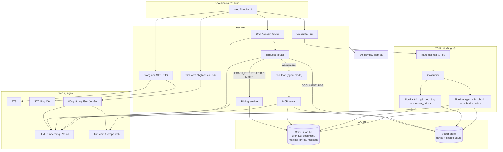
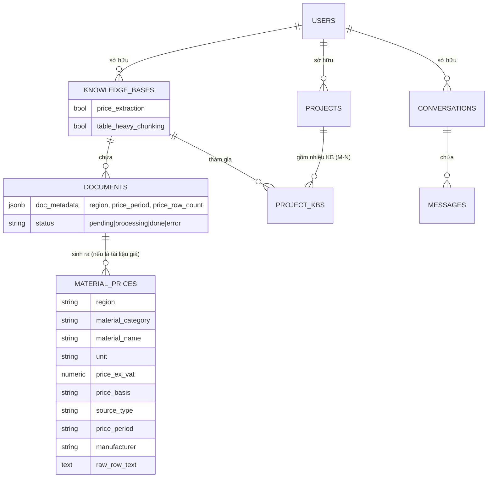
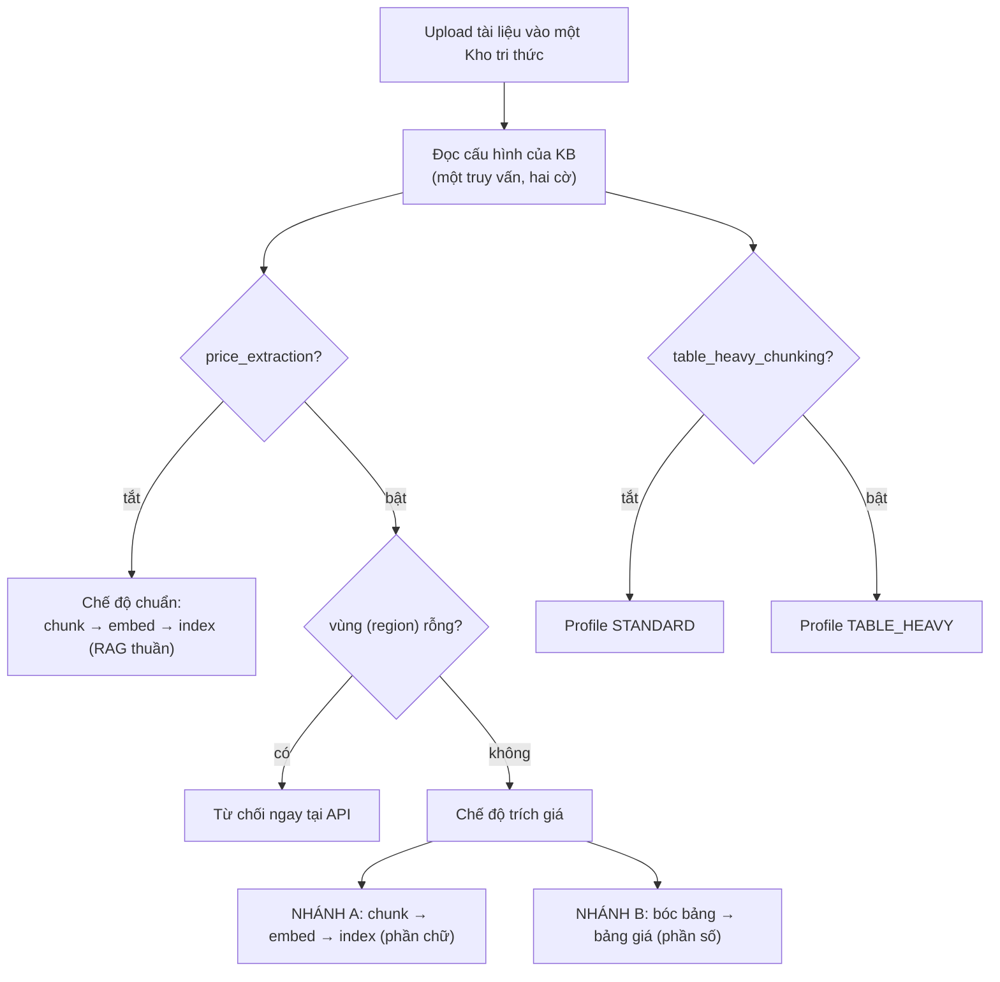
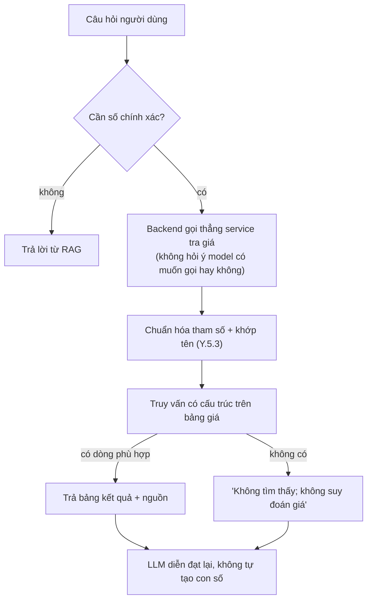
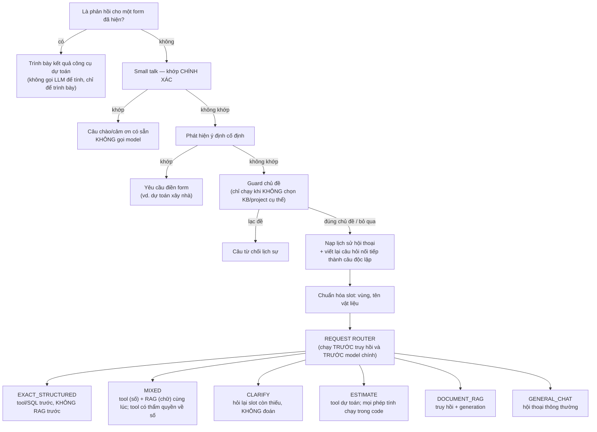
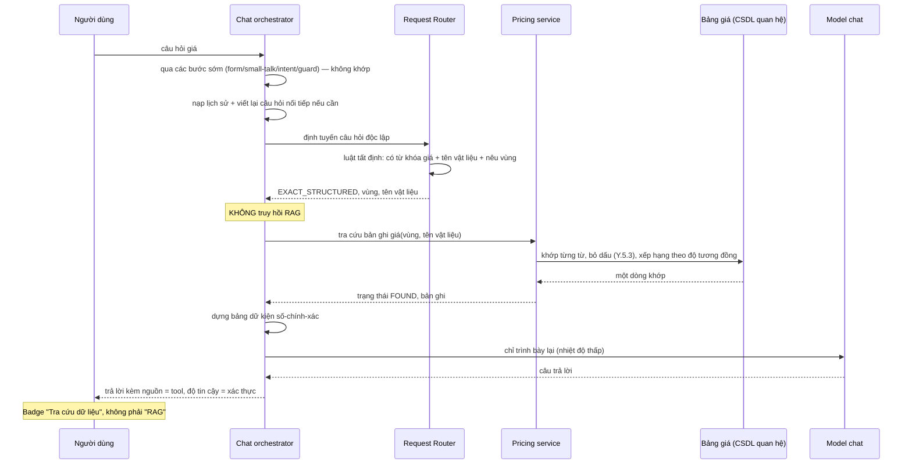
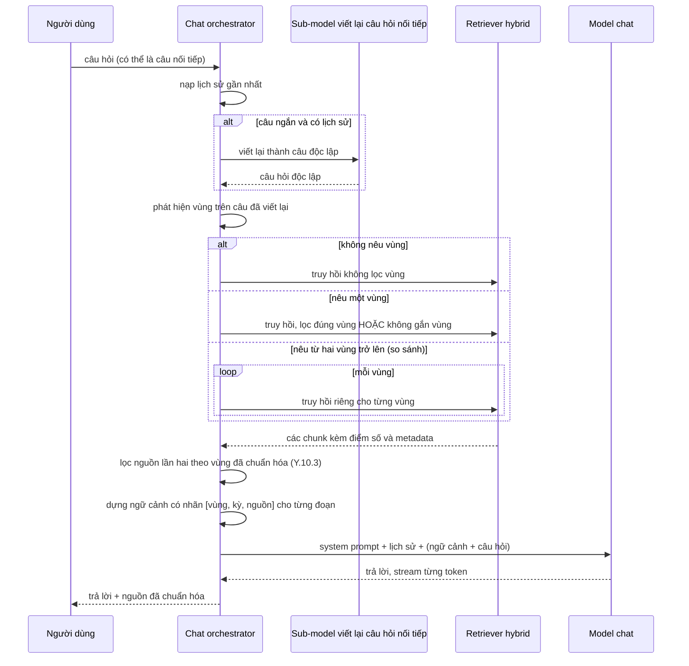
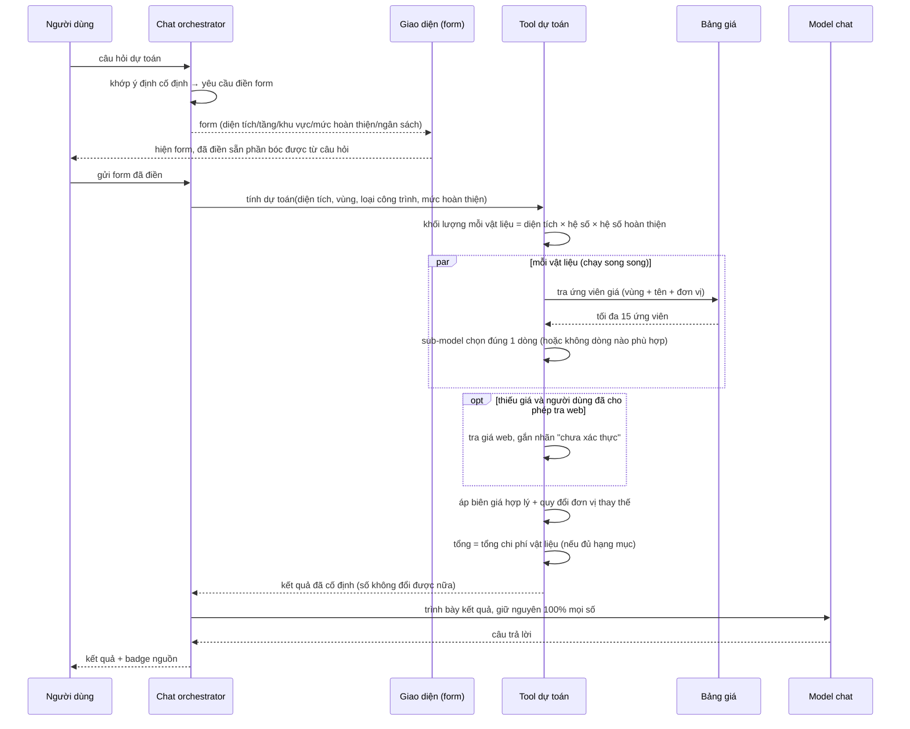
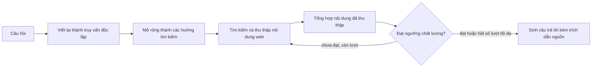

# CHƯƠNG X. THỰC NGHIỆM VÀ ĐÁNH GIÁ PIPELINE XỬ LÝ BẢNG DÀI CHO HỆ THỐNG RAG

## X.1. Mục tiêu và phạm vi đánh giá

Chương này đánh giá tác động của việc xử lý tài liệu theo cấu trúc bảng đối với một hệ thống hỏi đáp tăng cường truy hồi (Retrieval-Augmented Generation — RAG) trên các công văn công bố giá vật liệu xây dựng. Corpus nghiên cứu gần như toàn bộ là bảng; một số bảng kéo dài qua hàng trăm trang và không lặp lại hàng tiêu đề. Khi tài liệu được làm phẳng thành văn bản rồi chia theo độ dài, các giá trị ở phần giữa hoặc cuối bảng có thể không còn đi kèm nhãn cột. Hệ thống vẫn có thể giữ tên vật liệu và một con số trong cùng đoạn, nhưng không còn tín hiệu rõ ràng cho biết con số hoặc chuỗi văn bản đó thuộc cột “Đơn vị tính”, “Nhà sản xuất”, “Tiêu chuẩn kỹ thuật”, “Cơ sở giá” hay “Giá công bố”.

Câu hỏi trung tâm của nghiên cứu là:

> Việc xử lý và chia tài liệu theo cấu trúc bảng, thay vì chia văn bản thuần theo độ dài, ảnh hưởng như thế nào đến khả năng bảo toàn cấu trúc, chất lượng biểu diễn vector, truy hồi bằng chứng và độ chính xác của câu trả lời; lợi ích xuất hiện ở loại câu hỏi nào và phải trả giá bằng những chi phí gì?

Để tránh quy mọi chênh lệch cho một chỉ số cuối duy nhất, nghiên cứu phân tách hệ thống thành bốn tầng:

```text
Bảo toàn cấu trúc
        ↓
Khả năng phân biệt trong không gian embedding
        ↓
Khả năng truy hồi bằng chứng
        ↓
Khả năng sử dụng context để sinh câu trả lời
```

Cách phân tầng này cho phép xác định liệu table-aware tạo lợi ích ở bước truy hồi hay chủ yếu giúp model diễn giải bằng chứng sau khi bằng chứng đã được đưa vào context.

### X.1.1. Đơn vị được đánh giá

Đối tượng đánh giá là một **pipeline table-aware end-to-end**, gồm các bước:

```text
PDF
→ nhận diện và trích xuất vùng bảng
→ dựng lại lưới ô
→ biểu diễn bảng bằng HTML
→ xác định hoặc khôi phục hàng tiêu đề
→ chia bảng theo ranh giới hàng
→ lặp tiêu đề cho từng chunk
→ mã hóa vector
→ truy hồi
→ sinh câu trả lời
```

Do đó, kết quả phản ánh hiệu quả của toàn bộ pipeline có nhận thức cấu trúc, không chỉ phản ánh riêng thao tác đặt ranh giới chunk. Baseline recursive cũng là một pipeline hoàn chỉnh, bắt đầu từ văn bản PDF đã được làm phẳng và chia theo độ dài.

Phép so chính của chương là **T1500–R1500**. Hai nhánh sử dụng cùng giới hạn chunk danh nghĩa 1.500 token, cùng bộ câu hỏi, cùng embedding model, cùng top-k và cùng model sinh. Điều này giảm số thành phần thay đổi đồng thời và làm cho phép so phù hợp hơn với mục tiêu xác định ảnh hưởng của cách biểu diễn và chia bảng.

### X.1.2. Các câu hỏi nghiên cứu

Chương thực nghiệm trả lời sáu câu hỏi:

- **RQ1 — Bảo toàn cấu trúc:** Pipeline table-aware có duy trì nhãn cột và quan hệ hàng–cột tốt hơn recursive chunking hay không?
- **RQ2 — Chi phí biểu diễn:** Việc lặp header có làm các chunk trở nên gần nhau hơn trong không gian embedding và giảm khả năng phân biệt của dense retriever hay không?
- **RQ3 — Truy hồi:** Table-aware và recursive khác nhau như thế nào theo Recall@1/3/5/10, MRR và điểm vận hành top-5; đồng thời HTML, key–value và verbalized ảnh hưởng ra sao khi chính representation đó được dùng để embedding và lập chỉ mục?
- **RQ4 — Sinh câu trả lời:** Table-aware có cải thiện Exact Match, đặc biệt ở câu hỏi cần ánh xạ đúng giá trị vào đúng cột hay không?
- **RQ5 — Cơ chế sử dụng context:** Khi retrieval không tốt hơn nhưng generation tốt hơn, dữ liệu có cho thấy table-aware chuyển bằng chứng đã truy hồi thành câu trả lời đúng hiệu quả hơn hay không?
- **RQ6 — Độ bền và độ tin cậy:** Kết luận có còn giữ khi bổ sung BM25 và đánh giá trên câu hỏi không có đáp án hay không?

---

## X.2. Dữ liệu và bộ câu hỏi

### X.2.1. Corpus tài liệu

Corpus gồm 11 tệp PDF là công văn và phụ lục công bố giá vật liệu xây dựng. Bộ trích xuất có cấu trúc thu được 11.525 dòng giá dùng để xây dựng câu hỏi và phân tích cấu trúc.

**Bảng X.1. Thống kê corpus**

| Đặc điểm | Giá trị |
| --- | ---: |
| Số tài liệu PDF | 11 |
| Số dòng giá trích được | 11.525 |
| Tài liệu lớn nhất | `HaNoi_PhuLuc.pdf` |
| Số chunk T3000 của tài liệu lớn nhất | 818 |
| Số chunk bảng trong tài liệu lớn nhất | 809 |
| Độ dài bảng dài nhất | khoảng 699 trang liên tục |

`HaNoi_PhuLuc.pdf` là trường hợp đặc biệt quan trọng: một bảng kéo dài khoảng 699 trang nhưng hàng tiêu đề chỉ xuất hiện ở phần đầu. Từ các trang tiếp theo, văn bản thô chứa các giá trị nối tiếp nhưng không còn tín hiệu tường minh để xác định từng giá trị thuộc cột nào. Đây là loại tài liệu mà chiến lược lặp header có cơ sở để tạo khác biệt.

Năm tệp Markdown từng có trong kho dữ liệu được loại khỏi benchmark vì đi qua một pipeline khác và không tạo chunk bảng HTML. Việc giữ chúng trong corpus sẽ làm loãng phép đo đối với các thành phần đang được đánh giá.

### X.2.2. Bộ 500 câu hỏi có đáp án

Bộ benchmark chính gồm 500 câu hỏi. Về mặt vận hành, câu **tra giá** là câu có trường `expect_values`, còn câu **thuộc tính** là câu có trường `expect_text`.

**Bảng X.2. Hai nhóm câu hỏi chính**

| Nhóm | Ký hiệu | Số câu | Năng lực được đo |
| --- | --- | ---: | --- |
| Tra giá | G1–G4 | 252 | Tìm đúng một giá trị số gắn với tên hoặc mã vật liệu |
| Thuộc tính bảng | S1–S4 | 248 | Xác định đúng giá trị ở đúng cột của đúng hàng |
| **Tổng** |  | **500** |  |

Các biến thể G1–G4 lần lượt sử dụng tên nguyên vẹn, tên bỏ dấu, mã sản phẩm bị tách ký tự và tên rút gọn. Các câu S1–S4 hỏi về đơn vị tính, nhà sản xuất, tiêu chuẩn kỹ thuật và cơ sở giá.

Việc tách hai nhóm là một quyết định thiết kế quan trọng. Câu tra giá có thể được trả lời đúng nếu tên sản phẩm và một con số phù hợp xuất hiện gần nhau, ngay cả khi hệ thống không diễn giải đầy đủ cấu trúc bảng. Ngược lại, câu thuộc tính buộc hệ thống xác định một chuỗi thuộc đúng cột của đúng hàng. Vì vậy, mọi bảng kết quả đều báo cáo cả kết quả tổng thể và kết quả riêng cho hai nhóm.

### X.2.3. Bộ 70 câu không có đáp án

Bộ đánh giá khả năng từ chối gồm 70 câu đã được kiểm tra thủ công từ tài liệu nguồn.

**Bảng X.3. Phân bố câu hỏi không có đáp án**

| Nhóm | Số câu | Mục tiêu kiểm tra |
| --- | ---: | --- |
| N1 | 30 | Hàng dữ liệu tồn tại nhưng ô thuộc tính được hỏi bị trống |
| N3 | 20 | Tên hoặc quy cách gần giống dữ liệu thật nhưng không tồn tại |
| N4 | 20 | Kỳ công bố được hỏi không có trong tập tài liệu |
| **Tổng** | **70** |  |

Một câu được chấm đúng khi hệ thống từ chối đưa ra giá trị cụ thể và nêu rằng không tìm thấy thông tin hoặc không có đủ bằng chứng. Một câu bị chấm sai khi hệ thống đưa ra một giá trị không được tài liệu hỗ trợ. Bộ này không được diễn giải độc lập với độ chính xác trên 500 câu có đáp án, vì một hệ thống từ chối mọi truy vấn có thể đạt tỷ lệ bịa thấp nhưng không có giá trị sử dụng.

---

## X.3. Các phương pháp so sánh

### X.3.1. Pipeline table-aware

Pipeline table-aware sử dụng `pdfplumber` để dựng lại lưới bảng, biểu diễn bảng bằng HTML, khôi phục header cho các trang tiếp nối và chia bảng tại ranh giới hàng. Khi một bảng sinh ra nhiều chunk, hàng tiêu đề được lặp lại trong từng chunk và được tính vào ngân sách token.

Hai cấu hình được sử dụng trong phân tích cấu trúc và embedding:

- **T1500:** table-aware với giới hạn 1.500 token;
- **T3000:** table-aware với giới hạn 3.000 token.

Phép so generation chính sử dụng T1500. Cấu hình T3000 được giữ như một điểm tham chiếu về ảnh hưởng của kích thước chunk đối với số lượng chunk và độ tương đồng embedding, nhưng không được dùng để thay thế phép so T1500–R1500.

### X.3.2. Baseline recursive

Baseline sử dụng `RecursiveCharacterTextSplitter` trên văn bản PDF đã được làm phẳng, không giữ đánh dấu ô bảng. Phép so chính sử dụng:

- **R1500:** recursive chunking với giới hạn 1.500 token.

R1500 chịu cùng giới hạn danh nghĩa với T1500 nhưng tạo ít chunk hơn vì không lặp header và không duy trì cấu trúc HTML.

### X.3.3. Dense retrieval và hybrid retrieval

Dense retrieval sử dụng `text-embedding-3-small`. Hybrid retrieval kết hợp dense retrieval với BM25 Okapi; hai bảng xếp hạng được hợp nhất bằng Reciprocal Rank Fusion (RRF) với `k=60`. Mỗi nhánh prefetch 50 kết quả trước khi hợp nhất, sau đó lấy top-5 làm context cho model sinh.

BM25 được áp dụng cho cả T1500 và R1500. Thiết kế này tạo thành phép so 2×2:

| Chunking | Dense | Dense + BM25 |
| --- | --- | --- |
| Table-aware | T1500 dense | T1500 hybrid |
| Recursive | R1500 dense | R1500 hybrid |

Thiết kế 2×2 cho phép tách hai câu hỏi:

1. table-aware có tốt hơn recursive khi cùng dùng một loại retriever hay không;
2. BM25 có giúp table-aware nhiều hơn recursive hay chỉ là cải tiến retrieval tổng quát.

Ngoài phép so T1500–R1500, nghiên cứu thực hiện một **thí nghiệm representation ở tầng retrieval** để tách ảnh hưởng của định dạng chuỗi khỏi ảnh hưởng của ranh giới chunk. Ba index `T1500_HTML`, `T1500_KV` và `T1500_VERB` sử dụng cùng 2.252 logical chunk, cùng hàng, cột, header, giá trị ô và `chunk_id`; chỉ chuỗi được đưa vào embedding thay đổi. KV và verbalized được render bằng quy tắc deterministic, không dùng LLM. Cả ba dùng cùng `text-embedding-3-small`, cosine similarity và dense retrieval. `R1500` được giữ như baseline pipeline riêng, không được xem là representation thứ tư cùng chunk.

Thiết kế này trả lời hai câu hỏi độc lập: **representation nào tạo index dense tốt hơn**, và **representation nào giúp model đọc cùng evidence tốt hơn**. Hai kết quả không được gộp làm một vì representation tối ưu cho retrieval có thể khác representation tối ưu cho generation.

### X.3.4. Thiết lập generation

Model chính là `openai/gpt-oss-20b`, với:

- `temperature=0`;
- `max_tokens=2000`;
- `top_k=5`;
- không gọi công cụ;
- cùng prompt và cùng hàm chuẩn hóa đáp án cho bốn cấu hình.

Toàn bộ benchmark generation được chạy trực tiếp qua OpenRouter với cùng tên model và cùng tham số. Mọi cấu hình giữ nguyên mẫu số 500 câu và không sử dụng kết quả từ endpoint khác để thay thế.

---

## X.4. Chỉ số và quy trình đánh giá

### X.4.1. Tầng cấu trúc

Tầng cấu trúc chạy trên toàn bộ 11.525 dòng, không sử dụng LLM. Các chỉ số chính gồm:

- **Toàn vẹn dòng:** tên vật liệu và giá vẫn nằm trong cùng một chunk;
- **Dòng có nhãn cột:** chunk chứa đủ header cần thiết để diễn giải dòng dữ liệu;
- **Khả năng ánh xạ cột:** representation còn cho phép xác định một giá trị thuộc cột nào;
- **Hàng bị loại:** số hàng không thể đưa vào index do vượt giới hạn chunk.

### X.4.2. Tầng embedding

Độ tương đồng cosine được tính giữa các chunk trong corpus. Nghiên cứu báo cáo median, P90 và tỷ lệ cặp có cosine lớn hơn hoặc bằng 0,90 và 0,95. Tỷ lệ cặp gần trùng cao cho thấy index có nhiều vector khó phân biệt, có thể làm nhiều vị trí trong top-k bị chiếm bởi các chunk gần giống nhau.

### X.4.3. Tầng retrieval

Retrieval được đánh giá tại nhiều điểm cắt thay vì chỉ một `k`. Các chỉ số gồm:

- **Recall@1, Recall@3, Recall@5, Recall@10:** tỷ lệ câu hỏi mà top-k chứa ít nhất một chunk mang giá trị đích theo `expect_values` hoặc `expect_text`;
- **MRR (Mean Reciprocal Rank):** trung bình nghịch đảo thứ hạng của hit đầu tiên, do đó nhạy với việc evidence xuất hiện sớm hay muộn trong danh sách;
- **Median first-hit rank:** trung vị thứ hạng của hit đầu tiên trong các truy vấn có hit;
- **No-hit@10:** số truy vấn không có proxy evidence trong top-10.

`Recall@5` vẫn là **endpoint vận hành chính** vì generation của hệ thống dùng top-5 context. Recall@1/3/10 và MRR được dùng để mô tả hình dạng bảng xếp hạng và tránh kết luận từ một điểm cắt duy nhất.

Do benchmark chưa có `gold_row_id` hoặc `gold_cell_id` độc lập cho toàn bộ 500 câu, các recall trong chương là **proxy evidence hit**: một truy vấn được tính là hit khi top-k chứa giá trị kỳ vọng. Chỉ số này hữu ích để so sánh các cấu hình trên cùng benchmark, nhưng không hoàn toàn tương đương evidence recall dựa trên đúng hàng hoặc đúng ô. Hạn chế này được giữ rõ trong diễn giải kết quả.

### X.4.4. Tầng generation

Câu trả lời được chấm bằng Exact Match (EM) sau chuẩn hóa. Mẫu số luôn là 500 câu cho mỗi cấu hình.

Chỉ số bổ sung là **retrieval-to-answer conversion**:

\[
\text{Conversion}=
\frac{\text{số câu retrieval hit và generation đúng}}
{\text{số câu retrieval hit}}
\]

Conversion được tính theo từng `query_id`, không lấy EM chia cho Recall tổng. Chỉ số này đo khả năng chuyển một retrieval hit thành câu trả lời đúng, nhưng vẫn mang tính mô tả vì retrieval hit dựa trên answer-containing proxy.

### X.4.5. Khả năng từ chối

Trên bộ 70 câu không có đáp án, chỉ số chính là tỷ lệ từ chối đúng. Một câu bị chấm sai khi model đưa ra giá trị cụ thể không được tài liệu hỗ trợ. Cả hai cấu hình hybrid sử dụng cùng model, prompt, top-k và retriever; khác biệt chính là pipeline table-aware hoặc recursive.

### X.4.6. Kiểm định thống kê

Mọi cấu hình trả lời cùng một tập câu hỏi, vì vậy phép so đúng–sai sử dụng kiểm định McNemar ghép cặp. Báo cáo trình bày hai số bất đồng:

- T đúng, R sai;
- T sai, R đúng.

Họ kiểm định xác nhận chính gồm sáu phép so T1500–R1500:

1. dense trên toàn bộ 500 câu;
2. dense trên 252 câu tra giá;
3. dense trên 248 câu thuộc tính;
4. hybrid trên toàn bộ 500 câu;
5. hybrid trên 252 câu tra giá;
6. hybrid trên 248 câu thuộc tính.

Sáu p-value được hiệu chỉnh bằng thủ tục Holm. Cách chọn này bảo thủ hơn việc chỉ hiệu chỉnh bốn phép theo nhóm và tránh lựa chọn họ kiểm định sau khi quan sát kết quả.

Tương tác BM25 được đo bằng chênh-của-chênh:

\[
\Delta_{interaction}=
(T_{hybrid}-T_{dense})-(R_{hybrid}-R_{dense})
\]

Độ bất định được ước lượng bằng paired bootstrap trên `query_id`. Với interaction generation, nghiên cứu sử dụng 100.000 lần resampling, seed `20260807`, và khoảng tin cậy percentile 95%.

---

## X.5. Kiểm soát chất lượng và khả năng tái lập

### X.5.1. Xác minh danh tính index

Trong quá trình kiểm tra, alias cấu hình `T` từng trỏ mặc định tới T3000, tạo nguy cơ gắn nhầm kết quả T3000 cho T1500. Để loại bỏ lỗi này, các script sau đó bắt buộc dùng tên tường minh `T1500`, `T3000` và `R1500`; alias mơ hồ bị từ chối.

Mỗi vector cache được gắn manifest gồm:

- tên cấu hình;
- giới hạn chunk;
- số lượng chunk;
- digest nội dung chunk;
- embedding model;
- cache version.

Cache chỉ được sử dụng khi số chunk và digest khớp dữ liệu hiện tại. Kết quả cuối sử dụng cache version `identity_v2`.

**Bảng X.4. Danh tính các index đã xác minh**

| Cấu hình | Giới hạn | Số chunk | Token trung bình | Digest/manifest |
| --- | ---: | ---: | ---: | --- |
| T1500 | 1.500 | 2.252 | 831 | Khớp |
| T3000 | 3.000 | 1.476 | 1.185 | Khớp |
| R1500 | 1.500 | 790 | 1.102 | Khớp |

### X.5.2. Tách raw cache và file tổng hợp

Cache câu trả lời thô và file kết quả tổng hợp được ghi vào hai đường dẫn khác nhau. Mỗi bản ghi raw lưu tối thiểu:

- `query_id`;
- cấu hình;
- danh sách chunk được truy hồi;
- câu trả lời thô;
- câu trả lời chuẩn hóa;
- điểm đúng/sai;
- `finish_reason`;
- cờ output rỗng;
- token usage;
- prompt hash và model.

Thiết kế này ngăn file tổng hợp ghi đè dữ liệu từng câu và cho phép tính McNemar, conversion và bootstrap trực tiếp từ raw result.

### X.5.3. Tính nhất quán endpoint

Toàn bộ kết quả chính thức của `openai/gpt-oss-20b` được sinh trực tiếp qua OpenRouter. Bốn cấu hình chính sử dụng cùng prompt, cùng hàm chuẩn hóa, cùng tham số generation và cùng endpoint; nghiên cứu không sử dụng kết quả từ endpoint thứ hai để thay thế câu trả lời.

### X.5.4. Phụ thuộc giữa nhãn và parser

Đáp án kỳ vọng được lấy từ dữ liệu có cấu trúc do cùng pipeline trích xuất bảng tạo ra. Điều này có thể tạo thiên lệch có lợi cho table-aware. Đối với chỉ số toàn vẹn dòng, nghiên cứu chỉ giữ tập tên xuất hiện ở mọi nhánh; sau hiệu chỉnh, T và R1500 gần như bằng nhau.

Ngoài ra, 25 câu thuộc tính được lấy ngẫu nhiên để đối chiếu thủ công với PDF gốc; 24 câu khớp và một câu sai, tương đương 96% trong mẫu kiểm tra. Kết quả này làm giảm lo ngại về lỗi nhãn phổ biến nhưng không được diễn giải thành độ chính xác 96% cho toàn bộ 248 câu, vì cỡ mẫu còn nhỏ.

### X.5.5. Hạn chế của nhãn retrieval

Benchmark retrieval hiện sử dụng `expect_values` và `expect_text` thay vì gold row/cell ID độc lập. Vì cùng một đơn vị, nhà sản xuất hoặc con số có thể xuất hiện ở nhiều hàng, Recall@5 có thể chứa hit giả; ngược lại, một câu generation có thể đúng dù proxy retrieval không nhận diện hit. Vì vậy, các kết luận về cơ chế dựa trên conversion được trình bày như bằng chứng phù hợp, không phải phân rã nhân quả tuyệt đối.

---

## X.6. Kết quả

### X.6.1. Bảo toàn cấu trúc

**Bảng X.5. Chất lượng cấu trúc của các cấu hình chính**

| Nhánh | Số chunk | Token trung bình | Toàn vẹn dòng | Dòng có nhãn cột |
| --- | ---: | ---: | ---: | ---: |
| T1500 | 2.252 | 831 | 99,5% | 100% |
| T3000 | 1.476 | 1.185 | 99,5% | 100% |
| R1500 | 790 | 1.102 | 99,4% | 65% |

Sau khi loại ảnh hưởng của nhãn không xuất hiện đồng đều giữa các nhánh, T1500 và R1500 gần như tương đương về việc giữ tên vật liệu và giá trong cùng chunk: 99,5% so với 99,4%. Vì vậy, nghiên cứu không sử dụng “toàn vẹn dòng cao hơn” làm luận điểm chính cho table-aware.

Khác biệt rõ nằm ở nhãn cột. T1500 và T3000 đều giữ header trong 100% chunk bảng, trong khi R1500 chỉ có khoảng 65% dòng đi kèm đủ tín hiệu header theo phép đo hiện tại. Recursive có thể giữ các giá trị gần nhau nhưng không còn đánh dấu ô để xác định chắc chắn giá trị nào thuộc cột nào.

Kết quả trả lời RQ1:

> Lợi thế cấu trúc trực tiếp của table-aware không phải là giữ tên và giá cùng một chunk tốt hơn R1500, mà là duy trì nhãn cột và quan hệ hàng–cột để model có thể diễn giải các thuộc tính.

### X.6.2. Chi phí trong không gian embedding

**Bảng X.6. Độ tương đồng giữa các chunk**

| Nhánh | Median cosine | P90 | Tỷ lệ ≥0,90 | Tỷ lệ ≥0,95 |
| --- | ---: | ---: | ---: | ---: |
| T1500 | 0,633 | 0,788 | 1,67% | 0,38% |
| T3000 | 0,605 | 0,782 | 2,69% | 0,65% |
| R1500 | 0,611 | 0,731 | 0,59% | 0,20% |

T1500 có tỷ lệ cặp cosine ≥0,90 cao hơn R1500 khoảng 2,8 lần (1,67% so với 0,59%). Kết quả này cho thấy việc giữ và lặp header tạo ra một phần văn bản chung giữa các chunk cùng bảng. Phần chung có lợi cho model khi cần hiểu cột, nhưng làm dense retriever khó phân biệt các chunk hơn.

T3000 có tỷ lệ cặp ≥0,90 cao hơn T1500, 2,69% so với 1,67%. Có thể các chunk lớn chứa nhiều hàng với từ vựng và cấu trúc lặp lại, nhưng nghiên cứu chưa thực hiện ablation tách header khỏi body để xác định đóng góp nhân quả của từng phần. Vì vậy, giải thích này chỉ là giả thuyết hậu nghiệm.

Kết quả trả lời RQ2:

> Table-aware tạo một trade-off: bảo toàn header và quan hệ cột tốt hơn, nhưng index chứa nhiều cặp vector gần trùng hơn recursive.

### X.6.3. Hồ sơ retrieval tại nhiều điểm cắt

Việc mở rộng phép đo từ Recall@5 sang Recall@1/3/5/10 và MRR cho thấy T1500 và R1500 có hành vi xếp hạng khác nhau; không có một nhánh thắng nhất quán tại mọi `k`.

**Bảng X.7. Retrieval toàn tập tại nhiều điểm cắt**

| Cấu hình | R@1 | R@3 | R@5 | R@10 | MRR | Median first-hit rank | No-hit@10 |
| --- | ---: | ---: | ---: | ---: | ---: | ---: | ---: |
| T1500 dense | 207/500 = 41,4% | 307/500 = 61,4% | 343/500 = 68,6% | **394/500 = 78,8%** | 0,5345 | 1,0 | 106 |
| R1500 dense | **228/500 = 45,6%** | **327/500 = 65,4%** | **354/500 = 70,8%** | 389/500 = 77,8% | **0,5659** | 1,0 | 111 |
| T1500 hybrid | 272/500 = 54,4% | 373/500 = 74,6% | **410/500 = 82,0%** | 435/500 = 87,0% | 0,6597 | 1,0 | 65 |
| R1500 hybrid | **294/500 = 58,8%** | **381/500 = 76,2%** | 403/500 = 80,6% | **438/500 = 87,6%** | **0,6844** | 1,0 | 62 |

Trong dense retrieval, R1500 tốt hơn ở R@1, R@3, R@5 và MRR; T1500 chỉ vượt nhẹ ở R@10. Điều này củng cố kết luận rằng table-aware **không tạo lợi thế dense retrieval tổng quát**. Trong hybrid retrieval, R1500 vẫn cao hơn ở R@1, R@3, R@10 và MRR, trong khi T1500 cao hơn tại R@5 — đúng điểm vận hành mà hệ thống dùng để đưa context vào generation. Vì vậy, phát biểu chính xác là **T1500 đạt Recall@5 hybrid cao hơn**, không phải “T1500 có bảng xếp hạng retrieval tốt hơn ở mọi độ sâu”.

**Bảng X.8. Retrieval theo nhóm câu hỏi**

| Cấu hình | Nhóm | R@1 | R@3 | R@5 | R@10 | MRR | No-hit@10 |
| --- | --- | ---: | ---: | ---: | ---: | ---: | ---: |
| T1500 dense | Tra giá | 108/252 | 166/252 | 189/252 | 210/252 | 0,5661 | 42 |
| R1500 dense | Tra giá | 113/252 | 179/252 | 196/252 | 214/252 | 0,5887 | 38 |
| T1500 hybrid | Tra giá | 156/252 | 219/252 | **238/252** | **243/252** | 0,7572 | 9 |
| R1500 hybrid | Tra giá | **171/252** | 219/252 | 228/252 | 241/252 | **0,7798** | 11 |
| T1500 dense | Thuộc tính | 99/248 | 141/248 | 154/248 | **184/248** | 0,5023 | 64 |
| R1500 dense | Thuộc tính | **115/248** | **148/248** | **158/248** | 175/248 | **0,5428** | 73 |
| T1500 hybrid | Thuộc tính | 116/248 | 154/248 | 172/248 | 192/248 | 0,5606 | 56 |
| R1500 hybrid | Thuộc tính | **123/248** | **162/248** | **175/248** | **197/248** | **0,5874** | 51 |

Hai chế độ lỗi tách khá rõ. Với **tra giá**, hybrid làm Recall@5 của T1500 tăng từ 189 lên 238 và R1500 từ 196 lên 228; các token định danh như mã, tên riêng, kích thước và chuỗi số phù hợp với lexical matching. Với **thuộc tính**, R1500 vẫn cao hơn T1500 tại Recall@5 ở cả dense (158 so với 154) và hybrid (175 so với 172). Vì vậy, lợi thế generation thuộc tính của table-aware không thể được giải thích bằng việc retrieval tìm evidence thường xuyên hơn.

Kết quả trả lời phần thứ nhất của RQ3:

> Table-aware không thắng retrieval một cách nhất quán theo độ sâu xếp hạng. R1500 có R@1, R@3 và MRR cao hơn trong cả dense lẫn hybrid; T1500 chỉ vượt R1500 tại operating point R@5 của hybrid và ở một số điểm cắt sâu. Do đó, kết luận retrieval phải gắn với `k` vận hành thay vì quy thành một thứ hạng tổng quát.

### X.6.4. Ảnh hưởng của representation lên dense retrieval

Thí nghiệm representation ở tầng retrieval giữ nguyên 2.252 logical chunk T1500 và chỉ thay chuỗi được embedding. Vì ranh giới chunk, hàng, cột, header và cell value được khóa bằng fingerprint, chênh lệch có thể được diễn giải như ảnh hưởng của representation đối với dense retrieval, không phải ảnh hưởng của chunking. Thí nghiệm này không gọi model generation.

**Bảng X.9. Recall@5 khi thay representation dùng để embedding**

| Representation T1500 | Recall@5 | Tỷ lệ | Chênh so với HTML |
| --- | ---: | ---: | ---: |
| **HTML** | **343/500** | **68,6%** | — |
| Key–value (KV) | 306/500 | 61,2% | −37 câu (−7,4 điểm %) |
| Verbalized (VERB) | 218/500 | 43,6% | −125 câu (−25,0 điểm %) |

HTML đạt Recall@5 cao nhất quan sát được. Việc tuyến tính hóa cùng dữ liệu bảng thành key–value làm mất 37 retrieval hit; verbalized giảm mạnh hơn, mất 125 hit. Kết quả này bác bỏ giả thuyết rằng chuyển bảng sang chuỗi “dễ đọc hơn” tất yếu cải thiện embedding retrieval.

Kết quả cũng tạo ra một phân biệt quan trọng với benchmark generation ở X.6.9: **representation tốt nhất để lập chỉ mục không nhất thiết luôn là representation tốt nhất để một model cụ thể đọc context**. Ở retrieval, HTML là winner rõ tại endpoint R@5. Ở generation, HTML đạt tổng EM cao nhất với GPT-OSS 20B và hai model Gemma, trong khi KV đạt cao nhất với Llama 3.1 8B. Vì vậy, kiến trúc vẫn nên tách `retrieval representation` và `generation representation` về mặt khái niệm, dù HTML là lựa chọn mặc định hợp lý cho phần lớn model trong benchmark hiện tại.

Kết quả trả lời phần thứ hai của RQ3:

> Trên cùng logical chunks T1500, HTML là representation dense-retrieval tốt nhất quan sát được tại Recall@5. Key–value và đặc biệt verbalized không cải thiện retrieval; lợi ích của chúng, nếu có, chỉ xuất hiện ở một số model tại giai đoạn generation.

### X.6.5. Ảnh hưởng của BM25 lên retrieval

**Bảng X.10. Retrieval 2×2 tại operating point top-5**

| Cấu hình | Dense R@5 | Hybrid R@5 | Mức tăng | Tăng tra giá | Tăng thuộc tính |
| --- | ---: | ---: | ---: | ---: | ---: |
| T1500 | 343/500 | 410/500 = 82,0% | +67 | +49 | +18 |
| R1500 | 354/500 | 403/500 = 80,6% | +49 | +32 | +17 |

BM25 cải thiện Recall@5 của cả hai pipeline. T1500 tăng 67 hit, còn R1500 tăng 49 hit. Chênh-của-chênh là +18 câu. Paired bootstrap cho khoảng tin cậy 95% từ −2 đến +37 câu và `p=0,0796`; khoảng tin cậy chứa 0, nên chưa có đủ bằng chứng ở ngưỡng 0,05 để kết luận BM25 tương tác đặc biệt với table-aware.

Mức tăng tập trung mạnh ở tra giá:

- T1500: `189 → 238`, tăng 49/252 câu;
- R1500: `196 → 228`, tăng 32/252 câu.

Ở thuộc tính, mức tăng nhỏ hơn:

- T1500: `154 → 172`, tăng 18/248 câu;
- R1500: `158 → 175`, tăng 17/248 câu.

Kết hợp với hồ sơ xếp hạng ở X.6.3, BM25 không làm T1500 thắng mọi điểm cắt: R1500 hybrid vẫn có R@1, R@3, R@10 và MRR cao hơn. Giá trị của T1500 hybrid nằm ở đúng top-5 context mà hệ thống sử dụng và ở generation thuộc tính sau đó.

Kết quả trả lời phần hybrid của RQ3:

> BM25 là cải tiến retrieval hiệu quả cho cả hai pipeline, đặc biệt ở câu tra giá. T1500 đạt Recall@5 hybrid cao hơn R1500 tại operating point của hệ thống, nhưng interaction chưa đạt ý nghĩa thống kê và R1500 vẫn có lợi thế ở một số chỉ số xếp hạng khác.

### X.6.6. Kết quả generation

**Bảng X.11. Exact Match của bốn cấu hình chính**

| Cấu hình | EM | Tra giá G1–G4 | Thuộc tính S1–S4 |
| --- | ---: | ---: | ---: |
| T1500 dense | 251/500 = 50,2% | 159/252 = 63,1% | 92/248 = 37,1% |
| R1500 dense | 227/500 = 45,4% | 162/252 = 64,3% | 65/248 = 26,2% |
| T1500 hybrid | **292/500 = 58,4%** | **196/252 = 77,8%** | **96/248 = 38,7%** |
| R1500 hybrid | 256/500 = 51,2% | 182/252 = 72,2% | 74/248 = 29,8% |

Trong dense retrieval, T1500 hơn R1500 24 câu tổng thể. Phân rã theo nhóm cho thấy toàn bộ lợi thế đến từ câu thuộc tính:

- tra giá: T ít hơn R 3 câu;
- thuộc tính: T nhiều hơn R 27 câu.

Trong hybrid retrieval, T1500 hơn R1500 36 câu:

- tra giá: T nhiều hơn R 14 câu;
- thuộc tính: T nhiều hơn R 22 câu.

BM25 làm EM của T1500 tăng 41 câu, từ 251 lên 292; R1500 tăng 29 câu, từ 227 lên 256. Ở T1500, 37/41 câu cải thiện thuộc nhóm tra giá và chỉ 4/41 thuộc nhóm thuộc tính. Ở R1500, mức tăng tương ứng là 20 câu tra giá và 9 câu thuộc tính.

Interaction generation quan sát được là `+12` câu, tức mức tăng của T1500 lớn hơn R1500 12 câu. Tuy nhiên, paired bootstrap 100.000 lần cho khoảng tin cậy 95% từ −13 đến +37 câu và `p=0,3723`. Khoảng tin cậy chứa 0, nên chưa có bằng chứng rằng tác động của BM25 lên generation phụ thuộc vào chiến lược chunking.

Mẫu kết quả cho thấy table-aware và BM25 giải quyết hai chế độ lỗi khác nhau:

- table-aware tạo lợi thế rõ nhất ở câu thuộc tính, nơi model phải xác định đúng cột;
- BM25 tạo phần lớn lợi ích ở câu tra giá, nơi mã sản phẩm, kích thước, tên riêng và chuỗi số có giá trị phân biệt cao.

### X.6.7. So sánh ghép cặp và hiệu chỉnh Holm

**Bảng X.12. McNemar và p-value Holm cho họ sáu kiểm định**

| Retriever | Phạm vi | n | T đúng/R sai | T sai/R đúng | p gốc | p Holm |
| --- | --- | ---: | ---: | ---: | ---: | ---: |
| Dense | Toàn tập | 500 | 80 | 56 | 0,04818 | 0,14455 |
| Dense | Tra giá | 252 | 36 | 39 | 0,8176 | 0,8176 |
| Dense | Thuộc tính | 248 | 44 | 17 | **0,00073** | **0,00438** |
| Hybrid | Toàn tập | 500 | 83 | 47 | **0,00202** | **0,01012** |
| Hybrid | Tra giá | 252 | 42 | 28 | 0,1196 | 0,2392 |
| Hybrid | Thuộc tính | 248 | 41 | 19 | **0,00622** | **0,02487** |

Sau hiệu chỉnh Holm:

- dense thuộc tính vẫn có ý nghĩa (`p_Holm=0,00438`);
- hybrid thuộc tính vẫn có ý nghĩa (`p_Holm=0,02487`);
- hybrid tổng thể vẫn có ý nghĩa (`p_Holm=0,01012`);
- dense tổng thể không còn có ý nghĩa (`p_Holm=0,14455`);
- hai phép so tra giá không có ý nghĩa.

Đây là bằng chứng thống kê trực tiếp cho luận điểm trung tâm:

> Khác biệt giữa table-aware và recursive tập trung ở câu hỏi thuộc tính. Không có bằng chứng thống kê rằng table-aware tốt hơn ở câu tra giá; lợi thế dense tổng thể cũng không còn đứng vững sau hiệu chỉnh so sánh bội.

Kết quả trả lời RQ4:

> Với model `gpt-oss-20b`, table-aware cải thiện ổn định câu hỏi thuộc tính trong cả dense và hybrid. Ở cấu hình hybrid, table-aware còn tốt hơn tổng thể sau hiệu chỉnh Holm.

### X.6.8. Retrieval-to-answer conversion và cơ chế sử dụng context

**Bảng X.13. Tỷ lệ chuyển retrieval hit thành câu trả lời đúng**

| Cấu hình | Toàn tập | Tra giá | Thuộc tính |
| --- | ---: | ---: | ---: |
| T1500 dense | 241/343 = 70,26% | 159/189 = 84,13% | 82/154 = 53,25% |
| T1500 hybrid | 287/410 = 70,00% | 196/238 = 82,35% | 91/172 = 52,91% |
| R1500 dense | 221/354 = 62,43% | 162/196 = 82,65% | 59/158 = 37,34% |
| R1500 hybrid | 249/403 = 61,79% | 182/228 = 79,82% | 67/175 = 38,29% |

Ở câu tra giá, conversion của T và R tương đối gần nhau, nằm trong khoảng 79,8%–84,1%. Ở câu thuộc tính, khoảng cách lớn hơn rõ rệt:

- dense: T1500 53,25%, R1500 37,34%;
- hybrid: T1500 52,91%, R1500 38,29%.

Đáng chú ý, hybrid thuộc tính của T1500 có Recall@5 thấp hơn R1500 (69,4% so với 70,6%) nhưng generation cao hơn (38,7% so với 29,8%). Điều này loại bỏ cách giải thích đơn giản rằng T trả lời tốt hơn chỉ vì retrieval tốt hơn.

BM25 làm Recall@5 tăng mạnh nhưng conversion gần như không tăng:

- T1500: 70,26% xuống 70,00%;
- R1500: 62,43% xuống 61,79%.

Như vậy, BM25 chủ yếu đưa thêm giá trị đích vào top-5; nó không tự động làm model sử dụng context hiệu quả hơn. Ngược lại, table-aware không tạo lợi thế retrieval thuộc tính nhưng có conversion thuộc tính cao hơn đáng kể.

Kết quả trả lời RQ5:

> Dữ liệu phù hợp với giả thuyết rằng table-aware giúp model khai thác quan hệ hàng–cột trong context hiệu quả hơn. Đây là bằng chứng gián tiếp từ conversion, không phải chứng minh nhân quả tuyệt đối, vì retrieval hit hiện vẫn dựa trên answer-containing proxy và top-5 của hai nhánh không giống nhau hoàn toàn.

### X.6.9. Ảnh hưởng của dạng biểu diễn theo model khi giữ cố định retrieval

Thí nghiệm này tách ảnh hưởng của **representation ở giai đoạn generation** khỏi ảnh hưởng của retrieval. Ba nhánh `HTML`, `KV` và `VERB` sử dụng cùng top-5 của T1500 dense, cùng thứ tự chunk và cùng dữ liệu ô; chỉ chuỗi context đưa vào model được thay đổi. Nhánh `Recursive` sử dụng top-5 của R1500 dense và được xem là baseline pipeline, không phải một representation thứ tư dùng chung chunk với T1500.

**Bảng X.14. Exact Match theo model và dạng biểu diễn**

| Model | Arm | Tra giá /252 | Thuộc tính /248 | Tổng /500 |
| --- | --- | ---: | ---: | ---: |
| GPT-OSS 20B | HTML | 159 (63,1%) | 92 (37,1%) | **251 (50,2%)** |
|  | KV | 149 (59,1%) | **94 (37,9%)** | 243 (48,6%) |
|  | VERB | 144 (57,1%) | 87 (35,1%) | 231 (46,2%) |
|  | Recursive | **162 (64,3%)** | 65 (26,2%) | 227 (45,4%) |
| Gemma 3 12B | HTML | 159 (63,1%) | **134 (54,0%)** | **293 (58,6%)** |
|  | KV | 153 (60,7%) | 132 (53,2%) | 285 (57,0%) |
|  | VERB | 157 (62,3%) | 131 (52,8%) | 288 (57,6%) |
|  | Recursive | 158 (62,7%) | 93 (37,5%) | 251 (50,2%) |
| Llama 3.1 8B | HTML | 91 (36,1%) | 119 (48,0%) | 210 (42,0%) |
|  | KV | 110 (43,7%) | **121 (48,8%)** | **231 (46,2%)** |
|  | VERB | 107 (42,5%) | 119 (48,0%) | 226 (45,2%) |
|  | Recursive | 112 (44,4%) | 92 (37,1%) | 204 (40,8%) |
| Gemma 3 4B | HTML | **119 (47,2%)** | **116 (46,8%)** | **235 (47,0%)** |
|  | KV | 78 (31,0%) | 96 (38,7%) | 174 (34,8%) |
|  | VERB | 85 (33,7%) | 80 (32,3%) | 165 (33,0%) |
|  | Recursive | 102 (40,5%) | 81 (32,7%) | 183 (36,6%) |

Kết quả không tạo thành một xu hướng đơn điệu theo quy mô tham số.

- **GPT-OSS 20B:** HTML đạt tổng EM cao nhất với 251/500 câu đúng, cao hơn KV 8 câu và cao hơn VERB 20 câu. So với KV, HTML cao hơn 10 câu tra giá nhưng thấp hơn 2 câu thuộc tính. Recursive cao hơn HTML 3 câu tra giá, nhưng thấp hơn 27 câu thuộc tính và thấp hơn 24 câu tổng thể.
- **Gemma 3 12B:** HTML đạt kết quả cao nhất ở cả tổng thể và thuộc tính. Khoảng cách giữa ba representation table-aware tương đối nhỏ, đặc biệt ở nhóm thuộc tính.
- **Llama 3.1 8B:** KV cao nhất tổng thể. Phần lớn cải thiện so với HTML nằm ở tra giá (`+19`), còn thuộc tính chỉ tăng `+2`.
- **Gemma 3 4B:** HTML vượt KV và VERB ở cả hai nhóm. So với KV, HTML hơn 41 câu tra giá và 20 câu thuộc tính; so với VERB, mức chênh tương ứng là 34 và 36 câu.

Representation table-aware tốt nhất của từng model đều cao hơn baseline recursive về tổng EM:

| Model | Table-aware tốt nhất | Recursive | Chênh lệch |
| --- | ---: | ---: | ---: |
| GPT-OSS 20B | HTML: 251 | 227 | +24 |
| Gemma 3 12B | HTML: 293 | 251 | +42 |
| Llama 3.1 8B | KV: 231 | 204 | +27 |
| Gemma 3 4B | HTML: 235 | 183 | +52 |

Đối với GPT-OSS 20B, kết quả HTML 251/500 và Recursive 227/500 trong bảng này nhất quán với hai nhánh dense ở Bảng X.11. Các chênh lệch giữa HTML, KV và VERB trong mục này được diễn giải theo **giá trị quan sát được**. Chỉ được gọi là khác biệt có ý nghĩa sau khi McNemar ghép cặp và hiệu chỉnh Holm được tính từ raw result theo từng `query_id`.

Kết quả hỗ trợ kết luận:

> Không tồn tại một representation tối ưu chung cho mọi model. Hiệu quả của HTML, key–value và verbalized phụ thuộc vào model family và loại câu hỏi, không chỉ vào số tham số danh nghĩa. Vì vậy, representation generation phải được chọn theo benchmark của model triển khai thay vì suy ra từ kích thước model.


### X.6.10. Khả năng từ chối trên 70 câu không có đáp án

**Bảng X.15. Kết quả từ chối của hai cấu hình hybrid**

| Cấu hình | Tổng | N1 | N3 | N4 |
| --- | ---: | ---: | ---: | ---: |
| T1500 hybrid | 44/70 = 62,9% | 13/30 = 43,3% | 19/20 = 95,0% | 12/20 = 60,0% |
| R1500 hybrid | 47/70 = 67,1% | 11/30 = 36,7% | 16/20 = 80,0% | 20/20 = 100% |

Theo rubric hiện tại, T1500 không từ chối đúng ở 26/70 câu (37,1%), còn R1500 không từ chối đúng ở 23/70 câu (32,9%).

So sánh ghép cặp có:

- T từ chối đúng, R sai: 9 câu;
- T sai, R từ chối đúng: 12 câu;
- McNemar `p=0,6636`.

Không có bằng chứng về khác biệt tổng thể giữa hai pipeline. Kết quả theo nhóm cho thấy chế độ lỗi khác nhau:

- cả hai còn yếu ở N1, tức trường hợp hàng tồn tại nhưng ô cần hỏi bị trống;
- T cao hơn ở N3, tức biến thể gần giống nhưng không tồn tại;
- R cao hơn ở N4, tức kỳ công bố không có trong corpus.

Các khác biệt theo N1/N3/N4 chỉ được dùng để mô tả lỗi, không được xem là kết luận xác nhận riêng vì cỡ mẫu mỗi nhóm nhỏ và chưa hiệu chỉnh một họ kiểm định riêng.

Kết quả trả lời phần an toàn của RQ6:

> Table-aware không cải thiện khả năng từ chối tổng thể. Hai pipeline cần một cơ chế xác minh bằng chứng và kiểm tra điều kiện tồn tại của dữ liệu trước khi xuất giá trị cụ thể.

### X.6.11. Các cấu hình tốt nhất theo phạm vi đánh giá

Các thí nghiệm được thiết kế để cô lập từng thành phần, vì vậy nghiên cứu không ép ba “winner” ở các tầng khác nhau thành một cấu hình toàn cục chưa từng được chạy. Kết quả cuối được báo cáo theo ba phạm vi: representation retrieval, generation khi giữ retrieval cố định, và pipeline end-to-end đã đánh giá đầy đủ.

#### X.6.11.1. Representation retrieval tốt nhất tại endpoint chính

Trong phép so ba representation sử dụng cùng 2.252 logical chunk T1500, HTML đạt Recall@5 cao nhất:

```text
T1500 HTML: 343/500 = 68,6%
T1500 KV:   306/500 = 61,2%
T1500 VERB: 218/500 = 43,6%
```

Vì vậy, **HTML được chọn làm representation mặc định cho embedding/indexing** trong kiến trúc cuối. Kết luận này chỉ áp dụng cho dense retrieval trên benchmark hiện tại; nó không có nghĩa HTML là representation generation tốt nhất cho mọi model.

#### X.6.11.2. Cấu hình generation tốt nhất khi giữ retrieval cố định

Trong benchmark đa model sử dụng cùng evidence T1500 dense, cấu hình đạt EM cao nhất là:

```text
T1500 dense top-5 cố định
+ context HTML
+ google/gemma-3-12b-it
```

Kết quả:

| Chỉ số | Kết quả |
| --- | ---: |
| Exact Match | **293/500 = 58,6%** |
| Tra giá | 159/252 = 63,1% |
| Thuộc tính | **134/248 = 54,0%** |

Con số 293/500 cao hơn một câu so với 292/500 của cấu hình hybrid GPT-OSS, nhưng hai kết quả không phải một phép so end-to-end trực tiếp: benchmark Gemma giữ retrieval dense cố định, còn benchmark GPT-OSS sử dụng hybrid retrieval. Do đó, Gemma 3 12B + HTML được gọi là **cấu hình generation-time tốt nhất quan sát được khi retrieval được giữ cố định**, chưa thay thế cấu hình end-to-end hybrid đã xác nhận.

Nghiên cứu không chạy thêm phép tối ưu chéo để ghép Gemma 12B với mọi retriever. Vì vậy kết quả 293/500 được giữ đúng vai trò của nó: lựa chọn generation tốt nhất trong phép so có evidence cố định, không phải một số end-to-end suy diễn.

#### X.6.11.3. Cấu hình end-to-end hybrid tốt nhất đã được xác nhận

```text
T1500
+ HTML table và lặp header
+ tắt add_table_context
+ dense embedding
+ BM25 Okapi
+ RRF k=60
+ top-5
+ openai/gpt-oss-20b
```

**Bảng X.16. Cấu hình end-to-end hybrid tốt nhất đã được xác nhận**

| Thành phần | Thiết lập |
| --- | --- |
| Biểu diễn lưu trữ và generation | HTML table, lặp header |
| Giới hạn chunk | 1.500 token |
| `add_table_context` | Tắt |
| Embedding | `text-embedding-3-small` |
| Retrieval | Dense + BM25 Okapi, RRF `k=60` |
| Prefetch | 50 mỗi nhánh |
| Top-k | 5 |
| Model sinh | `openai/gpt-oss-20b`, `temperature=0`, `max_tokens=2000` |

| Chỉ số | Kết quả |
| --- | ---: |
| Recall@5 | 410/500 = **82,0%** |
| Exact Match | 292/500 = **58,4%** |
| Tra giá | 196/252 = **77,8%** |
| Thuộc tính | 96/248 = **38,7%** |
| Từ chối đúng | 44/70 = **62,9%** |

Đây là cấu hình end-to-end tốt nhất đã được chạy đầy đủ trong benchmark chính, vì retrieval, context và generation được đánh giá cùng nhau.

Ba kết quả trên không mâu thuẫn nhau. HTML là lựa chọn retrieval rõ nhất; Gemma 3 12B + HTML là lựa chọn generation mạnh nhất trong phép so có evidence cố định; còn T1500 HTML hybrid + GPT-OSS 20B là pipeline end-to-end đã được xác nhận đầy đủ. Nghiên cứu **không chạy thêm phép tối ưu chéo** giữa mọi model × retriever × representation, vì mục tiêu chính là xác định cơ chế và đóng góp của từng tầng thay vì tìm cực đại trên một không gian cấu hình lớn.


---

## X.7. Thảo luận tổng hợp

### X.7.1. Vì sao table-aware tốt hơn ở generation nhưng không thắng retrieval tổng quát?

Bốn tầng kết quả tạo thành một chuỗi logic nhất quán:

1. T1500 giữ header và quan hệ cột tốt hơn R1500;
2. việc lặp header làm index T1500 có nhiều vector gần trùng hơn;
3. R1500 có R@1, R@3 và MRR cao hơn trong dense, và vẫn cao hơn các chỉ số này trong hybrid;
4. tại operating point top-5, T1500 hybrid đạt 410/500 so với 403/500 của R1500, nhưng riêng câu thuộc tính R1500 vẫn có Recall@5 cao hơn (175 so với 172);
5. dù vậy, T1500 có generation và conversion thuộc tính cao hơn rõ rệt.

Do đó, đóng góp chính của table-aware không nằm ở việc làm bảng xếp hạng retrieval tốt hơn ở mọi độ sâu. Lợi ích xuất hiện khi evidence đã vào cửa sổ context và model cần hiểu đúng quan hệ hàng–cột. Câu tra giá ít phụ thuộc cấu trúc cột nên hai nhánh không khác biệt có ý nghĩa thống kê; câu thuộc tính cần ánh xạ giá trị vào đúng cột nên lợi thế của T1500 còn đứng vững sau Holm.

### X.7.2. Vai trò bổ sung của BM25 và table-aware

BM25 làm retrieval tăng mạnh ở cả hai pipeline, đặc biệt ở câu tra giá. Đây là loại truy vấn có nhiều token định danh phù hợp với lexical matching: mã sản phẩm, kích thước, tên riêng và chuỗi số.

Table-aware giải quyết một vấn đề khác: giữ lại ý nghĩa của cột. Vì vậy, hai thành phần có tính bổ sung:

- BM25 cải thiện khả năng đưa mục phù hợp vào top-5;
- table-aware cải thiện khả năng sử dụng quan hệ hàng–cột trong các chunk đã truy hồi.

Interaction retrieval và interaction generation đều chưa có ý nghĩa thống kê. Vì vậy, không nên nói BM25 chỉ hiệu quả khi kết hợp với table-aware. Kết luận phù hợp hơn là BM25 có lợi tổng quát, còn table-aware tạo lợi ích riêng ở nhóm thuộc tính.

### X.7.3. Representation retrieval và generation phải được phân biệt

Thí nghiệm mới làm rõ rằng HTML không chỉ là định dạng lưu trữ thuận tiện. Khi cùng 2.252 logical chunk T1500 được embedding dưới ba representation, Recall@5 lần lượt là 343 với HTML, 306 với KV và 218 với verbalized. Vì vậy, **HTML là representation retrieval tốt nhất quan sát được** trên endpoint chính của benchmark.

Benchmark generation với evidence cố định cho thấy HTML cũng là representation mạnh ở giai đoạn sinh: GPT-OSS 20B, Gemma 3 12B và Gemma 3 4B đạt tổng EM cao nhất với HTML, trong khi Llama 3.1 8B đạt cao nhất với KV. Trường hợp Llama cho thấy representation generation vẫn phụ thuộc model, dù HTML là winner ở ba trong bốn model được đánh giá. Retrieval và generation vì vậy vẫn cần được phân biệt về mục tiêu:

- retrieval cần một chuỗi tạo embedding phân biệt tốt giữa các chunk;
- generation cần một chuỗi mà model cụ thể có thể khai thác chính xác trong context.

Kiến trúc vì vậy giữ **lưới bảng canonical + HTML** làm nguồn sự thật và representation mặc định cho index, đồng thời vẫn cho phép render deterministic sang KV hoặc verbalized khi một model generation đã được benchmark cho thấy có lợi. Không có bằng chứng cho quy luật “model càng nhỏ càng cần KV/VERB”.

### X.7.4. Ý nghĩa đối với triển khai hệ thống

Kết quả cho thấy một pipeline RAG cho bảng giá không nên tối ưu bằng một chỉ số duy nhất.

- Nếu mục tiêu chủ yếu là tìm mã hoặc giá trị số, hybrid retrieval có tác động lớn.
- Nếu mục tiêu là trả lời thuộc tính theo cột, việc bảo toàn cấu trúc có giá trị rõ rệt.
- Nếu tài liệu không chứa đáp án, cả hai pipeline vẫn có tỷ lệ từ chối chưa cao, đặc biệt ở trường hợp ô trống.

Do đó, hệ thống triển khai nên bổ sung một tầng xác minh trước khi trả lời, chẳng hạn kiểm tra giá trị có xuất hiện trong đúng hàng, đúng cột và đúng kỳ dữ liệu hay không. Một tầng dữ liệu có cấu trúc hoặc API xác minh là hướng phù hợp để đánh giá tiếp, nhưng nghiên cứu hiện tại chưa thực hiện benchmark trực tiếp giữa RAG và SQL nên không kết luận kiến trúc nào tốt hơn một cách tổng quát.

### X.7.5. Trả lời các câu hỏi nghiên cứu

| Câu hỏi | Kết luận |
| --- | --- |
| RQ1 | Table-aware giữ nhãn cột và quan hệ hàng–cột tốt hơn; không có lợi thế đáng kể về toàn vẹn dòng so với R1500 sau hiệu chỉnh thiên lệch nhãn. |
| RQ2 | Table-aware có nhiều cặp vector gần trùng hơn recursive; đây là chi phí của việc lặp header. |
| RQ3 | Table-aware không thắng retrieval nhất quán theo R@1/3/5/10 hay MRR. R1500 thường xếp evidence sớm hơn, trong khi T1500 đạt R@5 hybrid cao hơn tại operating point top-5. Trong cùng logical chunks T1500, HTML là representation dense-retrieval tốt nhất tại R@5 (343 > 306 KV > 218 VERB). BM25 cải thiện cả hai pipeline; interaction chưa có ý nghĩa thống kê. |
| RQ4 | Table-aware cải thiện câu thuộc tính trong cả dense và hybrid sau Holm; không có khác biệt có ý nghĩa ở câu tra giá. |
| RQ5 | Conversion thuộc tính của T cao hơn rõ rệt dù recall không cao hơn, phù hợp với giả thuyết T giúp model sử dụng quan hệ hàng–cột trong context hiệu quả hơn. |
| RQ6 | Toàn bộ generation được chạy thống nhất qua OpenRouter; table-aware không cải thiện khả năng từ chối tổng thể trên 70 câu không có đáp án. |
| Phân tích bổ sung | Representation retrieval và generation không đồng nhất: HTML thắng dense retrieval tại R@5, còn generation phụ thuộc model family và nhóm câu hỏi. Không có bằng chứng cho quy luật “model càng nhỏ càng cần KV/VERB”. |

---

## X.8. Hạn chế

Thứ nhất, retrieval hit được xác định bằng `expect_values` và `expect_text`, chưa phải gold row/cell ID độc lập. Recall@1/3/5/10, MRR và conversion vì vậy có thể chịu ảnh hưởng của giá trị lặp hoặc proxy hit/miss. Một benchmark evidence-level cần gán `document_id`, `table_id`, `row_id` và `column_id` cho từng câu.

Thứ hai, nhãn câu hỏi thuộc tính có nguồn gốc từ cùng parser dùng cho table-aware. Kiểm tra thủ công 24/25 câu làm giảm lo ngại về lỗi phổ biến nhưng chưa đủ để loại bỏ hoàn toàn thiên lệch. Một tập gán nhãn độc lập lớn hơn sẽ làm kết luận mạnh hơn.

Thứ ba, toàn bộ generation được chạy qua OpenRouter, nhưng khả năng tái lập tuyệt đối vẫn phụ thuộc vào việc khóa đúng model, prompt, tham số và phiên bản serving tại thời điểm chạy. Raw cache và manifest vì vậy phải được giữ cùng kết quả.

Thứ tư, một tài liệu rất lớn đóng góp tỷ trọng đáng kể trong corpus. Kết quả có thể phản ánh mạnh đặc điểm của bảng dài trong tập dữ liệu này. Đánh giá theo tài liệu hoặc cluster bootstrap theo bảng sẽ giúp kiểm tra khả năng khái quát.

Thứ năm, các cấu hình được lựa chọn và phân tích trên cùng bộ 500 câu, chưa có holdout độc lập. Do đó, các từ “tốt nhất” trong chương luôn được giới hạn thành **tốt nhất quan sát được trên benchmark hiện tại**.

Thứ sáu, conversion chỉ cung cấp bằng chứng gián tiếp về cơ chế. Nghiên cứu không thực hiện thí nghiệm oracle khớp cặp T1500–R1500 hoặc thêm số lượng distractor có kiểm soát, nên không khẳng định khả năng chống nhiễu là nguyên nhân duy nhất.

Thứ bảy, thí nghiệm representation retrieval đã hoàn tất và xác nhận HTML dẫn đầu tại endpoint chính Recall@5. Các artefact thí nghiệm còn chứa Recall@1/3/10, MRR, McNemar, Holm và bootstrap; phần thân luận văn chỉ dùng R@5 làm endpoint xác nhận chính để tránh mở rộng họ kiểm định sau khi quan sát dữ liệu.

Thứ tám, nghiên cứu không chạy toàn bộ tích Descartes giữa mọi retriever, representation và model generation. Đây là lựa chọn phương pháp có chủ đích: các thí nghiệm được tách để cô lập retrieval representation và generation representation. Vì vậy, tài liệu báo cáo các winner theo phạm vi thay vì tuyên bố một “global optimum” chưa được đánh giá trực tiếp.

## X.9. Kết luận chương

Chương này đánh giá pipeline table-aware qua toàn bộ chuỗi từ cấu trúc, embedding, retrieval đến generation, representation theo model và khả năng từ chối. Kết quả cho thấy lợi ích của table-aware không phải một cải thiện đồng đều ở mọi tầng.

Ở tầng cấu trúc, T1500 duy trì header và quan hệ hàng–cột tốt hơn R1500, trong khi toàn vẹn dòng gần như tương đương sau khi hiệu chỉnh thiên lệch nhãn. Ở tầng embedding, T1500 có nhiều cặp vector gần trùng hơn R1500, phản ánh chi phí của việc lặp header.

Hồ sơ retrieval nhiều điểm cắt làm kết luận chặt hơn. Trong dense retrieval, R1500 cao hơn T1500 ở R@1 (45,6% so với 41,4%), R@3 (65,4% so với 61,4%), R@5 (70,8% so với 68,6%) và MRR (0,5659 so với 0,5345); T1500 chỉ vượt nhẹ ở R@10. Trong hybrid, R1500 vẫn cao hơn ở R@1, R@3, R@10 và MRR, nhưng T1500 đạt R@5 cao hơn tại đúng operating point top-5 của hệ thống: 82,0% so với 80,6%. Vì vậy, table-aware không được mô tả là retrieval tốt hơn tổng quát.

Thí nghiệm representation retrieval trên cùng 2.252 logical chunk cho kết quả rõ: HTML đạt Recall@5 343/500 (68,6%), KV 306/500 (61,2%) và verbalized 218/500 (43,6%). Điều này xác nhận HTML là representation dense-retrieval tốt nhất quan sát được tại endpoint chính; tuyến tính hóa sang KV hoặc văn xuôi không làm retrieval tốt hơn.

Lợi ích mạnh nhất của table-aware xuất hiện ở generation thuộc tính. T1500 dense đạt 251/500 so với 227/500 của R1500; T1500 hybrid đạt 292/500 so với 256/500. Sau Holm, khác biệt ở câu thuộc tính vẫn có ý nghĩa trong cả dense (`p_Holm=0,00438`) và hybrid (`p_Holm=0,02487`), còn hai phép so tra giá không có ý nghĩa. Conversion củng cố cách diễn giải này: ở câu thuộc tính, T1500 chuyển proxy retrieval hit thành đáp án đúng khoảng 53%, trong khi R1500 chỉ khoảng 37%–38%, dù R1500 có Recall@5 thuộc tính không thấp hơn.

BM25 cải thiện retrieval và generation của cả hai pipeline, chủ yếu ở câu tra giá. Interaction giữa BM25 và chiến lược chunking chưa đạt ý nghĩa thống kê ở cả retrieval và generation. Vì vậy, BM25 được xem là cải tiến lexical retrieval tổng quát, còn table-aware giữ tín hiệu cấu trúc cho model sinh.

Benchmark đa model tiếp tục cho thấy representation generation không có winner tuyệt đối cho mọi model, dù HTML dẫn đầu ở ba trong bốn trường hợp. Gemma 3 12B + HTML đạt 293/500 khi giữ T1500 dense cố định; GPT-OSS 20B + HTML đạt 251/500; Gemma 3 4B cũng ưu tiên HTML, còn Llama 3.1 8B đạt cao nhất với KV. Kết quả này bác bỏ quy luật đơn giản rằng model nhỏ luôn cần KV hoặc verbalized và đồng thời cho thấy representation retrieval và generation phải được đánh giá riêng.

Trên bộ 70 câu không có đáp án, T1500 hybrid đạt 62,9% từ chối đúng và R1500 hybrid 67,1%; McNemar không cho thấy khác biệt tổng thể (`p=0,6636`). Tối ưu retrieval và EM vì vậy chưa đủ để bảo đảm độ tin cậy khi dữ liệu không tồn tại.

Kết quả cuối được báo cáo theo phạm vi thay vì ép thành một global optimum: **HTML là representation retrieval tốt nhất quan sát được tại Recall@5; Gemma 3 12B + HTML là cấu hình generation tốt nhất khi evidence được giữ cố định; T1500 HTML + dense/BM25 RRF + GPT-OSS 20B là pipeline end-to-end hybrid đã được chạy đầy đủ và đạt Recall@5 82,0%, EM 58,4%**. Nghiên cứu dừng tại đây và không chạy thêm phép tối ưu chéo, vì các bằng chứng hiện tại đã đủ để trả lời câu hỏi nghiên cứu về vai trò của cấu trúc bảng, retrieval lexical và khả năng sử dụng context.

> **Kết luận tổng quát:** Với tài liệu bảng dài qua nhiều trang, table-aware không nhất thiết xếp evidence cao hơn recursive ở mọi độ sâu retrieval. Giá trị chính của nó là bảo toàn nhãn cột để model sử dụng evidence đúng hơn ở câu hỏi thuộc tính. HTML phù hợp nhất cho dense indexing trên benchmark này; BM25 bổ sung khả năng tìm kiếm lexical; còn representation generation phải được lựa chọn theo model cụ thể.

---

## X.10. Từ kết quả thực nghiệm đến quyết định kiến trúc

Sáu câu hỏi nghiên cứu ở đầu chương đều được đặt ở cấp độ cơ chế: cấu trúc, embedding, retrieval, generation, cách model sử dụng context và độ tin cậy khi từ chối. Trả lời xong các câu hỏi đó chưa tự động cho ra một kiến trúc; nó chỉ cho biết **thành phần nào chịu trách nhiệm cho lợi ích nào** và **lợi ích đó có giá gì**. Ba kết luận sau đây là điểm nối trực tiếp sang các quyết định thiết kế ở Chương Y.

Thứ nhất, lợi ích của table-aware không nằm ở việc thắng retrieval nói chung, mà nằm ở đúng nhóm câu hỏi cần ánh xạ giá trị vào cột (RQ1, RQ4) và ở khả năng model khai thác context sau khi bằng chứng đã được truy hồi (RQ5). Ranh giới này — cấu trúc quan trọng cho câu hỏi thuộc tính nhưng không phải cho câu tra giá — là lý do trực tiếp khiến Chương Y tách hệ thống thành hai đường dữ liệu bổ sung cho nhau (table-aware RAG và typed tool + SQL) thay vì dùng một cơ chế RAG duy nhất cho mọi loại câu hỏi.

Thứ hai, thí nghiệm representation ở tầng retrieval (RQ3) tách HTML ra khỏi vai trò "định dạng lưu trữ tiện lợi" và biến nó thành một lựa chọn có bằng chứng định lượng: trên cùng logical chunks, HTML thắng KV và verbalized đúng tại endpoint vận hành Recall@5. Đây là kết quả đủ trực tiếp để đưa thẳng vào kiến trúc làm representation mặc định cho embedding/indexing mà không cần diễn giải thêm.

Thứ ba, benchmark đa model ở tầng generation cho thấy không có representation nào thắng tuyệt đối ở mọi model. Kết quả này không sinh ra một lựa chọn cố định để hard-code vào hệ thống, mà sinh ra một **ràng buộc thiết kế**: representation dùng để model đọc context phải được giữ như một tham số cấu hình theo model, tách rời khỏi representation dùng để lập chỉ mục.

Cả ba điểm trên đều được đo trên cùng một miền dữ liệu — công văn giá vật liệu xây dựng tiếng Việt, một embedding model, và chủ yếu một model sinh cho pipeline end-to-end đã xác nhận đầy đủ. Vì vậy, Chương Y không coi các con số này là hằng số phổ quát; mục Y.7 sẽ trình bày tường minh bảng ánh xạ từ từng quan sát thực nghiệm sang từng quyết định kiến trúc (Y.7.1), đồng thời liệt kê rõ những gì benchmark hiện tại **không** cho phép kết luận (Y.7.2).

---

# CHƯƠNG Y. KIẾN TRÚC HỆ THỐNG HỎI ĐÁP TRÊN TÀI LIỆU BẢNG DÀI CHO DOANH NGHIỆP VẬT LIỆU XÂY DỰNG

> **Ghi chú sử dụng:** thay ký hiệu `Y` bằng số chương thực tế khi đưa vào khóa luận. Bản mô tả này được đối chiếu trực tiếp với mã nguồn hiện hành của hệ thống (không phải một bản thiết kế lý thuyết), và giữ nguyên các kết quả benchmark ở Chương X làm căn cứ cho những quyết định có thể đo được. Những chỗ mà thực tế triển khai đã thay đổi so với thời điểm chạy benchmark — ví dụ model sinh câu trả lời dùng trong sản phẩm — được nêu tường minh để tránh nhầm giữa "cấu hình đã đo" và "cấu hình đang chạy".

---

## Y.1. Bài toán và mục tiêu kiến trúc

### Y.1.1. Bối cảnh nghiệp vụ

Doanh nghiệp vật liệu xây dựng phải khai thác thông tin từ nhiều nguồn không đồng nhất: công văn công bố giá của cơ quan nhà nước, phụ lục báo giá dài nhiều trang, báo giá của nhà cung cấp, tài liệu tiêu chuẩn và tài liệu kỹ thuật. Phần lớn dữ liệu quan trọng không nằm trong văn xuôi liên tục mà nằm trong bảng có các đặc điểm sau:

- một bảng có thể kéo dài hàng chục đến hàng trăm trang;
- header chỉ xuất hiện ở trang đầu hoặc không được lặp ổn định;
- nhiều cột sử dụng ô gộp theo chiều dọc, có khi trải suốt một họ sản phẩm;
- tên sản phẩm, quy cách, nhà sản xuất, đơn vị và giá nằm ở các cột khác nhau;
- một số PDF có lớp văn bản, trong khi một số khác chỉ là ảnh scan;
- cùng một sản phẩm có thể có nhiều mức giá theo kỳ, khu vực, nhà sản xuất hoặc cơ sở giá;
- câu hỏi người dùng thường ngắn, không chuẩn hóa và chứa tên sản phẩm gần giống nhau.

Corpus dùng trong thực nghiệm gồm 11 PDF. Tài liệu lớn nhất chứa một bảng kéo dài liên tục khoảng 699 trang và không lặp header đầy đủ — pdfplumber bóc ra đúng 700 chunk bảng trên 699 trang, tức gần như mỗi trang được xem là một bảng độc lập. Đây là trường hợp mà cách xử lý văn bản thông thường (làm phẳng rồi cắt theo độ dài) dễ làm mất quan hệ hàng–cột, và là động lực trực tiếp cho toàn bộ kiến trúc trình bày trong chương này.

### Y.1.2. Hai loại yêu cầu không thể xử lý bằng cùng một cơ chế

Hệ thống phải phục vụ ít nhất hai nhóm yêu cầu khác nhau.

| Nhóm yêu cầu | Ví dụ | Yêu cầu độ chính xác | Cơ chế phù hợp |
| --- | --- | --- | --- |
| **Tra cứu số liệu chính xác** | "Giá xi măng PCB40 ở Hà Nội là bao nhiêu?" | Phải đúng sản phẩm, đơn vị, kỳ và giá; không được chọn một số "gần đúng" | Truy vấn dữ liệu có cấu trúc qua tool và SQL |
| **Hiểu cấu trúc và diễn giải** | "Nhà sản xuất của sản phẩm này là ai?", "Tiêu chuẩn nào áp dụng cho dòng này?" | Phải hiểu giá trị thuộc đúng cột và đúng hàng | Table-aware RAG |
| **Câu hỏi hỗn hợp** | "Giá sản phẩm này bao nhiêu và tiêu chuẩn kỹ thuật là gì?" | Cần cả số chính xác và giải thích từ tài liệu | Kết hợp tool + table-aware RAG |

Một kiến trúc chỉ dùng RAG sẽ không bảo đảm con số được chọn đúng hàng — mục Y.4.5 và Y.5.1 sẽ trình bày bằng chứng định lượng cho việc này. Ngược lại, một kiến trúc chỉ dùng SQL không xử lý tốt câu hỏi mơ hồ, văn bản điều kiện, ghi chú, tiêu chuẩn và quan hệ ngữ nghĩa trong bảng. Vì vậy, hệ thống được thiết kế theo **hai đường dữ liệu bổ sung cho nhau**, dùng chung một tầng trích xuất bảng ở đầu vào.

### Y.1.3. Mục tiêu thiết kế

Kiến trúc hướng tới năm mục tiêu:

1. **Bảo toàn cấu trúc bảng dài:** giữ được header, ô gộp và quan hệ hàng–cột qua nhiều trang.
2. **Tra cứu con số có thể kiểm toán:** giá phải đi từ ô nguồn đến cơ sở dữ liệu và được truy vấn tất định.
3. **Hỗ trợ câu hỏi ngôn ngữ tự nhiên:** người dùng không phải biết tên cột, schema hoặc cú pháp SQL.
4. **Phù hợp hạ tầng doanh nghiệp phổ thông:** ưu tiên CPU, tránh bắt buộc GPU và hạn chế chi phí xử lý toàn bộ PDF bằng OCR thị giác.
5. **Có khả năng giải thích và tái lập:** mỗi câu trả lời phải truy nguyên được về tài liệu, chunk hoặc dòng giá nguồn, và mỗi quyết định thiết kế phải phân biệt rõ đâu là điều đã đo, đâu là lập luận theo nguyên tắc, đâu là ràng buộc do môi trường ép buộc.

### Y.1.4. Hai nguyên tắc xuyên suốt

Kiến trúc được chi phối bởi hai nguyên tắc, và không phải khẩu hiệu suông — cả hai chi phối những chi tiết cụ thể sẽ xuất hiện xuyên suốt chương này.

> **Nguyên tắc 1 — Con số đi đường tất định; phần chữ đi đường truy hồi xấp xỉ.**

- Đơn giá, khối lượng và phép cộng được lấy từ bảng dữ liệu có cấu trúc hoặc hàm tính toán trong code, không bao giờ từ một model ngôn ngữ.
- Điều kiện áp dụng, tiêu chuẩn, quy cách, nhà sản xuất và giải thích được lấy qua RAG.
- Bằng chứng cho nguyên tắc này không chỉ mang tính lý thuyết: trên chính dữ liệu của hệ thống, một truy vấn dò theo tên "xi măng" khớp 135 sản phẩm trải từ 1.400 đến 4.766.000 đồng — chênh nhau hơn 3.400 lần vì trộn lẫn đơn vị và mác sản phẩm. "Giá xi măng bao nhiêu" không có một đáp án duy nhất; một hệ thống chỉ dựa vào RAG sẽ chọn đại một đoạn văn bản gần nghĩa nhất và trình bày như thể đó là câu trả lời đúng (chi tiết ở Y.5.1).

> **Nguyên tắc 2 — "Không tìm thấy" luôn tốt hơn "sai".**

Khi không có dòng dữ liệu đáp ứng đầy đủ điều kiện, tool phải trả về trạng thái không tìm thấy thay vì chọn giá trị gần giống. Khi bằng chứng trong RAG không đủ, model phải từ chối hoặc yêu cầu làm rõ. Nguyên tắc này không chỉ là một dòng hướng dẫn trong prompt — nó quyết định nhiều lựa chọn kỹ thuật cụ thể sẽ được nêu trong Y.3 và Y.5: dừng nới lỏng khớp tên ở hai từ thay vì một, không bao giờ bỏ token chứa chữ số khi nới lỏng, không phát nhãn cột khi không chắc chắn, làm trống một ô số OCR không đối chiếu được thay vì giữ nguyên, và loại bỏ đơn giá nằm ngoài biên hợp lý trước khi đưa vào phép tính dự toán.

---

## Y.2. Kiến trúc tổng thể

### Y.2.1. Sơ đồ khái quát



**Đọc sơ đồ.** Upload tài liệu luôn đi qua hàng đợi, không xử lý đồng bộ trong request HTTP. Luồng chat luôn đi qua Request Router trước khi bất kỳ truy hồi nào chạy — router quyết định câu hỏi đi đường **tool/SQL** (qua pricing service), đường **RAG** (vector store), hay **tool-loop** (khi người dùng chọn chế độ Agentic). Chi tiết từng nhánh ở Y.3–Y.6, các sơ đồ trình tự đầy đủ ở Y.6.2–Y.6.4.

Hai đường số liệu và văn bản dùng chung một tầng trích xuất bảng ở lúc nạp tài liệu — đây là điểm mấu chốt của toàn bộ kiến trúc: hệ thống không duy trì hai parser độc lập với nguy cơ nhìn thấy hai phiên bản dữ liệu khác nhau của cùng một bảng. Một lưới bảng canonical được dựng trước, sau đó dùng cho hai mục đích: tạo chunk HTML cho RAG, và chuyển từng hàng thành bản ghi có cấu trúc trong bảng giá.

### Y.2.2. Sơ đồ quan hệ dữ liệu



Ba bảng đáng chú ý nhất và lý do chúng được thiết kế như vậy:

| Bảng | Giữ gì | Điểm đáng chú ý |
| --- | --- | --- |
| Kho tri thức | Đơn vị tổ chức tài liệu | Hai cờ độc lập: một cờ quyết định upload có bóc dòng giá hay không, cờ còn lại quyết định tài liệu được cắt theo profile nào (Y.3) |
| Tài liệu | Mỗi file đã nạp | Metadata nghiệp vụ (vùng, kỳ công bố, số dòng giá) lưu dưới dạng có cấu trúc bán-linh hoạt, vì chỉ tài liệu giá mới cần các trường này |
| Bảng giá vật liệu | Mỗi dòng = một đơn giá | Đây là "sự thật về số" của hệ thống — nguồn duy nhất mà một con số giá được phép xuất phát từ đó (Y.5) |

**Vì sao ràng buộc xóa theo tầng (cascade) quan trọng.** Xóa một kho tri thức phải xóa sạch tài liệu và dòng giá phụ thuộc; nếu không khai báo tường minh, hành vi mặc định của tầng ORM là gỡ khóa ngoại thay vì xóa — điều đó vi phạm ràng buộc không-rỗng của khóa ngoại con và khiến thao tác xóa lỗi. Nhưng việc xóa theo tầng ở cơ sở dữ liệu quan hệ **không** tự động lan sang vector store — đây là nguồn gốc của một sự cố production được trình bày chi tiết ở Y.10.4.

### Y.2.3. Thành phần cốt lõi và thành phần tích hợp

Luận điểm nghiên cứu của khóa luận tập trung vào đường xử lý tài liệu bảng, RAG cấu trúc và tool giá — đây là nơi các benchmark ở Chương X trực tiếp quyết định thiết kế. Các module giọng nói, tìm kiếm web và nghiên cứu sâu là những thành phần **đã triển khai và đang chạy trong sản phẩm**, được trình bày trong chương này ở mức đủ để thấy bức tranh kiến trúc đầy đủ, nhưng không phải là đối tượng được benchmark định lượng như hai nhánh chính.

| Nhóm | Thành phần | Vai trò |
| --- | --- | --- |
| **Cốt lõi — có benchmark định lượng** | Bóc PDF hai lớp (text + hình học bảng), table resolver | Tạo dữ liệu canonical từ PDF (Y.3) |
| **Cốt lõi — có benchmark định lượng** | Table-aware chunking, vector store hybrid (dense + BM25) | Truy hồi và trả lời câu hỏi cấu trúc (Y.4) |
| **Cốt lõi — có benchmark định lượng** | Bảng giá có cấu trúc, tool-calling | Tra giá và dự toán có kiểm soát (Y.5) |
| **Hạ tầng vận hành** | API streaming, hàng đợi bất đồng bộ | Phục vụ request và nạp tài liệu không chặn (Y.8) |
| **Tích hợp sản phẩm** | Giọng nói (STT/TTS), tìm kiếm web, nghiên cứu sâu | Mở rộng kênh tương tác, không tham gia vào các con số benchmark ở Chương X (Y.9) |

---
## Y.3. Tầng nạp và chuẩn hóa tài liệu

### Y.3.1. Upload bất đồng bộ và hai cờ cấu hình độc lập

Một phụ lục hàng trăm trang cần thời gian để phân tích bảng, tạo chunk, embedding và trích dòng giá — có thể tới hàng chục giây hoặc vài phút. Vì vậy request upload không chờ toàn bộ pipeline hoàn thành mà chỉ ghi nhận công việc rồi trả về ngay.



Việc dùng hàng đợi giúp giới hạn số job đồng thời và tránh một tệp hàng trăm trang làm treo request HTTP hoặc chiếm toàn bộ tài nguyên ứng dụng; job xử lý tuần tự theo lô nên tải tài liệu dài không gây quá tải hệ thống.

**Hai cờ cấu hình theo từng kho tri thức, hoàn toàn độc lập nhau:**

- **Cờ trích giá** quyết định upload có bóc dòng giá vào cơ sở dữ liệu quan hệ hay không. Trước đây tính năng này chỉ mở cho một kho tri thức có id cố định; hiện tại bất kỳ kho tri thức nào, kể cả do người dùng tự tạo, cũng bật được. Vùng địa lý là bắt buộc khi cờ này bật, vì mọi truy vấn giá đều lọc theo vùng — một dòng giá lưu không có vùng sẽ không bao giờ được tìm thấy, nên hệ thống chặn ngay lúc upload thay vì nạp vào rồi để dữ liệu chết.
- **Cờ chunking theo bảng** quyết định tài liệu được cắt theo profile nào (Y.3.2). Đổi cờ không làm tài liệu đã nạp được cắt lại — chỉ ảnh hưởng lần upload sau.

Cả hai nhánh xử lý đều mang đầy đủ tham số cấu hình chunk theo cùng một cách trong thông điệp hàng đợi. Đây là một điểm từng bị bỏ sót ở phiên bản trước: nhánh trích giá khi đó chỉ gửi kèm vùng và kỳ công bố, thiếu hẳn tham số chunk, khiến kho tri thức báo giá — đúng loại tài liệu cần profile chuyên biệt nhất — lại là loại duy nhất không cấu hình được profile. Sự cố này minh họa một nguyên tắc chung khi thiết kế pipeline bất đồng bộ nhiều nhánh: hai nhánh cùng xử lý một tài liệu phải mang theo cùng một tập cấu hình đầy đủ, không phải tập con "đủ dùng cho nhánh đang viết".

### Y.3.2. Vì sao dùng cả hai thư viện bóc PDF

Việc bóc PDF dùng đồng thời hai thư viện chuyên biệt, không phải trùng lặp chức năng — mỗi thư viện giỏi một việc khác nhau.

| Nhu cầu | Thư viện lấy text theo khối tọa độ | Thư viện nhận diện bảng bằng hình học |
| --- | ---: | ---: |
| Lấy text block và tọa độ nhanh | Tốt | Có nhưng chậm hơn |
| Phát hiện bảng từ đường kẻ | Không phải chức năng chính | Tốt |
| Phân biệt ô rỗng thật với thân của ô gộp | Không | Có, qua thông tin hình học của từng ô |
| Phù hợp chạy trên CPU | Có | Có |

Khả năng thứ ba — phân biệt ô rỗng thật với thân của ô gộp — là thứ không thể thay thế và sẽ được trình bày chi tiết ở Y.3.4. Đây không phải một lựa chọn lý thuyết: khi khả năng đó bị bỏ qua, một cột "tiêu chuẩn kỹ thuật" gộp suốt một họ mười hai sản phẩm chỉ còn dính đúng một sản phẩm đầu tiên, khiến mô hình ngôn ngữ lấp phần còn thiếu bằng kiến thức chung và trả lời sai cho mười một sản phẩm còn lại.

Các phương án khác đã được cân nhắc và loại: thư viện chỉ đọc text thuần không có khả năng nhận diện bảng; các thư viện đòi phụ thuộc hệ thống nặng (Java hoặc Ghostscript) làm phình image triển khai; các bộ công cụ document-understanding kéo theo hàng loạt model học máy làm image triển khai tăng thêm nhiều gigabyte — không phù hợp với mục tiêu hạ tầng doanh nghiệp phổ thông (Y.1.3).

### Y.3.3. Tách text khỏi vùng bảng theo thứ tự đọc

Thư viện đọc text không biết vùng nào là bảng — nó trả toàn bộ chữ, kể cả chữ bên trong bảng, dưới dạng các khối rời theo thứ tự khó đoán. Nếu không xử lý, cùng một dữ liệu sẽ xuất hiện hai lần: một lần trong bảng HTML, một lần trong chunk text bị xáo trộn — và tệ hơn, các mảnh số liệu xáo trộn đó có thể lọt vào đúng phần ngữ cảnh bao quanh chunk bảng, khiến một mức giá của hàng trước bị đặt cạnh hàng sau đang có ô giá trống.

Pipeline vì vậy xử lý theo đúng thứ tự đọc trên trang: xác định vùng bảng bằng hình học trước, sau đó loại khỏi luồng text mọi khối văn bản có tâm nằm trong vùng đó, rồi sắp phần bảng và phần text còn lại theo tọa độ trên trang để giữ đúng vị trí bảng xen giữa các đoạn văn. Đo trên toàn bộ mười PDF nguồn, việc lọc này giảm tổng số chunk từ hơn ba nghìn xuống còn khoảng một nghìn hai trăm — chủ yếu là loại bỏ phần trùng lặp — trong khi số chunk bảng giữ nguyên.

### Y.3.4. Tạo lưới bảng canonical: hình học, không đoán chuỗi

Đây là bước chung cho cả hai đường RAG và trích giá, và là chỗ khó nhất về mặt kỹ thuật trong toàn bộ pipeline. Lưới canonical phải phân biệt được ba trường hợp có hình thức giống hệt nhau nếu chỉ nhìn vào nội dung chữ của ô:

1. ô có giá trị thật;
2. ô rỗng thật (có viền, không có chữ);
3. vị trí nằm trong thân của một ô gộp trải nhiều hàng phía trên.

Chỉ nhìn vào lưới chữ thuần túy, cả hai trường hợp sau đều là chuỗi rỗng — không có cách nào phân biệt "trống vì bị ô gộp phủ" với "trống thật" nếu không có thêm tín hiệu. Tín hiệu đó đến từ hình học của bảng (đường kẻ, bounding box của từng ô), thứ mà chỉ thư viện đọc bảng mới cung cấp.

**Một ví dụ minh họa.** Xét một bảng vật tư điện thu nhỏ có hai cột trông giống nhau ở cái nhìn đầu tiên nhưng thực chất ngược nhau:

```text
        Tên vật liệu     Đơn vị   Tiêu chuẩn kỹ thuật      Ghi chú     Giá
hàng 1  Đèn LED 30W       đ/bộ     ┐                        Hàng đặt   4.446.000
hàng 2  Đèn LED 40W       -        │ CE, ENEC, IEC60598...  (trống)    5.087.250
hàng 3  Đèn LED 50W       -        │ (một ô gộp suốt 4 hàng) (trống)   5.785.500
hàng 4  Đèn LED 60W       -        ┘                        (trống)   6.184.500
```

Cột "Tiêu chuẩn kỹ thuật" không có đường kẻ ngang nào giữa bốn hàng — đó là một ô duy nhất cao bằng bốn hàng, chữ căn giữa nên trông như chỉ thuộc hàng 2–3. Cột "Ghi chú" ngược lại có đường kẻ ngang giữa mọi hàng — bốn ô riêng biệt, ba ô dưới rỗng thật. Nếu chỉ nhìn vào chữ, cả hai cột đều "trống" ở hàng 2, 3, 4 — nhưng ý nghĩa hoàn toàn khác nhau: tiêu chuẩn RoHS vẫn áp dụng cho mọi hàng, còn ghi chú "hàng đặt" chỉ áp cho đúng hàng 1.

Cách giải là duy trì giá trị gần nhất theo từng cột trong khi duyệt bảng từ trên xuống, và chỉ kế thừa giá trị đó khi hình học xác nhận đây thực sự là thân của một ô gộp (không có ô riêng nào bắt đầu ở vị trí đó). Với ô có viền riêng nhưng không có chữ, hệ thống giữ nguyên trạng thái rỗng thay vì kế thừa — nếu áp dụng quy tắc "cứ trống thì lấy giá trị hàng trên" một cách mù quáng, cột ghi chú "hàng đặt" sẽ bị gán nhầm cho cả bốn sản phẩm, tức là bịa ra dữ liệu không có trong tài liệu gốc.

**Một trường hợp thứ ba nguy hiểm hơn cả ô gộp: lưới bị vẽ khuyết.** Một số PDF có đường kẻ bảng không đầy đủ — ô đó có chữ thật, nhưng vì thiếu nét viền nên công cụ đọc bảng không dựng được một ô ở đúng vị trí, và chữ trong vùng đó bị đánh rơi hoàn toàn khỏi lưới. Về mặt tín hiệu hình học, trường hợp này trông **giống hệt** thân của một ô gộp — cùng biểu hiện "không có ô nào bắt đầu ở đây". Nếu xử lý bằng đúng quy tắc kế thừa ở trên, hệ thống sẽ điền vào đó một giá trị mượn từ một hàng khác hoàn toàn không liên quan — không phải mất dữ liệu, mà là **bịa dữ liệu** trông có vẻ hợp lệ (đúng định dạng số, đúng đơn vị, chỉ sai giá trị). Đã có 121 dòng dữ liệu thật mang giá trị bịa kiểu này trước khi được phát hiện và sửa.

Cách phân biệt hai trường hợp giống nhau về tín hiệu hình học nhưng khác nhau về bản chất là quay lại kiểm tra trực tiếp trên trang giấy: dựng lại hộp không gian của vị trí nghi ngờ từ biên của cột và biên của hàng, rồi tìm xem có từ nào trên trang thực sự rơi vào hộp đó hay không — có chữ thì đó là dữ liệu của chính hàng này, không kế thừa; không có gì thì đúng là thân ô gộp, kế thừa như bình thường. Đây là minh họa trực tiếp cho **Nguyên tắc 2** ở Y.1.4: một suy luận hình học đúng trong đa số trường hợp vẫn có thể bịa dữ liệu ở phần thiểu số còn lại, và chi phí để loại bỏ phần thiểu số đó — thêm một lượt quét chữ trên trang — là chấp nhận được so với rủi ro một con số sai lọt vào cơ sở dữ liệu giá.

Tầng này còn xử lý ký hiệu lặp kiểu "như trên" (các biến thể gạch ngang, ngoặc kép…), bung ra thành giá trị của ô phía trên. Một dấu gạch ngang đơn lẻ cố ý **không** được coi là ký hiệu lặp ở tầng chung này, vì trong cột ghi chú nó thường có nghĩa "không áp dụng"; việc diễn giải gạch ngang là "lặp lại đơn vị phía trên" chỉ áp dụng trong ngữ cảnh hẹp của cột đơn vị, nơi một dấu gạch ngang không thể là một đơn vị đo hợp lệ.

### Y.3.5. Khôi phục header của bảng nối trang

Công cụ đọc bảng xử lý mỗi trang như một bảng độc lập. Với một bảng vật lý kéo dài liên tục qua hàng trăm trang, nếu dòng đầu tiên của mọi trang tiếp theo bị mặc định coi là header mới, một dòng dữ liệu bình thường — ví dụ một mức giá — sẽ bị gán nhãn thành tên cột.

Cơ chế khôi phục xét theo thứ tự ưu tiên: nếu dòng đầu của trang mới trùng khớp với header đang giữ, lặp lại header đó; nếu cùng số cột với bảng trước nhưng dòng đầu rõ ràng mang hình thức dữ liệu (không có nhãn cột nào xuất hiện trong đó), coi là trang tiếp nối và mượn header của trang trước; nếu dòng đầu thực sự có dấu hiệu của một header (nhiều ô ngắn, có ít nhất một từ khóa nhãn cột quen thuộc, không ô nào là số tiền thuần túy), tạo header mới; và nếu không rơi vào trường hợp nào ở trên với đủ độ tin cậy, **không phát nhãn header** — thà thiếu nhãn cột còn hơn gán nhầm một dòng sản phẩm thành tên cột, vì thiếu nhãn chỉ làm giảm chất lượng còn nhãn sai có thể đổi nghĩa toàn bộ cột đó cho mọi hàng phía dưới. Đây lại là một ví dụ khác của Nguyên tắc 2.

Điều kiện phân biệt header thật với một dòng tiêu đề nhóm vật liệu (ngắn, thuần chữ, không có giá — hình thức rất giống header) là sự hiện diện của ít nhất một từ khóa nhãn cột quen thuộc; hình dạng thuần túy không đủ để tách hai loại này.

### Y.3.6. Gắn ngữ cảnh cho chunk bảng

Một bảng giá đứng trơ trọi chỉ có số liệu sẽ mất đi ngữ cảnh "đây là bảng gì, điều kiện giá ra sao". Với mỗi chunk bảng, hệ thống thu thêm một đoạn văn bản liền trước và liền sau (tính theo ngân sách token, cắt theo ranh giới câu) để bù lại ngữ cảnh đó khi embedding và khi model đọc chunk.

Cơ chế này phụ thuộc trực tiếp vào việc lọc text theo vùng bảng ở Y.3.3: chỉ khi các mảnh chữ thuộc về bảng đã bị loại khỏi luồng text thì phần ngữ cảnh bao quanh mới là văn bản thật, không phải một chuỗi ô bảng xáo trộn nguy hiểm hơn cả việc không có ngữ cảnh gì — vì một con số của sản phẩm khác dễ bị gán nhầm cho hàng đang xét. Với các phụ lục gần như toàn bảng, không có văn xuôi xen kẽ, phần ngữ cảnh bao quanh nay thường chỉ còn header/footer trang hoặc rỗng — đúng và vô hại, thay vì sai và gây hiểu nhầm.

Với kho tri thức là phụ lục giá gần như toàn bảng, cơ chế gắn ngữ cảnh này được **tắt** trong profile chunking chuyên biệt (Y.4.2), vì phần lân cận trong loại tài liệu đó thường chỉ là header/footer trang lặp lại chứ không mang thông tin bổ sung; với tài liệu hỗn hợp văn xuôi–bảng, cơ chế này được giữ bật vì đoạn văn giải thích điều kiện của bảng thường nằm ngay bên cạnh.

### Y.3.7. Chunk quá khổ và các định dạng còn lại

Nếu một chunk bảng vượt trần token cứng của API embedding, hệ thống tách nó thành nhiều chunk theo ranh giới hàng, lặp lại hàng header trong mỗi mảnh để không mất ngữ cảnh cột; một hàng tự nó đã vượt ngân sách (ví dụ một ô chứa cả đoạn ghi chú dài) thì hàng đó bị bỏ thay vì làm hỏng cả lô embedding.

Tài liệu DOCX được duyệt theo đúng thứ tự nội dung, đoạn văn gộp theo ngân sách token, bảng tách độc lập và gắn ngữ cảnh giống PDF. Tài liệu Markdown được cắt tại từng heading; tài liệu văn bản thuần được cắt theo đoạn trống rồi gộp theo ngân sách token.

### Y.3.8. OCR dự phòng cho PDF dạng ảnh scan

Đường xử lý ưu tiên CPU ở trên chỉ hiệu quả khi PDF có lớp văn bản. Khi toàn bộ tài liệu không sinh được một chunk nào — dấu hiệu PDF chỉ là ảnh scan — hệ thống mới kích hoạt OCR dự phòng; việc chỉ kích hoạt khi thực sự cần tránh gọi model thị giác một cách lãng phí cho mọi trang của một PDF vốn đã có lớp text.

Mỗi trang được xử lý qua **hai lượt độc lập bằng hai model thị giác khác nhà cung cấp**: lượt thứ nhất yêu cầu xuất bảng dưới dạng HTML có cấu trúc, lượt thứ hai đọc lại cùng trang dưới dạng văn bản thuần chỉ để đối chiếu số. Bất kỳ số tiền nào xuất hiện trong kết quả HTML nhưng **không** được lượt đối chiếu độc lập xác nhận sẽ bị làm trống thay vì giữ nguyên — một ô trống báo hiệu trung thực "không có dữ liệu", trong khi một số bịa sẽ trở thành một sai số âm thầm trong dự toán về sau.

Lý do bắt buộc hai model khác nhà cung cấp: một model được yêu cầu xuất bảng có xu hướng bịa một giá trị hợp lý cho ô đang thiếu để bảng "cân đối" — và nếu hỏi lại chính model đó với cùng ảnh, nó thường lặp lại đúng giá trị đã bịa, nên việc tự đối chiếu với chính mình không phát hiện được lỗi này. Đầu ra của lượt cấu trúc sau khi xác minh đi qua đúng lớp xử lý bảng dùng chung với PDF có lớp text — tức vẫn được resolve ô gộp, nhận diện header, và trích thành dòng giá có cấu trúc, không chỉ dừng ở việc tạo được chunk có thể tìm kiếm.

Giới hạn còn lại của đường OCR: với bảng có nhiều cột giá song song theo khu vực phụ (ví dụ giá tại nhiều điểm giao hàng khác nhau trong cùng một dòng), cơ chế nhận diện cột hiện chỉ ánh xạ được một cột giá chung, nên dòng nào chỉ có giá trị ở một cột phụ khác sẽ bị bỏ sót.

---
## Y.4. Nhánh A — Table-aware RAG cho câu hỏi cấu trúc

### Y.4.1. Representation canonical và retrieval mặc định: HTML

Bảng sau chuẩn hóa được lưu dưới dạng HTML:

```html
<table>
  <tr>
    <th>Tên vật liệu</th>
    <th>Đơn vị</th>
    <th>Nhà sản xuất</th>
    <th>Giá</th>
  </tr>
  <tr>
    <td>Xi măng PCB40</td>
    <td>tấn</td>
    <td>Bút Sơn</td>
    <td>1.520.000</td>
  </tr>
</table>
```

HTML được giữ làm representation canonical vì bảo toàn hàng–cột, phân biệt header với dữ liệu, dễ kiểm toán và có thể render tất định sang representation khác mà không thay đổi giá trị từng ô.

Sau benchmark representation ở Chương X, lựa chọn này còn có bằng chứng định lượng. Khi giữ nguyên 2.252 logical chunk T1500 và chỉ thay đổi chuỗi dùng để embedding:

| Representation | Dense Recall@5 |
| --- | ---: |
| **HTML** | **343/500 = 68,6%** |
| KV | 306/500 = 61,2% |
| VERB | 218/500 = 43,6% |

Vì vậy, **HTML được chọn làm representation mặc định cho embedding/indexing**, không chỉ vì thuận tiện lưu trữ. KV và verbalized vẫn có thể được sinh từ lưới canonical ở tầng generation nếu benchmark của model triển khai cho thấy có lợi. Điều này tách rõ hai khái niệm: representation tốt cho retrieval và representation tốt cho model đọc context.

### Y.4.2. Chunking theo hàng, lặp header, và mối liên hệ với hai profile triển khai

Cấu hình table-aware mục tiêu sau benchmark là **T1500**: giới hạn danh nghĩa 1.500 token, chỉ cắt tại ranh giới hàng (không bao giờ chia một hàng giữa hai chunk), lặp header trong mỗi chunk con và tính header vào ngân sách token, lưu kèm metadata nguồn, trang, loại chunk và các trường nghiệp vụ liên quan. Cấu hình này tạo 2.252 chunk, trung bình 831 token/chunk. T3000 tạo 1.476 chunk, trung bình 1.185 token/chunk và được giữ như điểm tham chiếu.

**Trong hệ thống triển khai, hai cấu hình chunk này không tồn tại như hai lựa chọn rời rạc mà ánh xạ trực tiếp vào hai profile chọn theo từng kho tri thức** (Y.3.1): profile mặc định dùng trần chunk bảng 3.000 token — tương ứng T3000, phù hợp văn xuôi có bảng nhỏ hoặc vừa xen kẽ, nơi phép đo cho thấy cắt nhỏ hơn làm mỗi mảnh mang quá ít hàng và các mảnh cùng bảng trở nên khó phân biệt trong không gian embedding (tỉ lệ cặp gần trùng nhau tăng rõ rệt khi trần token giảm). Profile chuyên biệt cho phụ lục giá dùng trần 1.500 token và tắt hẳn cơ chế gắn ngữ cảnh xung quanh — tương ứng T1500, phù hợp corpus gần như toàn bảng, nơi không có văn xuôi nào để mượn ngữ cảnh nên phần lân cận sẽ chỉ là nhiễu.

Hai phép đo cho hai kết luận nhìn qua có vẻ trái ngược không mâu thuẫn nhau: chúng trả lời hai câu hỏi khác nhau trên hai loại tài liệu khác nhau, và kiến trúc bảo đảm mỗi kết luận được áp đúng vào loại tài liệu nó được đo, thông qua cờ chọn profile theo từng kho tri thức thay vì một hằng số chunk toàn cục.

> **Profile không bao gồm lựa chọn model trả lời.** Cấu hình end-to-end tốt nhất được xác nhận trong Chương X còn nêu một model sinh câu trả lời cụ thể dùng cho benchmark; lựa chọn model đó **không** được áp trực tiếp vào cấu hình profile — profile chỉ mô tả cách cắt tài liệu. Model sinh câu trả lời trong sản phẩm là một cấu hình tách biệt, được trình bày ở Y.7.3 cùng với lý do vì sao nó khác model dùng khi benchmark.

### Y.4.3. Chính sách gắn ngữ cảnh theo loại tài liệu

Mã nguồn ban đầu có cơ chế gắn text trước và sau bảng vào mọi chunk mà không phân biệt loại tài liệu. Cơ chế này hữu ích ở tài liệu hỗn hợp, nơi đoạn văn giải thích điều kiện của bảng nằm sát bên. Nhưng với corpus phụ lục giá gần như toàn bảng, phần lân cận thường chỉ là header/footer trang hoặc nội dung bảng bị lặp lại — không mang thông tin bổ sung mà còn làm loãng tín hiệu embedding.

Vì vậy chính sách hiện tại là: với kho tri thức báo giá và phụ lục bảng dài, tắt cơ chế gắn ngữ cảnh; với tài liệu hỗn hợp văn xuôi–bảng, giữ nó như tùy chọn bật theo mặc định, chỉ tắt sau khi đo trên dữ liệu tương ứng cho thấy không có lợi. Quyết định này tránh áp dụng một cơ chế chung cho hai loại tài liệu có cấu trúc thông tin lân cận rất khác nhau.

### Y.4.4. Truy hồi hybrid: dense và BM25 hợp nhất bằng RRF

Chunk HTML được embedding và lưu trong vector store cùng payload gồm định danh tài liệu, kho tri thức, trang, loại chunk và metadata nghiệp vụ (vùng, kỳ công bố, loại nguồn…). Dense retrieval phù hợp để tìm các mô tả gần nghĩa, nhưng bằng chứng ở Chương X cho thấy nó không đủ mạnh với mã sản phẩm, tên riêng, kích thước và chuỗi số — hai chuỗi chỉ khác nhau một ký tự mã sản phẩm có thể có độ tương đồng vector rất gần nhau trong khi giá trị thực tế khác biệt đáng kể. Vì vậy nhánh RAG cấu trúc kết hợp dense vector search trên index HTML với BM25 Okapi, hợp nhất bằng Reciprocal Rank Fusion (`k=60`), mỗi nhánh lấy 50 ứng viên trước khi hợp nhất, và lấy top-5 làm ngữ cảnh cho generation.

**Vì sao thêm BM25 — đây là cải thiện lớn nhất đo được trong toàn bộ nghiên cứu.** Trên bộ 500 câu hỏi, Recall@5 của nhánh table-aware tăng từ 68,6% lên 82,0% khi thêm BM25 — tăng 67 câu, lớn hơn cả chênh lệch giữa table-aware và recursive. Riêng nhóm câu tra giá tăng từ 189/252 lên 238/252. Lý do khớp trực tiếp với đặc điểm của domain: sản phẩm được định danh bằng mã (ví dụ một mác xi măng, một mã cáp điện, một đường kính thép) — đó là chuỗi hiếm mà embedding có xu hướng gộp vào cùng một hướng ngữ nghĩa "đại loại là cùng loại vật liệu", trong khi BM25 cân theo tần suất nghịch đảo tài liệu nên đẩy đúng mã khớp chính xác lên đầu.

Việc hợp nhất có hai chốt an toàn đáng chú ý về mặt thiết kế:

- **Bộ lọc bắt buộc áp cho cả hai nhánh dense và sparse**, không chỉ nhánh dense — nếu không, BM25 có thể trả về chunk sai vùng địa lý cho một câu hỏi đã nêu rõ vùng, vô hiệu hóa lớp lọc vùng vốn đã được thiết kế cẩn thận (Y.10.3). Quy tắc lọc vùng cụ thể là "đúng vùng được hỏi HOẶC không gắn vùng nào cả" — chunk trung lập không bị loại, nhưng chunk mang đúng nhãn vùng khác thì bị loại dứt khoát.
- **Ngưỡng điểm số chỉ áp cho nhánh dense**, vì sau khi hợp nhất bằng RRF, điểm số không còn cùng thang đo với điểm cosine ban đầu — áp một ngưỡng cosine lên điểm đã hợp nhất sẽ hoặc lọt hết hoặc chặn hết một cách vô nghĩa. Thay vào đó, hệ thống dùng một cờ riêng buộc BM25 chỉ được phép **xếp lại và mở rộng** những gì nhánh dense đã tìm thấy chứ không được tự mình trả lời khi không có chunk nào vượt ngưỡng dense. Lý do cho chốt này: BM25 không phân biệt được "liên quan đến câu hỏi" với "trùng một từ hiếm" — trong corpus này, tên một khu vực địa lý cũng có thể trùng với tên riêng khác, nên một câu hỏi lạc đề nhưng nhắc tới cùng chuỗi ký tự đó sẽ là một match lexical rất mạnh với mọi tài liệu giá của vùng đó nếu không có chốt này.

### Y.4.5. Bằng chứng thực nghiệm cho cấu hình RAG

Các số dưới đây lấy từ lần chạy cuối đã khóa danh tính index bằng số lượng chunk, digest nội dung và phiên bản cache. Toàn bộ generation trong phép đo này được chạy trực tiếp qua endpoint suy luận thống nhất, giữ mẫu số đầy đủ 500 câu.

#### a. Bảo toàn cấu trúc

| Cấu hình | Số chunk | Token trung bình | Toàn vẹn dòng | Dòng có nhãn cột |
| --- | ---: | ---: | ---: | ---: |
| T1500 | 2.252 | 831 | 99,5% | 100% |
| T3000 | 1.476 | 1.185 | 99,5% | 100% |
| R1500 | 790 | 1.102 | 99,4% | 65% |

Toàn vẹn dòng của T1500 và R1500 gần như bằng nhau. Lợi thế của table-aware không nằm ở việc giữ tên và giá gần nhau, mà ở khả năng giữ nhãn cột và ánh xạ giá trị vào đúng cột.

#### b. Trade-off trong embedding

| Cấu hình | Median cosine | P90 | Cặp ≥0,90 | Cặp ≥0,95 |
| --- | ---: | ---: | ---: | ---: |
| T1500 | 0,633 | 0,788 | 1,67% | 0,38% |
| T3000 | 0,605 | 0,782 | 2,69% | 0,65% |
| R1500 | 0,611 | 0,731 | 0,59% | 0,20% |

Header lặp giúp model hiểu cột nhưng làm các chunk cùng bảng giống nhau hơn. Kiến trúc vì vậy không giả định bảo toàn cấu trúc sẽ tự động cải thiện dense retrieval.

#### c. Retrieval tại nhiều độ sâu

| Cấu hình | R@1 | R@3 | R@5 | R@10 | MRR | No-hit@10 |
| --- | ---: | ---: | ---: | ---: | ---: | ---: |
| T1500 dense | 41,4% | 61,4% | 68,6% | **78,8%** | 0,5345 | 106 |
| R1500 dense | **45,6%** | **65,4%** | **70,8%** | 77,8% | **0,5659** | 111 |
| T1500 hybrid | 54,4% | 74,6% | **82,0%** | 87,0% | 0,6597 | 65 |
| R1500 hybrid | **58,8%** | **76,2%** | 80,6% | **87,6%** | **0,6844** | 62 |

Kết quả này thay đổi cách diễn giải retrieval. R1500 thường đưa evidence lên vị trí sớm hơn, thể hiện qua R@1, R@3 và MRR cao hơn. T1500 không thắng retrieval nói chung; lợi thế của T1500 hybrid xuất hiện tại **R@5 = 82,0%**, đúng operating point top-5 của generation.

Theo nhóm ở R@5:

| Cấu hình | Tra giá | Thuộc tính |
| --- | ---: | ---: |
| T1500 dense | 189/252 = 75,0% | 154/248 = 62,1% |
| R1500 dense | 196/252 = 77,8% | 158/248 = 63,7% |
| T1500 hybrid | **238/252 = 94,4%** | 172/248 = 69,4% |
| R1500 hybrid | 228/252 = 90,5% | **175/248 = 70,6%** |

BM25 tăng recall mạnh ở cả hai pipeline, đặc biệt ở tra giá. Interaction retrieval chưa đạt ý nghĩa thống kê (`p=0,0796`). Do đó, BM25 được xem là cải tiến lexical tổng quát, không phải thành phần chỉ có tác dụng với table-aware.

#### d. Generation — và ranh giới với model sản phẩm

Benchmark generation trong Chương X dùng một model cố định, `temperature=0`, `max_tokens=2000`, top-5 và không gọi tool.

| Cấu hình | EM toàn tập | Tra giá | Thuộc tính |
| --- | ---: | ---: | ---: |
| T1500 dense | 251/500 = 50,2% | 159/252 = 63,1% | **92/248 = 37,1%** |
| R1500 dense | 227/500 = 45,4% | 162/252 = 64,3% | 65/248 = 26,2% |
| T1500 hybrid | **292/500 = 58,4%** | **196/252 = 77,8%** | **96/248 = 38,7%** |
| R1500 hybrid | 256/500 = 51,2% | 182/252 = 72,2% | 74/248 = 29,8% |

Sau hiệu chỉnh Holm cho sáu kiểm định: dense thuộc tính đạt ý nghĩa mạnh (`p_Holm=0,00438`), hybrid thuộc tính đạt ý nghĩa (`p_Holm=0,02487`), hybrid tổng thể đạt ý nghĩa (`p_Holm=0,01012`); dense tổng thể và hai phép so tra giá không còn hoặc không đạt ý nghĩa. Kết quả này chứng minh giá trị của table-aware ở đúng nhóm câu hỏi cần hiểu cấu trúc, không chứng minh table-aware tốt hơn cho mọi truy vấn.

> **Model benchmark khác model sản phẩm.** Các định danh model xuất hiện trong bảng trên và trong các script đánh giá là **artefact đánh giá lịch sử**, được giữ nguyên có chủ ý để bảng kết quả có thể đối chiếu lại; chúng không phải model đang chạy trong sản phẩm. Toàn bộ đường chat sản phẩm — bao gồm luồng RAG streaming, phần trình bày lại kết quả tra giá và tool-loop — dùng một model chat duy nhất được cấu hình tập trung ở một biến môi trường, và giao diện đọc lại đúng giá trị đó nên không có nguy cơ lệch giữa model hiển thị và model thực chạy. Sự tách bạch này có chủ đích: chạy lại benchmark bằng một model khác là một thí nghiệm khác, không phải một lần cập nhật cấu hình sản phẩm. Hệ quả kiến trúc là **representation dùng để lập chỉ mục** (HTML, đã khóa bằng bằng chứng Recall@5) và **model dùng để sinh câu trả lời** (một tham số cấu hình sản phẩm, có thể đổi mà không cần nạp lại dữ liệu) là hai quyết định tách rời nhau — chi tiết ở Y.7.3.

#### e. Khả năng sử dụng context

| Cấu hình | Conversion toàn tập | Conversion tra giá | Conversion thuộc tính |
| --- | ---: | ---: | ---: |
| T1500 dense | 70,26% | 84,13% | **53,25%** |
| R1500 dense | 62,43% | 82,65% | 37,34% |
| T1500 hybrid | 70,00% | 82,35% | **52,91%** |
| R1500 hybrid | 61,79% | 79,82% | 38,29% |

Ở hybrid retrieval, T1500 có recall thuộc tính thấp hơn R1500 nhưng generation thuộc tính cao hơn. Điều này phù hợp với giả thuyết rằng header và quan hệ hàng–cột giúp model sử dụng context hiệu quả hơn. Đây là bằng chứng gián tiếp, không phải phân rã nhân quả tuyệt đối.

### Y.4.6. Quy tắc lựa chọn triển khai

- Đường **giá chính xác** luôn ưu tiên typed tool và cơ sở dữ liệu quan hệ; RAG không thay thế đường số liệu tất định (Y.5, Y.6).
- Đường **retrieval cấu trúc** dùng cấu hình T1500 tương ứng với profile chunking theo bảng, HTML làm representation lập chỉ mục, kết hợp dense và BM25 vì HTML thắng ở retrieval representation và hybrid đạt R@5 tốt nhất tại đúng operating point top-5 sử dụng trong sản phẩm.
- Ở tầng **generation**, kết quả benchmark đa model cho biết model nào đọc context tốt nhất trong điều kiện kiểm soát, nhưng lựa chọn model chạy trong sản phẩm là một quyết định cấu hình vận hành riêng (Y.7.3), không tự động kế thừa từ kết quả benchmark.
- Nghiên cứu không chạy thêm toàn bộ tổ hợp model × retriever × representation. Kiến trúc vì vậy giữ model generation là thành phần cấu hình được, còn các kết luận "tốt nhất" luôn ghi rõ phạm vi đo.

---
## Y.5. Nhánh B — Dữ liệu có cấu trúc và tool cho đường giá

### Y.5.1. Vì sao con số giá không nên lấy trực tiếp từ RAG

Tra giá khác với hỏi một thuộc tính mô tả. Một mức giá chỉ đúng khi đồng thời đúng sản phẩm hoặc mã sản phẩm, quy cách, đơn vị, khu vực, kỳ công bố, loại nguồn và cơ sở giá. Tìm kiếm vector tối ưu cho độ gần nghĩa, không phải phép so bằng chính xác trên các trường nghiệp vụ đó. Hai sản phẩm chỉ khác nhau ở mác hoặc đường kính có thể có embedding rất gần nhau nhưng giá khác biệt đáng kể. Ngoài ra, RAG không tự nhiên thực hiện được các phép tổng hợp như nhỏ nhất, lớn nhất, đếm, lọc theo kỳ hay tổng hợp theo đơn vị.

Ba điểm yếu này không phải do chỉnh tham số chưa khéo mà là cố hữu với cách tiếp cận truy hồi ngữ nghĩa:

1. **Tương đồng ngữ nghĩa không phân biệt được sản phẩm gần giống nhau.** Hai mã sản phẩm khác nhau đúng một ký tự có thể cách nhau đáng kể về giá nhưng gần như trùng nhau về vector.
2. **Con số và tên vật liệu có thể lệch hàng trong cùng một chunk.** Đây là lỗi từng xảy ra thật: một chunk có một hàng với ô giá trống, trong khi con số của một sản phẩm khác ở trang trước lại nằm trong phần ngữ cảnh bao quanh của chính chunk đó — mô hình đọc chunk ấy rất dễ gán nhầm con số cho hàng đang thiếu. Y.3.3 và Y.3.4 đã sửa nguyên nhân gốc, nhưng rủi ro dạng này không bao giờ về không với bảng dài, ô gộp và cắt trang.
3. **RAG không tổng hợp được** các câu hỏi dạng "giá thấp nhất là bao nhiêu", "có bao nhiêu loại trong công bố quý này" — không có phép tính tổng hợp nào trong tìm kiếm vector, nó chỉ lấy về k đoạn văn bản rồi dừng.

Bằng chứng bằng số trên chính dữ liệu của hệ thống, với hơn mười nghìn dòng giá đã trích xuất: một truy vấn dò tên "xi măng" khớp 135 sản phẩm trải từ 1.400 đến 4.766.000 đồng; một truy vấn dò tên "thép" khớp 512 sản phẩm trải từ 3 đến 210.000.000 đồng — chênh nhau hàng nghìn lần vì trộn lẫn đơn vị và mác/thương hiệu trong cùng một truy vấn mô tả. "Giá xi măng bao nhiêu" không có một đáp án duy nhất — nó là 135 sản phẩm khác nhau. Đây chính là bằng chứng cụ thể cho Nguyên tắc 1 ở Y.1.4.

Vì vậy, giá được trích thành dữ liệu có cấu trúc và truy vấn qua tool. RAG chỉ cung cấp phần giải thích và dẫn nguồn bổ sung, không bao giờ là nguồn của một con số trong câu trả lời.

### Y.5.2. Trích dòng giá từ lưới canonical

Pipeline trích giá chạy song song hai việc trên cùng một tài liệu, dùng chung lưới bảng canonical đã dựng ở Y.3.4 để hai đường RAG và SQL không bao giờ nhìn thấy hai phiên bản dữ liệu khác nhau của cùng một bảng:

1. chunk và embedding cho RAG, mỗi chunk gắn kèm metadata vùng/kỳ/loại nguồn để retrieval lọc đúng phạm vi (Y.4.4);
2. trích dòng giá thành các bản ghi có cấu trúc.

Việc nhận diện header dò trong một số dòng đầu của bảng, khớp từ khóa cho từng loại cột (tên, đơn vị, nhóm, các loại giá). Header có thể trải trên nhiều dòng vật lý (ví dụ "Giá bán" ở dòng trên, "tại nơi sản xuất / tại chân công trình" ở dòng dưới) và được gộp qua một cửa sổ quét. Bảng không xác định được tối thiểu cột tên, đơn vị và ít nhất một cột giá thì bị bỏ qua và ghi cảnh báo thay vì đoán liều.

Khi cả việc nhận diện trực tiếp lẫn việc mượn ánh xạ cột từ trang liền trước đều thất bại — trường hợp xảy ra khi cùng một bảng vật lý bị công cụ đọc bảng cắt ra số cột khác nhau giữa các trang — hệ thống còn một tầng dự phòng suy luận thuần túy từ **hình dạng dữ liệu**, không cần nhãn cột: cột nào phần lớn ô khớp định dạng tiền tệ là cột giá, cột nào phần lớn ô là một từ đơn nằm trong tập đơn vị đo quen thuộc là cột đơn vị, cột có văn bản dài nhất và nằm trước cột đơn vị là cột tên. Thiếu bất kỳ cột nào trong ba cột tối thiểu đó, bảng vẫn bị bỏ qua — đoán nửa vời sẽ ghi sai dữ liệu vào kho thay vì báo thiếu, đúng tinh thần Nguyên tắc 2.

Việc đọc từng dòng dữ liệu còn phải xử lý: nhận diện và loại bỏ hàng tiêu đề nhóm vật liệu (dễ bị đọc nhầm thành một dòng sản phẩm sau khi ô gộp được điền, vì nó thừa hưởng đơn vị, tiêu chuẩn và cả tên của họ sản phẩm phía trên); resolve ký hiệu lặp ở cột đơn vị; chặn nhãn nhóm vật liệu tràn sang nhóm mới khi số thứ tự bắt đầu lại từ đầu; chỉ nhận diện tên nhà sản xuất khi giá trị có hình thức của tên tổ chức (một cột "nhà sản xuất/ghi chú" thường trộn lẫn tên công ty với địa chỉ và ghi chú giao hàng ở các dòng dưới); chuẩn hóa số theo quy ước Việt Nam kể cả khi có lỗi khoảng trắng do font chữ; và một dòng có thể sinh nhiều bản ghi giá nếu có nhiều cột giá song song (ví dụ giá tại mỏ và giá tại chân công trình).

Với bảng trải nhiều trang không lặp header, hệ thống giữ lại ánh xạ cột và trạng thái phân tích (nhóm vật liệu, đơn vị, nhà sản xuất đang hiệu lực) từ trang cuối có header; trang sau không có header nhưng cùng số cột được coi là tiếp nối — số cột khác thì được coi là bảng hoặc phần khác, không tái dùng ánh xạ cũ để tránh đọc nhầm cột.

Một dòng có tên và đơn vị nhưng không đọc được giá trị số **không** tạo bản ghi — nó được đẩy vào danh sách cảnh báo thay vì đoán liều, vì một dòng khớp sai giá còn nguy hiểm hơn một dòng bị bỏ sót.

Bảng dữ liệu giá lưu tối thiểu: vùng, nhóm vật liệu, tên vật liệu, quy cách, đơn vị, đơn giá chưa VAT, cơ sở giá, loại nguồn, kỳ công bố, nhà sản xuất, và dòng gốc nguyên văn cùng định danh tài liệu — hai trường cuối cho phép đối chiếu ngược về đúng vị trí trong tài liệu gốc bất cứ lúc nào.

### Y.5.3. Khớp tên vật liệu — vì sao so khớp chuỗi đơn giản không đủ

Đây là chỗ nghẽn lớn nhất của đường tra giá, đo được bằng một bộ mười sáu câu tra thực tế.

**Cách cũ** — một phép so khớp chuỗi con đòi các từ của người dùng phải liền nhau, đúng thứ tự. Câu hỏi thật không như vậy: người dùng gõ tên rút gọn, trong khi tên lưu trong cơ sở dữ liệu thường đầy đủ hơn và có thêm từ chen vào giữa (ví dụ tên đầy đủ có thêm dòng sản phẩm hoặc mô tả bổ sung mà câu hỏi không nhắc tới). Cùng những từ đó nhưng bị chen thêm từ khác vào giữa khiến phép so khớp chuỗi con trả về không kết quả, trong khi dữ liệu đúng nằm ngay đó.

**Cách hiện tại** gồm bốn bước: tách câu tra thành từng từ, bỏ dấu, bỏ từ dừng không mang thông tin; yêu cầu ứng viên phải chứa **tất cả** các từ còn lại (không phải bất kỳ từ nào) nhưng cho phép các từ khác chen vào giữa — nghiêm ngặt như cách cũ về mặt nội dung nhưng linh hoạt hơn về thứ tự; xếp hạng các ứng viên còn lại bằng độ tương đồng chuỗi; và nếu không dòng nào chứa đủ mọi từ, bỏ dần từ phổ biến nhất rồi thử lại — vì tên lưu trong cơ sở dữ liệu thường cô đọng hơn mô tả của người dùng, nên một số từ mô tả thêm vào đơn giản là không tồn tại trong tên gốc.

Kết quả đo được: tỉ lệ tra đúng sản phẩm ở kết quả đầu tăng từ 5/16 lên 15/16. Ca duy nhất còn trượt là một câu hỏi về loại vật liệu thực sự không có trong dữ liệu của vùng được hỏi — trả về không có kết quả trong trường hợp này là **đúng**, không phải lỗi.

**Hai chốt an toàn, cả hai đều ra đời sau khi phép đo bắt được lỗi thật, không phải phòng xa lý thuyết:**

- **Không bao giờ bỏ từ chứa chữ số khi nới lỏng.** Mã sản phẩm và kích thước chính là danh tính của vật liệu, nhưng nếu chỉ xếp theo tần suất xuất hiện thuần túy, một mã sản phẩm ít gặp hơn một từ mô tả thông thường sẽ bị bỏ trước — dẫn tới một câu hỏi về một loại thép cụ thể từng bị trả lời bằng một tấm vách kính hoàn toàn không liên quan, chỉ vì trùng hai từ mô tả chung chung sau khi mã kích thước đã bị loại.
- **Không nới lỏng xuống dưới hai từ.** Một từ đơn không đủ làm danh tính: một câu hỏi về loại xi măng không có trong bảng, khi nới xuống còn đúng một từ, từng trả về một sản phẩm hoàn toàn khác loại (một tấm trần nhôm) chỉ vì trùng một âm tiết. Dừng ở hai từ khiến câu hỏi đó trả về không có kết quả — đúng hợp đồng của công cụ này: không tìm thấy tốt hơn sản phẩm sai.
- **Không dùng độ tương đồng theo từ đơn thuần làm cơ chế nới lỏng chính.** Phương án này đã được thử và loại bỏ: nó từng xếp một thương hiệu sai lên hạng nhất, cao hơn thương hiệu đúng chỉ vì hai tên gần giống nhau về mặt ký tự (một địa danh dễ nhầm âm), kèm điểm số trông rất đáng tin cậy. Giữ các từ hiếm làm bộ lọc cứng — ứng viên buộc phải chứa từng từ một — tránh được lớp lỗi này vì độ tương đồng chỉ dùng để xếp hạng trong tập đã qua bộ lọc cứng, không dùng để tự nó quyết định một ứng viên có hợp lệ hay không.

### Y.5.4. Typed tool-calling

Tool chính cho tra giá nhận các tham số vùng, tên vật liệu và nhóm vật liệu — và điều đáng chú ý là **không có tham số nào bắt buộc** trong khai báo schema. Đây là một lựa chọn có chủ đích, không phải sơ suất: khi vùng từng bị khai bắt buộc, hệ quả là model có xu hướng tự đoán một vùng cho câu hỏi không nêu vùng — đúng điều Nguyên tắc 2 cấm. Mô tả tham số hiện tại yêu cầu rõ: bỏ trống nếu câu hỏi không nêu vùng, không được đoán; và việc hỏi lại vùng còn thiếu được giao hẳn cho tầng điều phối câu hỏi ở Y.6, không phải cho model tự xử lý bằng cách đoán.



Tool-calling kiểu tham số định kiểu được chọn thay vì để model tự sinh câu truy vấn (text-to-SQL) ở giai đoạn hiện tại, vì bốn lý do có thể kiểm chứng: không gian truy vấn hiện còn nhỏ và mô tả được đầy đủ bằng một schema tham số; cách này test được bằng cách gọi hàm với tham số cố định và so kết quả, trong khi câu lệnh do model sinh ra khác nhau mỗi lần khiến việc test và tái hiện lỗi khó khăn; bề mặt rủi ro bảo mật gần như không có, vì model không có quyền truy cập trực tiếp vào các bảng chứa dữ liệu người dùng hay token xác thực; và quan trọng nhất — chỗ nghẽn thực sự đo được nằm ở chất lượng khớp tên (Y.5.3), một câu lệnh do model tự sinh cũng sẽ viết ra đúng kiểu so khớp chuỗi con đã bị chứng minh là không đủ, tức là nó không hề chạm tới vấn đề thật.

Text-to-SQL sẽ trở nên đáng cân nhắc khi schema mở rộng nhiều bảng liên kết, có lịch sử giá qua nhiều kỳ công bố, và người dùng bắt đầu hỏi những câu tổng hợp không thể liệt kê trước như so sánh biến động giá theo thời gian giữa nhiều nhà sản xuất. Ở quy mô dữ liệu hiện tại — một bảng, khoảng mười hai cột, chưa có nhiều kỳ giá — ngưỡng đó chưa đạt tới.

### Y.5.5. Kiểm tra tồn tại và từ chối có cấu trúc

Benchmark 70 câu không có đáp án ở Chương X cho kết quả:

| Cấu hình | Từ chối đúng |
| --- | ---: |
| T1500 hybrid | 44/70 = 62,9% |
| R1500 hybrid | 47/70 = 67,1% |

Kiểm định McNemar cho `p=0,6636`, tức chưa có bằng chứng hai pipeline khác nhau về khả năng từ chối tổng thể. Kết quả này cho thấy một điều quan trọng về mặt kiến trúc: **chunking và retrieval không thay thế được validation nghiệp vụ**. Vì vậy đường giá không dựa vào khả năng "từ chối" tự nhiên của RAG mà tự thực hiện một chuỗi kiểm tra tường minh trước khi phát ra bất kỳ con số nào: sản phẩm hoặc mã có thực sự khớp, đơn vị có phù hợp, kỳ dữ liệu có tồn tại, trường được hỏi có rỗng hay không, và dòng có nguồn cùng tài liệu hợp lệ hay không.

Kết quả tra cứu được phân loại thành bốn trạng thái có cấu trúc, mỗi trạng thái ứng với một cách xử lý riêng chứ không phải một câu trả lời chung chung: tìm thấy đúng một dòng khớp thì dựng bảng dữ kiện số-chính-xác để model chỉ trình bày lại; có nhiều ứng viên khớp thì liệt kê và yêu cầu người dùng chọn thay vì tự chọn hoặc lấy trung bình; thiếu tham số bắt buộc (vùng hoặc tên vật liệu) thì hỏi lại đúng phần còn thiếu; không có dòng nào khớp thì báo rõ không tìm thấy dữ liệu đã xác minh — không lấy giá vùng khác, không lấy giá từ RAG, không tự chọn sản phẩm gần giống thay thế.

Nếu một điều kiện không đạt ở bất kỳ bước nào, hệ thống từ chối hoặc yêu cầu người dùng làm rõ thay vì suy đoán để có một câu trả lời trông có vẻ hoàn chỉnh.

---
## Y.6. Điều phối câu hỏi tại thời điểm truy vấn

### Y.6.1. Vì sao cần một bộ định tuyến chạy trước truy hồi

Nguyên tắc 1 (Y.1.4) đòi hỏi một con số trong câu trả lời chỉ được đến từ bảng giá có cấu trúc (qua tool) hoặc từ phép tính trong code, không bao giờ từ chính model ngôn ngữ. Điều này kéo theo một yêu cầu tưởng như nhỏ nhưng có ảnh hưởng lớn tới toàn bộ luồng xử lý: quyết định "câu hỏi này có cần con số chính xác hay không" phải được đưa ra **trước** khi bất kỳ khối ngữ cảnh RAG nào được dựng, chứ không phải để model tự đọc một khối ngữ cảnh lớn rồi tùy nghi quyết định có gọi tool hay không.

Đây không phải một lựa chọn thiết kế trừu tượng — nó xuất phát từ một quan sát thực nghiệm cụ thể trong quá trình xây dựng hệ thống. Thiết kế ban đầu để model tự quyết định có gọi tool hay không sau khi đã được cấp sẵn ngữ cảnh RAG, dựa trên giả định rằng model đủ khả năng nhận ra khi nào cần một con số chính xác. Một thí nghiệm đối chứng cho thấy giả định đó sai: khi có ngữ cảnh RAG đi kèm trực tiếp trong câu hỏi, tool được gọi **0 lần** — model nhìn thấy một khối tư liệu lớn trước mặt, coi đó là nguồn để trả lời, không tìm thấy đúng sản phẩm trong đó, và kết luận "không có dữ liệu" mà bỏ qua hoàn toàn bước gọi tool; khi tắt hẳn ngữ cảnh RAG cho cùng câu hỏi, tool được gọi ngay lập tức. Nói cách khác, chính cơ chế truy hồi vốn được thiết kế để **bổ trợ** cho đường tra chính xác lại đang **vô hiệu hóa** đường đó.

Một lần sửa trung gian là tách ngữ cảnh RAG sang một thông điệp hệ thống riêng kèm chỉ dẫn nói rõ ngữ cảnh không thay thế công cụ. Cách sửa đó cải thiện được tình hình nhưng vẫn dựa trên một tiền đề mong manh: một dòng hướng dẫn trong prompt là một *đề nghị*, còn thứ tự thực thi trong code thì không. Bản sửa cuối cùng — và là kiến trúc hiện tại — loại bỏ hẳn sự phụ thuộc vào việc model có tự gọi tool hay không: một bộ định tuyến chạy **trước** mọi truy hồi và trước lời gọi tới model chính, quyết định câu hỏi cần đường số liệu tất định, đường RAG, hay cả hai; với đường số liệu, backend gọi thẳng tool mà không hỏi ý model, và với riêng nhóm câu hỏi giá chính xác thì **không có bất kỳ truy hồi RAG nào chạy trước đó cả**.

### Y.6.2. Thứ tự xử lý một request chat



Mỗi bước ở đầu chuỗi được thiết kế để trả lời sớm và rẻ nhất có thể, tránh gọi model tốn kém khi không cần thiết:

- **Small talk** khớp chính xác (không khớp chuỗi con) với một tập câu chào hỏi, cảm ơn, tạm biệt đã chuẩn hóa — trả một câu có sẵn, không gọi model. Cố ý không khớp chuỗi con để một câu vừa chào vừa hỏi giá không bị nuốt nhầm thành câu chào; cố ý không coi các từ xác nhận ngắn là small talk độc lập vì chúng thường là phản hồi cho câu hỏi trước đó.
- **Phát hiện ý định cố định** dùng khớp tổ hợp nhóm từ khóa (mỗi nhóm cần xuất hiện ít nhất một từ) để nhận ra các yêu cầu có thể render thành form nhập liệu, điển hình là yêu cầu dự toán xây dựng — khớp thì phát sự kiện yêu cầu điền form kèm dữ liệu đã bóc sẵn từ câu hỏi (diện tích, khu vực, ngân sách nếu có), không gọi model. Bước này bị bỏ qua hoàn toàn với câu hỏi qua giọng nói, để tránh hiện một form đột ngột giữa một hội thoại thoại.
- **Guard chủ đề** chỉ chạy khi người dùng chưa chọn một kho tri thức, dự án hay kỹ năng cụ thể nào — vì khi đã chọn, "đúng chủ đề" là do phạm vi đó tự định nghĩa. Bước này gọi một model phân loại rẻ để trả lời có/không câu hỏi có liên quan tới lĩnh vực xây dựng/vật liệu hay không, hiểu theo nghĩa rộng; nếu lỗi, mặc định cho câu hỏi đi tiếp thay vì chặn oan.
- **Viết lại câu hỏi nối tiếp** dùng lịch sử hội thoại gần nhất để chuyển một câu ngắn kiểu "còn ở khu vực khác thì sao?" thành một câu hỏi độc lập đầy đủ, vì bản thân câu ngắn đó không có từ khóa để truy hồi hiệu quả.

### Y.6.3. Bộ định tuyến: luật tất định trước, model phân loại chỉ là dự phòng

Bộ định tuyến nhận câu hỏi đã được chuẩn hóa và trả về một quyết định có cấu trúc: tuyến xử lý, ý định, danh sách vùng được nêu, kỳ giá, tên và nhóm vật liệu, nhà sản xuất, các trường được yêu cầu, các slot còn thiếu, và độ tin cậy.

Điểm mấu chốt về mặt thiết kế: **luật tất định chạy trước bất kỳ classifier nào, và một khi luật tất định đã xác định đây là câu hỏi giá rõ ràng, classifier không được phép hạ cấp nó xuống thành một câu hỏi RAG thuần túy.** Bảng dưới đây tóm tắt các luật chính:

| Dạng câu hỏi | Tuyến xử lý |
| --- | --- |
| Hỏi giá, đơn giá, giá bán của một vật liệu cụ thể | `EXACT_STRUCTURED` |
| Hỏi đơn vị, nhà sản xuất, quy cách, cơ sở giá, kỳ công bố của một sản phẩm cụ thể | `EXACT_STRUCTURED` |
| Hỏi xây bao nhiêu mét vuông hết bao nhiêu tiền, khối lượng vật liệu cho một công trình | `ESTIMATE` |
| Hỏi về VAT, phạm vi áp dụng, tiêu chuẩn, so sánh hai sản phẩm khác nhau chỗ nào | `DOCUMENT_RAG` |
| Vừa hỏi giá vừa hỏi điều kiện/tiêu chuẩn trong cùng một câu | `MIXED` |
| Hỏi giá nhưng không nêu vùng, hoặc không nêu vật liệu nào cụ thể | `CLARIFY` |

Bộ định tuyến tái sử dụng đúng cơ chế phát hiện vùng và bước viết lại câu hỏi nối tiếp đã có, không duy trì một bộ phát hiện vùng thứ hai độc lập trong hệ thống. Model phân loại chỉ được gọi làm phương án dự phòng khi luật tất định không đủ để quyết định, và nếu bước gọi model đó gặp lỗi, hệ thống mặc định rơi về tuyến hội thoại thông thường thay vì chặn cứng.

**Một thay đổi quan trọng liên quan tới vùng địa lý còn thiếu.** Trước đây, khi câu hỏi giá không nêu vùng, hệ thống để model tự đoán một vùng — vi phạm trực tiếp Nguyên tắc 2. Hiện tại, trường hợp này đi vào tuyến `CLARIFY` và hệ thống chủ động hỏi lại thay vì đoán. Ngoại lệ có chủ đích: một câu hỏi mang tính danh mục (ví dụ "công ty X bán những loại vật liệu nào") không đòi hỏi vùng, vì nó nêu tên nhà cung cấp chứ không nêu tỉnh thành — ép một vùng vào loại câu hỏi này mới chính là thứ khiến model phải đoán.

### Y.6.4. Bốn chế độ trên giao diện người dùng

Người dùng chọn chế độ tương tác trên thanh soạn thảo, mỗi chế độ ánh xạ xuống một cấu hình backend khác nhau về phạm vi truy hồi và việc có cho phép gọi tool tự do hay không:

| Chế độ | Phạm vi truy hồi | Có dùng tool không |
| --- | --- | --- |
| **Trò chuyện** (mặc định) | Kho tri thức hoặc dự án đang chọn | Có, khi bộ định tuyến quyết định là câu hỏi giá/dự toán |
| **Tìm kiếm** | Web (qua dịch vụ tìm kiếm/scrape ngoài) | Không dùng tool nội bộ |
| **Nghiên cứu sâu** | Web, qua một vòng lặp nhiều bước | Không dùng tool nội bộ |
| **Agentic** | Toàn bộ kho tri thức người dùng có quyền xem | Có, ba tool công khai; giá chính xác vẫn bị backend ép qua tool trước như mọi chế độ khác |

Điểm cần lưu ý: chế độ **Trò chuyện** trước đây luôn buộc mọi câu hỏi giá đi đường RAG; hiện tại nó để bộ định tuyến tự quyết định theo đúng cơ chế ở Y.6.3. Chế độ ép RAG-thuần túy vẫn được backend hỗ trợ như một lựa chọn tường minh cho ứng dụng khách nào cần, chỉ không còn là hành vi mặc định.

Vòng lặp gọi tool trong chế độ Agentic bị giới hạn số lượt (để một câu hỏi cần tra nhiều loại vật liệu rồi tổng hợp vẫn xử lý được trong một lượt hội thoại), và **không** được cấp một tool truy hồi RAG tự do — tầng điều phối ở backend đã quản lý việc truy hồi và lọc vùng, nên cấp thêm một tool truy hồi cho model tự gọi chỉ khiến nó lặp lại một việc đã có người làm, đồng thời có nguy cơ bỏ qua lớp lọc vùng đã được thiết kế cẩn thận (Y.10.3). Tool tìm kiếm web và nghiên cứu sâu cũng không được cấp cho model tự gọi giữa một câu hỏi thông thường — hai tính năng đó có kênh tương tác riêng nơi người dùng chủ động lựa chọn, vì để model tự quyết định gọi chúng có thể khiến thời gian phản hồi tăng từ vài giây lên hàng chục giây mà người dùng không lường trước.

### Y.6.5. Luồng câu hỏi giá chính xác

Ví dụ: "Giá xi măng PCB40 ở Hà Nội bao nhiêu một tấn?"



Một câu hỏi **giải thích** cùng chủ đề (ví dụ "loại này khác loại kia chỗ nào") đi tuyến `DOCUMENT_RAG` thay vì `EXACT_STRUCTURED` — khi đó luồng chạy qua truy hồi hybrid như Y.6.7, và nhãn hiển thị sẽ là "RAG" thay vì "Tra cứu dữ liệu".

Nếu bước tra cứu trả về không có dòng nào khớp (sau khi đã thử chuẩn hóa alias đúng một lần), hệ thống trả nguyên văn thông báo không tìm thấy dữ liệu đã xác minh, **không gọi model**, và không có nguồn nào được đính kèm.

### Y.6.6. Luồng câu hỏi hỗn hợp

Ví dụ: "Giá xi măng Bút Sơn PCB40 ở Hà Nội, giá đó đã gồm VAT chưa?"

```mermaid
sequenceDiagram
    participant CHAT as Chat orchestrator
    participant R as Request Router
    participant PS as Pricing service
    participant DB as Bảng giá
    participant RET as Retriever hybrid
    participant LLM as Model chat

    CHAT->>R: định tuyến câu hỏi
    R-->>CHAT: MIXED, vùng, tên vật liệu
    par Backend gọi tool giá (không hỏi ý model)
        CHAT->>PS: tra cứu bản ghi giá
        PS->>DB: khớp từng từ
        DB-->>PS: FOUND
    and RAG lọc theo đúng vùng đã nêu
        CHAT->>RET: truy hồi hybrid, lọc vùng
        RET-->>CHAT: top-5 chunk (điều kiện giá, VAT, kỳ công bố...)
    end
    CHAT->>LLM: bảng dữ kiện (nguồn thẩm quyền cho SỐ)<br/>+ ngữ cảnh RAG (chỉ dùng cho CHỮ, không lấy số từ đây)
    LLM-->>CHAT: câu trả lời tổng hợp
    Note over CHAT: số & trường có cấu trúc ưu tiên tool;<br/>RAG không được ghi đè giá/vùng/đơn vị
```

Cả hai nhánh chạy **song song**, nhưng thẩm quyền không ngang nhau: tool cấp giá, đơn vị, kỳ công bố, vùng và nguồn gốc; RAG cấp thông tin về VAT, ghi chú công bố và phạm vi áp dụng. Khi tổng hợp câu trả lời cuối, các trường có cấu trúc luôn ưu tiên kết quả từ tool — RAG không được phép ghi đè giá, vùng hay đơn vị. Nếu tool không tìm thấy giá nhưng RAG có thông tin về điều kiện áp dụng, hệ thống vẫn trả lời phần đó nhưng phải nói rõ trước rằng chưa tìm thấy giá đã xác minh, tránh để câu trả lời tạo cảm giác đầy đủ hơn thực tế.

### Y.6.7. Luồng câu hỏi cấu trúc / hội thoại thông thường



Đây là tuyến mà bằng chứng ở Y.4.5 cho thấy table-aware có ưu thế rõ rệt so với recursive, vì mỗi chunk mang đủ nhãn cột để model ánh xạ đúng giá trị.

Việc lọc vùng ở đây có một chi tiết quan trọng: bộ lọc ở tầng truy hồi giữ lại cả chunk mang đúng vùng lẫn chunk không gắn vùng nào (để không loại bỏ oan nội dung trung lập), nên riêng bộ lọc đó là chưa đủ để bảo đảm không có nguồn sai vùng lọt vào câu trả lời — hệ thống còn thực hiện một bước lọc nguồn lần hai sau khi truy hồi, dựa trên vùng đã được chuẩn hóa của từng nguồn. Lý do cho bước lọc kép này được trình bày ở Y.10.3, gắn với một sự cố production cụ thể.

### Y.6.8. Luồng dự toán chi phí xây dựng

Ví dụ: "Xây nhà 100 m² 2 tầng ở Hà Nội hết bao nhiêu?"



Chi tiết cơ chế và các chốt an toàn của tool dự toán được trình bày đầy đủ ở Y.9.3.

### Y.6.9. Câu hỏi nối tiếp và vai trò của metadata

Cơ chế điều phối dùng lịch sử hội thoại để viết lại câu hỏi nối tiếp thành một câu độc lập trước khi định tuyến hoặc truy hồi — việc phát hiện vùng luôn chạy trên câu đã được viết lại, để một câu nối tiếp kiểu "còn ở vùng khác thì sao?" vẫn phát hiện đúng vùng mới được nêu.

Metadata nghiệp vụ như vùng, kỳ công bố, loại nguồn và định danh tài liệu được giữ đồng bộ ở cả tầng lưu trữ vector lẫn tầng cơ sở dữ liệu quan hệ, phục vụ bốn mục đích: lọc phạm vi trước khi truy hồi, truy vấn đúng kỳ và nguồn ở đường giá, dựng citation hiển thị cho người dùng, và ngăn dữ liệu của một tài liệu hoặc một vùng khác bị sử dụng ngoài ý muốn trong câu trả lời.

### Y.6.10. Quy tắc chống bịa trong system prompt

Ngoài các cơ chế ở tầng backend, system prompt của model chat còn mang một số quy tắc cứng làm lớp phòng vệ cuối cùng: không bịa số giá khi không có dữ liệu thật kèm theo; khớp đúng khu vực và nói thẳng khi vùng được hỏi chưa có dữ liệu thay vì lấy giá vùng khác thay thế; ưu tiên dữ liệu trong ngữ cảnh được cấp hơn kiến thức nền của model; từ chối trả lời câu hỏi ngoài phạm vi vật liệu xây dựng dù câu đó tình cờ trùng một từ khóa liên quan; với câu hỏi nối tiếp, suy luận chủ đề từ lượt trước thay vì hỏi lại những gì đã rõ; và khi câu hỏi chung chung nhưng dữ liệu chỉ có sản phẩm trong một phạm vi hẹp, không liệt kê số liệu một cách máy móc mà hỏi lại để làm rõ ý người dùng.

---
## Y.7. Từ benchmark đến quyết định kiến trúc

### Y.7.1. Bảng ánh xạ bằng chứng → quyết định

| Quan sát thực nghiệm | Kết luận | Quyết định kiến trúc |
| --- | --- | --- |
| T1500 và R1500 gần như ngang về toàn vẹn dòng | Giữ tên và giá gần nhau chưa đủ để gọi là hiểu bảng | Không dùng "row integrity" làm luận điểm chính |
| T1500 giữ header 100%, R1500 khoảng 65% | Nhãn cột là tín hiệu cấu trúc quan trọng | Dùng table-aware chunks và lặp header cho nhánh cấu trúc |
| T1500 có nhiều vector gần trùng hơn R1500 | Bảo toàn cấu trúc có chi phí embedding | Không kỳ vọng dense tự tốt hơn |
| R1500 cao hơn ở R@1/R@3/MRR; T1500 hybrid chỉ cao hơn ở R@5 | Không có winner retrieval tại mọi độ sâu | Chọn top-k theo operating point thực tế và báo cáo nhiều `k` |
| HTML/KV/VERB dense R@5 = 343/306/218 | HTML là retrieval representation tốt nhất quan sát được | Dùng HTML cho embedding/indexing |
| BM25 tăng Recall@5 mạnh, nhất là tra giá | Lexical matching hữu ích cho tên/mã/số | Dùng dense + BM25 + RRF |
| Thuộc tính của T tốt hơn có ý nghĩa sau Holm | Table-aware giúp model hiểu đúng cột | Chọn T1500 cho câu hỏi cấu trúc |
| Tra giá T/R không khác biệt có ý nghĩa | Chunking không phải lời giải chính cho số giá | Đưa giá qua tool + SQL |
| Conversion thuộc tính T ≈53%, R ≈37–38% | Lợi ích chủ yếu nằm sau retrieval | Giữ representation có cấu trúc trong context generation |
| Benchmark generation đa model không có winner representation chung | Model family ảnh hưởng cách đọc context | Generation representation là cấu hình theo model; tách khỏi model chạy sản phẩm (Y.7.3) |
| Từ chối tổng thể chưa cao và không khác biệt giữa hai pipeline | RAG không tự bảo đảm an toàn | Validation và fail-closed thực hiện ở tool, không phó mặc cho retrieval (Y.5.5) |
| Câu hỏi giá thật (`5/16 → 15/16`) chỉ cải thiện nhờ đổi cách khớp tên, không nhờ chunking hay embedding | Chỗ nghẽn của đường giá nằm ở entity matching, không nằm ở retrieval | Đầu tư vào thuật toán khớp tên (Y.5.3) thay vì tiếp tục tinh chỉnh chunk/embedding cho câu hỏi giá |

### Y.7.2. Quyết định không được rút ra từ benchmark

Benchmark không cho phép khẳng định:

- table-aware tốt hơn cho mọi loại PDF;
- HTML là representation generation tốt nhất cho mọi model;
- BM25 chỉ có tác dụng khi kết hợp table-aware;
- RAG có thể thay thế cơ sở dữ liệu giá;
- typed tool luôn tốt hơn Text-to-SQL khi schema mở rộng;
- cấu hình T1500 là tối ưu ngoài miền báo giá vật liệu xây dựng.

Việc phân biệt rõ phạm vi kết luận giúp kiến trúc tránh bị "tối ưu theo benchmark" quá mức — tức tránh nguy cơ diễn giải một kết quả đo trên một domain hẹp thành một quy luật phổ quát.

### Y.7.3. Model benchmark và model sản phẩm là hai quyết định tách rời

Đây là một điểm cần làm rõ tường minh vì nó dễ bị hiểu nhầm khi đọc riêng Chương X: các định danh model xuất hiện trong bảng kết quả generation ở Y.4.5 — bao gồm cả model đạt điểm cao nhất trong benchmark đa model có kiểm soát retrieval — là **artefact đánh giá lịch sử**. Chúng được giữ nguyên trong tài liệu và trong mã nguồn đánh giá có chủ đích, để bảng kết quả có thể đối chiếu lại đúng những gì đã đo, nhưng **không phải** model đang chạy trong sản phẩm.

Model sinh câu trả lời trong sản phẩm được cấu hình tập trung ở đúng **một** nơi, dùng chung cho mọi đường trả lời khi request không tự truyền một model khác: luồng RAG streaming, phần trình bày lại kết quả tra giá, phần trình bày kết quả dự toán, và vòng lặp gọi tool ở chế độ Agentic. Giao diện người dùng đọc lại đúng giá trị cấu hình đó từ một endpoint chung, nên không có nguy cơ hiển thị một tên model trên giao diện trong khi hệ thống thực chạy một model khác.

Sự tách bạch này có ba lý do:

1. **Khả năng tái lập của benchmark.** Chạy lại đánh giá bằng một model khác là một thí nghiệm khác, có thể cho kết quả khác — không phải một lần cập nhật cấu hình. Giữ nguyên định danh model trong kết quả đã công bố cho phép người đọc biết chính xác điều gì đã được đo.
2. **Chi phí vận hành và độ ổn định sản phẩm.** Việc chọn model sản phẩm còn cân nhắc các yếu tố ngoài phạm vi benchmark generation thuần túy: chi phí trên mỗi request, độ trễ, tính sẵn có của nhà cung cấp — những yếu tố mà một benchmark generation kiểm soát chặt (giữ nguyên retrieval, chỉ đổi model) không đo tới.
3. **Tính nhất quán trong toàn bộ đường xử lý.** Nếu mỗi tính năng (tra giá, RAG, dự toán, tool-loop) tự chọn một model khác nhau theo kết quả benchmark riêng của nó, hệ thống sẽ khó kiểm toán và khó giải thích hành vi khi có sự cố. Một điểm cấu hình duy nhất giữ cho toàn bộ đường trả lời nhất quán và dễ theo dõi.

Hệ quả kiến trúc trực tiếp: **representation dùng để lập chỉ mục** (HTML, đã được khóa bằng bằng chứng Recall@5 ở Y.4.1 và không phụ thuộc model sinh câu trả lời) và **model dùng để sinh câu trả lời** (một tham số cấu hình vận hành, đổi được mà không cần nạp lại dữ liệu hay tính lại embedding) là hai quyết định độc lập nhau về mặt kiến trúc, dù cả hai đều bắt nguồn từ cùng một chuỗi thực nghiệm ở Chương X.

---

## Y.8. Quyết định công nghệ và trade-off triển khai

Mục này trình bày lý do lựa chọn công nghệ nền tảng, phân biệt rõ đâu là quyết định có phép đo trực tiếp trên dữ liệu dự án, đâu là lập luận theo nguyên tắc thiết kế chưa được đo định lượng, và đâu là ràng buộc do môi trường triển khai ép buộc.

### Y.8.1. CPU-first thay vì OCR toàn bộ

Với PDF có lớp văn bản, cách tiếp cận kết hợp hai thư viện đọc PDF ở Y.3.2 chạy được hoàn toàn trên CPU, không cần model thị giác cho mọi trang, giữ được tọa độ và hình học từng ô, giảm chi phí và thời gian nạp, và dễ truy nguyên lỗi vì mỗi bước đều có thể kiểm tra lại trên chính trang PDF gốc. Các model OCR hoặc hiểu tài liệu bằng thị giác mạnh hơn có thể cải thiện với tài liệu scan hoặc bảng có bố cục rất phức tạp, nhưng làm tăng đáng kể kích thước ảnh cần xử lý, bộ nhớ, độ trễ và chi phí vận hành cho **mọi** tài liệu, kể cả phần lớn tài liệu vốn đã có lớp text và không cần tới khả năng đó. Vì vậy OCR được dùng theo cơ chế dự phòng có điều kiện kích hoạt rõ ràng (Y.3.8), không phải đường xử lý mặc định.

Việc chọn cụ thể hai model thị giác nào cho lượt cấu trúc và lượt đối chiếu trong OCR dự phòng cũng dựa trên phép đo trực tiếp trên một bản scan thật của corpus, chấm điểm từng dòng so với bản in gốc: cấu hình đang dùng đạt độ chính xác ngang bằng với một model đắt hơn rõ rệt, trong khi chi phí trên mỗi trang thấp hơn khoảng một bậc độ lớn — tức là model đắt hơn không mua được thêm độ chính xác nào đo được trên corpus này. Lượt đối chiếu độc lập (Y.3.8) cũng được đo riêng theo khả năng bắt số đúng, để bảo đảm việc làm trống một ô không đối chiếu được không đồng thời xóa nhầm những giá trị đúng.

### Y.8.2. Vì sao cần cả cơ sở dữ liệu quan hệ và vector store

Hai kho lưu trữ không trùng chức năng:

| Kho | Dữ liệu | Phép truy vấn | Mức chính xác mong muốn |
| --- | --- | --- | --- |
| Cơ sở dữ liệu quan hệ | dòng giá đã chuẩn hóa | lọc, sắp xếp, tổng hợp, so khớp tất định | Tất định |
| Vector store | chunk văn bản và bảng | tìm kiếm ngữ nghĩa + lọc metadata | Xấp xỉ |

Việc ghi cùng một tài liệu vào cả hai kho là một quyết định có chủ đích, không phải trùng lặp dữ liệu lãng phí: cơ sở dữ liệu quan hệ là "sự thật về số" của hệ thống, còn vector store là "bộ nhớ ngữ nghĩa và dẫn chứng". Tách hai vai trò này cho phép mỗi kho được truy vấn đúng theo bản chất phù hợp với nó, thay vì ép một kho phải làm cả hai việc.

Vector store được chọn (thay vì một tiện ích mở rộng vector ngay trong cơ sở dữ liệu quan hệ sẵn có) vì ba đặc tính bài toán cần: lọc theo metadata (kho tri thức, vùng địa lý) trong cùng một truy vấn thay vì lọc sau khi đã lấy kết quả; hỗ trợ sẵn cả tìm kiếm dense và sparse để bật được truy hồi hybrid (Y.4.4); và khả năng tự vận hành độc lập, không khóa chặt vào một nhà cung cấp dịch vụ đám mây cụ thể. Phương án dùng tiện ích mở rộng vector trong chính cơ sở dữ liệu quan hệ đã được cân nhắc — gọn hơn vì không cần vận hành thêm một dịch vụ riêng — nhưng việc lọc metadata phức tạp hơn và không có sẵn cơ chế sparse retrieval.

### Y.8.3. Vì sao dùng hàng đợi cho việc nạp tài liệu

Nạp một tài liệu dài là một tác vụ nhiều bước và có thể kéo dài tới vài phút. Hàng đợi cung cấp bốn lợi ích cụ thể: phản hồi API nhanh (trả về ngay một mã công việc thay vì chờ xử lý xong); tự động thử lại khi worker xử lý gặp lỗi; giới hạn số công việc chạy đồng thời để tránh quá tải tài nguyên; và tách vòng đời của một request HTTP khỏi vòng đời của toàn bộ quá trình nạp tài liệu, vốn dài hơn nhiều so với thời gian một kết nối HTTP nên được giữ mở hợp lý.

Phương án dùng riêng một hệ thống hàng đợi tác vụ nặng hơn (kèm broker và kho lưu kết quả riêng) bị đánh giá là quá cồng kềnh so với nhu cầu thực tế; phương án chạy tác vụ nền đơn giản ngay trong tiến trình ứng dụng web bị loại vì sẽ mất công việc đang xử lý mỗi khi tiến trình khởi động lại — không chấp nhận được với một công việc có thể kéo dài vài phút.

### Y.8.4. Vai trò của model: mỗi việc một model, không dùng một model cho tất cả

Hệ thống cố tình không dùng một model duy nhất cho mọi việc: một model embedding chuyên trách tạo vector, một model chat chính đọc ngữ cảnh và gọi tool (Y.7.3), các model phân loại nhỏ và rẻ xử lý các việc có phạm vi hẹp như guard chủ đề, viết lại câu hỏi nối tiếp và phân biệt ứng viên mơ hồ, các model thị giác chỉ tham gia ở đường OCR dự phòng, còn công thức tính toán và câu lệnh truy vấn có cấu trúc luôn chạy bằng code chứ không giao cho bất kỳ model nào.

Việc chọn model embedding cũng có một kết quả đáng chú ý và phản trực giác được đo trực tiếp trên dữ liệu dự án: phiên bản embedding "mạnh hơn, đắt hơn" trong cùng một họ model lại làm **hẹp lại** khoảng cách phân biệt giữa các ứng viên gần giống nhau — đo trên một câu hỏi có bốn ứng viên gồm một đáp án đúng và ba loại sai (sai thương hiệu, sai mác, và một trường hợp gài bẫy về mặt ngữ nghĩa), phiên bản nhỏ hơn cho khoảng cách phân biệt lớn hơn ở cả ba phép so sánh. Với đúng loại bài toán này — phân biệt hai mã sản phẩm hoặc hai thương hiệu gần giống nhau — một model "mạnh hơn" theo nghĩa chung lại tệ hơn cho tác vụ cụ thể, và đắt hơn. Đây là một minh chứng cụ thể cho việc quyết định công nghệ trong hệ thống này ưu tiên phép đo trên chính domain và chính bài toán, thay vì suy luận từ bảng xếp hạng chung của model.

### Y.8.5. Quyết định công nghệ cho các thành phần tích hợp

Các thành phần giọng nói, tìm kiếm web và nghiên cứu sâu (Y.9) cũng đi theo cùng triết lý lựa chọn công nghệ: nhận dạng giọng nói tiếng Việt dùng một model đã được tinh chỉnh riêng cho tiếng Việt và chạy được trên CPU ngay trong tiến trình ứng dụng (tùy chọn chạy qua một máy GPU riêng khi cần độ trễ thấp hơn), tránh phụ thuộc một dịch vụ giọng nói đám mây tính phí theo dung lượng; tổng hợp giọng nói gọi trực tiếp một dịch vụ chuyên trách bên ngoài vì đây không phải năng lực cốt lõi cần tự vận hành; tìm kiếm và nghiên cứu sâu dùng một dịch vụ scrape/tìm kiếm web chuyên dụng thay vì tự xây dựng bộ thu thập dữ liệu web, và một khung điều phối dạng đồ thị trạng thái cho vòng lặp nghiên cứu nhiều bước (Y.9.2) thay vì viết một vòng lặp tùy biến từ đầu.

---
## Y.9. Các thành phần tích hợp: cơ chế tool, giọng nói, dự toán, tìm kiếm và nghiên cứu sâu

Mục này trình bày các thành phần đã triển khai đầy đủ trong sản phẩm nhưng không phải đối tượng benchmark định lượng ở Chương X. Chúng được đưa vào thân chương thay vì gói gọn trong một phụ lục, vì hiểu được chúng là cần thiết để thấy bức tranh kiến trúc đầy đủ, đặc biệt là cách chúng tuân theo cùng hai nguyên tắc thiết kế ở Y.1.4 dù không được đo bằng cùng một bộ benchmark 500 câu hỏi.

### Y.9.1. Cơ chế tool và danh sách đầy đủ

Một model ngôn ngữ không chạy được code và không tự truy cập được cơ sở dữ liệu — nó chỉ sinh ra chữ. Cơ chế tool giải quyết điều này bằng cách khai báo trước cho model biết có những hàm nào và mỗi hàm nhận tham số gì; khi model xác định cần dùng một hàm, nó không trả lời bằng văn bản tự do mà trả về một yêu cầu gọi hàm có cấu trúc (tên hàm và tham số). Hệ thống bắt lấy yêu cầu đó, tự chạy logic tương ứng (thường là một truy vấn cơ sở dữ liệu hoặc một phép tính), rồi đưa kết quả quay lại cho model dưới dạng một thông điệp riêng để model đọc và diễn đạt lại. Điểm mấu chốt: model không tự bịa được con số — nó chỉ được nhìn thấy đúng những gì hàm đã trả về thật sự, và nếu hàm trả về không có kết quả, model buộc phải nói không có dữ liệu vì đó là nội dung duy nhất nó nhận được.

Hệ thống khai báo tổng cộng **sáu tool** trong một server công cụ dùng chung, nhưng chỉ **ba** trong số đó được cấp cho model chat trong hội thoại thông thường:

| Tool | Cấp cho chat agent? | Chạm vào |
| --- | :--: | --- |
| Tra một đơn giá vật liệu | ✔ | Cơ sở dữ liệu quan hệ |
| Ước tính khối lượng theo công thức đo bóc | ✔ | Chỉ tính toán thuần túy |
| Tính dự toán chi phí xây dựng từ diện tích | ✔ | CSDL quan hệ + web (có điều kiện) |
| Truy hồi RAG trong một kho tri thức | ✘ | Vector store |
| Tìm kiếm web | ✘ | Dịch vụ tìm kiếm ngoài |
| Nghiên cứu sâu | ✘ | Khung điều phối nhiều bước + web |

Ba tool không cấp cho chat agent vẫn tồn tại và hoạt động đầy đủ qua một giao thức tool ngoài chuẩn hóa (mount tại một endpoint riêng của backend), phục vụ các ứng dụng khách bên ngoài muốn tích hợp trực tiếp. Lý do không cấp chúng cho chat agent trong hội thoại thông thường: tool truy hồi RAG là thừa vì tầng điều phối ở backend đã quản lý việc truy hồi và lọc vùng theo đúng cơ chế ở Y.6 — cấp thêm một tool truy hồi cho model tự gọi chỉ khiến nó lặp lại một việc đã có người làm và có nguy cơ bỏ qua lớp lọc vùng; tool tìm kiếm web và nghiên cứu sâu có kênh tương tác riêng trên giao diện nơi người dùng chủ động chọn (Y.9.4), để model tự gọi chúng giữa một câu hỏi thông thường sẽ làm thời gian phản hồi tăng đột biến mà người dùng không lường trước.

Đáng chú ý là có một giai đoạn triển khai mà việc mount endpoint cho giao thức tool ngoài chuẩn hóa bị bỏ sót — ba tool đó về mặt code hoàn toàn đúng nhưng thực chất không thể truy cập được từ bất kỳ đâu vì đường dẫn không tồn tại trên server đang chạy. Sự cố này minh họa một loại lỗi dễ bị bỏ sót trong kiểm thử: từng thành phần được viết đúng riêng lẻ, nhưng bước "gắn thành phần đó vào hệ thống đang chạy" bị thiếu, và không có bài kiểm thử nào phát hiện ra vì các bài kiểm thử đơn vị vẫn gọi trực tiếp vào hàm xử lý mà không đi qua đường mạng thật.

### Y.9.2. Giọng nói

Hệ thống hỗ trợ hai chiều tương tác bằng giọng nói. Chiều nhận dạng giọng nói thành văn bản dùng một model đã được tinh chỉnh chuyên biệt cho tiếng Việt, có thể chạy trực tiếp trong tiến trình ứng dụng trên CPU (mặc định) hoặc qua một máy chủ GPU riêng khi cần độ trễ thấp hơn; model được nạp sẵn ngay lúc khởi động ứng dụng để tránh độ trễ tải lần đầu khi có yêu cầu thực tế. Chiều tổng hợp giọng nói từ văn bản gọi trực tiếp một dịch vụ chuyên trách bên ngoài, đọc lại chính xác nội dung câu trả lời mà model đã sinh ra, không phải một nội dung soạn riêng cho giọng nói.

Một chi tiết thiết kế đáng chú ý: khi câu hỏi đến từ giọng nói, hệ thống bỏ qua hoàn toàn bước phát hiện ý định cố định (Y.6.2) — câu thoại luôn đi thẳng vào đường xử lý RAG/tuyến thông thường thay vì có nguy cơ bật một form nhập liệu đột ngột giữa một hội thoại bằng giọng nói, nơi trải nghiệm điền form không tự nhiên bằng gõ phím.

### Y.9.3. Công cụ dự toán chi phí xây dựng

Công cụ này giải quyết một bài toán khác với tra giá đơn thuần: ước lượng ý tưởng chi phí **vật liệu chính** cho một công trình dựa trên diện tích, ở giai đoạn **chưa có bản vẽ thiết kế**. Đây không phải giá xây dựng trọn gói — nó không bao gồm nhân công, thiết bị, lợi nhuận nhà thầu hay VAT, và mức độ chính xác tương ứng với một ước lượng ý tưởng chứ không phải một bản bóc tách khối lượng chi tiết.

**Công thức chung, áp dụng cho mọi loại hình công trình theo cùng một khuôn mẫu:**

```text
khối lượng vật liệu i  =  diện tích tham chiếu  ×  hệ số tiêu hao của vật liệu i  ×  hệ số hoàn thiện (nếu áp dụng)
chi phí vật liệu i     =  khối lượng vật liệu i  ×  đơn giá tra từ bảng giá
tổng chi phí vật liệu  =  tổng chi phí của mọi vật liệu
```

Hệ số tiêu hao và tập hợp vật liệu cần tính khác nhau theo từng loại hình công trình — nhà ở khung bê tông cốt thép, nhà xưởng thép tiền chế, sân bê tông, san nền… mỗi loại có một tổ hợp vật liệu và hệ số riêng, vì một bộ hệ số chung không thể phục vụ đồng thời một nhà phố và một nhà xưởng thép tiền chế. Diện tích tham chiếu cũng không phải lúc nào cũng là diện tích sàn: với nhà ở là diện tích sàn cộng dồn mọi tầng, với sân bãi hoặc nhà xưởng là diện tích mặt bằng, còn với tường rào là diện tích mặt tường (chiều dài nhân chiều cao). Hệ số hoàn thiện chỉ áp dụng cho các vật liệu hoàn thiện bề mặt (sơn, gạch lát) và chỉ ở những loại hình công trình có hoàn thiện.

Các hệ số tiêu hao là số tròn có chủ đích — ghi nhiều chữ số có nghĩa sẽ ngụ ý một độ chính xác mà cấp độ ước lượng ý tưởng này không có; tiêu hao thực tế còn thay đổi theo khẩu độ, số tầng, địa chất và hệ kết cấu cụ thể của từng công trình.

**Từ khối lượng sang giá, và hai chốt an toàn trên đơn giá.** Với mỗi vật liệu cần tính, hệ thống tra cứu song song (chạy đồng thời, không tuần tự) trong bảng giá theo vùng, tên và đơn vị, lấy tối đa một số ứng viên gần đúng nhất; một model phân loại nhỏ được dùng để chọn đúng một dòng trong số các ứng viên đó (hoặc xác nhận không có dòng nào phù hợp) — quyết định này dựa trên các dòng có thật trong cơ sở dữ liệu, không phải model tự sinh giá. Nếu không có trong cơ sở dữ liệu, hệ thống **fail-closed theo mặc định**: liệt kê rõ hạng mục còn thiếu giá và không đưa ra tổng chi phí, thay vì âm thầm bỏ qua hạng mục đó và tính tổng thiếu. Chỉ khi người dùng chủ động cho phép, hệ thống mới tra thêm giá tham khảo từ web — và giá đó luôn được gắn nhãn rõ ràng là chưa xác thực, không bao giờ trộn lẫn âm thầm với giá đã công bố chính thức.

Hai chốt an toàn bổ sung ra đời sau khi phát hiện sự cố thật, không phải phòng xa lý thuyết:

- **Biên giá hợp lý.** Mỗi vật liệu có một khoảng đơn giá được coi là chấp nhận được; ứng viên nằm ngoài khoảng đó bị loại, áp dụng cho cả nguồn từ cơ sở dữ liệu lẫn nguồn từ web. Chốt này ra đời sau một sự cố cụ thể: một lần tra giá web trả về một đơn giá thép sai lệch nhiều bậc độ lớn so với thực tế (một con số tổng của cả một dự án bị hiểu nhầm thành đơn giá trên một đơn vị khối lượng), khi nhân với khối lượng cần dùng đã tạo ra một hạng mục có chi phí lớn hơn thực tế hàng nghìn lần — sai nhưng vẫn hiển thị với vẻ ngoài chắc chắn y như các dòng đúng khác. Biên được đặt rộng có chủ đích: mục đích là bắt được thảm họa về đơn vị hoặc dấu thập phân, không phải để phán xét giá thị trường hợp lý hay không.
- **Quy đổi đơn vị thay thế.** Cùng một vật liệu có thể được công bố theo nhiều đơn vị khác nhau trong dữ liệu (ví dụ vừa theo khối lượng vừa theo trọng lượng). Nếu chỉ tra đúng một đơn vị cố định, một phần đáng kể dữ liệu hợp lệ sẽ trở nên "vô hình" và vật liệu đó bị báo nhầm là không có giá. Hệ thống tra theo đơn vị chính trước; nếu không thấy, tra đơn vị thay thế rồi quy đổi bằng hệ số chuyển đổi tương ứng.

**Trình bày kết quả.** Khi có đủ giá cho các hạng mục chính, hệ thống đưa ra một khoảng tổng chi phí (không phải một con số đơn, phản ánh đúng bản chất một ước lượng ý tưởng); thiếu ít nhất một hạng mục lớn thì không đưa tổng, chỉ nêu rõ những gì còn thiếu. Có một tính năng tính ngược: nếu người dùng cho biết ngân sách mục tiêu, hệ thống suy ra đơn giá trên một đơn vị diện tích từ kết quả đã tính, rồi suy ngược ra diện tích khả thi với ngân sách đó — chỉ kích hoạt khi người dùng thực sự cung cấp thông tin ngân sách. Model chỉ được yêu cầu **trình bày lại** kết quả đã cố định, giữ nguyên toàn bộ các con số, không được tự tính hoặc sửa; và nếu không có dòng ngân sách mục tiêu trong dữ liệu đầu vào, model tuyệt đối không được tự nhắc tới khái niệm ngân sách để tránh bịa ra một kỳ vọng ngân sách không tồn tại.

### Y.9.4. Tìm kiếm web và nghiên cứu sâu

Hai tính năng này phục vụ nhu cầu tra cứu thông tin ngoài phạm vi tài liệu đã nạp vào hệ thống, và có kênh tương tác riêng trên giao diện — người dùng chủ động chọn chế độ Tìm kiếm hoặc Nghiên cứu, không phải để model tự quyết định gọi giữa một hội thoại thông thường (Y.6.4). Cả hai đều viết lại câu hỏi tiếp nối thành một truy vấn độc lập trước khi gửi đi, cùng cơ chế với việc viết lại câu hỏi nối tiếp trong luồng chat (Y.6.2), để một câu hỏi ngắn không tự nó đủ ngữ cảnh vẫn tạo ra một truy vấn tìm kiếm có ý nghĩa.

Nghiên cứu sâu là một vòng lặp nhiều bước, tổ chức thành một đồ thị các bước xử lý:



Vòng lặp dừng khi đạt một ngưỡng chất lượng nội dung đã tổng hợp được, hoặc khi đã chạy hết số lượt tối đa cho phép — giới hạn số lượt là cần thiết để tránh một câu hỏi khó khiến vòng lặp chạy vô hạn định, và bảo đảm người dùng luôn nhận được một câu trả lời trong một khoảng thời gian có thể dự đoán được, đổi lại có thể không đạt ngưỡng chất lượng lý tưởng ở một số câu hỏi khó.

---
## Y.10. Độ tin cậy, khả năng tái lập và vận hành

### Y.10.1. Danh tính cấu hình và cache

Trong quá trình chạy benchmark, một lần lẫn lộn bí danh cấu hình từng khiến kết quả của một cấu hình bị gắn nhầm nhãn sang cấu hình khác. Để tránh lặp lại lỗi này ở cả tầng nghiên cứu lẫn tầng vận hành sản phẩm, hệ thống đánh giá và pipeline nạp tài liệu đều gắn kèm: tên cấu hình tường minh cho từng profile chunking; một "chữ ký" cấu hình gồm số lượng chunk và digest nội dung để xác nhận một lần chạy hoặc một lần truy hồi cache đang dùng đúng dữ liệu mong đợi; quy tắc chỉ dùng lại cache vector khi digest khớp hoàn toàn; tách riêng đường dẫn lưu kết quả thô và kết quả tổng hợp để tránh ghi đè lẫn nhau; và mỗi bản ghi generation trong quá trình đánh giá đều gắn định danh câu hỏi, danh sách chunk đã dùng, mã băm của prompt, tên model và lý do dừng sinh. Những hàng rào này là một phần của kiến trúc đo lường, không chỉ là chi tiết triển khai riêng cho benchmark — cùng nguyên lý "gắn danh tính cấu hình vào mọi kết quả" cũng áp dụng cho việc theo dõi log sản phẩm ở Y.10.4.

### Y.10.2. Tính nhất quán endpoint

Toàn bộ quá trình đánh giá generation trong Chương X sử dụng cùng một endpoint suy luận, cùng model, cùng prompt và cùng tham số cho các cấu hình được so sánh trực tiếp với nhau. Kết quả lấy từ một endpoint khác — dù cùng tên model — không được dùng để thay thế hoặc trộn lẫn vào so sánh, vì cùng một định danh model có thể được các nhà cung cấp suy luận khác nhau phục vụ với cấu hình lượng tử hóa hoặc phiên bản triển khai khác nhau, làm sai lệch kết quả so sánh mà không có dấu hiệu rõ ràng nào cảnh báo.

Để tái lập được, mỗi kết quả thô cần giữ đủ: định danh câu hỏi, model, mã băm prompt, cấu hình retrieval, danh sách chunk đã dùng, lý do dừng sinh, số token đã dùng, và thời điểm chạy — đi kèm một tệp mô tả tổng thể của lần chạy đó.

### Y.10.3. Citation và provenance: schema chuẩn hóa và một sự cố đáng để rút kinh nghiệm

Mỗi câu trả lời phải truy nguyên được về đúng nguồn đã dùng — đây là một trong năm mục tiêu thiết kế ở Y.1.3. Để làm được điều đó một cách nhất quán giữa hai đường tool và RAG, hệ thống chuẩn hóa mọi nguồn trích dẫn về một cấu trúc chung, bất kể nguồn đó đến từ một lần tra cứu tool, một chunk RAG hay một kết quả tìm kiếm web: loại nguồn (tool/RAG/web), mức độ thẩm quyền (xác thực/hỗ trợ/chưa xác thực), mục đích sử dụng (giá/trường có cấu trúc/giải thích/dự toán), cùng các định danh tài liệu, trang, chunk hoặc dòng dữ liệu, vùng, kỳ công bố và điểm số liên quan.

**Một sự cố production đáng chú ý minh họa vì sao chuẩn hóa nguồn quan trọng hơn nó có vẻ.** Triệu chứng ban đầu: người dùng hỏi giá tại một khu vực cụ thể, phần văn bản trả lời có thể đúng, nhưng nhãn nguồn hiển thị trên giao diện lại chỉ ra một khu vực hoàn toàn khác — dù dữ liệu đã được gắn đúng vùng ngay từ lúc nạp tài liệu. Truy vết toàn bộ đường đi của thông tin vùng qua từng chặng — từ lúc upload, qua metadata tài liệu, qua metadata của từng chunk, vào payload lưu trữ vector, ra khỏi tầng truy hồi — cho thấy thông tin vùng **sống sót nguyên vẹn ở mọi chặng trừ đúng một chặng**: bước đóng gói danh sách nguồn để gửi về cho giao diện hiển thị. Ở đúng bước đó, cấu trúc dữ liệu gửi đi chỉ giữ lại tên file, nội dung và điểm số — bỏ sót trường vùng dù nó có sẵn ở bước ngay trước đó. Vì giao diện không có gì khác ngoài tên file để hiển thị, một tên file chứa tên một khu vực địa lý khác bị đọc nhầm thành nhãn vùng của câu trả lời.

Điều đáng chú ý hơn cả: đây **không đơn thuần là lỗi hiển thị nhãn**. Chunk đó thực sự là chunk của vùng sai — nó được truy hồi thật, vì việc lọc vùng ở tầng truy hồi khi đó chỉ được kích hoạt có điều kiện theo một kho tri thức cụ thể, nên ở chế độ Agentic (truy hồi trên toàn bộ kho tri thức người dùng có quyền xem) và chế độ chat theo dự án (gộp nhiều kho tri thức), **không có bộ lọc vùng nào chạy** — tức là sự cố hiển thị nhãn sai chỉ là phần nổi của một lỗ hổng sâu hơn: dữ liệu sai vùng thực sự có thể lọt vào làm ngữ cảnh trả lời ở hai chế độ đó.

Nhìn lại, đây là hai lỗi độc lập cộng dồn vào nhau, và cần hai bản sửa riêng biệt: (1) bảo đảm thông tin vùng đi trọn vẹn qua mọi bước tuần tự hóa dữ liệu, không bị rơi rớt ở bất kỳ chặng nào; (2) chuyển điều kiện lọc vùng từ việc phụ thuộc vào "kho tri thức nào đang được chọn" sang phụ thuộc vào "vùng nào được nêu trong chính câu hỏi của request", để việc lọc luôn nhất quán bất kể người dùng đang ở chế độ nào.

**Quy tắc nguồn hiện tại**, áp dụng cho mọi đường trả lời, được rút ra trực tiếp từ sự cố trên:

1. Không bao giờ suy luận vùng từ tên file, tên kho tri thức, nội dung câu trả lời hay vùng người dùng đã hỏi — vùng chỉ được lấy từ đúng trường dữ liệu đã gắn vùng tường minh lúc nạp tài liệu.
2. Với một câu hỏi có nêu vùng cụ thể: nguồn từ tool bắt buộc phải đúng vùng đó; nguồn RAG nếu có vùng thì cũng phải đúng vùng đó; nguồn không gắn vùng chỉ được giữ lại khi nó thực sự trung lập — một chunk cũ thiếu metadata vùng nhưng nội dung thực chất đang trích một bảng giá của vùng khác vẫn phải bị loại, tuyệt đối không được đổi nhãn để trông như đúng vùng.
3. Với câu hỏi so sánh nhiều vùng: truy hồi riêng theo từng vùng, giữ nguồn của từng vùng tách biệt, và bước loại trùng lặp phải tính cả vùng vào khóa loại trùng — nếu không, một câu so sánh hai vùng có nguy cơ bị gộp nhầm thành một nguồn duy nhất và mất hẳn một vùng khỏi kết quả.
4. Chỉ hiển thị nguồn thật sự được dùng để tạo câu trả lời: câu trả lời giá chính xác chỉ hiển thị nguồn gốc từ tool; câu trả lời hỗn hợp hiển thị cả tool và RAG bổ trợ; câu trả lời thuần RAG chỉ hiển thị nguồn RAG.
5. Nhãn hiển thị (ví dụ badge "Tra cứu dữ liệu" hay "RAG") phải quyết định theo loại nguồn thật sự có mặt, không phải chỉ dựa vào việc "có trường nguồn hay không" — một nhật ký gọi tool nội bộ dùng để gỡ lỗi không được lẫn vào danh sách nguồn hiển thị cho người dùng, nếu không một câu trả lời chỉ dùng tool sẽ bị gắn nhãn sai thành "RAG".
6. Khi lưu một lượt hội thoại, lưu nguyên vẹn metadata nguồn đã chuẩn hóa, để mở lại một hội thoại cũ vẫn hiển thị đúng vùng như lúc trả lời, không bị tính toán lại theo trạng thái hiện tại.

### Y.10.4. Quan sát, dọn dữ liệu, và các sự cố production đã phát hiện và sửa

Mỗi lượt chat ghi lại một dòng nhật ký có cấu trúc chứa các trường phục vụ gỡ lỗi định tuyến và lọc vùng (tuyến xử lý đã chọn, trạng thái tool, số nguồn trước và sau khi lọc theo vùng…), không chứa khóa truy cập hay nội dung nhạy cảm. Hệ thống theo dõi thêm: thời gian và số chunk của mỗi lần nạp tài liệu, số dòng giá trích được, số cảnh báo trong quá trình trích xuất, token và chi phí sử dụng model, độ trễ truy hồi và sinh câu trả lời, tỉ lệ tool không tìm thấy kết quả, và tỉ lệ từ chối trả lời.

Vì cơ sở dữ liệu quan hệ và vector store là hai hệ lưu trữ độc lập không chia sẻ một giao dịch chung (Y.8.2), việc xóa một kho tri thức hoặc một tài liệu phải chủ động dọn cả hai phía theo đúng thứ tự: kiểm tra quyền sở hữu trước, xóa vector trước, xóa dữ liệu quan hệ sau. Thứ tự này có chủ đích chứ không tùy tiện — hai kiểu hỏng dở dang không nghiêm trọng như nhau: mất vector nhưng còn dữ liệu quan hệ là một lỗi **nhìn thấy được** và có thể khắc phục bằng cách nạp lại; mất dữ liệu quan hệ nhưng còn sót vector là một lỗi **vô hình** — hệ thống vẫn hoạt động bình thường bên ngoài, nhưng âm thầm trả lời dựa trên dữ liệu mà người dùng tin là đã bị xóa. Khi phải chọn giữa hai kiểu hỏng, kiến trúc chọn kiểu hỏng có thể cứu được.

**Bảng dưới đây tổng hợp các sự cố production quan trọng đã phát hiện và sửa trong quá trình phát triển hệ thống — được ghi lại có chủ đích để tránh lặp lại khi thiết kế tính năng mới, vì phần lớn không phải lỗi logic đơn lẻ mà là lỗi ở ranh giới giữa hai thành phần tưởng như đã đúng riêng lẻ:**

| Sự cố | Triệu chứng | Nguyên nhân gốc | Bài học kiến trúc |
| --- | --- | --- | --- |
| Vector mồ côi khi xóa kho tri thức | Hàng nghìn vector còn sót, tiếp tục làm nguồn trích dẫn cho một kho tri thức người dùng tin là đã xóa | Việc xóa theo tầng ở CSDL quan hệ không biết gì về vector store | Hai kho độc lập đòi hỏi dọn dẹp tường minh ở tầng ứng dụng, không thể trông chờ cơ chế cascade của một kho lan sang kho kia (Y.8.2, Y.10.4) |
| Nhãn nguồn sai vùng địa lý | Hỏi giá một vùng nhưng chip nguồn hiển thị vùng khác | Thông tin vùng bị rơi ở đúng một bước tuần tự hóa; lọc vùng bị gate theo kho tri thức đang chọn thay vì theo vùng của request | Chuẩn hóa schema nguồn xuyên suốt mọi chặng + lọc theo vùng của chính request (Y.10.3) |
| Tool tra giá không bao giờ được gọi | Model đọc thẳng một khối ngữ cảnh RAG lớn, kết luận "không có dữ liệu" mà không hề gọi tool | Ngữ cảnh RAG được gắn trực tiếp vào câu hỏi, khiến model coi đó là nguồn duy nhất để trả lời | Quyết định "có cần tool hay không" phải nằm ở backend và chạy trước truy hồi, không thể phó mặc cho model tự nhận ra giữa một khối ngữ cảnh lớn (Y.6.1) |
| Ba tool ngoài không gọi được dù code đúng | Không có ứng dụng khách nào kết nối được | Endpoint gắn kết giao thức tool ngoài được định nghĩa nhưng chưa từng được gắn vào ứng dụng đang chạy | Kiểm thử tích hợp phải đi qua đúng đường mạng thật, không chỉ gọi thẳng vào hàm xử lý (Y.9.1) |
| Giá bịa từ vùng lưới bảng bị vẽ khuyết | Một số dòng mang giá trị vô nghĩa (một con số rất nhỏ so với thực tế) | Vị trí không có ô do lưới vẽ thiếu nét bị hiểu nhầm là thân của ô gộp | Hai nguyên nhân có cùng tín hiệu bề mặt (đều là "ô trống theo hình học") cần một bước xác minh bổ sung để phân biệt, không thể suy luận chỉ từ một tín hiệu duy nhất (Y.3.4) |
| Số bị cắt cụt bởi khoảng trắng lỗi font | Một giá trị tiền tệ bị đọc thiếu, chỉ còn phần trước dấu phân cách nghìn | Lỗi kerning font PDF chèn khoảng trắng ngay trước dấu phân cách nghìn, bị hiểu nhầm là khoảng trắng phân tách hai số | Cần một quy tắc nhận diện riêng cho mẫu lỗi định dạng đặc thù của nguồn dữ liệu, không thể dùng luật phân tách số chung chung (Y.3.4 – Y.3.7) |
| Hệ số dự toán không khớp tài liệu mô tả | Tài liệu mô tả một đường tính khác với đường code thực sự chạy | Tài liệu cũ tham chiếu một đoạn code không còn được gọi tới ở đâu | Tài liệu kiến trúc cần được đối chiếu định kỳ với đường chạy thật, không chỉ viết một lần rồi để nguyên (nguyên tắc áp dụng cho cả chính chương này) |
| Kho tri thức báo giá không đổi được tham số chunk | Luôn nhận cấu hình mặc định dù đã chọn profile khác | Nhánh trích giá trong thông điệp hàng đợi chỉ mang một phần tham số, thiếu tham số chunk | Hai nhánh xử lý cùng một tài liệu phải mang theo cùng một tập cấu hình đầy đủ (Y.3.1) |
| Đơn giá phi thực tế lọt vào dự toán | Một hạng mục dự toán bị thổi phồng sai lệch nhiều bậc độ lớn | Không có biên kiểm tra hợp lý trên đơn giá lấy từ web | Mọi nguồn dữ liệu số có độ tin cậy thấp hơn (đặc biệt là dữ liệu lấy từ web thời gian thực) cần một chốt kiểm tra biên giá trị hợp lý trước khi đưa vào phép tính (Y.9.3) |

### Y.10.5. Bảo mật tool

Cơ chế tool định kiểu ở Y.5.4 và Y.9.1 đồng thời đóng vai trò giới hạn bề mặt truy cập của model: model không bao giờ được cấp một kết nối cơ sở dữ liệu trực tiếp hay quyền chạy câu lệnh SQL tự do. Mỗi hàm xử lý phía sau tool chỉ thực hiện đúng những truy vấn đã được định nghĩa trước trên đúng những bảng cần thiết, có giới hạn số kết quả trả về, và tuân theo quy tắc không suy đoán khi không tìm thấy dữ liệu (Y.5.5). Đây là một lợi ích bảo mật đi kèm của quyết định chọn tool-calling thay vì text-to-SQL đã trình bày ở Y.5.4 — không phải một cơ chế bảo mật được thiết kế tách biệt.

---

## Y.11. Hạn chế và hướng phát triển

### Y.11.1. Giới hạn của nghiên cứu và hệ thống hiện tại

1. Corpus thực nghiệm chỉ thuộc miền báo giá vật liệu xây dựng tiếng Việt; các con số benchmark không đương nhiên tổng quát hóa sang miền dữ liệu khác.
2. Một tài liệu bảng rất dài chi phối phần lớn số lượng chunk trong bộ đánh giá, có thể ảnh hưởng tới độ đại diện của mẫu.
3. Nhãn dùng để đánh giá retrieval hit dựa trên việc câu trả lời mong đợi có xuất hiện trong chunk hay không, chưa phải nhãn gold ở mức dòng/cột độc lập với parser sinh ra dữ liệu.
4. Nhãn thuộc tính có nguồn gốc từ cùng một parser dùng để trích dữ liệu; việc kiểm tra thủ công trên một tập con nhỏ chỉ là kiểm tra tính hợp lý (sanity check), chưa phải một tập gold độc lập đầy đủ.
5. Các cấu hình "tốt nhất" được chọn trên cùng một benchmark dùng để đánh giá, chưa có tập kiểm định giữ riêng (holdout) độc lập.
6. Kết quả generation phụ thuộc vào model và phiên bản phục vụ suy luận cụ thể tại thời điểm đo; việc tái lập đòi hỏi khóa chặt model, prompt, tham số và một tệp mô tả tổng thể của lần chạy (Y.10.1, Y.10.2).
7. PDF dạng scan và bảng không có lớp text chỉ được đánh giá trong phạm vi hạn chế qua đường OCR dự phòng, chưa có một bộ benchmark định lượng riêng cho loại tài liệu này.
8. Khả năng từ chối khi không có dữ liệu phù hợp còn ở mức vừa phải, đặc biệt khi trường nguồn bị trống hoặc yêu cầu vượt ngoài phạm vi dữ liệu đã nạp.
9. Nghiên cứu không chạy toàn bộ tổ hợp model × retriever × representation; các kết luận được phân rã theo từng tầng để ưu tiên khả năng giải thích hơn là tìm cực đại trên một không gian cấu hình lớn (Y.7.3).
10. Đường tra giá chưa hỗ trợ các phép tổng hợp (nhỏ nhất/lớn nhất/trung vị theo đơn vị) — một câu hỏi kiểu "giá xi măng khoảng bao nhiêu" chưa được trả lời gọn bằng một con số tổng hợp (Y.5.1).
11. Với bảng OCR có nhiều cột giá song song theo khu vực phụ, cơ chế nhận diện cột hiện chỉ ánh xạ được một cột giá chung, có nguy cơ bỏ sót dòng chỉ có giá trị ở cột phụ (Y.3.8).
12. Một phần dữ liệu giá đã nạp trước khi có cơ chế resolve ký hiệu lặp ở cột đơn vị vẫn còn tồn đọng giá trị chưa chuẩn hóa, cần một đợt nạp lại hoặc backfill để làm sạch hoàn toàn.

### Y.11.2. Representation theo tầng và theo model — hai kết luận bổ sung, không mâu thuẫn

Hai benchmark representation ở Chương X đưa ra hai kết luận bổ sung cho nhau chứ không trái ngược, và đây là cơ sở cho việc tách ba lớp representation trong kiến trúc.

**Ở tầng retrieval**, khi cùng logical chunk T1500 được embedding dưới ba định dạng khác nhau, HTML dẫn đầu rõ rệt về Recall@5 so với hai định dạng còn lại (Y.4.1) — do đó HTML được giữ làm định dạng lập chỉ mục mặc định.

**Ở tầng generation**, khi ngữ cảnh truy hồi được giữ cố định và chỉ đổi định dạng model đọc, không có một định dạng nào thắng tuyệt đối ở mọi model được thử — một số model đọc HTML tốt nhất, một số khác lại đọc định dạng dạng cặp khóa-giá trị tốt hơn. Kết quả này không ủng hộ một quy luật đơn giản kiểu "model càng nhỏ càng cần định dạng càng đơn giản".

Vì vậy kiến trúc tách ba lớp representation độc lập: **dữ liệu canonical** (lưới hàng–cột và HTML có thể kiểm toán, Y.3.4), **representation dùng để truy hồi** (HTML mặc định, khóa bằng bằng chứng Recall@5, không đổi theo model), và **representation dùng để model đọc context khi sinh câu trả lời** (có thể render sang định dạng khác từ cùng dữ liệu canonical tùy theo model đang dùng, HTML là lựa chọn mặc định hợp lý vì dẫn đầu ở phần lớn model được thử nhưng vẫn giữ như một tham số cấu hình chứ không hard-code). Việc tách lớp này giúp hệ thống không phải phân tích lại PDF từ đầu mỗi khi đổi model sinh câu trả lời — chuyển đổi representation chỉ diễn ra từ cùng một nguồn dữ liệu canonical duy nhất và phải bảo toàn header, thứ tự cột, ô rỗng và giá trị từng ô.

### Y.11.3. Gold evidence và benchmark liên tài liệu

Hướng cải thiện đánh giá tự nhiên tiếp theo là bổ sung cho mỗi câu hỏi một nhãn gold ở mức chi tiết hơn: định danh tài liệu, bảng, hàng và cột cụ thể chứa câu trả lời đúng. Điều này cho phép đo Recall theo đúng bằng chứng (evidence recall) thay vì chỉ dựa vào việc chuỗi câu trả lời mong đợi có xuất hiện trong chunk truy hồi được hay không — hai cách đo này có thể khác nhau khi cùng một giá trị xuất hiện ở nhiều vị trí trong corpus, và chỉ cách đo theo evidence mới xác nhận được retrieval có thực sự lấy đúng hàng hay chỉ tình cờ lấy một giá trị trùng khớp ở nơi khác.

### Y.11.4. Khi nào nên mở rộng sang Text-to-SQL

Quyết định dùng tool định kiểu thay vì để model tự sinh câu truy vấn (Y.5.4) là một quyết định phù hợp với quy mô schema hiện tại, không phải một nguyên tắc bất biến. Text-to-SQL sẽ trở nên đáng cân nhắc khi xuất hiện đồng thời các dấu hiệu: nhiều bảng có quan hệ liên kết với nhau, lịch sử giá trải qua nhiều kỳ công bố cần so sánh theo thời gian, nhu cầu truy vấn tổng hợp động không thể liệt kê hết trước (so sánh biến động giá theo nhà sản xuất qua nhiều quý), và không gian câu hỏi vượt quá khả năng bao phủ của một schema tham số cố định. Khi chuyển sang hướng đó, cần đi kèm một cơ sở dữ liệu chỉ đọc riêng biệt, danh sách bảng/cột được phép truy cập, giới hạn thời gian thực thi câu lệnh, và một bước xác thực cú pháp câu lệnh trước khi cho chạy — tức là đánh đổi lại một phần bề mặt bảo mật đã có được nhờ tool định kiểu (Y.10.5) để lấy sự linh hoạt.

### Y.11.5. Một tầng phân loại chất lượng làm fallback cho parser

Kiến trúc trích xuất PDF ưu tiên CPU (Y.3, Y.8.1) có thể được mở rộng thêm một tầng phân loại chất lượng: chạy đường xử lý dựa trên hình học mặc định trước, kiểm tra một số tiêu chí chất lượng đơn giản trên kết quả (ví dụ tỉ lệ ô đọc được, tính nhất quán số cột giữa các trang), và chỉ khi kết quả không đạt các tiêu chí đó mới chuyển sang một model hiểu tài liệu bằng thị giác mạnh hơn — tương tự cách OCR dự phòng hiện đang được kích hoạt có điều kiện (Y.3.8), nhưng áp dụng cho cả trường hợp PDF có lớp text mà bố cục bảng quá phức tạp để đường xử lý hình học mặc định xử lý tốt. Cách phân tầng này giữ chi phí thấp trên phần lớn tài liệu trong khi vẫn có một đường xử lý cho các trường hợp khó.

---

## Y.12. Kết luận kiến trúc

Kiến trúc cuối không chọn giữa RAG và truy vấn có cấu trúc theo kiểu loại trừ lẫn nhau. Nó tách bài toán theo đúng bản chất của từng loại thông tin: **table-aware RAG** xử lý câu hỏi mơ hồ, quan hệ hàng–cột, tiêu chuẩn, nhà sản xuất, quy cách và điều kiện áp dụng; **typed tool kết hợp truy vấn có cấu trúc** xử lý đơn giá, khối lượng và các phép tính cần độ chính xác tất định; **điều phối tại thời điểm truy vấn** kết hợp cả hai đường trong câu hỏi hỗn hợp và bảo đảm quyết định "cần con số hay không" được đưa ra trước khi có bất kỳ ngữ cảnh RAG nào can thiệp; và **một tầng trích xuất canonical dùng chung** bảo đảm hai đường RAG và SQL không bao giờ nhìn thấy hai phiên bản dữ liệu khác nhau của cùng một bảng.

Bằng chứng retrieval ở Chương X làm cho quyết định kỹ thuật chính xác hơn là chỉ dựa vào trực giác. T1500 không thắng R1500 ở mọi độ sâu truy hồi: R1500 có độ chính xác ở các hạng đầu và MRR cao hơn, còn T1500 hybrid chỉ vượt lên ở Recall@5 — đúng operating point top-5 mà hệ thống thực tế đang dùng. Vì vậy kiến trúc không dựa vào một tuyên bố chung chung kiểu "table-aware truy hồi tốt hơn", mà dựa vào hai lợi ích tách bạch và đo được riêng: BM25 giúp cải thiện lexical retrieval một cách tổng quát, còn table-aware giúp model hiểu và sử dụng đúng cấu trúc sau khi đã truy hồi được bằng chứng.

Representation dùng để lập chỉ mục đã được xác nhận trực tiếp bằng số liệu: trên cùng một tập logical chunk, HTML vượt trội rõ rệt so với hai định dạng còn lại ở Recall@5, nên HTML là representation mặc định cho embedding và lập chỉ mục. Ở tầng generation, không có định dạng nào thắng tuyệt đối ở mọi model được thử, nên representation dùng để model đọc ngữ cảnh vẫn được giữ như một tham số cấu hình phụ thuộc model — tách bạch rõ với representation lập chỉ mục, vốn không đổi theo model sinh câu trả lời (Y.11.2). Đồng thời, model thực sự chạy trong sản phẩm là một quyết định cấu hình vận hành độc lập với model đã dùng để chạy benchmark generation (Y.7.3) — một sự phân biệt cần thiết để tránh nhầm giữa "cấu hình đã được đo" và "cấu hình đang phục vụ người dùng thật".

Có thể tóm tắt kiến trúc cuối như sau: với tài liệu báo giá vật liệu xây dựng có nhiều bảng kéo dài qua nhiều trang, hệ thống khôi phục một lưới bảng canonical bằng pipeline ưu tiên CPU dựa trên hình học thay vì đoán chuỗi, chia theo cấu hình T1500 có lặp header, dùng HTML để lập chỉ mục và kết hợp dense với BM25 ở top-5. Câu hỏi thuộc tính được trả lời bằng table-aware RAG; câu hỏi giá đi qua typed tool truy vấn bảng giá có cấu trúc; câu hỏi hỗn hợp dùng cả hai với tool giữ thẩm quyền về số; và toàn bộ quyết định định tuyến này chạy trước truy hồi, không phó mặc cho model tự nhận ra giữa một khối ngữ cảnh lớn. Các thành phần tích hợp — giọng nói, tìm kiếm web, nghiên cứu sâu, dự toán chi phí — mở rộng kênh tương tác và tuân theo cùng hai nguyên tắc thiết kế, dù không phải đối tượng của benchmark định lượng chính.

Nghiên cứu không tiếp tục tối ưu chéo toàn bộ tổ hợp model × retriever × representation. Thay vào đó, nó dừng ở các kết luận đã được đo riêng cho từng tầng — cấu trúc, embedding, retrieval, generation — và giữ mỗi tầng đó tách bạch khỏi các quyết định vận hành như lựa chọn model sản phẩm. Cách tiếp cận này đánh đổi một phần khả năng đạt cực đại lý thuyết trên một không gian cấu hình lớn để lấy một kiến trúc dễ giải thích, dễ tái lập, và phù hợp hơn với yêu cầu kiểm toán của một hệ thống doanh nghiệp — nơi khả năng truy nguyên một con số về đúng nguồn của nó quan trọng không kém độ chính xác trung bình trên một bộ benchmark.

# PHỤ LỤC A. BẢN ĐỒ CÔNG NGHỆ

| Nhóm | Thành phần | Vai trò |
| --- | --- | --- |
| API & streaming | Framework API bất đồng bộ, kênh phản hồi theo dòng (SSE) | Nhận request, stream từng token câu trả lời |
| CSDL quan hệ | Cơ sở dữ liệu quan hệ (driver bất đồng bộ) | User, kho tri thức, tài liệu, **bảng giá vật liệu**, hội thoại, usage |
| Vector store | Kho vector hỗ trợ dense + sparse | Lưu embedding và vector BM25 của từng chunk; truy hồi hybrid hợp nhất bằng RRF, lọc kèm metadata |
| Hàng đợi | Message broker bền vững | Nạp tài liệu bất đồng bộ, không chặn request upload |
| LLM / Embedding / Vision | Nền tảng suy luận tương thích nhiều model qua một điểm truy cập thống nhất | Chat streaming, embedding, OCR thị giác, các sub-model phân loại |
| STT (giọng → text) | Model nhận dạng tiếng Việt đã tinh chỉnh, chạy CPU in-process hoặc qua GPU riêng | Chuyển giọng nói thành văn bản đầu vào cho chat |
| TTS (text → giọng) | Dịch vụ tổng hợp giọng nói bên ngoài | Đọc lại câu trả lời |
| Nghiên cứu sâu | Khung điều phối dạng đồ thị trạng thái nhiều bước | Vòng lặp tìm kiếm — tổng hợp — kiểm tra chất lượng |
| Tìm kiếm / scrape web | Dịch vụ tìm kiếm và scrape chuyên dụng | Tra cứu thông tin ngoài tài liệu đã nạp; giá tham khảo dự phòng cho dự toán |
| Đo lường | Middleware thu thập số liệu theo chuẩn Prometheus | Độ trễ, token, số liệu nạp tài liệu |
| Tokenizer | Bộ đếm token tương thích với model embedding đang dùng | Đếm token khi chunk và ước tính chi phí |

**Nguyên tắc chọn model cho từng việc:** không dùng một model cho mọi tác vụ (Y.8.4). Model chat chính dùng chung cho mọi đường trả lời và được cấu hình tập trung ở một điểm duy nhất (Y.7.3); các sub-model phân loại rẻ và nhanh xử lý các việc phạm vi hẹp (guard chủ đề, viết lại câu hỏi nối tiếp, phân biệt ứng viên mơ hồ); model thị giác chỉ tham gia đường OCR dự phòng, dùng hai model khác nhà cung cấp cho lượt cấu trúc và lượt đối chiếu (Y.3.8); model embedding cố định một phiên bản duy nhất sau khi phép đo cho thấy phiên bản "mạnh hơn" trong cùng họ model lại làm hẹp khoảng cách phân biệt sản phẩm gần giống nhau (Y.8.4).

---

# PHỤ LỤC B. BẢN ĐỒ THÀNH PHẦN CỐT LÕI

Bảng dưới đây tóm tắt các nhóm chức năng chính và mối liên hệ giữa chúng, ở mức module/subsystem — phục vụ người đọc muốn định vị nhanh một cơ chế đã mô tả trong chương này thuộc về khu vực nào của hệ thống, không phải một chỉ mục mã nguồn chi tiết.

| Nhóm chức năng | Thành phần chính | Mục tương ứng |
| --- | --- | --- |
| Nhận upload & điều phối nạp | API upload, publisher/consumer hàng đợi | Y.3.1 |
| Mô hình chunk & dispatcher theo định dạng file | Cấu trúc chunk dùng chung, bộ định tuyến theo đuôi file | Y.3.1, Y.3.7 |
| Xử lý PDF: bảng + text theo thứ tự đọc | Trộn text/bảng theo tọa độ, resolver ô gộp dùng chung | Y.3.3, Y.3.4 |
| Khôi phục header bảng nối trang | Cơ chế mượn/tạo header theo trang | Y.3.5 |
| OCR dự phòng | Hai lượt model thị giác, xác minh chéo | Y.3.8 |
| Chuẩn hóa nạp thường (RAG-only) | Pipeline chunk → embed → index | Y.3, Y.4.4 |
| Trích giá có cấu trúc | Pipeline song song 2 nhánh, nhận diện header/dòng dữ liệu | Y.5.2 |
| Vector store & truy hồi hybrid | Client vector store, module truy hồi dense+sparse+RRF | Y.4.4 |
| Điều phối chat & Request Router | Bộ định tuyến tất định + fallback classifier | Y.6.3 |
| Vòng lặp gọi tool (agent mode) | Vòng lặp bounded, xử lý tool_calls | Y.6.4, Y.9.1 |
| Pricing service (đường giá bị ép) | Service tra cứu trực tiếp, không qua tool schema | Y.6.5, Y.6.6 |
| Tool công khai (giá / khối lượng / dự toán) | 3 tool cấp cho chat agent | Y.5.4, Y.9.1, Y.9.3 |
| Tool chỉ-MCP (RAG / web search / nghiên cứu sâu) | 3 tool chỉ phục vụ ứng dụng khách ngoài | Y.9.1, Y.9.4 |
| Chuẩn hóa nguồn trích dẫn | Schema nguồn thống nhất, quy tắc lọc vùng | Y.10.3 |
| Giọng nói | Dispatcher STT, client TTS | Y.9.2 |
| Nghiên cứu sâu | Đồ thị điều phối nhiều bước | Y.9.4 |
| Mô hình dữ liệu quan hệ | Định nghĩa bảng & quan hệ, cascade tường minh | Y.2.2, Y.10.4 |

---

# PHỤ LỤC C. NHÓM API VÀ SỰ KIỆN STREAMING CHÍNH

Toàn bộ endpoint yêu cầu xác thực, trừ nhóm đăng nhập/đăng ký và kiểm tra sức khỏe hệ thống.

| Nhóm | Chức năng tiêu biểu |
| --- | --- |
| Xác thực | Đăng ký, đăng nhập, làm mới phiên, đăng nhập qua nhà cung cấp ngoài |
| Kho tri thức | Tạo/sửa/xóa kho tri thức; bật/tắt độc lập hai cờ trích giá và chunking theo bảng (Y.3.1) |
| Tài liệu | Upload theo chế độ chuẩn hoặc ép trích giá; xem trạng thái và số dòng giá đã trích; xóa tài liệu (dọn cả hai kho lưu trữ, Y.10.4) |
| Chat | Gửi câu hỏi và nhận trả lời theo dòng; xem lại lịch sử hội thoại |
| Tìm kiếm / Nghiên cứu sâu | Hai kênh riêng cho tra cứu web chủ động (Y.9.4) |
| Giọng nói | Nhận dạng giọng nói; tổng hợp giọng đọc theo dòng (Y.9.2) |
| Cấu hình | Cho phép giao diện đọc lại cấu hình model và chế độ mặc định đang chạy thật, tránh lệch giữa hiển thị và thực thi (Y.7.3) |
| Dự án | Gộp nhiều kho tri thức để chat truy hồi trên phạm vi rộng hơn một kho đơn lẻ |
| Usage | Tổng hợp token, chi phí và độ trễ theo thời gian |

**Các sự kiện chính của kênh phản hồi theo dòng:** từng đoạn văn bản của câu trả lời được đẩy dần; một sự kiện kết thúc kèm danh sách nguồn đã chuẩn hóa (Y.10.3) và thông tin badge hiển thị; và một sự kiện riêng yêu cầu giao diện hiển thị form nhập liệu khi hệ thống nhận diện được một ý định cố định (Y.6.2).
